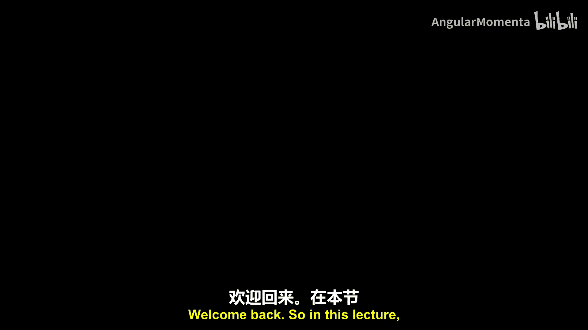
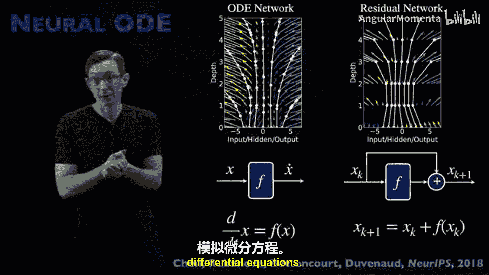

# 019：神经常微分方程 🧠➡️📈

在本节课中，我们将学习神经常微分方程。这是一种用于建模常微分方程等微分方程的强大现代机器学习架构。我们将了解其核心思想、它与残差网络的关系、工作原理以及其优势。

## 概述

神经常微分方程的核心思想是使用神经网络 **F** 来建模描述某个系统状态 **X** 的微分方程。我们知道许多系统，如钟摆、流体流动或机器人，都可以用微分方程 **ẋ = F(x)** 来建模。我们将尝试用神经网络来建模这个微分方程的右侧。

## 从残差网络到神经常微分方程

为了理解神经常微分方程的背景，回顾残差网络会很有帮助。残差网络是现代神经网络中一个基石性的算法。其思想很简单：如果我们想建模某个状态 **X** 在时间步 **k** 和 **k+1** 之间的输入输出关系，一个非常合理的方法是直接将输入复制过来，只建模输出与输入之间的差异。我们用神经网络 **F** 来建模这个所谓的“残差”。

用数学形式表达，这意味着输出 **x_{k+1}** 等于输入 **x_k** 加上建模残差的神经网络 **F**：

**x_{k+1} = x_k + F(x_k)**

对于有科学计算经验的人来说，这会认出这几乎就是教科书上的欧拉数值积分器。这是用最简单的方式积分微分方程 **ẋ = f(x)**，取时间步长为1并向前积分。这是一个简单的欧拉积分器。

然而，我们知道欧拉积分，尤其是在大步长下，是一种较差的积分微分方程的方法。它虽然快速简便，但非常容易不稳定且误差很大。如果残差网络是通过某个向量场 **F** 进行欧拉积分，那么我们的神经网络学习的这个残差也可以被视为一个向量场，即某个微分方程 **ẋ = F**，我们本质上是用这个残差网络对其进行时间步进。

既然基于这个简单思想（建模残差并进行本质上的欧拉积分）的残差网络如此成功，那么也许我们可以使用更好的数值积分器，做出类似残差网络但更优的东西。这就是神经常微分方程背后的思想。

## 神经常微分方程的核心思想

神经常微分方程不是建模从 **x_k** 到 **x_{k+1}** 的大步长前向映射（即欧拉步），而是建模微分方程本身，即实际的向量场 **ẋ = F(x)**。我们可以非常精确地建模那个向量场，然后使用更高级的数值积分方案来步进那个状态，并根据训练数据（图中的白点）来训练这个 **F**。

换句话说，神经常微分方程建模连续时间微分方程的右侧。这是对该连续时间微分方程的一种离散时间近似。我们可以用神经网络直接建模 **F**。如果我们有这个函数 **F**，根据经典的数学（如牛顿、莱布尼茨、欧拉、拉格朗日，已有数百年历史），我们知道如何求解这些微分方程。即使在现代计算时代，我们在数值步进求解这类微分方程方面也比在现代机器学习方面有更多经验。数值积分比现代机器学习古老得多。

因此，如果我们有这个微分方程的神经常微分方程表示，并且我们用神经网络学习这个 **F** 函数，我们本质上可以精确地写出 **x_{k+1}** 关于这个函数 **F** 的表达式。这不是一个近似，这是给定这个微分方程下，时间步 **k+1** 时 **x** 的精确表达式。

虽然这个表达式本身很难计算，但存在比这种粗糙的前向欧拉解更好的数值积分器来近似 **x_{k+1}**。例如，我们可以使用二阶龙格-库塔方案、四阶龙格-库塔方案，甚至可以做一些更高级的，如使用辛积分器或变分积分器，以守恒物理的某些能量或结构。这是我喜欢神经常微分方程的一点：你可以使用不同的积分器，从而得到这个算法的不同变体。

## 与残差网络的关键区别

让我们退一步看。神经常微分方程受残差网络启发，但认识到残差网络本质上是拟合数据。这里的数据是这些小白点。它要求你的数据在时间上均匀采样，点之间有固定的时间步长。这是你能想到的用于建模任何类型微分方程的最差的数值积分器之一。因此，残差网络可能不是建模微分方程的最佳方式。

相比之下，神经常微分方程建模实际的微分方程，即右侧本身，而不仅仅是该微分方程的一个单时间步更新或流映射。一旦你以这种方式表示你的系统，并尝试训练你的神经网络来表示 **x** 对时间导数 **d/dt** 的连续右侧，现在你就可以使用不同的数值积分方案来训练 **F** 的参数，使其与这些白点数据一致。

更清晰地说：使用神经常微分方程，我实际上可以拥有时间上不规则间隔的点。我不需要它们像在残差网络中那样均匀间隔，因为我本质上是在使用这些数据点来训练这个神经网络 **F** 的参数。我所做的是调整 **F**，调整 **F** 的参数，使得当我离散化这个数值积分器并尝试预测这些白点时，它们尽可能准确地拟合。我正在学习底层的向量场 **F**，以便如果我沿着那个向量场进行数值积分，我得到的结果尽可能接近我采样的数据。

这是一个非常聪明的想法。原则上，神经常微分方程和残差网络之间的区别在于，因为我们建模这个连续时间系统并使用一个好的积分器，这就像：如果我让我的残差网络有一个更小的 Δt 和更多的残差层，那么它就是连续和离散时间的类比。这就像银行利息每年复利与连续复利相比，后者要好得多，能给我更准确的模型，并允许我处理关键特性：我可以处理间隔不均匀的数据，因为我可以使用更好的积分器在不规则时间步长上积分这个系统。这是一个非常酷的想法。

## 实际效果与优势

这是原始论文中的一个图，展示了一个相对简单的微分方程。顶部是一个标准的循环神经网络，这一层是一个神经常微分方程。点是训练数据，然后你可以看到黄色的预测和蓝色的外推。

循环神经网络的预测非常锯齿状，在训练数据上的预测或蓝色的外推方面做得不是很好。而神经常微分方程则对噪声更鲁棒，能够对训练数据进行平滑预测，并且对未来外推的准确性要高得多，因为我们使用这些训练数据学习到了一个更干净、更准确的向量场 **F** 表示。

因此，核心原则是：你正在学习向量场 **F**，并使用机器学习进行优化。本质上，通过调整那个向量场的参数，你专门调整这些参数，使得你的积分轨迹与观测数据点最匹配。我们将使用自动微分和反向传播的所有标准技巧，根据这些观测数据来调整 **F** 的网络参数。但在底层，我们正在使用比残差网络更好的高级数值积分器来对我们的向量场 **F** 进行时间步进。

## 扩展：加入物理结构

我想指出，你可以使用更好的积分器，比如二阶龙格-库塔、四阶龙格-库塔，但你也可以在这个神经常微分方程中加入额外的结构。有一些后续论文，比如2019年NeurIPS的“哈密顿神经网络”，在道德上属于神经常微分方程家族。他们所做的是添加这种额外的结构：他们将学习某个哈密顿函数，并从该哈密顿函数计算运动方程 **q̇** 和 **ṗ**，从而保持系统的总能量。所以，这本质上是一个神经常微分方程，其中我使用的积分器被强制具有辛或能量守恒结构。这是一个非常强大的想法：你可以通过将积分器换成像哈密顿辛积分器这样的东西，使你的神经常微分方程守恒能量。

Cranmer等人一篇类似的后续论文将其扩展到“拉格朗日神经网络”。这里，他们不是在神经常微分方程积分器中强制辛或哈密顿结构，而是强制满足欧拉-拉格朗日方程。这就是所谓的变分积分器，它也具有在物理应用中至关重要的能量守恒特性。这是我最喜欢神经常微分方程的一点：它允许你融入额外的对称性和结构，使其更具物理意义。

## 技术细节：伴随方法与优化

我没有时间深入探讨这个算法如何工作的每一个细节。网上有很好的教程，我认为学习这些算法的最好方法是编写代码，下载别人的演示代码然后自己修改或尝试。但你可以看到计算图有点复杂，并不简单，其中有前向和后向时间部分。不过，我确实想深入一个关于神经常微分方程的技术细节，因为它非常重要，并且与更大的优化和动力系统领域（如强化学习、哈密顿-雅可比-贝尔曼方程）联系在一起。

神经常微分方程试图用神经网络建模这个 **ẋ = F(x)**，即建模向量场 **F** 的微分方程。数学上，我们知道如何对这个微分方程进行时间步进。如果我有一个在时间 **t_0** 的初始条件，我可以使用这里的计算将其向前步进一个 Δt。这被称为流映射 **φ**，它将我的初始条件映射到未来 Δt 时间。这是经典的动力系统，就是微分方程。

但在神经常微分方程中，我们将使用神经网络表示这个函数 **F**。因此，它将具有参数 **θ**，我们将调整这些参数 **θ**，以尝试根据观测数据拟合这个函数 **F**。这里有很多自由参数：**θ** 中的自由参数、从什么初始条件开始、应该使用什么 Δt，还有一个隐藏状态。这篇论文中经常提到的一个想法就是这个隐藏状态 **x(τ)**。

我的数据是在离散时间点采样的，它们不一定在时间上均匀采样，但通常是离散时间采样。因此，在任何两个测量点之间，存在一个连续的隐藏状态 **x**，它是某个连续变量 **τ** 的函数，介于这两个测量点之间。本质上，这个流映射沿着隐藏状态 **x(τ)** 从时间 **t_0** 积分到 **t_0 + Δt**。

因此，这个隐藏状态将是我用来训练神经网络以调整参数 **θ** 来学习 **F_θ** 的实际优化算法中的一个重要组成部分。我将需要关于这个隐藏状态的信息，而这些信息不在我的训练数据中。这就是我即将讲述的数学内容：我如何以某种方式获取这个隐藏状态，并将该信息纳入我的神经网络训练优化中。

具体来说，我将需要计算我的损失函数相对于系统状态 **x(t)** 在观测数据点之间中间时间 **τ** 的偏导数，即我需要计算 **∂L/∂x(t)**。

我将跳过大约五个小时涉及拉格朗日乘子的硬核动力系统优化内容，关于你实际上如何做到这一点。这是一个非常有趣的话题，我们将在目前正在开发的优化训练营中讨论。

长话短说，处理这个问题的方法之一是引入这个拉格朗日乘子变量 **a(t)**。这是一个虚拟变量，我将在训练神经网络时跟踪它。我将其定义为 **-∂L/∂x**。并且它满足这个微分方程。你可以通过一些优化推导并自己验证（使用链式法则等），这个微分方程满足这个虚构的虚拟 **a** 变量，它将是一个拉格朗日乘子。那个拉格朗日乘子本质上将在我优化自由参数时强制执行这个约束。

这也被称为伴随方程。我们在控制理论、工程设计与微分方程中已经使用基于伴随的优化几十年了，所以我们知道如何做。神经常微分方程论文的一大进步本质上就是如何在不手动积分的情况下进行这个拉格朗日乘子伴随计算。

这里的关键观察是：如果这个 **F** 函数是一个神经网络，我可以通过自动微分计算 **∂F/∂x**，使用我通常用来反向传播误差和训练神经网络的工具。我也可以计算我需要积分我的伴随拉格朗日乘子状态的函数。

这意味着，我仍然在尝试做我一直想做的事：学习参数 **θ** 来参数化这个神经网络以近似我的动力学。并且存在这个隐藏状态 **x** 我需要跟踪，因为它对我的损失函数很重要。因此，为了跟踪它，我将引入这个满足这些动力学的拉格朗日乘子变量，并且我可以计算这些动力学，并可以使用这个神经网络 **F_θ** 的自动微分能力来积分和跟踪这个 **a** 变量。

这听起来可能很复杂，可能只有大约2%真正想理解神经常微分方程的人感兴趣。但这是一个重要的部分，它将此与使用拉格朗日乘子的相当重要的优化理论联系起来。关键的是，我们正在使用神经网络的自动微分来获得这个拉格朗日乘子的方程，而不是用纸笔从第一原理推导，那样行不通，会非常痛苦。这就是他们如何利用现代神经网络自动微分能力解决拉格朗日乘子伴随问题的方法。这很酷。

## 总结

本节课中，我们一起学习了神经常微分方程。总结来说，我们所做的是使用神经网络建模动力系统（微分方程）。我们是在连续时间中建模它，而不是像残差网络那样将其建模为离散时间更新。这给了我们在交换更好积分器方面更多的灵活性，例如具有辛或能量守恒等结构的积分器。它允许我们通过拟合底层连续向量场并使用更好的积分器沿这些轨迹积分该向量场，来更好地拟合不规则间隔的数据。这是一个非常强大的想法，有大量的扩展。

你应该尝试一下，看看如何让它工作。我们课题组和其他人也使用过的一种方法是：像动态模式分解和SINDy这样的方法，如果你有不规则间隔的数据，并不总是很好用。但你可以做的是：取你不规则间隔的数据，在其上训练一个神经常微分方程，然后你可以通过你的神经常微分方程积分得到规则间隔的数据，并将其用作SINDy的输入数据。因此，神经常微分方程功能强大，但可解释性不强：这个 **F** 是一个大型神经网络，你很难说“哦，那是 **sin(x)**”。但如果你有规则间隔的数据，你可以训练一个神经常微分方程，然后使用那个训练好的神经常微分方程来获取规则间隔的数据，然后将其传递给像SINDy或符号回归这样更具可解释性的东西。这是我们使用它的方式之一。

还有对神经偏微分方程的扩展，以及如前所述的对辛、能量守恒系统的扩展。这是一个非常酷的架构，我认为你应该尝试一下，它概括了最重要的基石算法之一——残差网络，使其更适合建模微分方程。