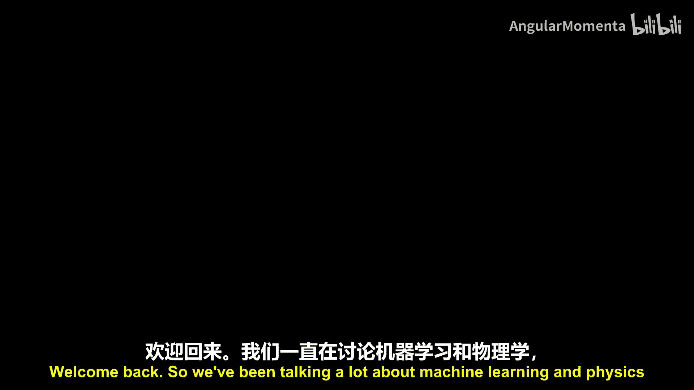
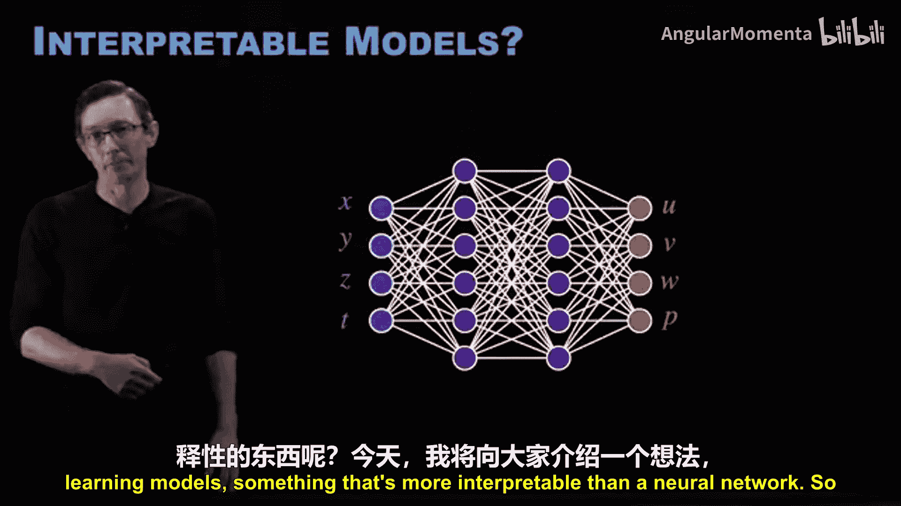
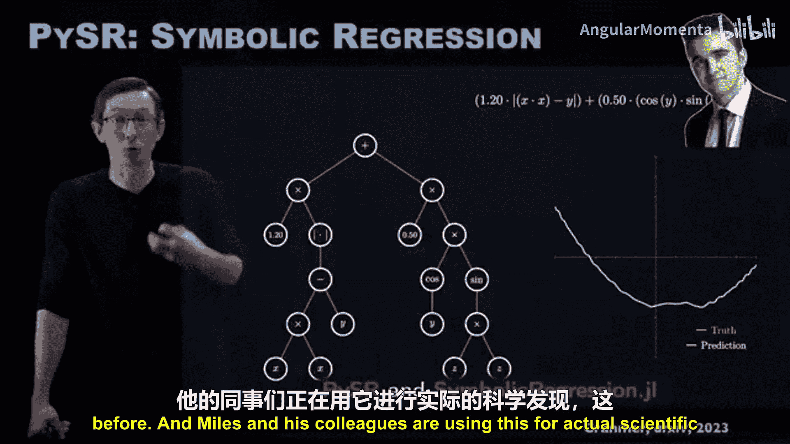
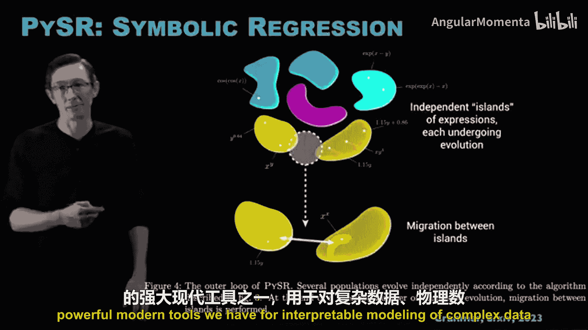
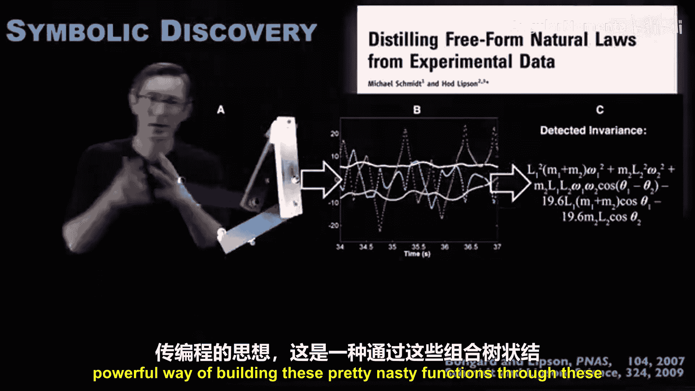
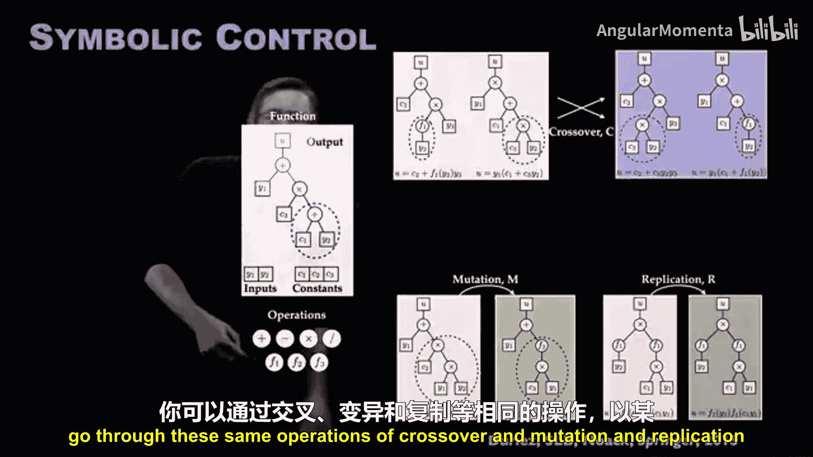
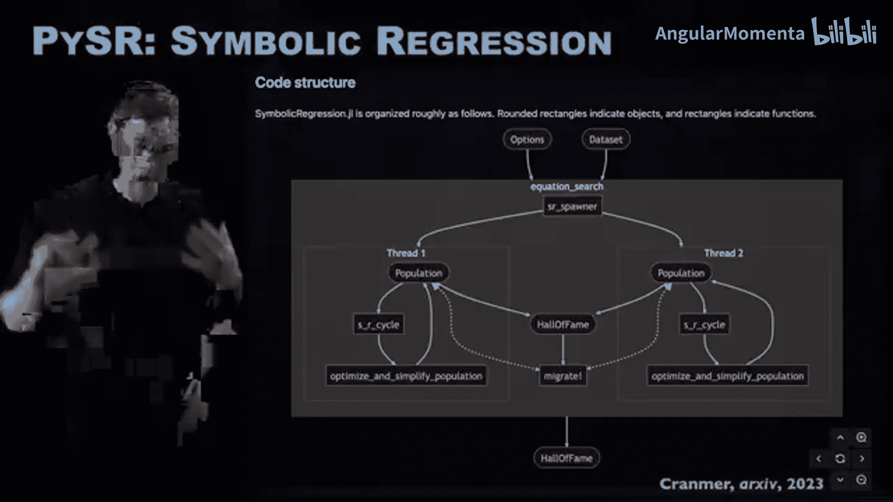
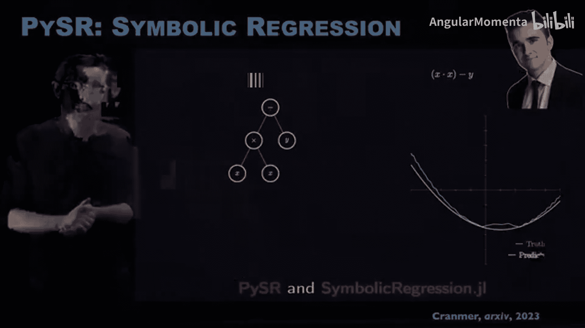

# 020：Python符号回归 🧠

在本节课中，我们将要学习一种名为“符号回归”的机器学习方法。与难以解释的“黑箱”神经网络不同，符号回归旨在从数据中发现人类可读的数学表达式，从而构建可解释的物理模型。

## 什么是符号回归？ 🔍

上一节我们介绍了物理信息机器学习的目标。本节中我们来看看符号回归的核心概念。符号回归是一种机器学习过程，其输出是一个符号化的、人类可读的公式，例如包含正弦、余弦、指数等运算的表达式。

其核心思想是搜索一个由基本运算符和变量构成的函数树，以最佳方式拟合观测数据。这遵循**简约原则**：我们希望找到能描述数据的最简单模型，但又不至于过于简单。

## PySR：一个强大的现代工具包 ⚙️

符号回归并非新概念，但`PySR`（Python Symbolic Regression）是一个由剑桥大学的Miles Cranmer教授开发的、功能强大且维护良好的现代软件包。它使全球的研究者都能使用这项技术进行科学发现。

以下是`PySR`工作流程的核心步骤，它借鉴了遗传编程的思想：

1.  **初始化种群**：随机生成一组初始函数表达式（种群）。
2.  **遗传操作**：通过“交叉”和“变异”等操作生成新的表达式。
    *   **交叉**：交换两个表现较好的函数表达式的子树，类似于生物繁殖中的基因交换。
    *   **变异**：随机改变函数树中的某个节点（如将加号变为减号）。
3.  **简化与优化**：对表达式进行代数简化，并优化其中的常数参数。
4.  **选择**：根据表达式对数据的拟合精度和复杂度，选择表现优异的个体进入下一代。
5.  **迭代**：重复上述步骤，使种群不断“进化”。

## 符号回归的历史与发展 📜

上一节我们介绍了`PySR`的基本原理。本节中我们来看看符号回归方法的发展历程。符号模型发现并非全新事物，其前身“遗传编程”在20世纪80年代就已出现。

关键的突破来自于Bongard、Lipson以及Schmidt和Lipson的工作。他们意识到，遗传编程不仅可以学习任意的输入输出映射，还能用于**发现支配物理系统的微分方程**。例如，仅从双摆的运动数据中，就能以符号形式发现其哈密顿量（守恒的能量）。

这一思想也被应用于其他领域，例如，通过与Barrett And Noack等人的合作，我们使用类似的符号回归方法来“培育”和演化出用于控制复杂系统（如湍流）的有效控制律。

`PySR`包的重大意义在于，它极大地**民主化**了这项技术，使其成为一个设计精良、功能全面、易于所有人使用的强大工具。

## PySR的核心特性与优势 ✨

`PySR`相较于其他经典实现，具有一系列深思熟虑的设计特性，使其能应用于更困难的问题。

以下是其主要优势：

*   **功能全面**：支持并行计算、自定义运算符、表达式简化、约束条件等。
*   **经过广泛验证**：在大量基准测试系统上表现优异，并提供了统一的实证基准测试框架。
*   **优秀的软件工程**：代码结构清晰，易于使用和扩展。
*   **支持科学发现**：已成功用于重新发现行星运动定律等实际科学问题。

## 简约原则与模型选择 ⚖️

`PySR`的一个巨大优势是它能帮助我们实践**简约原则**。在算法运行过程中，会产生许多不同复杂度的候选模型。

我们可以绘制模型的**精度-复杂度帕累托前沿图**。理想的模型位于前沿的“拐点”处，即在特定复杂度下精度最高，或者说，在满足精度要求的前提下复杂度最低。这使我们能够有依据地选择那个“尽可能简单，但又不至于过于简单”的模型。

---

本节课中我们一起学习了符号回归的概念，特别是`PySR`这一强大工具。它通过遗传编程的思想，从数据中演化出人类可读的数学表达式，为构建可解释的物理模型提供了重要手段。符号回归将简约原则内置于学习算法中，并能通过帕累托前沿辅助模型选择，是物理信息机器学习中不可或缺的技术。