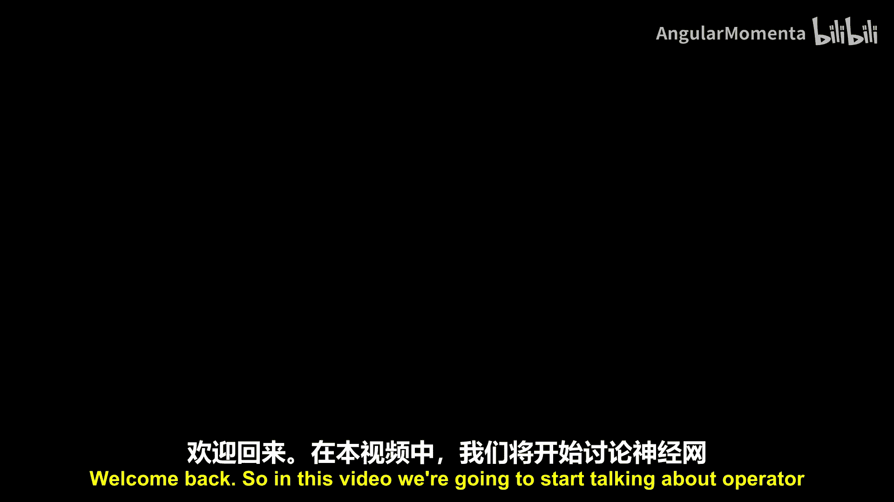
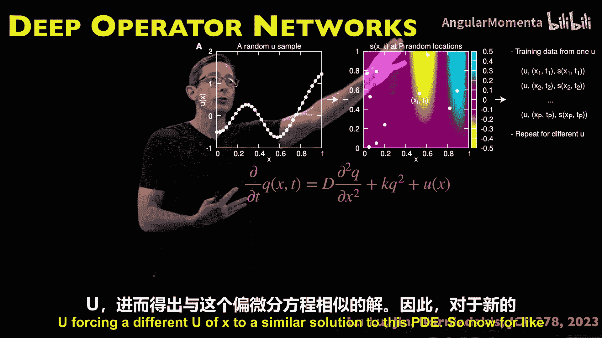
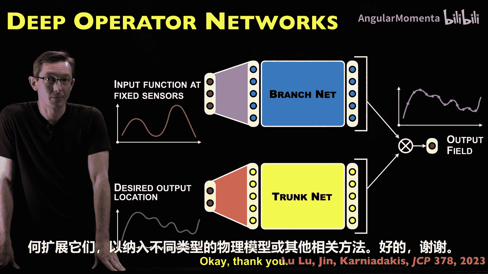

# 021：残差网络

在本节课中，我们将开始探讨神经网络中的算子方法。这是一套非常强大且不断发展的方法。深度算子网络（DeepONet）由Lu Lu、George Em Karniadakis等人在论文中提出。

该论文展示了多项重要内容。论文内容非常丰富，是一篇值得一读的有趣文章。其核心思想是：如果一个常微分方程或偏微分方程受到某种外部强迫函数的影响，那么从该外部强迫函数到ODE或PDE的解函数之间存在一个映射，这个映射就是一个算子。

大多数神经网络基于万能逼近定理，旨在逼近输入-输出函数。但在这篇论文中，作者指出，对于大多数常微分方程和偏微分方程，我们真正关心的是将输入函数映射到输出函数的**解算子**。

这一点至关重要。标准的深度神经网络是万能函数逼近器，它逼近变量X的某个函数。但在DeepONet论文中，作者认为，在ODE和PDE问题中，我们不应试图逼近数据向量上的任意函数，而应估计将函数映射到函数的**解算子**。

普通神经网络通过一个函数将数据映射到数据。而PDE和ODE的解则将函数映射到函数，这就是算子。实际上，存在一个类似的算子万能逼近定理，它表明某类神经网络不仅能任意好地逼近函数，也能逼近算子。

这篇论文是对这一思想的现代演绎：在ODE和PDE中，我们实际上希望逼近那个将某个强迫函数映射为该PDE或ODE解函数的**解算子**。这是核心思想。接下来，我们将详细介绍这种架构的设计原理，包括为何需要分支网络和主干网络，以及输入函数和输出位置的含义。

这是建模ODE和PDE解算子的众多方法之一。此外还有傅里叶神经算子等方法。但DeepONet这篇论文是首次以深度学习方法，系统而专注地处理ODE和PDE解算子的现代论文。我们将从这里开始。

## 核心思想与架构

上一节我们介绍了学习解算子的核心概念。本节中，我们来看看DeepONet的具体架构设计。

其思想是，假设我有一个常微分方程组，它受到某种输入强迫的影响，例如某种控制、驱动或外部扰动。因此存在一个输入函数。我的ODE的输出函数（解）将取决于这个输入强迫。我可能在时间或空间的一些固定位置测量这个输入函数，并且可能希望在一个空间网格或时间网格上预测我的输出函数。

DeepONet的做法是将网络拆分。以下是实现这一目标的简单方法。

一种朴素的方法是使用一个大型的全连接网络，直接接收输入函数信息和输出函数位置信息，并预测ODE或PDE的输出。但DeepONet的做法略有不同。

它拆分成两个不同的大型神经网络：一个用于编码输入函数（即强迫ODE或PDE的强迫函数的特征），称为**分支网络**；另一个独立的网络用于编码在这些指定输出位置上的解输出函数的特征，称为**主干网络**。

该论文系统性地证明了，将网络拆分为分支网络和主干网络，比使用单一的大型前馈网络效果更好。这种“更好”体现在泛化能力更强、精度更高、训练更顺畅等方面。他们详细展示了这种将输入特征空间和输出特征空间分离的自定义架构，对于表示ODE和PDE的解算子是一个巧妙的想法。

## 深入理解解算子

我们已经多次提到“解算子”，现在让我们更详细地探讨其含义。

让我们看一个更简单的例子：尝试使用DeepONet来求解或分析一个常微分方程，因为ODE通常比PDE更容易理解。

假设我有一个ODE，例如描述某个机械系统、汽车悬架或摆锤。状态X随时间变化，遵循描述该系统物理规律的某个函数F。这个系统的动力学受到一个输入函数U(t)的影响。U(t)可以看作是我施加的控制或随时间影响系统的输入强迫。

给定一个特定的输入函数u(t)，我想知道未来时间t的解x(t)。用DeepONet的语言来说，存在一个算子G，它接收这个强迫函数U，并输出我想要求解的解函数X(t)。因此，这个算子G将函数映射到函数，从强迫函数映射到解函数X(t)。在这种情况下，它通过**流映射**计算来实现。

这实际上就是我们写下常微分方程解的标准方式，即使用这里的流映射积分公式：`x(t) = x(0) + ∫_0^t f(x(τ), u(τ)) dτ`。

重要的是，当动力学是混沌的时候，这个流映射会变得极其敏感，并出现发散现象。这对于算子方法（如DeepONet和傅里叶神经算子）来说将是一个巨大的挑战，因为系统对初始条件和强迫非常敏感。如果我稍微扰动输入一点（ε），我的解算子G可能会导致未来的轨迹发散。因此，这些方法可能不太适用于混沌系统。当然，你应该尝试一下，编写代码并在确定性和混沌系统上测试。这里的核心思想是，我们试图使用神经网络来学习这个从函数到函数的算子函数G。

将其拆分为主干网络和分支网络似乎是实现这一目标的一种高效且有效的方法。

## 训练过程与数据表示

上一节我们讨论了算子的概念，本节我们来看看如何实际训练这样的网络。

实际训练时，你可能拥有高保真度的模拟数据，即为不同的输入函数和输出函数运行大量模拟；或者你从实验中收集测量数据。你需要做的是：在几个固定的传感器位置表征这个输入强迫函数。对于时间强迫的情况，你需要在几个时间点上表征这个输入函数。这些就是分支网络的输入：在指定时间点上的强迫函数。

然后，会有一些你希望预测未来解的输出位置。这些就是你希望得到解的输出位置。

你的分支网络和主干网络将学习潜在特征，这些特征编码了对该ODE重要的输入特征，以及该ODE可能生成的输出特征。它们将在这个输出场中重新组合，这个输出场就是实际的解，即算子G应用于这个输入函数的结果，它给出了你在下面指定的所有位置和时间上该ODE的解。

这是一个非常简单的想法。一旦我训练好这个网络，现在我可以给它一个新的输入函数，观察如果我给它一个从未训练过的不同强迫函数会发生什么。这能预测我的ODE在该新输入函数下的解吗？这就是我们所说的泛化能力。

DeepONet论文仔细地表明，至少对于相对简单的物理系统、简单的ODE和PDE，这种架构具有更好的泛化能力和训练效果。与使用单一大型全连接网络处理相同数据相比，它具有更好的收敛性、更低的误差和更强的泛化能力。因为单一大型网络更容易过拟合、更难训练、泛化能力更差。

## 应用范围与示例

我认为这是一个很酷的想法，而且它不只适用于ODE。我举的例子中，输入函数是ODE的时间强迫。但它同样适用于偏微分方程。输入函数可能是空间上所有点的强迫，我可能在空间上强迫我的PDE，并且我仍然希望学习从该强迫函数到我的PDE在空间和时间上解的算子。

最初的深度算子网络论文在一些相对简单的ODE和PDE上进行了测试。据我所知，没有涉及混沌系统。这些ODE和PDE要么是线性的，要么是弱非线性的。例如，ODE中有一个摆的例子，PDE是一个反应扩散的例子，这些系统相对良性，不会出现混沌混合。

我们知道混沌系统的解算子将是不可表示的复杂。实际上，庞加莱在100年前就证明了混沌系统的解算子是“不可表示”的，即使是万能函数逼近也会遇到这些“不可表示性”的限制。

因此，DeepONet对于非混沌系统效果非常好。论文中有一些很酷的例子。开发算法时总是从简单例子开始，他们也在这些简单例子上仔细演示了使用分支网络和主干网络实现泛化的思想。

例如，这是一个在空间上有强迫u(x)的偏微分方程。它是一个在空间和时间上变化的一维偏微分方程，根据这个强迫函数在空间上被强迫。这是一个随机的强迫函数，这是我们指定那些输入位置的方式。然后，你在这些白色标记的点上采样一个真实解，这就是针对特定强迫函数U的训练数据。你可以使用这类数据训练DeepONet（主干网络和分支网络），然后你可以预测，对于不同的强迫函数U(x)，该PDE的解算子会是什么。这样，对于一个新的强迫函数U，我无需运行大型模拟就能得到PDE的解。这是一个非常酷的想法。

你可以看到，测试误差实际上呈现出非常好的指数收敛，我们称之为强收敛。当算法在误差与训练数据的对数-对数图上呈现近似线性关系时，这表明了强或指数级的缩放，这是DeepONet在这篇论文中探索出的一个非常强大的特性。

他们还研究了训练这个网络需要多少数据，并进行了相当仔细的分析，将其与全连接网络进行比较，并考察了多个ODE和PDE的例子。

## 总结与扩展思考

在本节课中，我们一起学习了深度算子网络（DeepONet）的核心思想。我们了解到，对于ODE和PDE问题，将神经网络视为从函数到函数的**解算子**逼近器，比仅仅视为函数逼近器更为直观和有力。DeepONet通过**分支网络**编码输入强迫函数的特征，通过**主干网络**编码输出解位置的潜在特征，从而有效地学习这个解算子。

这种方法在相对简单、非混沌的ODE和PDE上表现出色，具有更好的泛化能力和训练效率。然而，对于具有混沌动力学的系统，由于解算子的极端敏感性和复杂性，该方法可能面临挑战。

我鼓励你尝试实现它：下载代码，在论文案例上运行并复现结果，然后开始添加更具挑战性的特性，观察它在何处失效。例如，在洛伦兹系统这样的混沌ODE上尝试，可能会遇到很大困难。

此外，还有一些重要的扩展问题值得思考：
*   如何将物理约束（如能量守恒、质量守恒或已知的对称性）融入这个框架？是通过损失函数，还是添加额外的架构？
*   能否将DeepONet与物理信息神经网络（PINN）结合起来？这是一个非常有趣的问题。

请始终思考：这些方法适用于哪些问题？不适用于哪些问题？以及你如何扩展它们以纳入不同类型的物理知识或其他相关方法。

