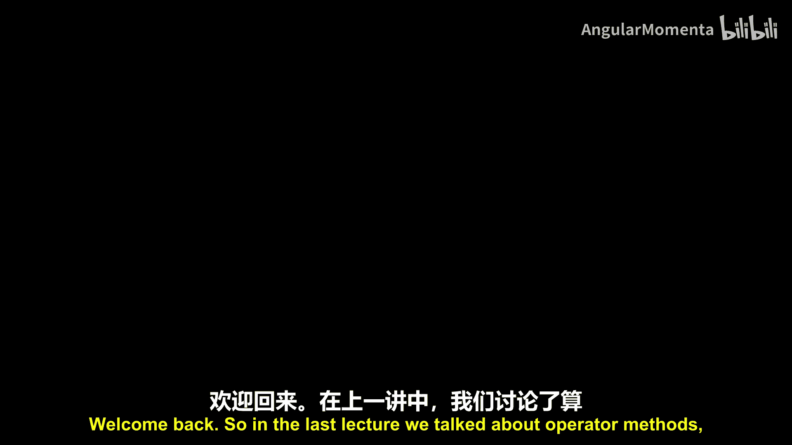
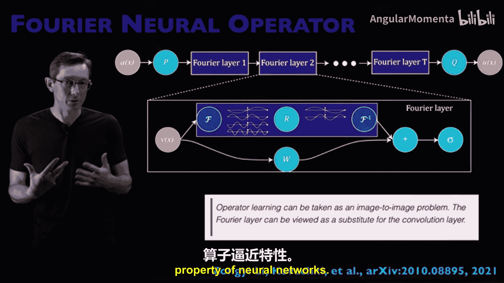
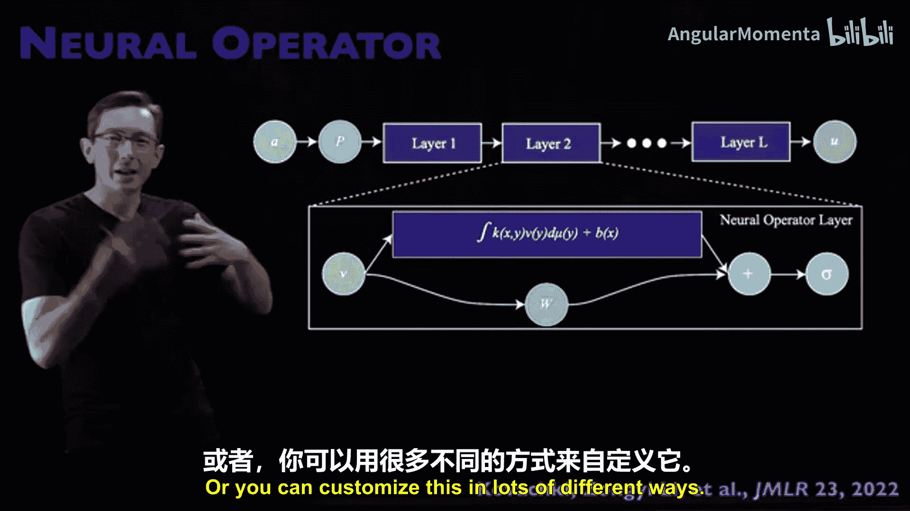
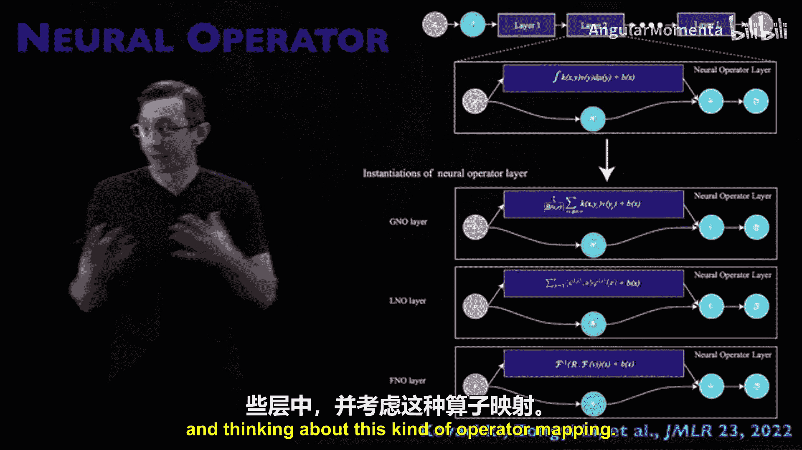
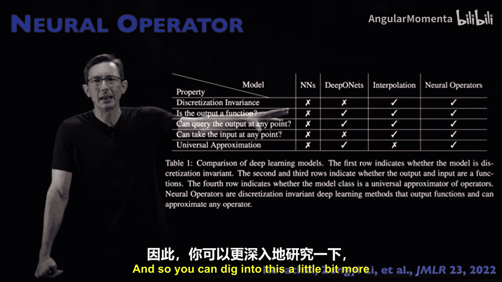
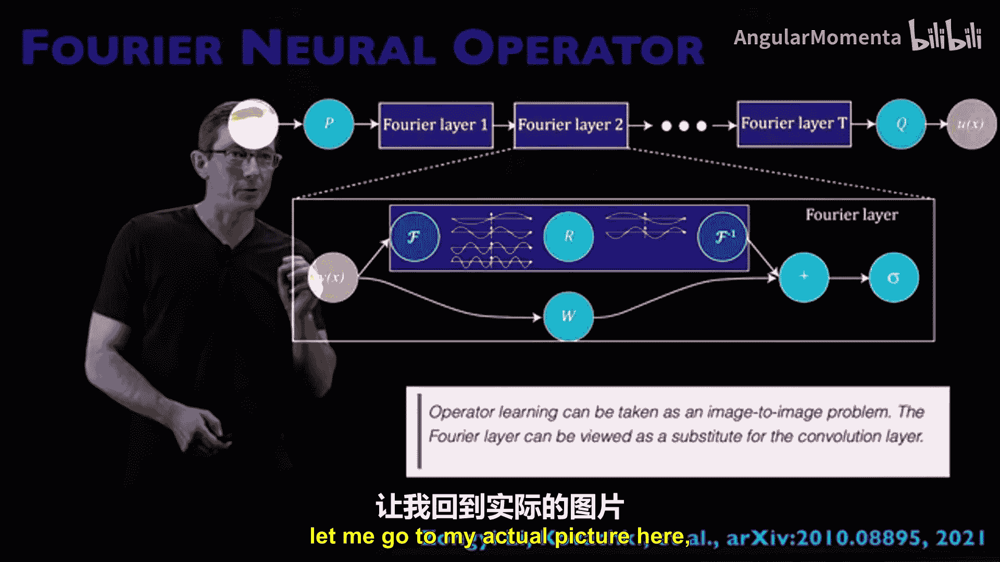
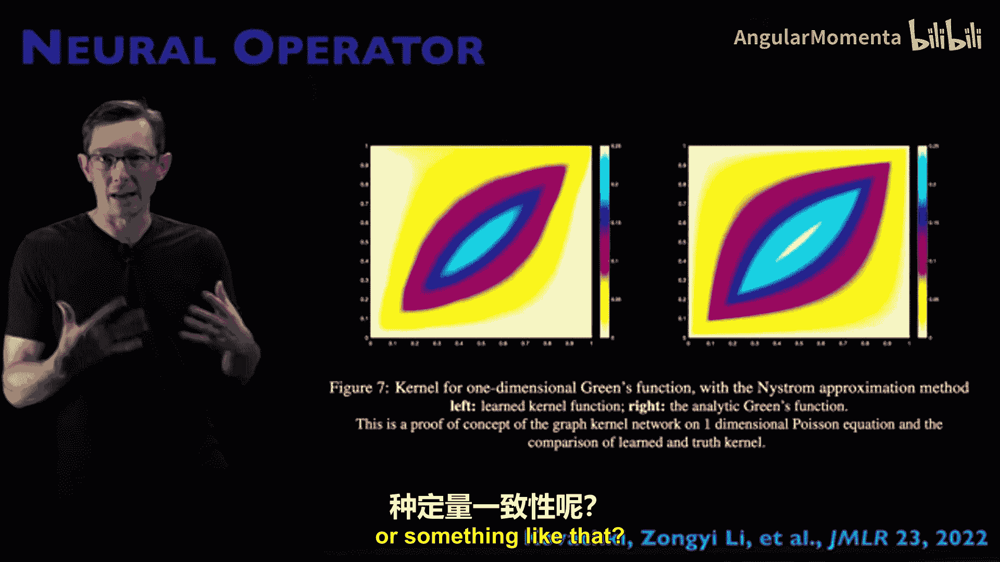
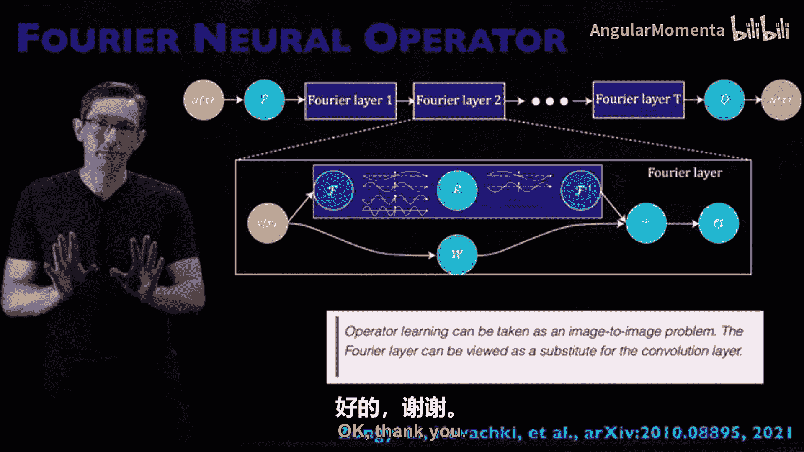

# 022：傅里叶神经算子

## 概述
在本节课中，我们将要学习傅里叶神经算子。这是一种将神经网络从通用函数逼近器推广为算子逼近器的方法，特别适用于求解偏微分方程等物理问题。我们将了解其核心思想、优势以及一些重要的扩展。

## 从函数逼近到算子逼近
上一节我们介绍了算子方法。深度算子网络将神经网络作为通用函数逼近器的思想，推广到了使用神经网络来逼近从函数到函数的算子。

一个函数可能将向量映射为向量。但一个算子，例如常微分方程或偏微分方程的解，会将一个函数映射为另一个函数，例如将初始条件函数映射为解函数，或将外力函数映射为解函数。

如果你对物理感兴趣，例如求解ODE和PDE，你可能希望将你的神经网络视为一个算子逼近器，而不仅仅是一个函数逼近器。这是一个在社区中酝酿的强大思想。傅里叶神经算子是神经算子的一种普遍形式，也是社区中算子学习的主要方法之一。

神经算子有很多变体，我们不会深入太多细节，因为有很多方法来构建和剖析它。我们将从高层次了解这些神经算子试图实现的目标，以及其大致的原理。

## 核心视角：图像到图像问题
我认为以下引用是一个非常重要的观点：算子学习可以被视为一个图像到图像问题。傅里叶层可以看作是卷积层的替代品。

如果我们考虑ODE或PDE的解，它们有时看起来像图像。例如，对于一个二维流体流动，我可能取一个初始条件并将其映射到最终条件，这是一个作用于输入函数的算子，但它看起来很像将一幅图像映射到另一幅图像。

就像处理图像时，我们可能会使用卷积层来提取特征。我们知道，在过去半个世纪里，我们解决计算物理问题的主要方式是基于傅里叶的谱方法。我们在傅里叶空间变换我们的系统，在傅里叶变换域中求解PDE（这通常是一个好的表示），然后进行逆傅里叶变换，回到空间坐标得到最终解。

因此，我认为他们在这里试图表达的是：我们知道傅里叶变换是物理学的良好坐标系。那么，为什么我们不使用这种空间，而是使用对图像到图像映射有帮助的卷积层呢？我们将在一个傅里叶嵌入空间中工作，因为我们知道这对于表示我们的PDE很有好处。

## 傅里叶变换：原始的通用逼近器
我们总是谈论神经网络的通用函数逼近性质。同样，神经网络也有通用算子逼近性质。

我的朋友内森·科茨几个月前向我指出，傅里叶变换也是原始的通用函数逼近器。这让我思考，我们是否过于强调神经网络的这个特性，因为还有很多其他通用逼近器。无论如何，傅里叶变换确实是一个通用函数逼近器。

## 零样本超分辨率：一个引人注目的特性
最初让人们对傅里叶神经算子感到兴奋的一个主要演示是它声称可以实现零样本超分辨率。你可以在低分辨率下训练一个纳维-斯托克斯求解器，然后增加网格分辨率，因为这个方法学习的是从函数到函数的算子。我可以改变函数指定的分辨率，从而获得解算子的超分辨率。

这是一个非常有趣的想法。他们在论文中演示了从64x64上采样到256x256，以及从20个时间快照上采样到80个时间快照。

我们必须问自己，这是否好得令人难以置信？我们知道没有免费的午餐。我们必须思考，在什么情况下这种超分辨率上采样会有效或无效？

我认为，很可能64x64x20的训练数据集有足够的分辨率来捕捉物理的关键特征，然后才能上采样到更高、更有用的分辨率。如果你将采样率降得太低，以至于破坏了基本的物理特性，这可能就行不通了。我鼓励你去尝试编码实现，看看在空间和时间上，下采样的极限在哪里，才能真正实现超分辨率。

## 神经算子的通用框架
神经算子是一个通用框架，傅里叶神经算子只是神经算子的一个特例。在这个更通用的框架中，本质上有一个深度架构，可能类似于残差网络，有一堆层堆叠在一起，可能还有一些跳跃连接绕过傅里叶层。

你会注意到这些蓝色框，所有有趣的、用户指定的知识，甚至物理信息，都可能体现在这一层的选择中。如果你看这个函数，它是与核函数K和一些加权函数μ的卷积。因此，你可以指定许多不同的核K来自定义这个神经算子。例如，如果你有史蒂夫的核，你可以制作史蒂夫的神经算子。你可以用许多不同的方式定制它。

因此，我们有了很多变体，如图神经算子（这里发生的是图核平均）或傅里叶神经算子（这里的核函数就是正弦和余弦，你在这一层进行傅里叶变换）。你还可以设计自己的神经算子层，使用适合你特定物理的定制核K。但同样，我们知道傅里叶对于许多偏微分方程具有非常好的性质。

## 网格无关性与离散不变性
神经算子和傅里叶神经算子一个非常重要的主张是它们是网格无关的，具有离散不变性。它们不关心你的训练数据在什么网格上，因为它们真正学习的是函数到函数的映射，学习的是傅里叶变换系数如何相互映射的系数。因此，原则上，一旦你学习了那个算子，你应该能够换用不同的网格、更高分辨率的网格来细化图像。

这实际上看起来很酷，你可以取这个相对锯齿状的低分辨率网格，并以一种合理的方式细化，从而开始捕捉到激波。网格无关性和离散不变性是一个非常有趣的想法。

## 与经典方法的比较
他们实际上继续将他们的神经算子方法与他们认为的三个最接近的“道德邻居”进行了比较，即普通的神经网络、深度算子网络，以及经典的插值函数逼近（如我们30年前在应用数学中做的样条拟合等）。离散不变性是他们强调该方法重要性的依据之一。

## 拉普拉斯神经算子：一个自然的扩展
傅里叶神经算子是神经算子的一个特例，其中你使用傅里叶变换核（正弦和余弦）作为神经算子中的核函数。这对于具有周期性边界条件的物理问题（如周期盒子上的纳维-斯托克斯流动）非常有效。

有一个扩展我认为也非常好，即拉普拉斯神经算子。在傅里叶神经算子中，我们的核是正弦和余弦这些纯音。就像傅里叶变换可以推广到拉普拉斯变换一样，我们也可以将傅里叶神经算子推广到拉普拉斯神经算子。现在，你取复平面上的极点（这些特征值对应于增长和衰减的正弦和余弦），并将它们用作神经算子的核。

例如，如果我在虚轴上的特征值对应于正弦和余弦。如果我给它一个负实部，现在我的正弦和余弦是指数衰减的；如果我给它一个正实部，那些正弦和余弦是指数增长的。这是傅里叶神经算子到拉普拉斯神经算子的一个非常巧妙且简单的推广，就像傅里叶变换可以推广到拉普拉斯变换一样。这对于更广泛的PDE解算子（可能具有指数增长或衰减）将更有用。

## 总结
本节课我们一起学习了傅里叶神经算子的核心概念。它是一种强大的方法，将神经网络视为算子逼近器，特别适用于物理问题的求解。其关键优势在于**网格无关性**和利用**傅里叶变换**作为有效的表示空间。我们还看到了其扩展，如**拉普拉斯神经算子**，以及它如何通过定制核函数来适应不同的物理问题。理解这些高层次概念后，下一步就是动手实践，通过编码来探索其在实际问题中的表现和局限性。