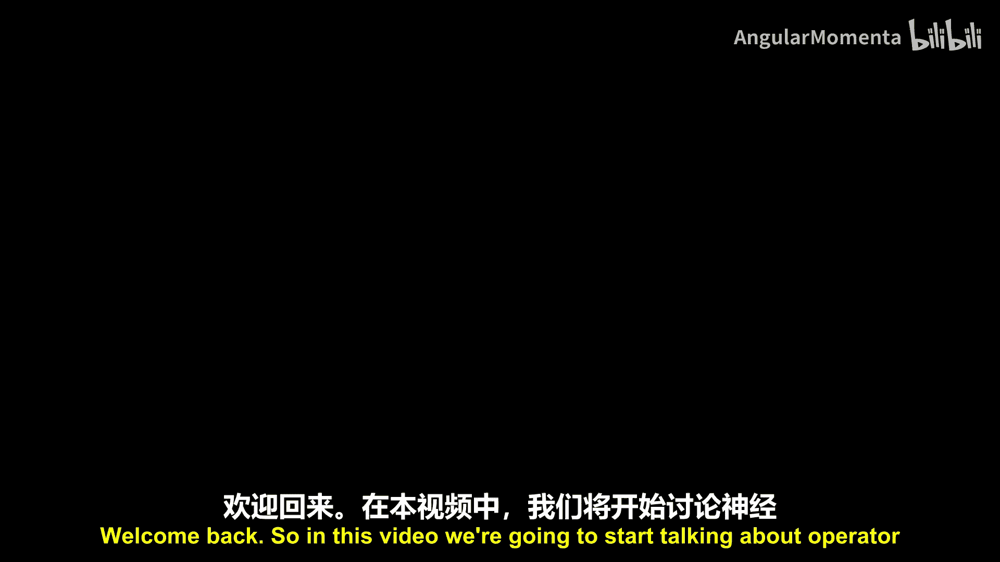
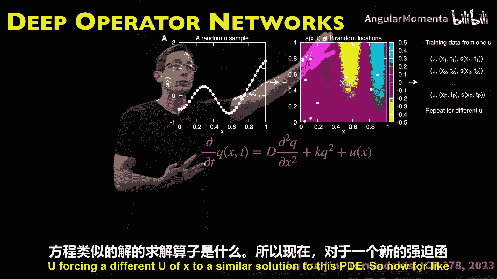
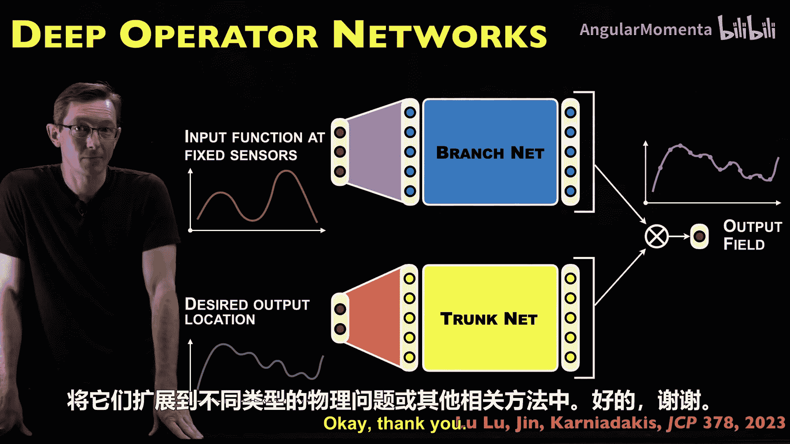

# 023：深度算子网络 🧠

在本节课中，我们将学习深度算子网络。这是一种用于求解常微分方程和偏微分方程的强大方法。其核心思想是，我们不再将神经网络视为简单的函数逼近器，而是将其视为一个**算子逼近器**，用于学习从输入函数（如外部激励）到输出函数（如方程的解）的映射。

## 从函数到算子：核心思想转变

上一节我们介绍了物理信息神经网络等函数逼近方法。本节中，我们来看看一个更符合微分方程本质的思路。

标准的深度神经网络是**通用函数逼近器**。它可以近似一个变量 `X` 的函数。然而，在深度算子网络论文中，作者认为，对于常微分方程和偏微分方程，我们真正需要估计的是**解算子**，它将一个函数映射到另一个函数。

*   **普通神经网络**：通过一个函数将数据映射到数据。
*   **ODE/PDE的解**：将函数映射到函数，这就是算子。

实际上，存在一个类似的算子通用逼近定理，表明某类神经网络也能很好地逼近算子，而不仅仅是函数。深度算子网络论文正是基于这一思想，提出在ODE和PDE问题中，我们应该逼近那个将激励函数映射到解函数的**解算子**。

## 深度算子网络架构：分支网络与主干网络

理解了核心思想后，我们来看看如何用神经网络实现它。一种朴素的方法是使用一个大型的全连接网络，同时处理输入函数信息和输出位置信息。但深度算子网络采用了一种不同的、更巧妙的架构。

它将网络拆分为两个独立的大型神经网络：
1.  **分支网络**：用于编码输入函数的特征，即作用于ODE或PDE的激励函数。
2.  **主干网络**：用于编码在指定输出位置上的解函数特征。

论文通过严谨的实验证明，将网络拆分为分支网络和主干网络，比使用单一的大型前馈网络效果更好。这种定制架构在表示ODE和PDE的解算子时，具有更好的泛化能力、更高的精度和更优的训练效果。

## 以常微分方程为例

为了更具体地理解，让我们看一个更简单的常微分方程例子。假设我有一个描述某个机械系统的ODE：

`dx/dt = f(x, t) + u(t)`

其中 `u(t)` 是输入激励函数（如控制信号或外部扰动），`x(t)` 是我要求解的系统状态。

在深度算子网络的语言中，存在一个算子 `G`，它接收激励函数 `u`，并输出我想要的解函数 `x(t)`。因此，这个算子 `G` 实现了从函数到函数的映射：`G: u(t) -> x(t)`。其数学表达通常涉及流映射积分。

**重要提示**：当系统动力学是混沌的时，这个流映射会变得极其敏感，导致解轨迹发散。因此，这类算子方法（包括深度算子网络和傅里叶神经算子）应用于混沌系统时将面临巨大挑战，因为输入的微小扰动可能导致输出的巨大差异。

## 网络训练与工作原理

那么，具体如何训练这个网络呢？以下是训练过程：

首先，你需要数据。这些数据可能来自高保真数值模拟，或者实际实验测量。你需要为许多不同的输入函数 `u(t)` 收集相应的解 `x(t)`。

接下来是数据处理：
*   **输入表征**：在几个固定的时间点上采样输入函数 `u(t)`。这些采样点就是分支网络的输入。
*   **输出目标**：指定你希望预测解的未来时间点。这些位置就是主干网络的输入，而对应这些时间点的真实解 `x(t)` 值则是训练目标。

分支网络和主干网络分别学习编码ODE相关特征的潜在表示。它们的输出会以一种特定的方式（通常是点积或求和）重新组合，最终生成一个**输出场**，这就是算子 `G` 作用于输入函数后得到的解，即在所有指定时间和位置上的预测值。

一旦训练完成，我就可以输入一个全新的、从未见过的激励函数，网络将预测出我的ODE在该激励下的解。这就是我们所说的**泛化**能力。

## 应用实例与性能

深度算子网络论文在几个相对简单的ODE和PDE上测试了该方法。例如，一个一维偏微分方程，其空间项受到随机激励函数 `u(x)` 的影响。

通过训练，网络能够学习从不同的空间激励函数 `u(x)` 到PDE解的映射。这样，对于一个新的激励函数，我可以直接获得PDE的近似解，而无需运行耗时的完整模拟。

论文展示了该方法具有**强收敛性**（测试误差呈指数下降），这是算法一个非常强大的特性。作者还仔细分析了所需的数据量，并与单一全连接网络进行了对比。

**再次强调**：这些实验主要针对线性或弱非线性的、非混沌的简单系统。对于混沌系统，由于其解算子本身具有不可表示的复杂性，该方法可能会遇到很大困难。

## 总结、思考与延伸

本节课中，我们一起学习了深度算子网络。它的核心贡献在于思维模式的转变：将神经网络视为**算子逼近器**，而不仅仅是函数逼近器，这更贴合ODE/PDE问题的本质。其分支-主干网络架构被证明在简单系统上比单一全连接网络更有效。

在结束前，我们可以思考一些延伸问题：
*   **适用范围**：我的ODE/PDE是否混沌？深度算子网络可能不适用于混沌系统。
*   **物理信息融合**：如何将已知的物理约束（如能量守恒、质量守恒、对称性）融入这个框架？是通过损失函数，还是修改网络架构？
*   **方法结合**：能否将深度算子网络与物理信息神经网络结合起来？
*   **实践探索**：鼓励下载代码，在论文案例上复现结果，然后尝试更富挑战性的系统，观察其局限所在。

通过思考这些问题，并动手实践，你可以更深入地理解这类方法的原理、优势与边界，并可能激发出新的改进思路。