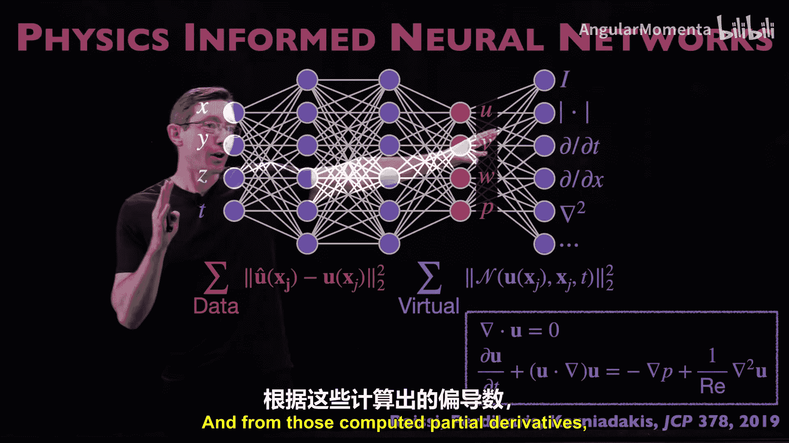
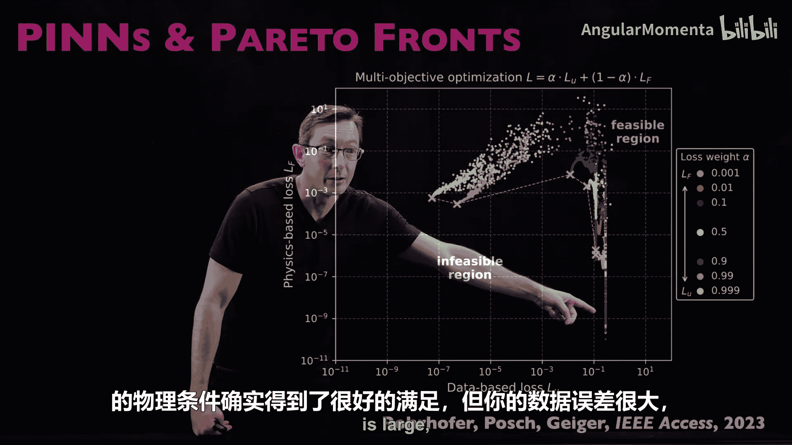

# 024：物理信息神经网络

## 概述
在本节课中，我们将要学习物理信息神经网络（Physics-Informed Neural Networks， PINNs）的核心概念、工作原理、优势与局限性。这是一种将已知物理定律（通常以偏微分方程形式表示）融入神经网络损失函数的强大方法，特别适用于数据有限但物理模型已知的场景。

## 物理信息神经网络（PINNs）的基本思想

上一节我们介绍了使用神经网络预测物理场的传统方法。本节中我们来看看PINNs如何对其进行革新。

PINNs由M. Raissi, P. Perdikaris 和 G. E. Karniadakis在其开创性论文中首次提出，现已成为物理与机器学习交叉领域的核心算法之一。其核心思想是：在标准前馈神经网络的损失函数中，加入一个基于已知物理定律（偏微分方程）的惩罚项。

一个预测流场的传统神经网络架构可能如下：构建一个深度前馈网络，输入是空间坐标 `(X, Y, Z)` 和时间 `T`，输出是感兴趣的场变量，例如速度分量 `(U, V, W)` 和压力 `P`。通过在海量流场数据上训练，网络学习从时空坐标到场变量的映射。

PINNs扩展了这一“朴素”的神经网络框架。它利用现代机器学习框架（如PyTorch, JAX）的自动微分功能，计算网络输出（场变量）对输入（时空坐标）的偏导数。这是一个简单但非常强大的想法。

获得这些偏导数后，就可以构建一个额外的损失项，用于衡量网络预测是否满足已知的物理方程。例如，如果已知速度场应该是无散的，就可以在损失函数中添加一个项，该项就是预测速度场的散度范数。如果该项非零，则意味着物理定律未被满足。

以下是纳维-斯托克斯方程作为PINNs损失函数组成部分的一个示例。其核心流程是：
1.  使用标准神经网络表示待预测的场变量（如速度、压力）。
2.  利用自动微分计算与物理相关的偏导数。
3.  基于这些偏导数，构建一个物理损失项，量化物理方程被违反的程度。

这个物理损失项的作用是：当神经网络违反已知物理时，增加惩罚。这对于我们已知部分物理规律的系统（如流体流动、量子系统、电磁系统）非常有效。

## PINNs的独特优势：数据与虚拟点

值得注意的是，PINNs的损失函数通常由两部分组成。一部分是基于实际测量或计算数据的损失，另一部分是基于物理方程的“虚拟”损失。

以下是PINNs损失函数的一个典型构成：
*   **数据损失**：在有限的真实数据点上，计算网络预测与真实值之间的误差。
*   **物理损失**：在大量“虚拟点”（无需真实数据）上，计算网络预测是否满足物理方程（如质量、动量守恒）。

这种架构的一个巨大优势是，即使实际训练数据非常有限，我们仍然可以通过在虚拟点上评估物理损失，来约束网络使其预测结果符合物理规律。这极大地降低了对海量标注数据的依赖。

回顾物理信息机器学习的宏观框架，PINNs清晰地处于“阶段四：设计损失函数以融入物理知识”的位置。当然，其架构（计算偏导数、建模场变量）也有特点，但PINNs最核心的创新在于这个精心设计的损失函数。

## PINNs的优缺点分析

现在，让我们深入分析一下PINNs架构的优缺点。

总的来说，这是一个非常巧妙的想法。它将机器学习中简单而强大的前馈神经网络，与一种融入物理知识的直观方式相结合。使用自动微分计算物理损失项中的相关量，是一种非常聪明且简单的方法。这可能是其被广泛采纳和应用的原因之一。

另一个我非常喜欢的优点是，它允许使用相对较小的数据集进行工作。无需大量的实际数据用于数据损失项，可以利用虚拟点来评估网络是否“物理”。因此，许多PINNs模型使用大量虚拟点和少量实际数据进行训练，这非常强大。

然而，这并非没有需要注意的地方。因为物理知识是以损失函数的形式加入的，这既是优点（直观、易实现），也意味着它只是“建议”而非“强制”网络满足物理规律。数据损失项和物理损失项始终在相互竞争。在训练过程中，优化可能变得相当“僵硬”和困难，并且几乎永远无法使物理损失项精确为零。这意味着质量、动量等并非被精确守恒。在许多应用中，拥有一个较小但非零的物理损失是完全可接受的，这仍然比完全不添加物理损失有改进。但在某些应用中，可能需要通过架构选择或约束优化来更精确地强制执行物理规律，这一点需要留意。

## PINNs的典型应用场景

那么，这种架构最适合解决什么问题呢？

它非常擅长根据稀疏的传感器测量数据来估计整个流场。这是对PINNs出现之前一些方法（如数据同化）的改进。例如，可以想象在一个聚变反应堆中，无法在内部到处布置传感器，可能只在表面有几个探头。PINNs可以成为一种很酷的架构，利用表面的有限数据，并加入已知的磁流体动力学物理损失，来估计与这些测量结果和最符合物理规律（PDE）的内部流动。

一个非常著名且有趣的例子是同一批作者在《科学》杂志上发表的关于“隐藏物理”的论文。他们展示了如何从流体流动（如动脉血流）的有限数据（有时甚至是烟雾可视化视频这类非速度场数据）中，推断出最符合纳维-斯托克斯方程和测量数据的定量速度场。论文显示，PINNs重建的结果与真实参考速度场吻合得相当好。

这再次说明，PINNs真正擅长的，是利用有限的传感器数据，结合控制方程，来“推断”数据点之间应有的速度场。有趣的是，这与卡尔曼滤波器的思想非常接近，都是在数据吻合度和模型吻合度之间寻求最优平衡。PINNs中也有一个超参数来平衡对数据的信任程度与对物理方程的执行力度。

需要指出的是，由于需要计算进入物理损失函数的偏导数，PINNs在处理具有不连续性（如激波）或混沌对流流动的系统时可能会比较困难。神经网络作为时间的函数可能发散且非常混沌，PINNs可能不擅长处理这类流动。因此，必须牢记这不是魔法，而是一个带有自定义损失函数的神经网络，需要了解其适用与不适用的场景。

## 实践资源与简单示例

现在，我将提供一些优秀的实践资源链接（请参见视频描述）。其中，Juan Toscano和Benjamin Moseley的教程视频非常出色，后者还在其科学机器学习博客中提供了详细的PINNs代码示例。

他们对比了朴素神经网络和PINNs在一个简单一维物理问题（弹簧质量阻尼系统）上的表现。训练数据是稀疏的蓝点。

以下是两种方法的训练结果对比：
*   **朴素神经网络**：经过训练，它基本上无法泛化到蓝色训练数据之外的区域，因为它不了解物理规律，收敛到一个不理想的解。
*   **物理信息神经网络**：由于在损失函数中加入了物理知识（`F = ma` 弹簧系统），它能够从蓝色训练点出发，很好地泛化到未来时刻，因为它掌握了正确的物理规律。

这是一个非常简单的例子，但直观易懂，并且比处理完整的PDE更容易上手。需要注意的是，此例中PINNs训练了12000步，而朴素网络只训练了620步。这引发思考：要使PINNs收敛，究竟需要多少训练？但也许训练是离线计算，只要模型能学习物理并在未来快速执行，我们愿意投入大量资源。关键点在于，PINNs因融入了物理而泛化得更好。

## PINNs的扩展与变体

PINNs有许多很酷的扩展，这是我喜欢它的另一点。像DMD、SINDy和PINNs这类方法，往往因为思想简单而具有高度可扩展性，可以添加许多“附加组件”以适应不同场景。

以下是文献中众多扩展的两个精选示例：
1.  **分数阶PINNs**：用于处理包含分数阶导子的偏微分方程。其架构可以拆分：传统PINNs项使用自动微分处理，而分数阶导子、积分项等则使用传统的数值离散化方案（如有限差分、有限元、谱方法）处理。这将其应用范围扩展到了更广泛的PDE类别。
2.  **Delta-PINNs**：这一思想考虑了问题的几何形状。如果我们知道物理过程发生在球体、螺旋线等特定几何形状上，我们可以将这些几何先验信息融入PINNs。具体来说，该几何上拉普拉斯-贝尔特拉米算子的特征函数，为表示该PDE的解函数提供了一个很好的自然坐标系。例如，在心脏血流等复杂不规则几何形状中，使用这些特征函数作为基函数可以更好地表示和近似PDE解。Delta-PINNs利用这一思想将几何信息融入PDE的表示中，从而获得改进的表示效果。

## 注意事项与失败模式分析

当然，PINNs也存在一些注意事项。它们并不总是训练得很好，有时会很“僵硬”，有时会过拟合。任何大量使用过PINNs的人都知道，需要一些技巧才能使其工作，有时它就是不行。没有方法是万能药。

理解其局限性并以系统化、流程驱动的方式进行研究非常重要。Michael Mahoney课题组及其合作者关于表征PINNs实际失败模式的论文就做得很好。他们尝试在相对简单但相关的问题（如对流、反应扩散等简单PDE）上训练PINNs，发现标准的PINNs通常难以训练，并产生很大误差，除非PDE的参数范围非常简单。

他们系统地设置了问题，展示了在某些参数体制下方法训练失败。他们研究了调整物理损失项权重的影响，发现这个基于PDE的软约束会使优化问题更复杂，在某些情况下更难找到好的解。重要的是，他们提出了两种具体的改进建议：
1.  **课程正则化**：逐渐将物理损失从零增加到某个较大值。
2.  **序列到序列学习**：将学习问题构建为序列到序列学习任务。

另一篇有趣的论文研究了帕累托前沿。作者在一个简单的热方程示例上，广泛测试了改变数据损失和物理损失之间平衡超参数的影响。他们展示了在不同的场景和初始条件下，会得到物理损失满足得好但数据误差大，或者数据损失小但物理损失满足得差等不同的误差情况。这清晰地表明了两种损失函数之间的平衡关系，并提供了如何选择和调整这些超参数的建议。

## 总结

本节课中，我们一起学习了物理信息神经网络（PINNs）这一非常重要且广泛应用的方法。

总结来说，PINNs是一种简单直观的方法，它利用现代机器学习框架（如PyTorch, JAX）的可自动微分特性，计算偏导数，并添加一个量化物理规律是否被满足的自定义损失函数，从而将标准神经网络用于预测时空物理场。

例如，如果我知道速度场应该是无散的，我就可以直接添加一个损失项，即预测速度场散度的范数，并且我可以在任意点（虚拟点）上计算它。这意味着即使训练数据相对稀疏，我也可以使用PINNs来估计流场和速度场。

再次强调，因为它是通过损失函数融入物理，所以它是在“建议”而非“强制”解具有物理性。有时训练可能比较僵硬，有时泛化能力不强，有时对混沌系统效果不佳。没有方法是完美的。但它是将物理融入问题的一种非常简单直观的方法，这可能是它在社区中被广泛采用的原因之一。它正好处于机器学习和物理学的交叉甜点区：机器学习人员喜欢它，因为它易于使用；物理学家喜欢它，因为它易于将神经网络融入他们的物理工作流程。

关于PINNs的更多内容，请务必查看描述中的资源，尝试自己编写代码，亲身体验它在哪些地方有效，在哪些地方无效。我们很快将探讨其他方法。