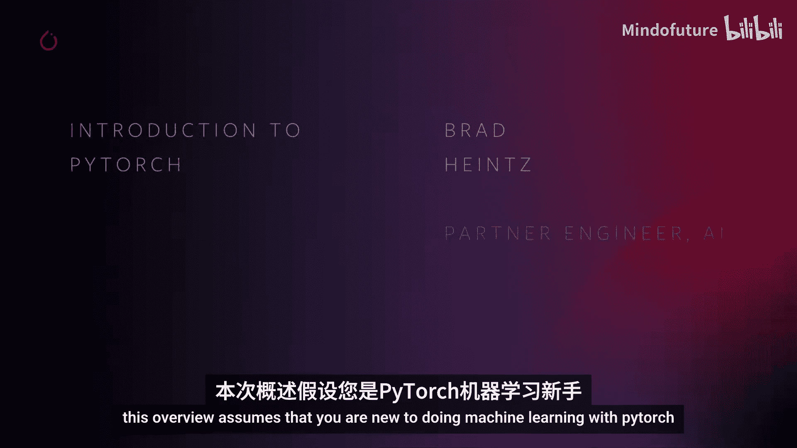
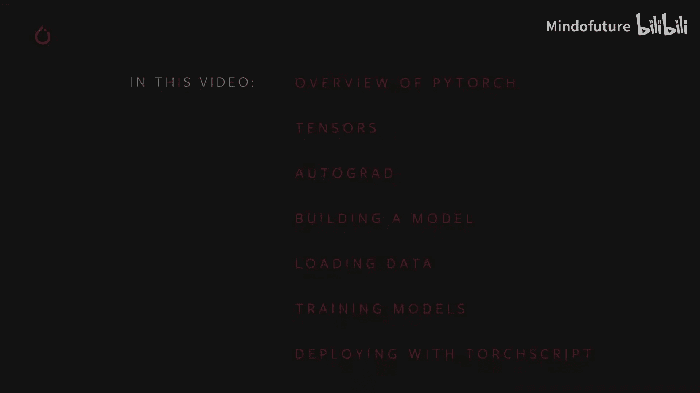
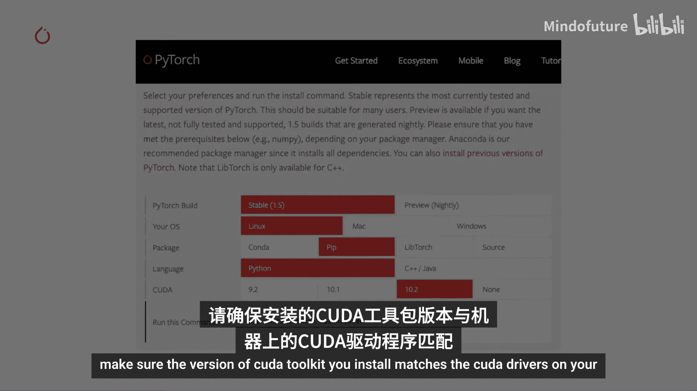
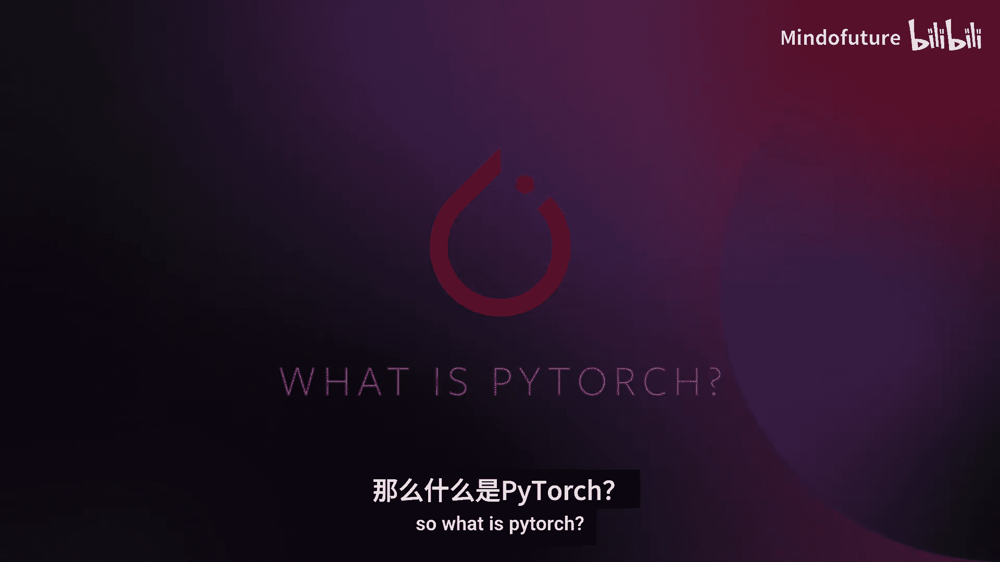
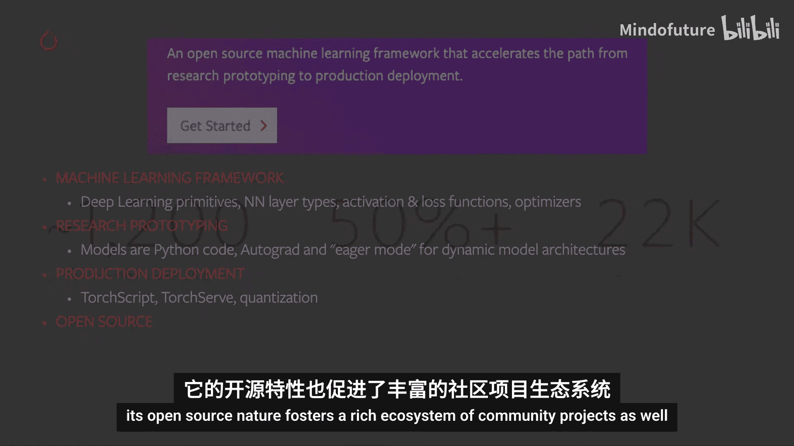
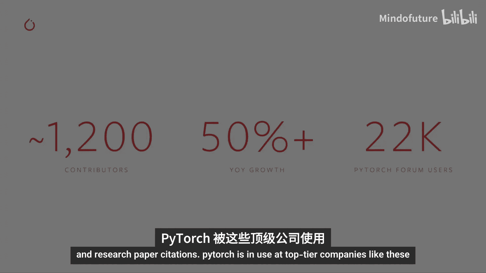
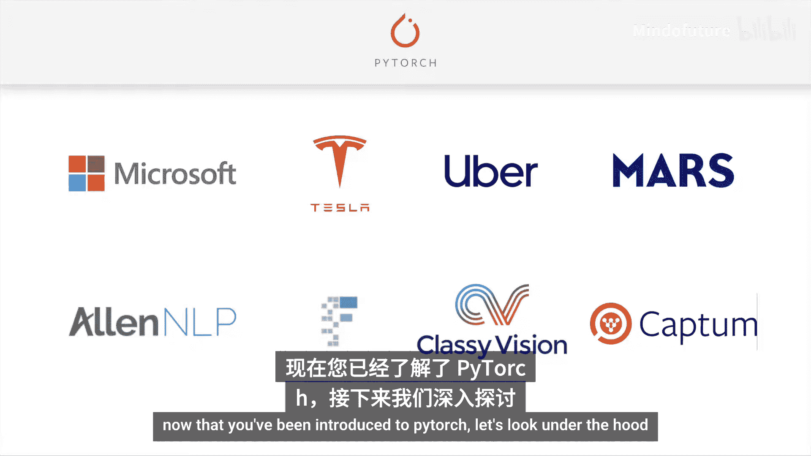
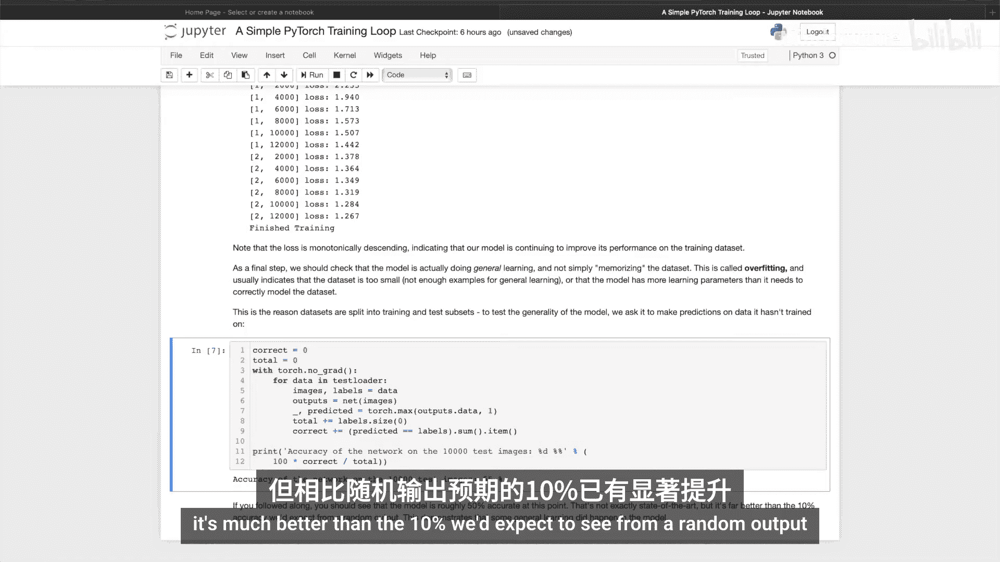
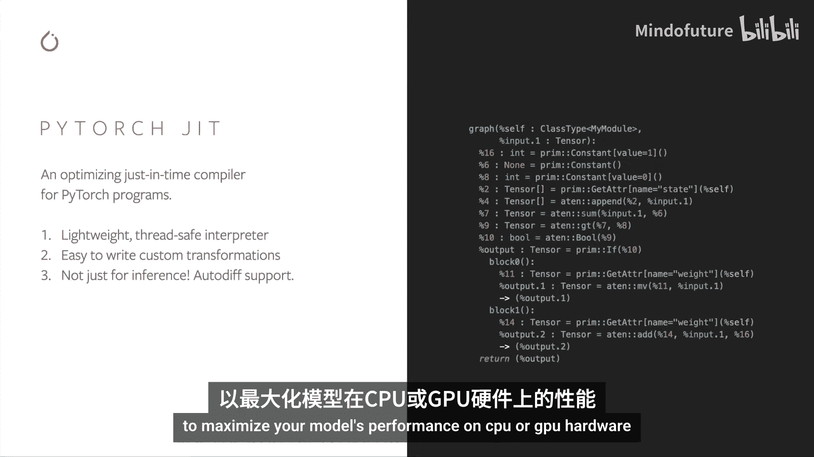
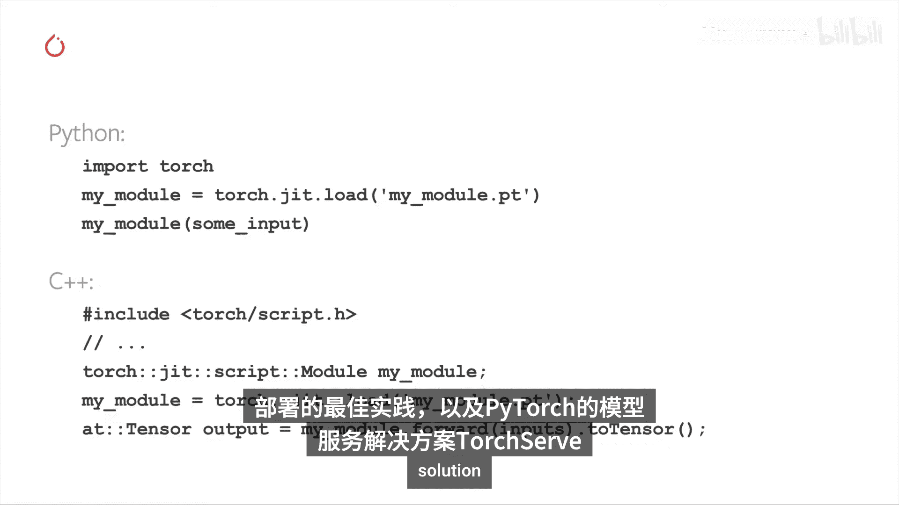

# 001：PyTorch简介

在本节课中，我们将要学习PyTorch的基础知识，包括其核心概念、相关工具和库。本概述假设您是初次使用PyTorch进行机器学习。

在本视频中，我们将涵盖以下内容：
*   PyTorch相关项目概述。
*   **张量**，这是PyTorch的核心数据抽象。
*   **自动求导**，它支持即时执行模式计算，使模型的快速迭代成为可能。
*   使用PyTorch模块构建模型。
*   如何高效加载数据以训练模型。
*   演示一个基础的训练循环。
*   最后，讨论使用TorchScript进行部署。

在开始之前，您需要安装PyTorch和torchvision，以便能够跟随演示和练习。如果您尚未安装最新版本的PyTorch，请访问PyTorch.org。

首页有一个安装向导。这里有两个重要事项需要注意。首先，CUDA驱动程序不适用于Mac。因此，在Mac上无法通过PyTorch获得GPU加速。其次，如果您在配备一个或多个NVIDIA CUDA兼容GPU的Linux或Windows机器上工作，请确保您安装的CUDA工具包版本与机器上的CUDA驱动程序匹配。

那么，什么是PyTorch？

PyTorch.org告诉我们，PyTorch是一个开源机器学习框架，它加速了从研究原型到生产部署的路径。

我们来详细解读一下。首先，PyTorch是用于机器学习的软件。它包含一个完整的工具包，用于构建和部署机器学习应用，包括深度学习原语，如神经网络层类型、激活函数和基于梯度的优化器。它在NVIDIA GPU上具有硬件加速功能，并拥有用于计算机视觉、文本和自然语言以及音频应用的相关库。Torchvision是PyTorch的计算机视觉库，还包括预训练模型和打包的数据集，您可以用它们来训练自己的模型。

PyTorch旨在实现机器学习模型和应用的快速迭代。您可以使用常规的、符合Python习惯的代码进行工作。无需学习新的领域特定语言来构建计算图。通过自动求导，模型的反向传播只需一个函数调用即可完成，并且无论计算在代码中经过哪条路径，都能正确执行，为您在模型设计中提供了无与伦比的灵活性。

PyTorch拥有适用于企业级规模工作的工具，例如TorchScript，这是一种从PyTorch代码创建可序列化和可优化模型的方法；TorchServe，PyTorch的模型服务解决方案；以及用于量化模型以提升性能的多种选项。

最后，PyTorch是免费的开源软件，可以自由使用，并开放社区贡献。其开源性质也培育了丰富的社区项目生态系统，支持从随机过程到基于图的神经网络等各种用例。

PyTorch社区庞大且不断增长，拥有来自全球超过1200名项目贡献者，研究论文引用量年同比增长超过50%。

PyTorch在顶级公司中得到使用，并为诸如AllenNLP（用于自然语言深度学习的开源研究库）、FastAI（使用现代最佳实践简化快速准确神经网络训练）、Classy Vision（用于图像和视频分类的端到端框架）和Captum（帮助您理解和解释模型行为的开源可扩展库）等项目提供了基础。

现在您已经了解了PyTorch，让我们深入其内部。张量将是您在PyTorch中所做一切的核心。您的模型、输入、输出和学习权重都以张量的形式存在。

如果“张量”不是您通常的数学词汇，只需知道在此上下文中，我们谈论的是一个多维数组，但附带了许多额外的功能。

PyTorch张量捆绑了超过300种可以在其上执行的数学和逻辑运算。虽然您通过Python API访问张量，但计算实际上发生在为CPU和GPU优化的已编译C++代码中。

让我们看看PyTorch中一些典型的张量操作。

首先我们需要做的是通过 `import torch` 导入PyTorch。

然后我们将创建第一个张量。这里我将创建一个具有五行三列的二维张量，并用零填充。我将查询这些零的数据类型。

您可以看到我得到了请求的15个零的矩阵，数据是32位浮点数。默认情况下，PyTorch将所有张量创建为32位浮点数。

如果您想要整数怎么办？您总是可以覆盖默认值。在下一个单元格中，我创建了一个充满1的张量。我请求它们是16位整数，并注意当我打印它时，PyTorch告诉我这些是16位整数，因为它不是默认值，这可能不是我所期望的。

通常随机初始化学习权重，通常使用特定的随机数生成器种子，以便在后续运行中重现结果。这里我们演示一下。用特定数字为PyTorch随机数生成器设定种子。生成一个随机张量。生成第二个随机张量，我们期望它与第一个不同。用相同的输入重新设定随机数生成器的种子。最后，创建另一个随机张量，我们期望它与第一个匹配，因为它是设定种子后创建的第一个张量。果然，我们得到了预期的结果。第一个张量和第三个张量确实匹配，而第二个则不匹配。

PyTorch张量的算术运算是直观的。形状相似的张量可以相加、相乘等。标量和张量之间的运算将分布到张量的所有元素上。让我们看几个例子。首先，我将创建一个充满1的张量。然后我将创建另一个充满1的张量，但我会将其乘以标量2。结果将是所有的1都变成2。乘法运算分布到张量的每个元素上。然后我将两个张量相加。我可以这样做是因为它们形状相同。运算在它们之间逐元素进行。现在我们得到一个充满3的张量。当我查询该张量的形状时，它与加法运算的两个输入张量的形状相同。最后，我创建两个不同形状的随机张量并尝试相加。我得到一个运行时错误，因为无法在两个不同形状的张量之间进行清晰的逐元素算术运算。

以下是PyTorch张量上可用的数学运算的一小部分示例。我将创建一个随机张量并调整其值在-1到1之间。我可以取其绝对值，看到所有值都变为正数。我可以取其反正弦，因为值在-1到1之间，并得到一个角度。我可以进行线性代数运算，如计算行列式或进行奇异值分解。还有统计和聚合运算，如均值、标准差、最小值和最大值等。

关于PyTorch张量的强大功能还有很多需要了解，包括如何为GPU上的并行计算设置它们。我们将在另一个视频中深入探讨。

作为对PyTorch自动微分引擎**自动求导**的介绍，让我们考虑一次简单训练过程的基本机制。对于这个例子，我们将使用一个简单的循环神经网络。我们首先有四个张量：输入X，RNN的隐藏状态H（赋予其记忆），以及两组学习权重，每组分别用于输入和隐藏状态。接下来，我们将权重乘以它们各自的张量。这里的“@”代表矩阵乘法。之后，我们将两个矩阵乘法的输出相加。并将结果通过一个激活函数（这里是双曲正切）传递。最后，我们计算此输出的损失。损失是正确输出与模型实际预测之间的差异。

因此，我们获取了一个训练输入，通过模型运行它，得到一个输出，并确定了损失。这是训练循环中的关键点，我们需要计算该损失相对于模型每个参数的导数，并使用学习权重的梯度来决定如何调整这些权重以减少损失。即使对于这样的小模型，也有很多参数和导数需要计算。

但好消息是，您可以用一行代码完成。此计算生成的每个张量都知道它是如何产生的。例如，`h_to_h` 携带元数据，表明它来自 `W_h` 和 `H` 的矩阵乘法。这种历史跟踪一直延续到图的其余部分。这种历史跟踪使得 `backward` 方法能够快速计算模型学习所需的梯度。这种历史跟踪是模型灵活性和快速迭代的促成因素之一。即使在具有决策分支和循环的复杂模型中，计算历史也会跟踪特定输入在模型中经过的特定路径，并正确计算反向导数。

在后续视频中，我们将向您展示如何使用自动求导做更多技巧，例如使用自动求导分析器、计算二阶导数，以及如何在不需要时关闭自动求导。

到目前为止，我们已经讨论了张量和自动求导，以及它们与PyTorch模型交互的一些方式。但是，模型在代码中是什么样子的呢？让我们构建并运行一个简单的模型来感受一下。

首先，我们将导入PyTorch。我们还将导入 `torch.nn`，它包含我们将组合到模型中的神经网络层，以及模型本身的父类。我们将导入 `torch.nn.functional` 以获取激活函数和最大池化函数，我们将用它们来连接层。

这里我们有一个LeNet-5的示意图。它是最早的卷积神经网络之一，也是深度学习爆炸式发展的推动力之一。它被构建用于读取手写数字的小图像，即MNIST数据集，并正确分类图像中表示的是哪个数字。

以下是其工作原理的简化版本。层C1是一个卷积层，意味着它扫描输入图像以寻找在训练期间学到的特征。它输出一个激活图，显示它在此图像中看到每个学习特征的位置。该激活图在层S2中进行下采样。层C3是另一个卷积层，这次扫描C1的激活图以寻找特征组合。它也输出一个激活图，描述这些特征组合的空间位置，该图在层S4中进行下采样。最后，末端的全连接层F5、F6和输出是一个分类器，它获取最终的激活图并将其分类到代表10个数字的10个类别中。

那么，我们如何在代码中表达这个简单的神经网络呢？查看这段代码，您应该能够发现与上图的一些结构相似之处。这展示了一个典型PyTorch模型的结构。它继承自 `torch.nn.Module`。模块可以嵌套。事实上，这里的 `Conv2d` 和 `Linear` 层也是 `torch.nn.Module` 的子类。

每个模型都会有一个 `__init__` 方法，在其中构建将组合到其计算图中的层，并加载它可能需要的任何数据工件。例如，一个NLP模型可能会加载一个词汇表。模型会有一个 `forward` 函数。这是实际计算发生的地方，输入通过各种函数通过网络层传递以生成输出，即预测。除此之外，您可以像构建任何其他Python类一样构建您的模型类，添加支持模型计算所需的任何属性和方法。

让我们实例化这个模型。并通过它运行一个输入。

这里发生了几件重要的事情。我们正在创建一个LeNet的实例。我们打印该对象。`torch.nn.Module` 的子类将报告它创建的层及其形状和参数。如果您想了解模型处理的要点，这可以提供方便的概述。

在那下面，我们创建了一个虚拟输入，代表一个具有一个颜色通道的32x32图像。通常，您会加载一个图像块并将其转换为这种形状的张量。您可能已经注意到我们的张量有一个额外的维度。这是批次维度。PyTorch模型假设它们处理的是批量数据。例如，一批16个我们的图像块将具有形状 `[16, 1, 32, 32]`。由于我们只使用一张图像，我们创建了一个批次大小为1的张量，形状为 `[1, 1, 32, 32]`。

我们通过像调用函数一样调用模型来请求推理：`net(input)`。此调用的输出代表模型对输入代表特定数字的置信度。由于这个模型实例尚未训练，我们不应期望在输出中看到任何信号。查看输出的形状，我们可以看到它也有一个批次维度，其大小应始终与输入批次维度匹配。如果我们传入一个包含16个实例的输入批次，输出将具有形状 `[16, 10]`。

您已经看到了如何构建模型，以及如何给它一批输入并检查输出。然而，模型并没有做太多事情，因为它尚未经过训练。为此，我们需要给它提供大量数据。为了训练我们的模型，我们需要一种批量提供数据的方法。这就是PyTorch的 `Dataset` 和 `DataLoader` 类发挥作用的地方。让我们看看它们的实际应用。

这里我声明了 `%matplotlib inline`，因为我们将在笔记本中渲染一些图像。我导入了PyTorch。我还导入了 `torchvision` 和 `torchvision.transforms`。这些将为我们提供数据集以及我们需要应用于图像的一些转换，以使它们能够被PyTorch模型消化。

我们需要做的第一件事是将输入的图像转换为PyTorch张量。这里我们为输入指定了两个转换。`transforms.ToTensor()` 获取由PIL库加载的图像，并将它们转换为PyTorch张量。`transforms.Normalize()` 调整张量的值，使其平均值为0，标准差为0.5。大多数激活函数在0点附近具有最强的梯度，因此将数据集中在那里可以加速学习。还有许多其他可用的转换，包括裁剪、居中、旋转、反射以及您可能对图像进行的大多数其他操作。

接下来，我们将创建一个CIFAR-10数据集的实例。这是一组32x32彩色图像块，代表10类对象：6种动物和4种车辆。当您运行上面的单元格时，数据集可能需要一两分钟才能完成下载，请注意这一点。这是在PyTorch中创建数据集的一个例子。像上面的CIFAR-10这样的可下载数据集是 `torch.utils.data.Dataset` 的子类。PyTorch中的数据集类包括 `torchvision`、`torchtext` 和 `torchaudio` 中的可下载数据集，以及实用数据集类，如 `torchvision.datasets.ImageFolder`，它将读取一个带标签图像的文件夹。您也可以创建自己的 `Dataset` 子类。

当我们实例化数据集时，我们需要告诉它几件事：我们希望数据存放的文件系统路径；我们是否将此集用于训练，因为大多数数据集会分为训练和测试子集；如果我们尚未下载数据集，是否希望下载它；以及我们想要应用于图像的转换。

准备好数据集后，您可以将其提供给数据加载器。数据集子类包装了对数据的访问，并专门针对所服务数据的类型。数据加载器对数据一无所知，但会根据您在上面示例中指定的参数，将数据集提供的输入张量组织成批次。我们要求数据加载器从训练集中给我们提供每批4张图像，通过 `shuffle=True` 随机化它们的顺序，并告诉它启动两个工作进程从磁盘加载数据。可视化数据加载器提供的批次是一个好习惯。运行单元格应该会显示一条包含四张图像的条带，并且您应该看到每张图像的正确标签。这里确实是我们的四张图像，看起来像一只猫、一只鹿和两辆卡车。

我们已经深入了解了张量和自动求导，并看到了PyTorch模型是如何构建的，以及如何高效地为它们提供数据。现在是时候将所有部分整合在一起，看看模型是如何被训练的了。

现在我们回到了我们的笔记本，您会看到这里的导入，除了 `torch.optim`（我很快就会谈到）之外，所有这些都应该从视频的前面部分看起来很熟悉。我们首先需要的是训练和测试数据集。因此，如果您还没有运行下面的单元格，请确保数据集已下载，如果您尚未这样做，可能需要一分钟。

我们将检查数据加载器的输出。再次，我们应该看到一个包含四张图像的条带：飞机、飞机、飞机、轮船。看起来正确。数据加载器工作正常。

这是我们将要训练的模型。如果这个模型看起来很熟悉，那是因为它是LeNet的一个变体，我们在本视频前面讨论过，但它被调整为接受三通道彩色图像。

我们需要的最后成分是损失函数和优化器。损失函数，如本视频前面所讨论的，是衡量模型预测与理想输出之间距离的指标。交叉熵损失是像我们这样的分类模型的典型损失函数。优化器是驱动学习的东西。这里，我们创建了一个实现随机梯度下降的优化器，这是更直接的优化算法之一。除了算法的参数（如学习率和动量）之外，我们还传入了 `net.parameters()`，这是模型中所有学习权重的集合，优化器将调整这些权重。

最后，所有这些都被组装到训练循环中。继续运行这个单元格，因为它需要几分钟才能执行。这里我们只进行两个训练周期，正如您从第1行看到的，这是对训练数据集的两次完整遍历。每次遍历都有一个内部循环，迭代训练数据，提供批量转换后的图像及其正确标签。

第9行清零梯度是非常重要的一步。当您运行一个批次时，梯度会在该批次上累积。如果我们不重置每个批次的梯度，它们将继续累积并提供不正确的值，学习将停止。在第12行，我们要求模型对批次进行实际预测。在接下来的第13行，我们计算损失，即输出与标签之间的差异。在第14行，我们进行反向传播并计算将指导学习的梯度。在第15行，优化器执行一个学习步骤。它使用来自反向调用的梯度，将学习权重朝着它认为会减少损失的方向微调。

循环的其余部分只是对周期编号、已完成多少训练实例以及整个训练周期内的累计损失进行一些简单的报告。请注意，损失是单调下降的，表明我们的模型在训练数据集上的性能持续提高。

作为最后一步，我们应该检查模型是否真的在进行泛化学习，而不是简单地记忆数据集。这被称为过拟合，通常表明您的数据集太小、示例不足，或者您的模型太大、对数据建模过度。我们防止过拟合的方法是测试模型在未训练过的数据上的表现，这就是为什么我们有一个测试数据集。这里我将运行测试数据，我们会得到一个准确率指标：55%。这虽然不是最先进的技术，但比我们从随机输出中预期的10%要好得多。这表明模型中确实发生了一些泛化学习。

当您不辞辛劳地构建和训练一个非平凡模型时，通常是因为您想用它来做一些事情。您需要将其连接到一个系统，该系统为其提供输入并处理模型的预测。如果您热衷于优化性能，您可能希望在没有Python解释器依赖的情况下完成此操作。好消息是PyTorch通过TorchScript为您提供了便利。

TorchScript是Python的一个静态、高性能子集。当您将模型转换为TorchScript时，模型的动态和Python特性得以完全保留。控制流在转换为TorchScript时得以保留，您仍然可以使用方便的Python数据结构，如列表和字典。查看右侧的代码，您会看到一个用Python定义的PyTorch模型。在其下方，创建了一个模型实例，然后我们调用 `torch.jit.script(my_module)`。这一行代码就是将Python模型转换为TorchScript所需的全部。此模型的序列化版本保存在最后一行中，它包含有关模型计算图及其学习权重的所有信息。模型的TorchScript表示显示在右侧。

TorchScript旨在由PyTorch即时编译器消费。JIT寻求运行时优化，例如操作重新排序和层融合，以最大化模型在CPU或GPU硬件上的性能。

那么，如何加载和执行TorchScript模型呢？您首先使用 `torch.jit.load` 加载序列化的包，然后可以像调用任何其他模型一样调用它。更重要的是，您可以在Python中执行此操作，或者您可以将其加载到PyTorch C++运行时中以消除解释型语言的依赖。在后续视频中，我们将更详细地介绍TorchScript、部署的最佳实践，并将涵盖TorchServe，PyTorch的模型服务解决方案。

这就是我们对PyTorch的快速概述。我们在这里使用的模型和数据集相当简单。但PyTorch在大型企业的生产中被用于强大的现实世界用例，例如在人类语言之间翻译、描述视频场景的内容或在视频中生成逼真的人声。在接下来的视频中，我们将让您掌握这种能力，我们将更深入地探讨这里涵盖的所有主题，并提供更复杂的用例，就像您在现实世界中看到的那样。

感谢您的时间和关注。希望能在PyTorch论坛见到您。