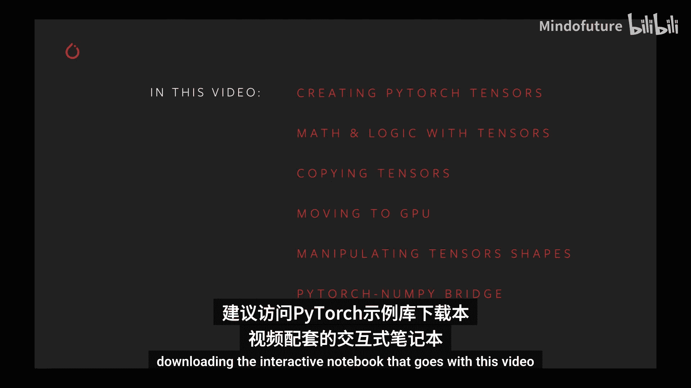
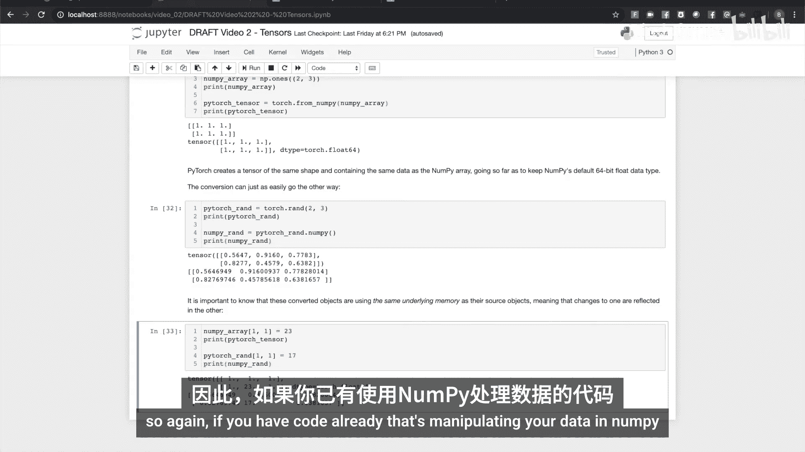

# 002：深入理解PyTorch张量 🧮



在本节课中，我们将深入学习PyTorch张量。张量是PyTorch深度学习模型的核心数据结构，所有的数据、输入、输出和学习权重都必须表示为张量。我们将涵盖张量的创建、数学与逻辑运算、复制、GPU加速、形状操作以及与NumPy的互操作性。

---

## 创建张量

上一节我们介绍了张量的重要性，本节中我们来看看如何创建张量。PyTorch提供了多种工厂方法来创建具有或不具有初始值的张量。

以下是几种创建张量的基本方法：

*   **`torch.empty()`**：分配内存但不初始化值。例如，`torch.empty(3, 4)` 创建一个3行4列的未初始化张量。
*   **`torch.zeros()`**：创建指定形状且所有元素为0的张量。例如，`torch.zeros(2, 3)`。
*   **`torch.ones()`**：创建指定形状且所有元素为1的张量。例如，`torch.ones(2, 3)`。
*   **`torch.rand()`**：创建指定形状且元素为[0, 1)区间内均匀分布随机数的张量。例如，`torch.rand(2, 3)`。

为了确保使用随机数生成的结果可复现，可以使用 `torch.manual_seed()` 函数设置随机种子。

```python
torch.manual_seed(1729)
random_tensor = torch.rand(2, 3)
```

---

## 张量形状与数据类型

在操作多个张量时，它们通常需要具有相同的形状。我们可以使用 `tensor.shape` 属性来查询张量的形状。

张量可以包含不同的数据类型，如浮点数、整数或布尔值。创建时可以指定数据类型，也可以使用 `.to()` 方法进行转换。

以下是创建时指定数据类型的示例：

```python
int_tensor = torch.ones((2, 3), dtype=torch.int16)
float_tensor = torch.ones((2, 3), dtype=torch.float64)
```

使用 `.to()` 方法转换数据类型：

```python
float_tensor = torch.rand(2, 3)
int_tensor = float_tensor.to(torch.int32) # 浮点数将被截断为整数
```

---

## 张量运算

了解了如何创建张量后，我们来看看如何对它们进行运算。PyTorch支持丰富的数学和逻辑运算。

### 张量与标量运算

运算会应用于张量的每一个元素。

```python
a = torch.zeros(2, 2)
b = a + 1  # b 现在是一个所有元素为1的2x2张量
c = b * 3  # c 现在是一个所有元素为3的2x2张量
```

### 张量与张量运算

当两个形状相同的张量进行运算时，运算是逐元素进行的。

```python
a = torch.full((2, 2), 2.0)
b = torch.tensor([[1, 2], [3, 4]], dtype=torch.float)
c = a ** b  # 逐元素求幂
d = a + b   # 逐元素相加
```

### 广播机制

广播允许对不同形状但满足特定规则的张量进行运算。规则是：从最后一个维度开始向前比较，每个维度必须相等，或者其中一个为1，或者其中一个张量在该维度上不存在。

```python
# 示例：将形状为(1, 4)的张量与形状为(2, 4)的张量相乘
random_tensor = torch.rand(2, 4)
multiplier = torch.tensor([[2., 2., 2., 2.]])
result = random_tensor * multiplier # 乘法被广播到每一行
```

---

## 常用操作与原地操作

PyTorch提供了超过300种张量操作，包括数学函数、三角函数、逻辑运算、比较运算和归约运算等。

有时，为了节省内存，我们希望在现有张量上直接修改结果，而不是创建新的张量。这可以通过使用带下划线 `_` 的方法来实现。

以下是原地操作的示例：

```python
a = torch.rand(2, 2)
b = torch.rand(2, 2)
a.add_(b) # 将b加到a上，结果存储在a中
```

许多函数也支持 `out` 参数，用于将结果直接输出到已分配的张量中。

```python
a = torch.rand(2, 2)
b = torch.rand(2, 2)
c = torch.zeros(2, 2)
torch.matmul(a, b, out=c) # 矩阵乘法的结果存入c
```

---

## 复制张量

在Python中，简单的赋值 (`b = a`) 不会创建数据的副本，而只是创建了一个新的引用。要创建数据的独立副本，需要使用 `.clone()` 方法。

```python
a = torch.ones(2, 2)
b = a.clone() # b是a数据的独立副本
a[0, 0] = 999
print(b[0, 0]) # 输出仍然是1，b未受影响
```

如果源张量启用了自动求导 (`requires_grad=True`)，其克隆体也会跟踪梯度历史。若想克隆时不跟踪梯度，可以使用 `.detach()` 方法。

```python
a = torch.rand(2, 2, requires_grad=True)
b = a.clone() # b也跟踪梯度
c = a.detach().clone() # c不跟踪梯度
```

---

## GPU加速

PyTorch的一个核心优势是GPU加速。首先，检查GPU是否可用：

```python
torch.cuda.is_available()
```

创建张量时指定设备，或使用 `.to()` 方法将现有张量移动到目标设备。

```python
# 创建时指定
if torch.cuda.is_available():
    gpu_tensor = torch.rand(2, 2, device='cuda')

# 移动现有张量
cpu_tensor = torch.rand(2, 2)
gpu_tensor = cpu_tensor.to('cuda')
```

最佳实践是使用设备句柄，避免在代码中硬编码字符串。

```python
device = torch.device('cuda' if torch.cuda.is_available() else 'cpu')
my_tensor = torch.rand(2, 2, device=device)
```

---

## 操作张量形状

在模型构建中，经常需要改变张量的形状。

### 增加或减少维度 (`unsqueeze` / `squeeze`)

*   **`unsqueeze(dim)`**：在指定维度索引处插入一个大小为1的新维度。常用于将单个实例变为批次大小为1的输入。
*   **`squeeze(dim)`**：移除指定维度（该维度大小必须为1）。常用于移除批次维度。

```python
# 假设有一个代表单张图片的张量 (3, 226, 226)
single_image = torch.rand(3, 226, 226)
batch_of_one = single_image.unsqueeze(0) # 形状变为 (1, 3, 226, 226)

# 模型输出可能是 (1, 20)
model_output = torch.rand(1, 20)
single_prediction = model_output.squeeze(0) # 形状变为 (20,)
```

### 重塑形状 (`reshape`)

`reshape` 方法可以在保持元素总数不变的前提下，改变张量的维度。它通常会返回一个原张量的视图（共享内存），但在某些情况下会返回副本。

```python
# 卷积层输出假设为 (6, 20, 20)
conv_output = torch.rand(6, 20, 20)
# 重塑为全连接层需要的1维向量
fc_input = conv_output.reshape(6 * 20 * 20) # 或 reshape(-1)
```

---

## 与NumPy的互操作性

如果你有现有的NumPy代码和数据，可以轻松地在NumPy数组和PyTorch张量之间转换。

```python
import numpy as np

# NumPy数组 -> PyTorch张量
np_array = np.ones((2, 3))
torch_tensor = torch.from_numpy(np_array)

# PyTorch张量 -> NumPy数组
torch_tensor = torch.rand(2, 3)
np_array = torch_tensor.numpy()
```

**重要提示**：通过这种方式转换的对象共享底层内存。修改其中一个会影响到另一个。

```python
np_array[0, 0] = 999
print(torch_tensor[0, 0]) # 输出 999
```

---



本节课中我们一起学习了PyTorch张量的核心概念与操作：从创建、指定数据类型，到进行数学运算和利用广播机制；从复制张量、使用GPU加速，到灵活操作张量形状；最后还了解了PyTorch与NumPy之间便捷的数据交换。掌握这些基础知识是构建和训练深度学习模型的关键第一步。建议结合PyTorch官方文档进行更深入的探索和实践。