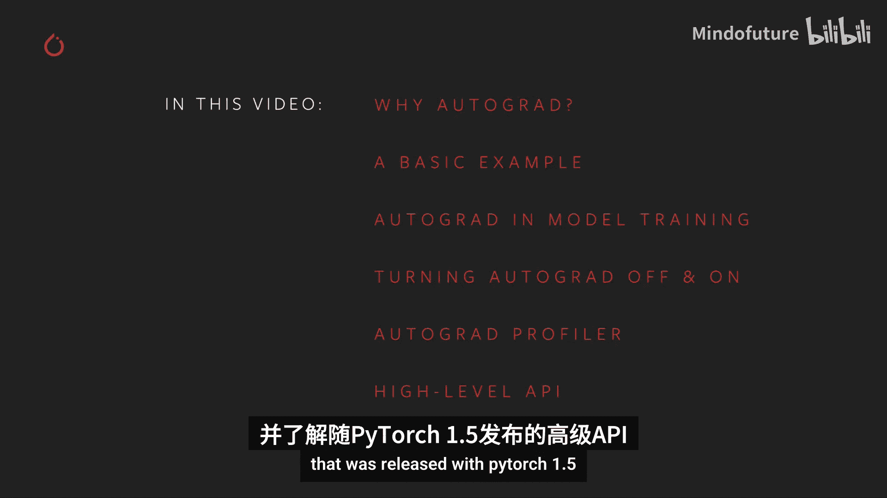
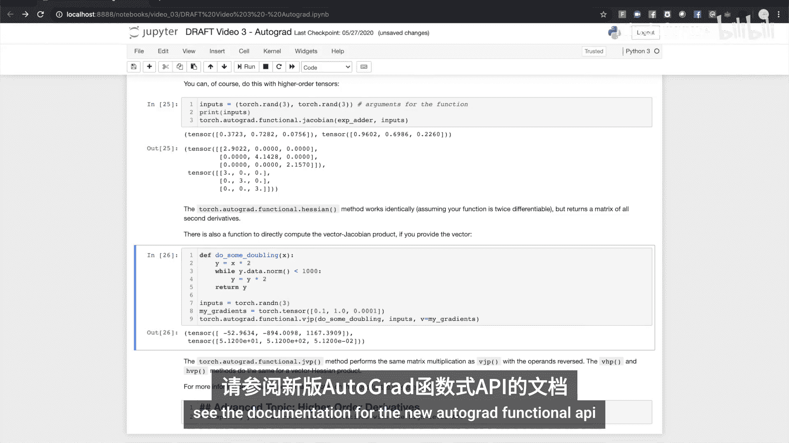
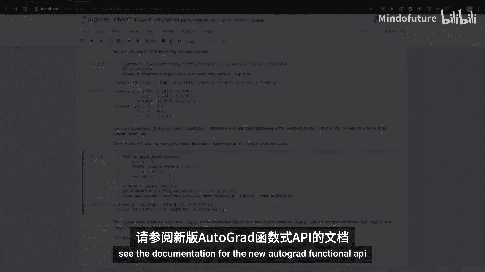

# 003：自动求导基础

在本节课中，我们将要学习PyTorch的核心特性之一：自动求导。自动求导是PyTorch能够快速、灵活地支持基于反向传播的机器学习模型训练的关键。我们将了解它的作用、工作原理，以及如何在实践中使用和控制它。

## 什么是自动求导？🤔

PyTorch的自动求导功能是其成为快速、灵活的深度学习框架的重要组成部分。它通过简化偏导数（也称为梯度）的计算来实现这一点，这些梯度驱动着基于反向传播的学习。

在训练模型时，我们会计算一个损失函数，它告诉我们模型的预测与理想值相差多远。然后，我们需要找到损失函数相对于模型学习权重（即参数）的偏导数。这些导数告诉我们为了最小化损失，需要朝哪个方向调整权重。这涉及到在计算的每条路径上迭代应用微积分的链式法则。

自动求导通过在运行时追踪你的计算来加速这一过程。模型计算产生的每个输出张量都携带着导致它的一系列操作的历史记录。这个历史记录允许快速计算整个计算图的导数，一直回溯到模型的学习权重。此外，由于这个历史记录是在运行时收集的，即使你的模型具有包含决策分支和循环的动态结构，你也能得到正确的导数。这比依赖静态计算图分析的工具提供了更大的灵活性。



## 一个简单的自动求导示例 🔍

上一节我们介绍了自动求导的基本概念，本节中我们来看看一个具体的代码示例，感受一下自动求导在幕后做了什么。

首先，我们导入必要的库并创建一个需要计算梯度的张量。

```python
import torch
import matplotlib.pyplot as plt

# 创建一个一维张量，值在0到2π之间，并设置需要计算梯度
a = torch.linspace(0, 2*torch.pi, steps=10, requires_grad=True)
print(a)
```

打印张量`a`时，PyTorch会提示它需要计算梯度。接下来，我们进行一个计算：取`a`中所有值的正弦。

```python
b = torch.sin(a)
plt.plot(a.detach().numpy(), b.detach().numpy())
plt.show()
print(b)
```

打印张量`b`，我们看到PyTorch告诉我们它有一个`grad_fn`属性。这意味着`b`来自一个至少有一个输入需要计算梯度的计算。`grad_fn`告诉我们`b`来自正弦运算。

让我们再执行几个步骤：将`b`乘以2再加1。

```python
c = 2 * b
d = c + 1
print(c)
print(d)
```

输出张量再次在其`grad_fn`属性中包含关于生成它们的操作的信息。

默认情况下，自动求导期望梯度计算的最终函数输出是单个标量值。当我们计算学习权重的导数时就是这种情况，因为损失函数的输出是一个标量值。它不一定必须是单值，但我们稍后会讨论。这里，我们只是对张量的元素求和，并将其称为此计算的最终输出。

```python
output = d.sum()
print(output)
```

实际上，我们可以使用任何输出或中间张量的`grad_fn`属性，通过`grad_fn.next_functions`属性回溯到计算历史的起点。例如，`d`知道它来自加法操作，加法操作知道它来自乘法操作，依此类推，直到`a`。`a`没有`grad_fn`，它是这个计算图的输入或叶节点，因此代表我们想要计算梯度的目标变量。

那么，我们如何实际计算梯度呢？很简单，只需在输出张量上调用`.backward()`方法。

```python
output.backward()
print(a.grad)
```

回顾计算过程，我们有一个正弦函数，其导数是余弦。我们乘以了2，这应该给梯度增加一个因子2。还有加法，它根本不应该改变导数。绘制`a`的`.grad`属性，我们确实看到计算出的梯度是余弦值的两倍。

需要注意的是，梯度只针对计算的输入或叶节点进行计算。在反向传播之后，中间张量不会附加梯度。

## 自动求导在训练循环中的角色 🔄

我们已经窥探了自动求导在简单情况下如何计算梯度。接下来，我们将检查它在PyTorch模型训练循环中的角色。

为了了解自动求导在训练中如何工作，让我们构建一个小模型，并观察它在单个训练批次中的变化。

首先，我们定义并实例化一个模型，并为训练输入和理想输出创建一些标准张量。

```python
import torch.nn as nn

class SimpleModel(nn.Module):
    def __init__(self):
        super().__init__()
        self.layer = nn.Linear(3, 1)

    def forward(self, x):
        return self.layer(x)

model = SimpleModel()
input_data = torch.randn(5, 3)  # 5个样本，每个3个特征
target = torch.randn(5, 1)      # 5个样本的目标值

# 查看模型层的权重（学习参数）
print(model.layer.weight)
print(model.layer.weight.grad)  # 此时梯度应为None
```

你可能已经注意到，在`torch.nn.Module`的子类中，我们没有为模型的层指定`requires_grad=True`，梯度跟踪是为你管理的。查看模型的层，你可以看到随机初始化的权重，并且它们还没有计算梯度。

现在让我们看看在一个训练批次后这是如何变化的。我们将使用预测值与理想输出之间的欧几里得距离平方作为损失函数，并设置一个使用随机梯度下降的基本优化器。

```python
loss_fn = nn.MSELoss()
optimizer = torch.optim.SGD(model.parameters(), lr=0.01)

# 前向传播
prediction = model(input_data)
loss = loss_fn(prediction, target)

print(f"Loss before backward: {loss.item()}")
print(f"Weight grad before backward: {model.layer.weight.grad}")  # 应为None

# 反向传播
loss.backward()

print(f"Weight grad after backward: {model.layer.weight.grad}")  # 现在应有梯度值
print(f"Weight value after backward: {model.layer.weight}")      # 权重应未改变
```

当我们调用`loss.backward()`时，可以看到权重没有改变，但我们已经计算了梯度。这些梯度指导优化器确定如何调整权重以最小化损失分数。

为了实际更新权重，我们必须调用`optimizer.step()`。

```python
optimizer.step()
print(f"Weight value after optimizer.step(): {model.layer.weight}") # 权重已更新
```

这就是PyTorch模型中学习发生的方式。

过程中还有一个重要的步骤。在调用`optimizer.step()`之后，你需要调用`optimizer.zero_grad()`。如果不这样做，梯度将在每个训练批次中累积。

```python
# 错误示例：不调用 zero_grad
for i in range(5):
    prediction = model(input_data)
    loss = loss_fn(prediction, target)
    loss.backward()
    print(f"Batch {i+1}, Gradient norm: {model.layer.weight.grad.norm()}")
    # 注意：这里没有 optimizer.zero_grad()

# 正确做法：每次训练步骤后重置梯度
optimizer.zero_grad()
prediction = model(input_data)
loss = loss_fn(prediction, target)
loss.backward()
print(f"Gradient after zero_grad and new backward: {model.layer.weight.grad.norm()}")
```

如果你的模型没有学习或者训练给出了奇怪的结果，你应该检查的第一件事就是是否在每个训练步骤后调用了`zero_grad`。

## 控制梯度跟踪 🎛️

有时你会想要控制是否对某个计算进行梯度跟踪。有多种方法可以做到这一点，具体取决于情况。

最简单的方法是直接设置`requires_grad`标志。

```python
x = torch.ones(2, 2, requires_grad=True)
y1 = x ** 2
print(f"y1 requires_grad: {y1.requires_grad}, grad_fn: {y1.grad_fn}")

x.requires_grad_(False)  # 关闭x的梯度跟踪
y2 = x ** 2
print(f"y2 requires_grad: {y2.requires_grad}, grad_fn: {y2.grad_fn}")
```

我们可以看到`y1`有一个`grad_fn`，但`y2`没有，因为我们在计算`y2`之前关闭了`x`的历史跟踪。

如果你只需要临时关闭自动求导，可以使用`torch.no_grad()`上下文管理器。

```python
x = torch.ones(2, 2, requires_grad=True)

with torch.no_grad():
    y3 = x ** 2
print(f"Inside no_grad context, y3 requires_grad: {y3.requires_grad}")

y4 = x ** 2
print(f"Outside no_grad context, y4 requires_grad: {y4.requires_grad}")
```

`no_grad`也可以用作函数或方法装饰器，导致装饰函数内部的计算关闭历史跟踪。

对应的上下文管理器是`torch.enable_grad()`，用于在局部上下文中打开自动求导。它也可以用作装饰器。

最后，你可能有一个正在跟踪历史的张量，但需要一个不跟踪历史的副本。在这种情况下，张量对象有一个`.detach()`方法，可以创建一个与计算历史分离的张量副本。

```python
x = torch.ones(2, 2, requires_grad=True)
y = x ** 2
z = y.detach()  # z是y的副本，但不跟踪梯度
print(f"z requires_grad: {z.requires_grad}, grad_fn: {z.grad_fn}")
```

关于自动求导机制还有一个重要的注意事项：你必须小心对正在跟踪梯度的张量使用原地操作。这样做可能会破坏你稍后正确进行反向传播所需的信息。事实上，如果你尝试对需要梯度的输入张量执行原地操作，PyTorch甚至会给你一个运行时错误。

## 使用自动求导分析器 📊

自动求导追踪张量计算的每一步，将这些信息与时间测量相结合，对于分析梯度追踪计算非常有用。事实上，这个功能是自动求导的一部分。

以下是分析器的基本用法示例。

```python
x = torch.randn(1000, 1000, requires_grad=True)
y = torch.randn(1000, 1000, requires_grad=True)

with torch.autograd.profiler.profile(use_cuda=False) as prof:
    for _ in range(10):
        z = x @ y  # 矩阵乘法
        z.sum().backward()

# 打印分析结果
print(prof.key_averages().table(sort_by="self_cpu_time_total"))
```

自动求导分析器还可以按代码块或输入形状对结果进行分组，并可以将结果导出给其他追踪工具。详细文档有完整说明。

## 自动求导高级API 🚀

PyTorch 1.5引入了自动求导高级API，它公开了自动求导底层的一些核心操作。为了最好地解释这一点，我们需要更深入地了解自动求导在幕后做了什么。

假设你有一个具有n个输入和m个输出的函数，即 **y = f(x)**。输出相对于输入的完整偏导数集合是一个称为雅可比矩阵的矩阵。

现在，如果你有第二个函数，我们称之为 **L = g(y)**，它接受一个与第一个函数输出维度相同的n维输入，并返回一个标量输出。你可以将其相对于y的梯度表示为一个列向量（本质上是一个单列的雅可比矩阵）。

将其与我们一直在讨论的内容联系起来：将第一个函数想象成你的PyTorch模型，它可能有许多输入、许多学习权重和许多输出；将第二个函数想象成一个损失函数，它以模型的输出作为输入，以损失值作为标量输出。

如果我们用第二个函数的梯度乘以第一个函数的雅可比矩阵，并应用链式法则，我们会得到另一个列向量。这个列向量表示第二个函数相对于第一个函数输入的偏导数。或者，在我们的机器学习模型的情况下，就是损失相对于学习权重的偏导数。

`torch.autograd`是一个用于计算这些向量-雅可比积的引擎。这就是我们在反向传播过程中累积学习权重梯度的方式。

因此，`.backward()`调用也可以接受一个可选的向量输入。该向量表示输出张量上的一组梯度，这些梯度会乘以前面自动求导追踪张量的雅可比矩阵。

让我们尝试一个带有小向量的具体例子。

```python
x = torch.randn(3, requires_grad=True)
y = x * 2
while y.norm() < 1000:
    y = y * 2

print(f"y: {y}")
# 如果现在尝试调用 y.backward()，会得到一个运行时错误，提示梯度只能为标量输出隐式计算。
# 对于多维输出，自动求导期望你提供这三个输出的梯度，以便它可以乘入雅可比矩阵。
v = torch.tensor([1.0, 0.1, 0.01], dtype=torch.float)
y.backward(v)
print(f"x.grad: {x.grad}")
```

自动求导上有一个API，可以直接访问重要的微分矩阵和向量操作。特别是，它允许你计算特定函数在特定输入下的雅可比矩阵和海森矩阵。海森矩阵类似于雅可比矩阵，但表示所有二阶偏导数。

让我们计算一个简单函数的雅可比矩阵，并针对两个单元素输入进行评估。

```python
from torch.autograd.functional import jacobian

def func(x):
    return torch.stack([torch.exp(x) * 2, x * 3])

input1 = torch.tensor([1.0], requires_grad=False)
input2 = torch.tensor([2.0], requires_grad=False)

J1 = jacobian(func, input1)
J2 = jacobian(func, input2)
print(f"Jacobian at input1 (x=1.0): {J1}")
print(f"Jacobian at input2 (x=2.0): {J2}")
# 第一个输出应等于 2 * exp(x)，因为 exp(x) 的导数是它自身。
# 第二个值应为 3。
```

当然，你也可以对更高阶的张量进行此操作。这里我们使用不同的输入集计算了同一个加法函数的雅可比矩阵。

如果你提供向量，还有一个函数可以直接计算向量-雅可比积。`autograd`的`.jvp()`方法执行与`.vjp()`相同的矩阵乘法，只是操作数顺序相反。`.vhp()`和`.hvp()`方法对向量-海森积执行相同的操作。更多信息，包括重要的性能说明，请参阅新的Autograd Functional API文档。

## 总结 📝





本节课中我们一起学习了PyTorch自动求导的基础知识。我们了解了自动求导如何通过追踪计算历史来高效计算梯度，从而驱动反向传播。我们通过代码示例观察了梯度计算的过程，并探讨了自动求导在模型训练循环中的核心作用。我们还学习了如何控制梯度跟踪的开关，例如使用`requires_grad`、`no_grad`上下文管理器和`.detach()`方法。最后，我们简要介绍了自动求导分析器和PyTorch 1.5引入的高级API，它们为更底层的梯度操作提供了工具。掌握这些概念是有效使用PyTorch进行深度学习模型开发的关键。