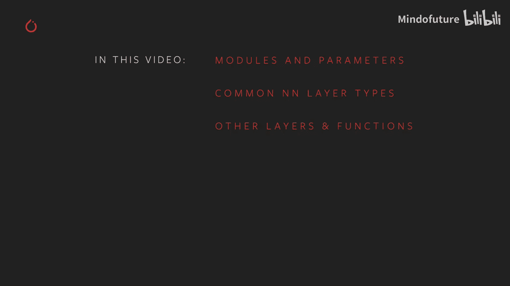
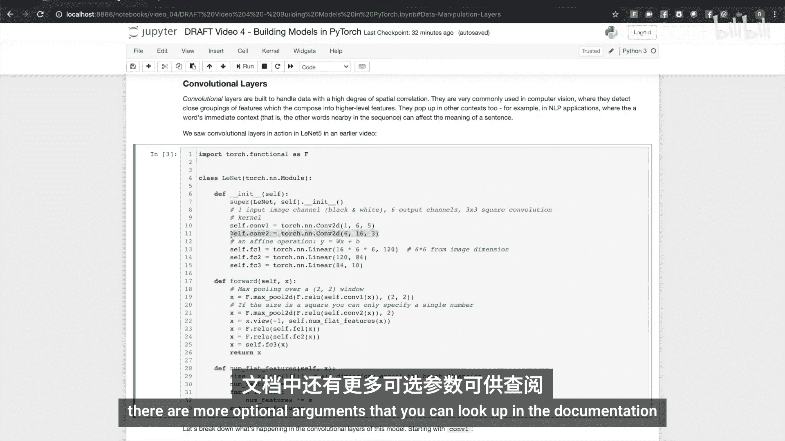
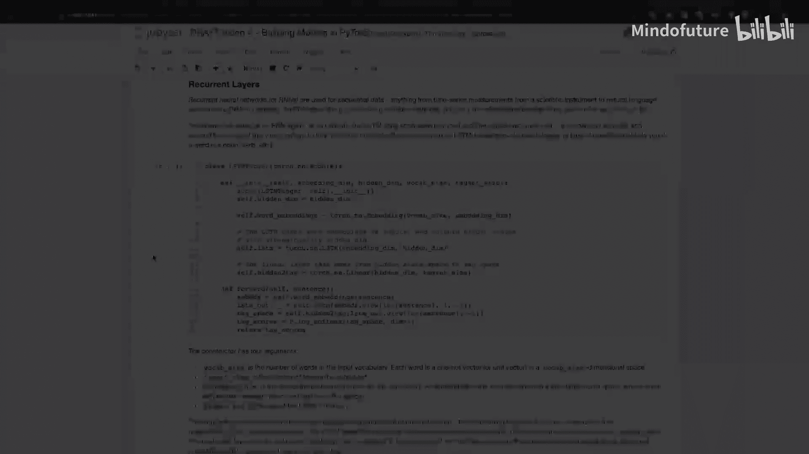
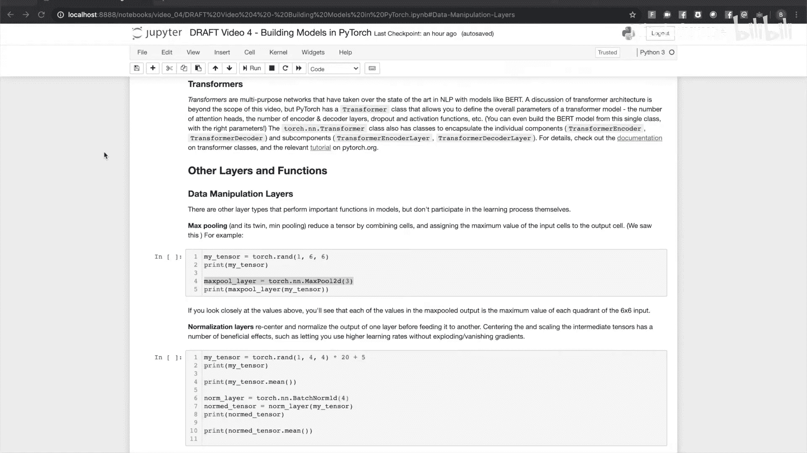
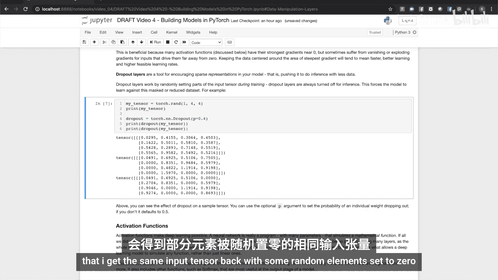
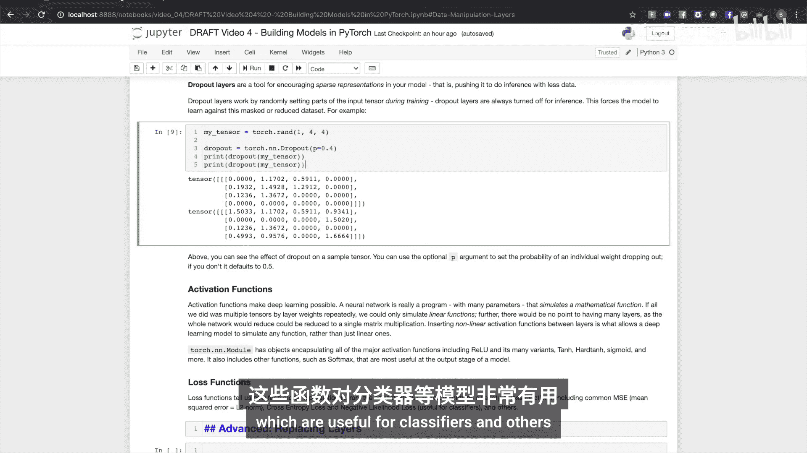

# 004：使用PyTorch构建模型 🏗️

在本节课中，我们将学习如何使用PyTorch的核心类来构建机器学习模型。我们将重点介绍`Module`和`Parameter`类，它们分别用于封装模型和学习权重。此外，我们还将探讨常见的神经网络层类型、其他功能层以及损失函数。



## 模型构建的核心：Module与Parameter类

模型构建的核心围绕着`torch.nn`模块中的两个类：`Module`类和`Parameter`类。`Module`类用于封装模型及其组件，例如神经网络层。`Parameter`类是`torch.Tensor`的子类，用于表示需要学习的权重。

当将一个`Parameter`对象作为`Module`的属性进行赋值时，该参数对象会被注册到该模块中。如果你将一个`Module`子类的实例注册为另一个模块的属性，那么被包含模块的参数也会被注册为拥有者类的参数。

为了更好地理解，让我们来看一个简单的例子。

以下是构建一个简单模型的方法：
```python
import torch
import torch.nn as nn

class TinyModel(nn.Module):
    def __init__(self):
        super(TinyModel, self).__init__()
        self.linear1 = nn.Linear(100, 200)
        self.activation = nn.ReLU()
        self.linear2 = nn.Linear(200, 10)
        self.softmax = nn.Softmax(dim=1)

    def forward(self, x):
        x = self.linear1(x)
        x = self.activation(x)
        x = self.linear2(x)
        x = self.softmax(x)
        return x
```

这个模型展示了PyTorch模型的常见结构。首先，它是`torch.nn.Module`的子类。`__init__`方法定义了模型的结构，即组成模型的层和函数。`forward`方法则将这些层和函数组合成实际的计算流程。

当我们创建这个模型的实例并打印它时，可以看到它不仅知道自己的层和属性，还知道它们被注册的顺序。打印其中一个层，会得到该层的描述。我们的模型和线性层都是`torch.nn.Module`的子类，因此可以通过`parameters()`方法访问它们的参数。模型会递归地注册其拥有的所有子模块的参数，这一点非常重要，因为在训练时，模型需要将所有参数传递给优化器。

## 常见的神经网络层类型

PyTorch提供了封装现代机器学习模型中常用层类型的类。

### 线性层（全连接层）

最基本的是全连接层或线性层，我们在上面的例子中已经见过。在这种层中，每个输入都会影响每个输出，因此称为“全连接”。影响的程度由该层的权重决定。

如果一个层有M个输入和N个输出，其权重将是一个M×N的矩阵。以下是一个简单的线性层示例：

```python
lin = nn.Linear(3, 2)  # 3个输入，2个输出
x = torch.rand(1, 3)   # 随机3元素输入向量
y = lin(x)              # 2元素输出向量
print(y)
```

当你打印参数时，它会显示这些参数需要梯度（`requires_grad=True`），这意味着它们会跟踪计算历史，以便我们可以计算用于学习的梯度。`Parameter`是`torch.Tensor`的子类，但其默认将`requires_grad`设置为`True`的行为与`Tensor`类不同。

线性层在深度学习模型中应用广泛，一个常见的地方是在分类器模型的末端，最后一层或最后几层通常是线性层。

### 卷积层

卷积层旨在处理在空间上强相关的数据。它们在计算机视觉模型中很常见，可用于检测有趣特征的紧密集群，并将其组合成更大的特征或识别对象。它们也出现在其他上下文中，例如自然语言处理应用，因为一个单词的意图通常受其附近单词的影响。

让我们以经典的LeNet-5模型为例，仔细看看卷积计算是如何构建的。LeNet-5旨在接收32x32像素的手写数字黑白图像块，并根据所表示的数字对其进行分类。

观察模型中的第一个卷积层：
```python
conv1 = nn.Conv2d(1, 6, 5)
```
其参数是`(1, 6, 5)`。第一个参数是输入通道数，对于黑白图像，只有一个数据通道，所以是1。第二个参数6是该层要学习的特征数量，因此它可以识别输入中最多六种不同的像素排列。第三个参数5是卷积核的大小，你可以将其想象成一个在输入上扫描的窗口，收集这个5像素窗口内的特征。该卷积层的输出是一个激活图，即它发现某些特征的空间位置图。

第二个卷积层类似，它将第一层的输出作为输入，因此其第一个参数是6。我们要求它学习16个不同的特征，这些特征通过组合第一层的特征来形成。这里我们只使用一个3元素的窗口进行卷积。

在第二个卷积层将其特征组合成更高级别的激活图后，我们将输出传递给一组线性层，这些线性层充当分类器，最后一层有10个输出，代表输入表示10个数字中某一个的概率。





PyTorch为1维、2维和3维输入提供了卷积神经网络层。还有更多可选参数，如步长和填充，你可以在文档中查阅。

### 循环神经网络层

循环神经网络是为处理序列数据而设计的神经网络，例如自然语言句子中的一串单词，或仪器的一串实时测量值。RNN通过保持一个隐藏状态来实现这一点，该状态充当其对序列中迄今为止所见内容的记忆。

RNN层或其变体（长短期记忆网络LSTM和门控循环单元GRU）的内部结构相当复杂，超出了本视频的范围。但我们可以通过一个基于LSTM的词性标注器来展示它的实际应用。

以下是其构造函数的四个参数：
1.  **输入词汇表大小**：即它要识别的整个单词库的大小。
2.  **标签集大小**：模型要识别并输出的标签数量。
3.  **嵌入维度**：词汇表嵌入空间的大小。
4.  **隐藏维度**：LSTM记忆的大小。

输入将是一个句子，其中单词表示为独热向量的索引。嵌入层会将这些映射到嵌入维度的空间中。LSTM接收一系列嵌入，并对其进行迭代，产生一个长度为隐藏维度的输出向量。最后的线性层充当分类器，对输出应用log softmax，最后一层将输出转换为一组归一化的估计概率，表示给定单词映射到给定词性标签的概率。

如果你想看这个网络的运行，PyTorch官网上有一个相关的教程。

### Transformer层

Transformer是多用途的神经网络，但近年来，随着BERT（一种Transformer模型）的成功，我们经常在自然语言应用中看到它们。关于Transformer架构的讨论有些复杂，超出了本视频的范围。但要知道，PyTorch有一个`Transformer`类，允许你定义Transformer模型的整体参数，例如编码器和解码器的层数、注意力头的数量、dropout和激活函数等。你甚至可以使用`torch.nn.Transformer`类，通过正确的参数从这一个类构建BERT模型。

PyTorch还有类来封装Transformer的各个组件，例如编码器、解码器以及组成它们的层。




## 其他功能层

除了学习层，模型中还有一些执行重要功能的非学习层类型。

### 池化层

一个例子是最大池化及其孪生兄弟最小池化。这些函数通过将单元格组合在一起，并将这些输入单元格的最大值分配给输出单元格来减少张量。这可能通过例子更容易解释。

```python
# 假设有一个6x6的输入
pool = nn.MaxPool2d(3, stride=1)
# 使用3x3窗口，步长为1进行最大池化，输出将是4x4
```

### 归一化层

归一化层在将一层的输出馈送到另一层之前，对其进行重新中心和归一化。在计算过程中对中间张量进行中心和缩放有许多有益效果，例如允许你使用更高的学习率，而不会出现梯度消失或爆炸的问题。

运行以下代码，你向一个随机输入张量添加了一个大的缩放因子和偏移。你应该看到输入张量的均值大约在15附近。在我们通过归一化层运行它之后，你可以看到值都变小了，并且集中在0附近。事实上，它的均值应该非常小。这很好，因为许多激活函数（我们稍后会讨论）在零附近有最强的梯度，但对于使它们远离零的输入，有时会遭受梯度消失或爆炸的问题。将数据保持在梯度最陡的区域附近，意味着学习往往会更快发生并更快收敛，并且更高的学习率对你的训练将是可行的。

### Dropout层




Dropout层是鼓励模型中稀疏表示的工具，即推动它用更少的数据进行推理。Dropout层通过在训练期间随机将输入张量的部分设置为0来工作。在推理时，Dropout层总是关闭的。这迫使模型学习如何针对被屏蔽或减少的数据输入进行推理。

例如，我创建一个随机输入张量，并将其通过一个dropout层两次。你会看到有一些零和一些值，但这些值总是相同的。它是在整个张量中随机设置零。你可以使用可选的`p`参数来设置概率，这里我们设置为40%，默认是0.5。

## 激活函数与损失函数

构建模型所需的最后成分是激活函数和损失函数。激活函数是使深度学习成为可能的部分原因。如果你回想一下前面的线性层例子，它只是一个简单的矩阵乘法，接收一个输入向量并得到一个输出向量。如果我们把许多这样的层堆叠在一起，无论我们堆叠多少层，我们总是可以将其简化为单个矩阵乘法，这意味着我们只能模拟线性方程。这就是激活函数的作用所在，通过在层之间插入非线性激活函数，我们获得了模拟非线性方程的能力。

`torch.nn`模块提供了所有主要的激活函数，包括其许多变体的整流线性单元、双曲正切、硬双曲正切、Sigmoid等。它还包括其他函数，如Softmax，在模型的输出阶段非常有用。

PyTorch有多种常见的损失函数，包括均方误差（与L2范数相同）、交叉熵损失和负对数似然损失，这些对分类器和其他应用很有用。

## 总结



在本节课中，我们一起学习了使用PyTorch构建模型的基础知识。我们深入了解了`Module`和`Parameter`这两个核心类如何协同工作来封装模型和学习参数。我们探讨了多种神经网络层，包括线性层、卷积层、循环神经网络层和Transformer层，并了解了它们各自的应用场景。此外，我们还介绍了池化层、归一化层和Dropout层等重要功能层的作用。最后，我们认识到非线性激活函数对于模型表达能力的关键性，并了解了PyTorch提供的常见损失函数。掌握这些组件是构建有效机器学习模型的第一步。