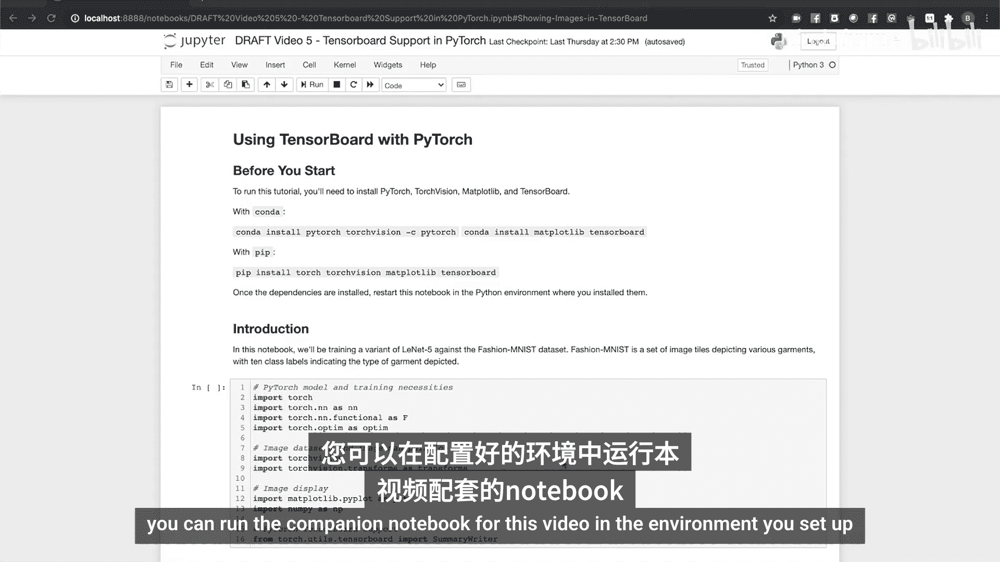
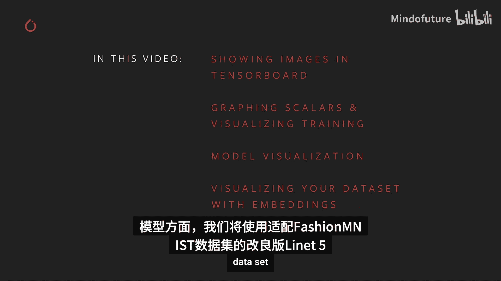
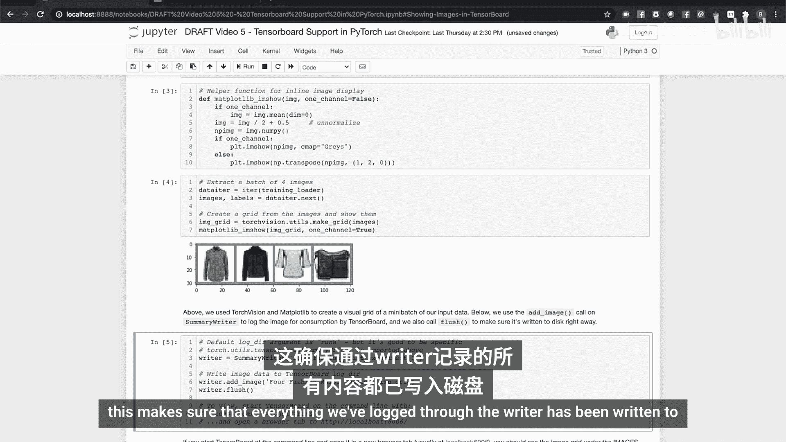
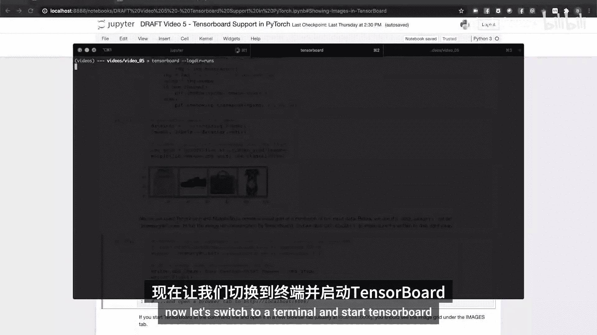
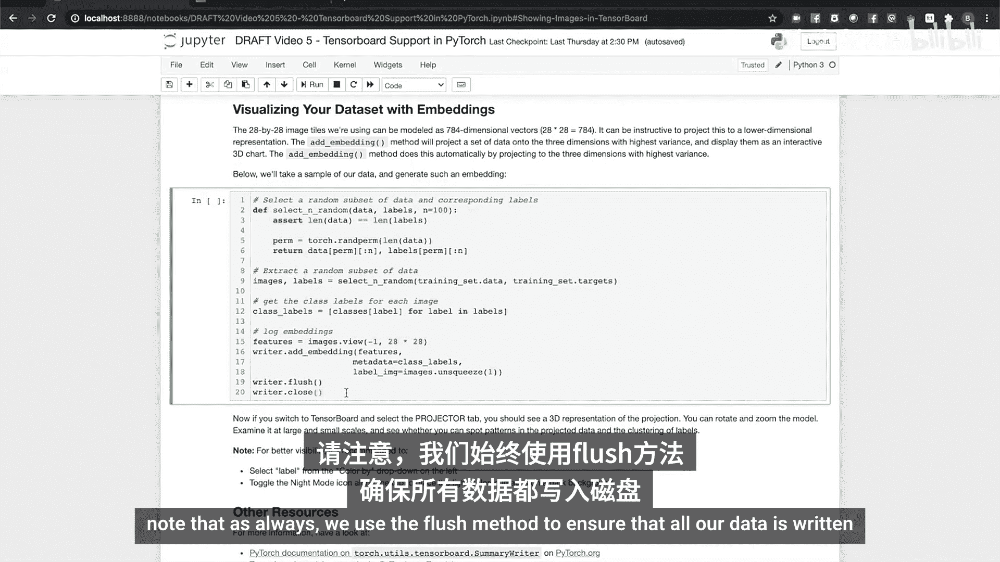
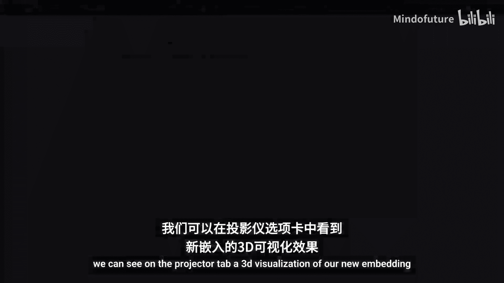
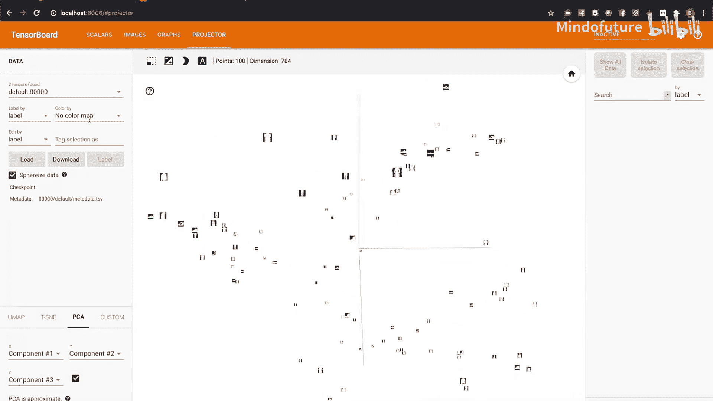
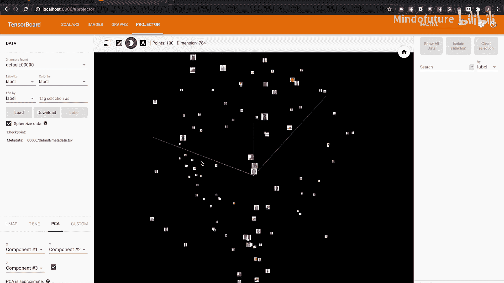
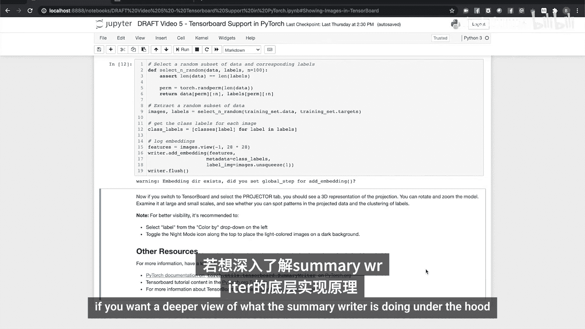

# 005：TensorBoard支持 🎛️

在本节课中，我们将学习如何在PyTorch项目中使用TensorBoard。TensorBoard是一个强大的可视化工具，可以帮助我们监控训练过程、理解模型结构以及探索数据集。我们将通过一个服装分类的实战项目，学习如何记录图像、绘制损失曲线、可视化模型计算图以及创建数据嵌入投影。

## 环境准备与项目介绍



首先，你需要设置一个包含最新版PyTorch和TensorBoard的Python环境。屏幕上的命令展示了如何使用Conda和Pip进行安装。我们还将使用matplotlib来处理图像。

安装好依赖项后，你可以在设置好的环境中运行本视频的配套笔记本。


对于本次模型，我们将训练一个简单的神经网络来识别不同的服装类别。我们将直接可视化数据元素，跟踪训练过程的成功与否。我们将使用TensorBoard来深入观察模型本身，并对整个数据集及其内部关系进行更高级的可视化。

我们将使用Fashion-MNIST数据集。这是一组描绘了各种服装的小图像块，根据所描绘的服装类型进行分类。

对于模型，我们将使用一个经过调整以适应Fashion-MNIST数据集的LeNet-5版本。




## 导入库与设置数据

我们将从导入所需的库开始，并从`torch.utils.tensorboard`导入`SummaryWriter`类。这个类封装了PyTorch中的TensorBoard支持，将是你与TensorBoard交互的主要接口。

在将数据输入模型之前，可视化你的训练数据是一个好习惯，尤其是在计算机视觉任务中。让我们来设置数据集。

我们将使用`torchvision`下载数据集的训练集和验证集拆分。我们稍后会详细讨论验证集。我们还将为每个数据集拆分设置数据加载器，并定义我们要进行分类的类别。

让我们可视化数据集的一些实例。我们将使用一个迭代器提取一些数据实例，并创建一个matplotlib辅助函数将它们批量组合在一个网格中。

让我们在笔记本中显示它们。那么，如何将它们添加到TensorBoard呢？

只需一行代码即可将数据写入日志目录。

请注意，我们还调用了summary writer对象的`flush`方法。这确保了我们通过writer记录的所有内容都已写入磁盘。






现在，让我们切换到终端并启动TensorBoard。


我们将复制TensorBoard命令行给出的URL，并查看“IMAGES”选项卡。

请注意，我们添加的图像有一个标题，其中包含我们将图像保存到TensorBoard日志目录时应用的标签。

## 使用TensorBoard评估训练过程

接下来，我们将使用TensorBoard来帮助评估我们的训练过程。

我们将绘制训练过程中定期累积的训练损失，并将其与在验证数据集上测量的损失进行比较。为了提供背景，这里简要说明一下我们正在做什么以及为什么这样做。

如果你上过数学课，很可能在完成一些作业后，你会参加考试。考试题目在性质上与你已经见过的作业题相似，但在具体内容上有所不同。这是为了确保你学习课程内容，而不仅仅是记住作业题。

类似地，我们可以使用验证数据集。这是总数据集中未用于训练的一部分，用于查看我们的模型是在进行泛化学习，还是过度拟合了训练数据（类似于记忆训练实例，而不是对我们试图优化的通用函数进行建模）。

让我们设置一个包含验证检查的训练循环，并绘制结果。

这里我们有一个训练循环。你可以看到，在代码顶部，我们声明了一个变量来累积模型预测的测量损失，该损失将每1000个训练步骤报告一次。我们还将对验证数据集进行单独的损失检查。

为了跟踪和比较两个不同的量，我们将使用summary writer的`add_scalars`调用，它允许我们添加一个包含多个标量值的字典，每个值都有不同的标签，在图表上会有各自的线条。

让我们运行单元格看看效果。切换到TensorBoard并查看“SCALARS”选项卡，我们可以看到我们的损失在训练过程中单调递减。这是一个很好的迹象，表明训练正在起作用。😊

但我们是否过拟合了呢？从图表上看，我们可以看到验证曲线和训练曲线很好地收敛在一起。

## 可视化模型计算图

接下来，让我们使用TensorBoard来更好地理解我们的模型以及数据如何流经它。

为此，我们将使用summary writer的`add_graph`方法。此方法将模型和一个样本输入作为参数，该样本输入将用于跟踪数据在模型中的流动。

我们将运行单元格并切换到TensorBoard。进入“GRAPHS”选项卡，我们可以看到一个非常简单的图，显示模型一侧输入数据，另一侧输出结果。

当然，我们希望看到更多细节，我们可以通过双击图中的模型节点来获取。在这里，我们可以看到包含我们所有层的图，以及指示数据如何流经它们的箭头。请注意，由于模型两次使用相同的最大池化对象，第二个卷积层看起来像是嵌入在一个循环中。但从代码中可以看出，数据流比那更线性。

## 创建数据嵌入投影

我们已经使用TensorBoard来显示数据实例的可视化。但整个数据集呢？

嵌入是将实例从高维空间映射到低维空间的一种技术。这在自然语言处理中很常见。如果你有一个由one-hot向量表示的10000个单词的词汇表，你的单词就是10000维空间中的单位向量。如果你训练一个将这些向量映射到低维空间的嵌入层，关系就会出现。例如，像“good”、“excellent”和“fabulous”这样的单词的新向量往往会聚集在那个低维空间中。

在我们的例子中，我们的28x28图像块可以被视为784维向量。我们可以使用summary writer的`add_embedding`方法将其投影到一个交互式的3D可视化中。

以下是一段代码，用于选择数据的随机样本，进行标记并投影。

请注意，和往常一样，我们使用`flush`方法来确保所有数据都写入磁盘。



切换到TensorBoard。



我们可以在“PROJECTOR”选项卡上看到我们新嵌入的3D可视化。



放大后，我们可以看到一些大的结构，3D空间内的一些弧线。放大这些结构中的一些，我们可以看到其中一些弧线聚集了相似的服装类型。

放大你自己的数据样本，看看是否能识别出不同类型服装在这个3D投影中是如何聚类的模式。



## 总结与资源


本节课中，我们一起学习了如何在PyTorch中集成和使用TensorBoard。我们涵盖了从记录图像、绘制标量图表以监控训练和验证损失，到可视化模型计算图以理解数据流，最后使用嵌入投影来探索高维数据集的结构。


以下是本教程涉及的核心操作代码示例：


*   **创建SummaryWriter**：
    ```python
    from torch.utils.tensorboard import SummaryWriter
    writer = SummaryWriter('runs/fashion_mnist_experiment_1')
    ```

*   **记录图像**：
    ```python
    writer.add_image('four_fashion_mnist_images', img_grid)
    writer.flush()
    ```

*   **记录标量（如损失）**：
    ```python
    writer.add_scalars('training vs. validation loss',
                      {'training' : running_loss / 1000, 'validation' : val_loss},
                      epoch * len(trainloader) + i)
    ```


*   **记录模型计算图**：
    ```python
    writer.add_graph(model, images)
    ```

*   **记录嵌入投影**：
    ```python
    writer.add_embedding(features, metadata=class_labels, label_img=images.unsqueeze(1))
    writer.flush()
    ```

如果你想了解更多关于PyTorch TensorBoard支持的信息，可以访问以下资源：

*   PyTorch官方文档 `pytorch.org`，查看`torch.utils.tensorboard.SummaryWriter`的完整文档。
*   PyTorch教程部分 `pytorch.org/tutorials`，有关于使用TensorBoard的教程。
*   TensorBoard文档本身，当然，提供了关于TensorBoard更详细的介绍。如果你想更深入地了解summary writer在底层做了什么，这些文档会很有帮助。



