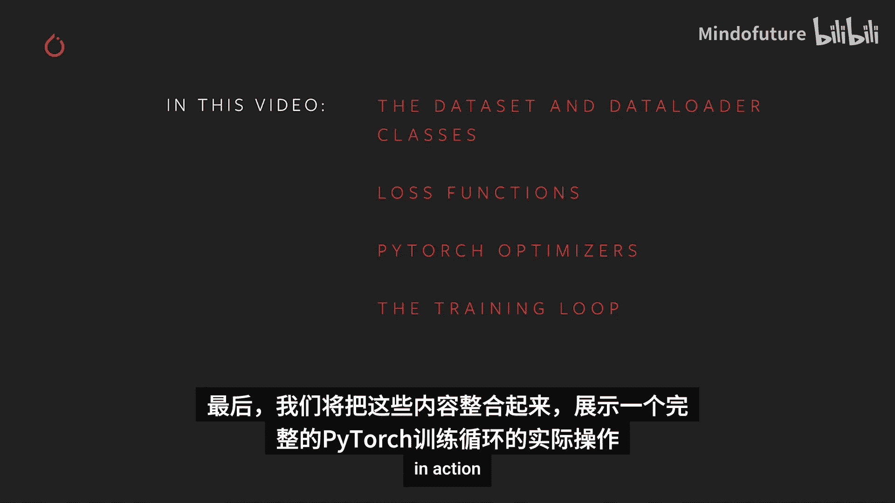
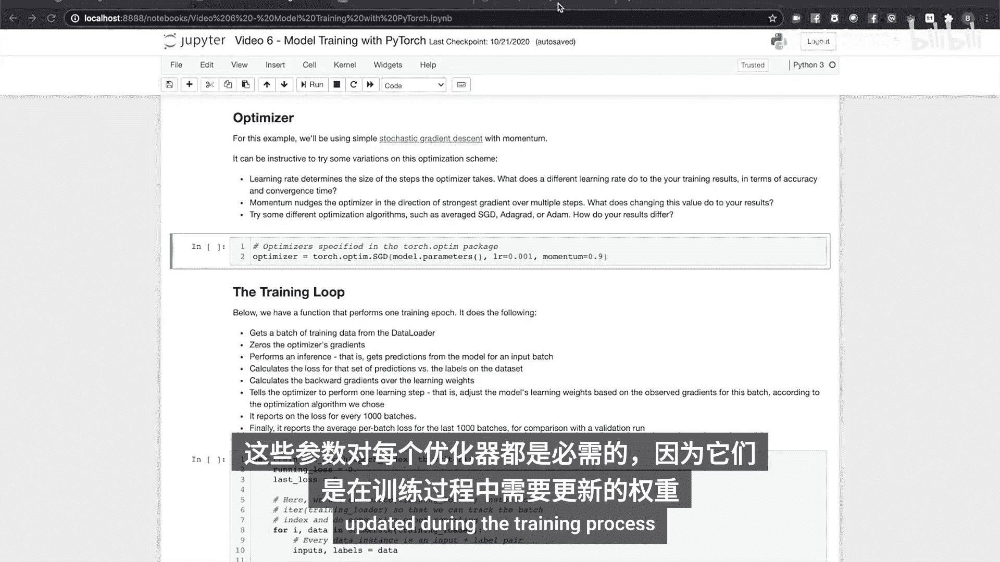
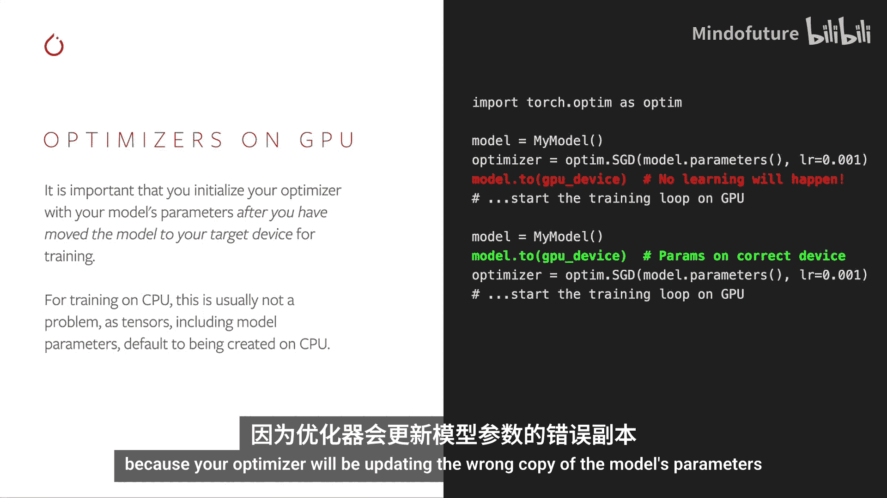
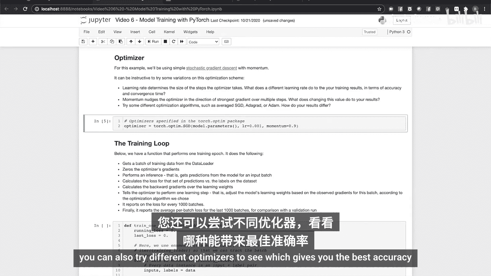
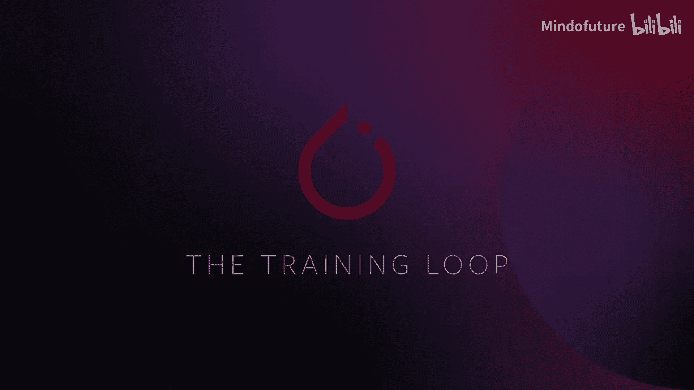
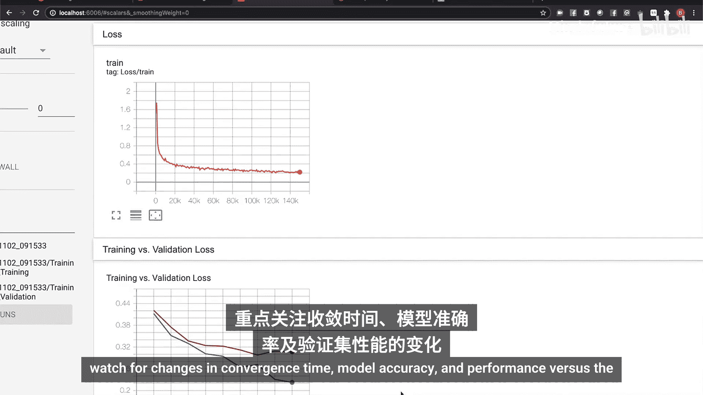
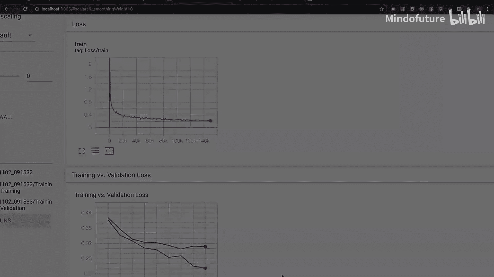
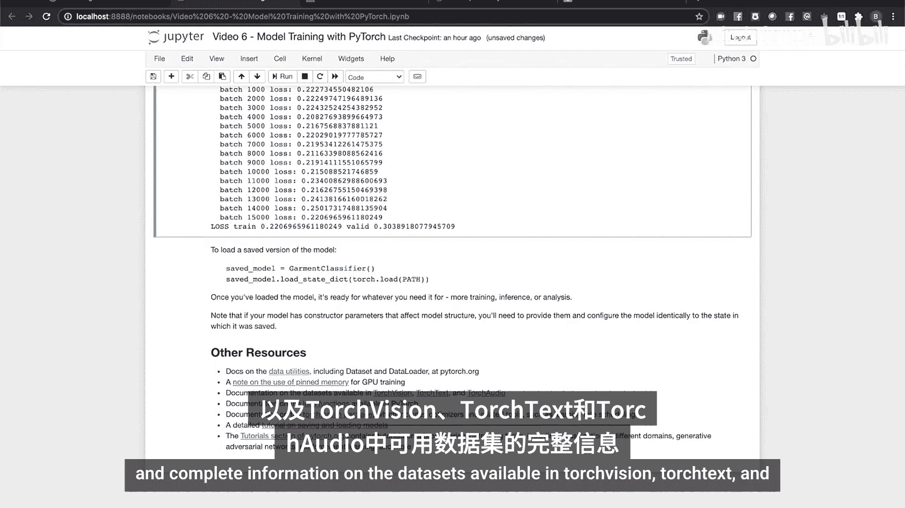

# 006：使用PyTorch进行模型训练 🚀

在本节课中，我们将学习使用PyTorch进行模型训练的核心流程。我们将从数据加载开始，逐步介绍损失函数、优化器，并最终将这些组件整合到一个完整的训练循环中。



---

## 数据加载：Dataset与DataLoader 📦

上一节我们介绍了模型构建和梯度计算。本节中，我们来看看如何高效地为模型提供训练数据。PyTorch通过两个主要类实现高效的数据处理：`Dataset`和`DataLoader`。

`Dataset`负责从你的数据源中访问和处理单个数据实例。PyTorch领域API（如`torchvision`、`torchtext`、`torchaudio`）提供了许多现成的数据集，你也可以通过继承`Dataset`父类来创建自己的数据集。

`DataLoader`从`Dataset`中提取数据实例（自动或通过自定义采样器），将它们收集成批次，并返回给你的训练循环使用。`DataLoader`适用于所有类型的数据集。

以下是创建自定义数据集的关键步骤：
1.  子类化`torch.utils.data.Dataset`。
2.  重写`__len__`方法以返回数据集中的项目数。
3.  重写`__getitem__`方法以通过键（通常是索引）访问数据实例。

```python
from torch.utils.data import Dataset

class CustomDataset(Dataset):
    def __init__(self, ...):
        # 初始化数据、标签等
        pass

    def __len__(self):
        return len(self.data)

    def __getitem__(self, idx):
        sample = self.data[idx]
        label = self.labels[idx]
        return sample, label
```

创建`DataLoader`时，唯一必需的参数是一个`Dataset`对象。以下是几个常用的可选参数：
*   `batch_size`：设置每个训练批次中的实例数量。
*   `shuffle`：设置为`True`会在每个epoch开始时打乱数据顺序，这对训练很重要。
*   `num_workers`：设置用于并行加载数据的子进程数量。

```python
from torch.utils.data import DataLoader

train_loader = DataLoader(dataset=train_dataset,
                          batch_size=32,
                          shuffle=True,
                          num_workers=2)
```

如果需要在训练期间将数据批次转移到GPU，建议使用固定内存缓冲区（pinned memory）以加速主机到GPU的数据传输。这可以通过在创建`DataLoader`时设置`pin_memory=True`来自动完成。

---

## 损失函数：衡量模型误差 📉

在准备好数据之后，我们需要一种方法来衡量模型的预测与真实值之间的差距，这就是损失函数。PyTorch提供了多种适用于不同任务的常用损失函数。

以下是几种常见的损失函数及其应用场景：
*   `nn.MSELoss`：用于回归任务（均方误差）。
*   `nn.KLDivLoss`：用于比较连续概率分布（KL散度）。
*   `nn.BCELoss`：用于二分类任务（二元交叉熵）。
*   `nn.CrossEntropyLoss`：用于多分类任务（交叉熵）。

所有损失函数都将模型的输出与某些标签或期望值进行比较。对于本视频中的分类任务，我们将使用交叉熵损失。

```python
import torch.nn as nn

loss_fn = nn.CrossEntropyLoss()
# 假设 outputs 是模型预测，labels 是真实标签
loss = loss_fn(outputs, labels) # 返回整个批次的平均损失
```

---

## 优化器：更新模型权重 ⚙️



知道了模型的误差（损失）后，我们需要一种算法来根据这个误差调整模型的权重，使其预测更准确，这就是优化器的作用。PyTorch提供了多种优化算法。



所有优化器在初始化时都需要模型的参数，这些参数是通过调用模型对象的`.parameters()`方法获得的。这些权重将在训练过程中被更新。

```python
import torch.optim as optim

optimizer = optim.SGD(model.parameters(), lr=0.001, momentum=0.9)
```

**重要提示**：在使用PyTorch优化器时，请确保你的模型参数存储在正确的设备上。如果你在GPU上训练，必须在初始化优化器之前将模型参数移动到GPU内存中。否则，优化器将更新错误的参数副本，导致损失不会随时间下降。





大多数基于梯度的优化器都有以下参数的组合：
*   `lr`（学习率）：决定优化器更新权重时的步长大小。
*   `momentum`（动量）：使优化器在过去几个时间步中改进最强的方向上采取稍大的步骤。
*   `weight_decay`（权重衰减）：用于鼓励权重正则化，避免过拟合。

---

## 整合：完整的训练循环 🔄

现在，我们拥有了所有必需的组件：一个模型、一个包装在`DataLoader`中的数据集、一个损失函数和一个优化器。我们可以开始训练了。

以下是执行一个训练周期（epoch，即完整遍历一次训练数据）的函数示例：

```python
def train_one_epoch(epoch_index):
    running_loss = 0.
    last_loss = 0.

    for i, data in enumerate(train_loader):
        # 每个批次包含输入张量和标签
        inputs, labels = data

        # 清零梯度
        optimizer.zero_grad()

        # 前向传播，获取预测
        outputs = model(inputs)

        # 计算损失
        loss = loss_fn(outputs, labels)

        # 反向传播，计算梯度
        loss.backward()

        # 优化器根据梯度更新权重
        optimizer.step()

        # 累计损失
        running_loss += loss.item()
        if i % 1000 == 999: # 每1000个批次记录一次
            last_loss = running_loss / 1000
            print(f'  batch {i+1} loss: {last_loss}')
            running_loss = 0.

    return last_loss
```

接下来，我们将循环多个epoch。在每个epoch中，我们会：
1.  将模型设置为训练模式（`model.train()`），启用梯度计算跟踪。
2.  训练一个epoch并记录其报告的平均批次损失。
3.  将模型设置为推理模式（`model.eval()`），禁用梯度计算跟踪（因为验证步骤不需要）。
4.  在验证数据集上进行推理并计算损失，计算平均批次损失。
5.  报告训练和验证的平均损失。
6.  如果这是目前看到的最佳验证损失，则将模型的状态保存到文件中。

通过运行这个循环并可视化训练进度（例如使用TensorBoard），我们可以观察损失是否单调下降，并检查是否存在过拟合（训练损失持续下降但验证损失开始上升）等问题。

---





## 总结与拓展 📚

本节课中，我们一起学习了使用PyTorch进行模型训练的核心流程。我们介绍了如何使用`Dataset`和`DataLoader`高效加载数据，如何根据任务选择合适的损失函数，以及如何使用优化器根据损失函数的梯度更新模型权重。最后，我们将这些组件整合到一个完整的训练循环中，并了解了如何监控和评估训练过程。

模型训练和优化是深入的主题。PyTorch官方文档包含了大量关于模型训练的宝贵信息，例如：
*   **教程部分**：涵盖迁移学习、微调、生成对抗网络（GAN）、强化学习以及用于分布式训练的`torch.distributed`框架。
*   **API文档**：提供了我们本节课所涵盖工具（优化器、损失函数、`Dataset`/`DataLoader`类）以及更多高级功能的完整细节。




鼓励你尝试更改模型结构或优化器参数，观察在像本课示例这样的相对简单案例中，训练结果（如收敛时间、模型准确率）会如何变化。实践是掌握这些概念的最佳途径。