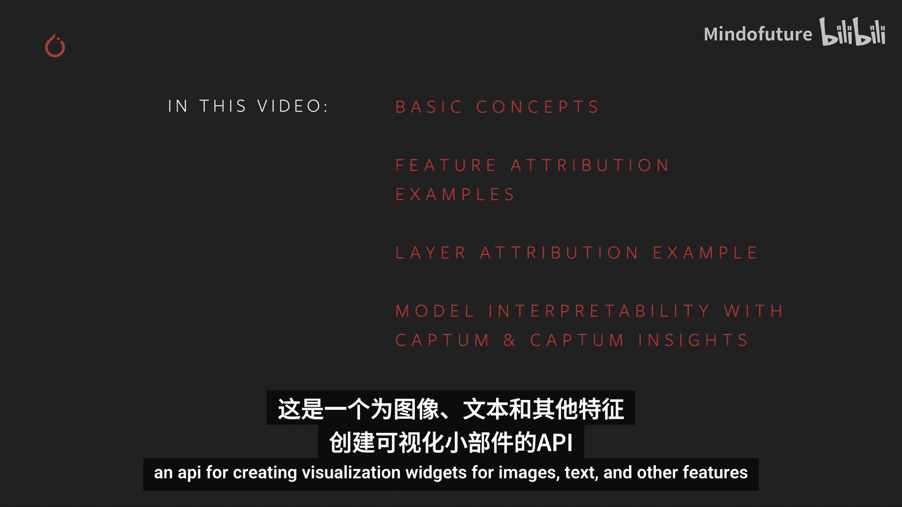
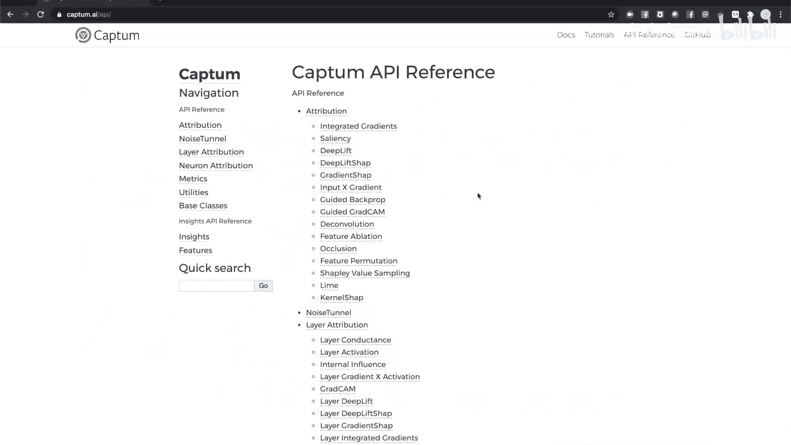
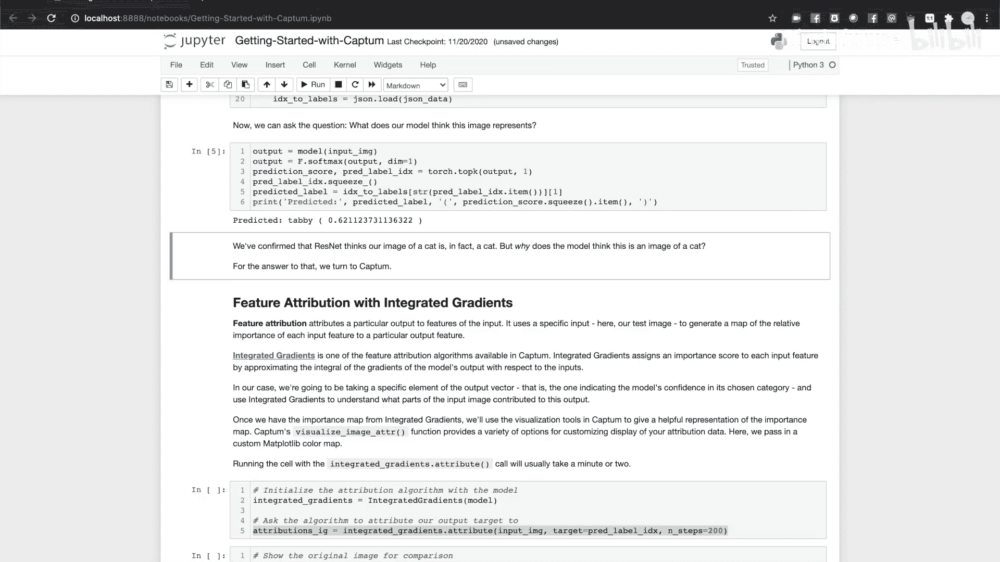
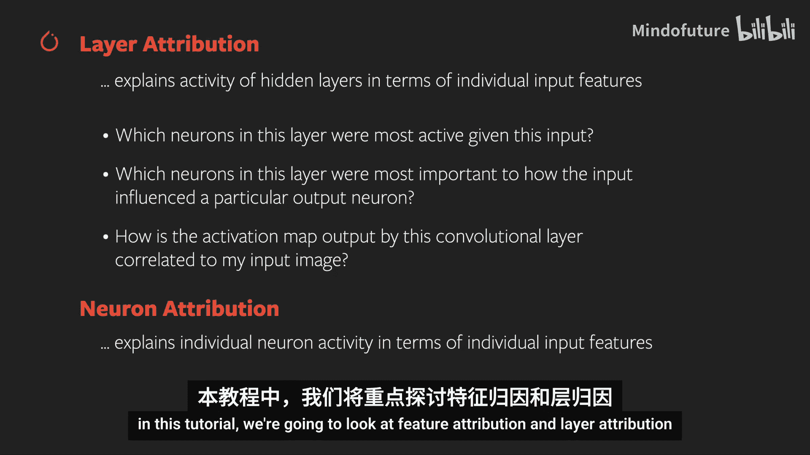
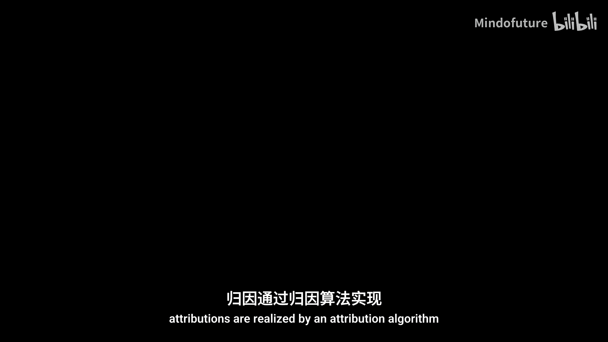
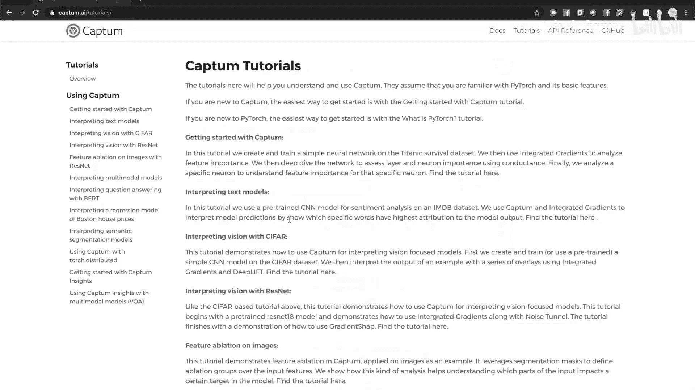

# 007：使用Captum理解模型 🧠


在本节课中，我们将学习如何使用Captum，这是一个PyTorch的模型可解释性工具集。我们将探讨Captum的核心概念，并通过一个图像分类器的实例，演示如何执行和可视化特征归因与层归因。课程最后，我们将介绍Captum Insights，一个用于创建可视化交互界面的高级工具。





## 概述与安装 📦


上一节我们介绍了课程目标，本节中我们来看看如何准备环境。

要运行本教程的交互式笔记本，你需要安装Python 3.6或更高版本、Flask 1.1或更高版本，以及最新版本的PyTorch、TorchVision和Captum。

以下是安装Captum的两种方法：
*   使用pip安装：`pip install captum`
*   使用Anaconda安装：`conda install -c pytorch captum`



## Captum核心概念 🔍

我们将从一个预训练的ResNet图像分类器开始，并使用Captum的工具来理解模型如何对特定输入图像做出预测。

Captum的核心抽象是**归因**，这是一种将模型的特定输出或活动与其输入进行定量关联的方法。

Captum主要提供三种归因方法：
1.  **特征归因**：用于确定输入的哪些部分对模型的预测最重要。
2.  **层归因**：用于将模型隐藏层的活动归因于模型的输入。
3.  **神经元归因**：与层归因类似，但深入到模型中的单个神经元级别。





在本教程中，我们将重点介绍特征归因和层归因。

## 特征归因实践 🖼️

首先，我们来看看特征归因。归因通过**归因算法**来实现，这是一种将模型活动映射到输入的特定方法。

### 集成梯度算法

我们首先使用的算法是**集成梯度**。该算法通过数值方法近似模型输出相对于其输入的梯度积分，从而找到给定输入-输出对在模型中的最重要路径。

以下是创建并运行集成梯度归因的代码示例：
```python
from captum.attr import IntegratedGradients
ig = IntegratedGradients(model)
attributions_ig = ig.attribute(input_img, target=pred_label_idx, n_steps=200)
```
运行此代码可能需要几分钟，因为梯度积分过程计算量较大。

得到归因数值图后，我们需要将其与原始图像关联起来进行可视化。Captum的`visualization`模块提供了相应工具。

以下是可视化原始图像和归因热图的代码：
```python
from captum.attr import visualization as viz
# 显示原始图像
viz.visualize_image_attr(None, transformed_img, method="original_image", title="Original Image")
# 显示归因热图
viz.visualize_image_attr(attributions_ig, transformed_img, method="heat_map", cmap=custom_cmap, sign="positive", title="Integrated Gradients")
```
运行后，我们可以看到模型主要关注猫的轮廓和脸部中心区域。

### 遮挡算法

接下来，我们尝试另一种特征归因算法：**遮挡**。与基于梯度的集成梯度不同，遮挡是一种基于扰动的方法，它通过遮挡图像的部分区域来观察其对输出的影响。

以下是使用遮挡算法的代码示例：
```python
from captum.attr import Occlusion
occlusion = Occlusion(model)
attributions_occ = occlusion.attribute(input_img,
                                       strides = (3, 8, 8),
                                       target=pred_label_idx,
                                       sliding_window_shapes=(3,15, 15),
                                       baselines=0)
```
我们可以使用`visualize_image_attr_multiple`方法同时展示多种可视化结果。

以下是同时展示原始图像、正负归因热图以及掩码图像的代码：
```python
viz.visualize_image_attr_multiple(attributions_occ,
                                  transformed_img,
                                  ["original_image", "heat_map", "heat_map", "masked_image"],
                                  ["all", "positive", "negative", "positive"],
                                  titles=["Original", "Positive Attribution", "Negative Attribution", "Masked"],
                                  fig_size=(18, 6))
```
结果显示，模型关注的重点区域与集成梯度算法的结果一致，主要集中在猫的轮廓和脸部中心。

## 层归因实践 🧩

上一节我们探讨了模型的输入输出关系，本节中我们来看看模型内部发生了什么。让我们使用层归因算法来检查其中一个隐藏层的活动。

我们将使用**GradCAM**算法，这是另一种为卷积网络设计的基于梯度的归因算法。它计算输出相对于指定模型层的梯度，对每个通道的梯度进行平均，并将此平均值乘以层激活值，以此作为层输出重要性的度量。

以下是使用GradCAM进行层归因的代码：
```python
from captum.attr import LayerGradCam
layer_gradcam = LayerGradCam(model, model.layer3[1].conv2)
attributions_lgc = layer_gradcam.attribute(input_img, target=pred_label_idx)
```
我们可以像之前一样用热图来可视化。由于卷积层的输出通常在空间上与输入相关，我们可以通过上采样激活图并将其直接与输入进行比较来更好地观察。

以下是上采样并生成混合热图的代码：
```python
upsamp_attr_lgc = LayerAttribution.interpolate(attributions_lgc, input_img.shape[2:])
viz.visualize_image_attr_multiple(upsamp_attr_lgc,
                                  transformed_img,
                                  ["original_image","blended_heat_map","masked_image"],
                                  ["all","positive","positive"],
                                  titles=["Original", "Blended Heat Map", "Masked"],
                                  fig_size=(18, 6))
```
这样的可视化可以帮助你理解隐藏层如何对模型的特定输出做出贡献。

## 使用Captum Insights进行高级探索 🚀

Captum附带了一个名为**Captum Insights**的高级可视化工具，它允许你将多个可视化结果组合在一个浏览器内的小部件中，并可以配置归因算法及其参数。Captum Insights可以可视化文本、图像和任意数据。

以下是设置Captum Insights可视化器的基本代码框架：
```python
from captum.insights import AttributionVisualizer, Batch
from captum.insights.attr_vis.features import ImageFeature
# 定义数据集
def baseline_func(input):
    return input * 0
visualizer = AttributionVisualizer(
    models=[model],
    score_func=softmax,
    classes=list(map(lambda k: k[1], imagenet_labels)),
    features=[ImageFeature("Photo", baseline_transforms=baseline_func)],
    dataset=dataset
)
visualizer.render() # 渲染交互式界面
```
在渲染出的浏览器界面中，你可以选择不同的归因算法和可视化方法，然后点击“Fetch”按钮来获取并可视化归因结果。这使你可以用最少的代码，以可视化的方式实验不同的归因方法，并理解导致模型预测（无论正确与否）的内部活动。

## 总结与资源 📚

本节课中，我们一起学习了如何使用Captum工具集来增强对PyTorch模型的理解。我们介绍了特征归因和层归因的核心概念，并通过集成梯度、遮挡和GradCAM等算法进行了实践。最后，我们探索了Captum Insights这一强大的交互式可视化工具。



要了解更多信息，请访问[Captum AI官网](https://captum.ai/)以获取深入的教程、文档和API参考，或在GitHub上访问其源代码。