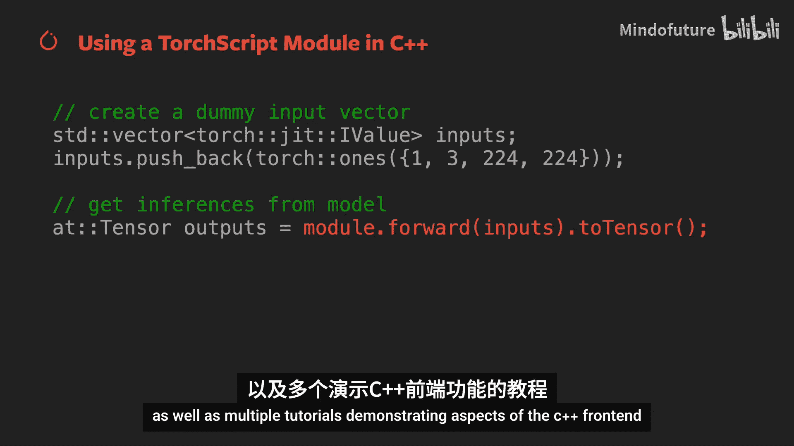
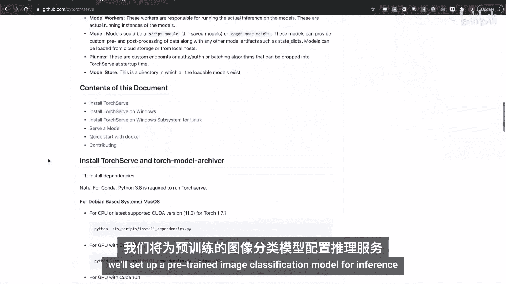
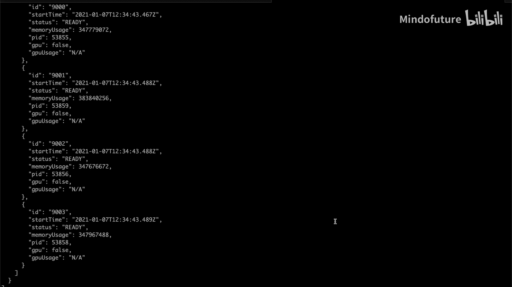
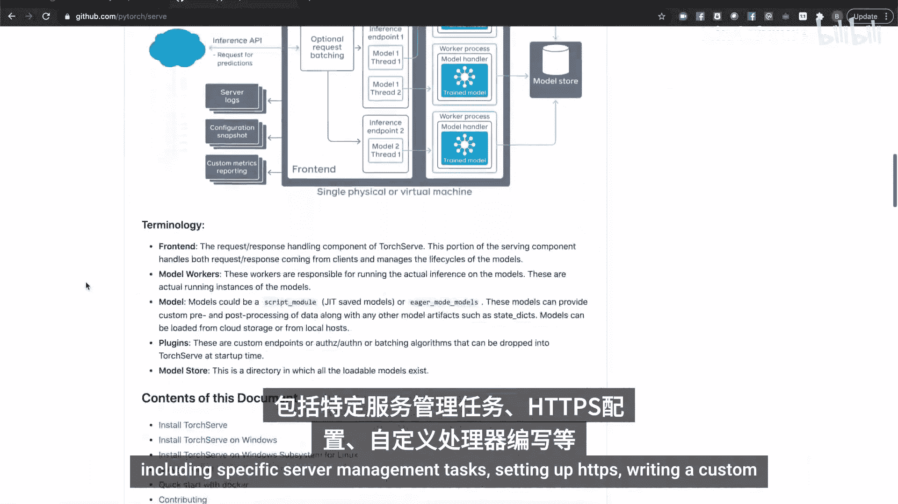

# 008：PyTorch模型的推理与生产部署 🚀

在本节课中，我们将学习如何将训练好的PyTorch模型部署到生产环境中进行推理。我们将涵盖从设置模型评估模式，到使用TorchScript进行模型转换和优化，再到通过C++或TorchServe进行高性能部署的完整流程。

## 模型评估模式 📊

上一节我们介绍了模型训练，本节中我们来看看推理前的关键准备步骤：设置模型为评估模式。

评估模式与训练模式相反。它会关闭在推理阶段不需要的训练相关行为。

具体来说，它会关闭自动求导（autograd）。在之前的课程中我们了解到，PyTorch张量（包括模型的学习权重）会跟踪其计算历史，以帮助快速计算反向传播梯度。这在推理时既消耗内存又占用计算资源，是不必要的。

评估模式还会改变某些具有训练特定功能的模块的行为。例如，Dropout层仅在训练时激活，评估模式下会失效。BatchNorm层在训练时会跟踪计算出的均值和方差的运行统计量，但在评估模式下此行为会被关闭。

以下是设置模型为评估模式的步骤：

1.  加载模型。对于基于Python的模型，这通常涉及从磁盘加载模型的状态字典，并用它初始化模型对象。
2.  在模型上调用 `.eval()` 方法。

至此，模型已关闭训练相关行为，准备进行推理。

值得注意的是，`.eval()` 方法实际上是调用 `.train(False)` 的别名。如果你的代码中已有标志位来指示是进行训练还是推理，这可能会很有用。

一旦模型处于评估模式，你就可以开始向其发送数据批次进行推理。在后续的部署方法中，确保模型处于评估模式始终是第一步。

## TorchScript：模型序列化与优化 ⚙️

上一节我们介绍了如何准备模型进行推理，本节中我们来看看如何将模型转换为TorchScript以实现序列化和性能优化。

TorchScript是Python的一个静态类型子集，用于表示PyTorch模型。它旨在被PyTorch即时编译器（JIT）使用，JIT会执行运行时优化（如算子融合和矩阵乘法批处理）以提高模型性能。TorchScript还允许你将模型和权重保存在单个文件中，并加载为一个脚本模块对象，你可以像调用原始模型一样调用它。

以下是使用TorchScript的流程：

1.  像往常一样，在Python中构建、测试和训练你的模型。
2.  当你想要导出模型用于生产推理时，可以使用 `torch.jit.trace` 或 `torch.jit.script` 调用将模型转换为TorchScript。
3.  之后，你可以在TorchScript模块上调用 `.save()` 方法，将其保存为包含模型计算图和学习权重的单个文件。

即时编译器会执行你的TorchScript模型，执行运行时优化。

你也可以用C++编写自己的TorchScript自定义扩展。右侧代码展示了TorchScript的样子，但在一般情况下，你无需自己编辑它，它由你的Python代码生成。

让我们更详细地了解使用TorchScript的过程。

该过程从你在Python中构建并训练到可以部署的模型开始。下一步是将模型转换为TorchScript。有两种方法：`torch.jit.script` 和 `torch.jit.trace`。了解这两种转换技术的区别很重要。

*   **`torch.jit.script`**：通过直接检查你的代码并通过TorchScript编译器运行它来转换模型。它保留了控制流（如果你的前向函数有条件语句或循环，则需要这个），并且支持常见的Python数据结构。然而，由于TorchScript编译器对Python操作符支持的限制，有些模型无法使用此方法转换。
*   **`torch.jit.trace`**：获取一个样本输入，并追踪它通过计算图的路径，以生成模型的TorchScript版本。这种方法不受 `torch.jit.script` 操作符覆盖范围的限制。但是，因为它只追踪代码中的单一路径，所以不会考虑可能导致可变或非确定性运行时行为的条件语句或其他控制流结构。

在转换模型时，也可以混合使用追踪和脚本化。有关混合使用这两种技术的说明，请参阅 `torch.jit` 模块的文档。

值得查看文档以了解 `script` 和 `trace` 的可选参数，其中包含用于检查TorchScript模型一致性和容差性的额外选项。

现在，我们将保存TorchScript模型。这会将你的计算图和学习权重保存在一个文件中，这意味着当你想要部署到生产环境时，无需附带包含模型类定义的Python文件。

当需要进行推理时，你可以在模型上调用 `torch.jit.load`，并以与Python版本模型相同的方式向其馈送输入批次。

## 在C++中加载TorchScript模型 🖥️

到目前为止，我所展示的一切都涉及在Python代码中操作模型，即使在将其转换为TorchScript之后。然而，在某些环境和情况下，你可能需要高吞吐量或实时推理，并希望避免Python解释器的开销。也可能你的生产环境已经围绕C++代码构建，你希望尽可能继续使用C++。

你可能在本系列前面的课程中记得，PyTorch中重要的张量计算发生在LibTorch中，这是一个经过编译和优化的C++库。PyTorch也有这个库的C++前端。这意味着你可以在C++中加载TorchScript模型并运行它，而无需Python运行时依赖。

以下是使用C++加载和运行TorchScript模型的基本步骤：

1.  访问 `pytorch.org` 并下载最新版本的LibTorch。解压包并将其放在你的构建系统可以找到的位置。
2.  创建一个CMake项目。请注意，你需要使用C++14或更高版本才能使用LibTorch。
3.  在C++代码中，包含 `torch/script.h`。这是使用TorchScript和C++的一站式头文件。
4.  声明一个 `torch::jit::script::Module` 变量。
5.  使用 `torch::jit::load` 将模型加载到内存中。
6.  要获取模型的预测，使用适当的输入调用其 `forward` 方法。这里，我们使用 `torch::ones` 创建了一个虚拟输入。在实际应用中，你需要根据模型要求传入自己的输入。
7.  一旦你获得了作为张量的输出预测，就可以使用与PyTorch Python前端中你习惯的张量方法等效的C++方法来操作它们。

`pytorch.org` 的教程部分包含指导你设置C++项目的内容，以及多个演示C++前端各个方面的教程。

## 使用TorchServe进行模型服务部署 🌐

设置生产模型服务环境可能很复杂，特别是如果你需要服务多个模型、处理模型的多个版本、要求可扩展性，或者需要详细的日志记录或指标。TorchServe是PyTorch的模型服务解决方案，涵盖了所有这些需求。

TorchServe将你的模型实例加载到独立的进程空间中，并将传入的请求分发给它们。它具有许多功能，使其适用于创建基于ML的Web服务。

以下是TorchServe的主要特性：

*   **数据处理器**：涵盖常见用例，包括图像分类与分割、目标检测和文本分类。
*   **版本管理**：允许你为模型设置版本标识符，并且可以管理并同时服务一个模型的多个版本。
*   **请求批处理**：可以选择性地将来自多个源的输入请求进行批处理，这有时可以提高吞吐量。
*   **日志与指标**：具有强大的日志记录功能，并能够记录你自己的指标。
*   **API分离**：具有独立的用于推理和模型管理的RESTful API，可以通过HTTPS进行安全保护。

我将通过使用 `github.com/pytorch/serve` 上 `examples` 文件夹中的一个示例，来演示如何设置和运行TorchServe，以此结束本视频。我们将为一个预训练的图像分类模型设置推理服务。

以下是设置和运行TorchServe的基本步骤：

1.  **安装TorchServe**：创建一个新的Conda环境，克隆源代码仓库，并运行依赖安装脚本。根据你的系统（Linux/Mac/Windows）和是否使用GPU，安装步骤可能有所不同。你需要安装两个程序：`torchserve` 和 `torch-model-archiver`。
2.  **准备模型存储目录**：TorchServe需要一个模型存储目录，所有由TorchServe服务的模型都存储在此文件夹中。
3.  **创建模型存档**：TorchServe期望模型被打包成模型存档（`.mar` 文件），其中包含模型的代码、权重以及支持模型所需的任何其他文件。使用 `torch-model-archiver` 工具创建存档，需要指定模型名称、版本、模型文件（或序列化的TorchScript文件）、权重文件、额外支持文件以及一个处理器（handler）来处理输入数据。
4.  **启动TorchServe**：将模型存档放入模型存储目录，然后使用 `torchserve` 命令启动服务，指定模型存储路径和要加载的模型。
5.  **进行推理**：TorchServe启动后，你可以通过其推理API（默认端口8080）发送请求。例如，使用 `curl` 命令发送一张图片进行图像分类。
6.  **管理模型**：通过管理API（默认端口8081）可以查看服务器状态、管理正在服务的模型、调整工作进程数量等。例如，你可以注册/注销模型、更改模型的默认版本、调整工作进程数量。
7.  **停止服务**：使用 `torchserve --stop` 命令停止TorchServe。

TorchServe的GitHub仓库还提供了许多常见任务的演练和示例，包括特定的服务器管理任务、设置HTTPS、编写自定义处理器等。

## 总结 📝

本节课中我们一起学习了将PyTorch模型部署到生产环境进行推理的完整流程。

我们首先学习了如何将模型设置为**评估模式**，这是关闭Dropout、BatchNorm统计量跟踪和自动求导等训练行为的关键步骤。

接着，我们探讨了使用**TorchScript**将模型序列化和优化的方法，包括 `torch.jit.script` 和 `torch.jit.trace` 两种转换方式的区别与适用场景。

然后，我们了解了如何在**C++环境中加载和运行TorchScript模型**，以实现高性能、无Python依赖的推理。

最后，我们介绍了使用**TorchServe**这一完整的模型服务解决方案，它提供了模型版本管理、请求批处理、日志记录和易于使用的REST API等功能，极大地简化了生产环境中的模型部署与管理。

所有这些内容以及更多细节，都可以在 `pytorch.org` 的文档和教程中找到。