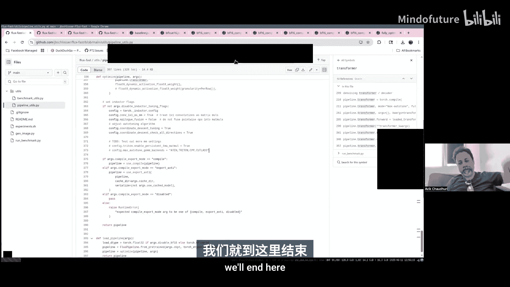

# 001：让 Flux 模型运行得更快 - PyTorch 编译器系列


在本教程中，我们将学习如何通过一系列优化技术，使用 PyTorch 编译器（`torch.compile`）为 Flux 图像生成模型实现最先进的性能。我们将从基础模型开始，逐步应用优化，并观察每一步带来的性能提升。

## 概述

我们将要学习的优化步骤包括：
1.  使用 BFloat16 数据类型。
2.  应用 `torch.compile`。
3.  进行投影融合。
4.  使用通道最后（Channels Last）内存格式。
5.  集成 Flash Attention V3。
6.  应用动态浮点量化。
7.  调整 Inductor 编译器的配置。
8.  结合使用导出（Export）、AOTInductor（AOTI）和 CUDA Graphs。

这些优化大多是“无损”的，意味着它们不会改变模型的输出质量。唯一的例外是浮点量化，它可能会引入微小的数值差异。

## 优化步骤详解

### 1. 基线模型与性能分析

首先，我们使用 `diffusers` 库加载并运行基础的 Flux 模型。这是我们的性能基准。

```python
from diffusers import FluxPipeline

pipeline = FluxPipeline.from_pretrained("black-forest-labs/FLUX.1-schnell", torch_dtype=torch.float32)
image = pipeline("a cat playing with a ball of yarn").images[0]
```

在性能跟踪（trace）中，我们可以看到模型主要由三部分组成：
*   **提示编码**：将文本提示通过 CLIP 和 T5 模型转换为嵌入向量。
*   **去噪步骤**：这是基于 Transformer 的核心部分，包含大量矩阵乘法运算，占据了主要的 GPU 计算时间。
*   **解码与后处理**：将潜在表示解码为图像，并转换回 CPU。

基线模型在 H100 GPU 上运行大约需要 7.5 秒。GPU 利用率已经较高，这意味着我们的优化重点将是减少单个内核（kernel）的运行时间，而不是填补 GPU 空闲间隙。

### 2. 应用 BFloat16

将模型从 Float32 转换为 BFloat16 是第一个简单且有效的优化。这能显著减少内存带宽和计算量，通常对生成质量影响很小。

```python
pipeline = FluxPipeline.from_pretrained("black-forest-labs/FLUX.1-schnell", torch_dtype=torch.bfloat16)
```

应用此优化后，运行时间从 7.5 秒降至约 1.2 秒。

### 3. 应用 Torch Compile

接下来，我们对计算最密集的部分——Transformer 和变分自编码器解码器——应用 `torch.compile`。我们使用 `max-autotune` 模式，让编译器为矩阵乘法和卷积层寻找最优内核。

```python
pipeline.transformer = torch.compile(pipeline.transformer, mode="max-autotune", fullgraph=True)
pipeline.vae.decoder = torch.compile(pipeline.vae.decoder, mode="max-autotune", fullgraph=True)

# 预热以触发编译
warmup_prompt = “warmup”
_ = pipeline(warmup_prompt)
```

`torch.compile` 会执行以下操作：
*   将多个操作融合（fuse）成更高效的内核。
*   为不同的矩阵乘法形状自动调优（autotune），选择在当前硬件上性能最佳的内核实现。
*   首次编译需要一些时间（约30秒到2分钟），但结果会被缓存以供后续使用。

应用编译后，运行时间从 1.2 秒进一步减少到 766 毫秒。在跟踪中，我们可以看到去噪步骤现在被封装在 CUDA Graphs 中启动，减少了内核启动开销。

### 4. 注意力投影融合

在 Transformer 的注意力机制中，查询（Q）、键（K）、值（V）的线性投影通常可以融合成一个更大的矩阵乘法，以提高效率。`diffusers` 库提供了便捷的方法来实现这一点。

```python
# 注意：当使用 torch.compile 时，此优化可能已被编译器自动识别并执行，
# 因此单独应用可能不会带来额外的速度提升。
pipeline.transformer.fuse_qkv_projections()
```

### 5. 使用通道最后内存格式

将图像数据的内存布局从默认的 `NCHW`（批次，通道，高度，宽度）改为 `NHWC`（批次，高度，宽度，通道），可以提高数据局部性，并可能启用一些更优化的内核。

主要的性能收益来自于后处理阶段。因为 Pillow 库期望 `NHWC` 格式，如果数据不是此格式，它需要进行转换。直接输出 `NHWC` 格式可以避免这个转换开销。

```python
# 将VAE解码器的输出设置为 channels last 格式
image = pipeline.vae.decode(latents).sample
image = image.contiguous(memory_format=torch.channels_last)
```

此优化带来了约 13 毫秒的性能提升。

### 6. 集成 Flash Attention V3

Flash Attention V3 是针对注意力机制的、高度优化的内核实现，尤其在 H100 等支持 FP8 数据类型的 GPU 上能带来巨大加速。目前，它需要通过一个自定义算子（operator）来集成。

以下是创建自定义注意力处理器以使用 Flash Attention V3 的示例：

```python
import flash_attn_3_cuda as flash_attn_cuda
from torch.library import impl, Library

# 1. 注册自定义算子
mylib = Library(“my_ops”, “DEF”)
mylib.define(“flash_attn_3(Tensor q, Tensor k, Tensor v) -> Tensor”)

# 2. 实现算子的计算逻辑（前向传播）
@impl(mylib, “flash_attn_3”, “CUDA”)
def flash_attn_3_forward(q, k, v):
    # 调用 Flash Attention V3 的底层函数
    output = flash_attn_cuda.fwd(q, k, v, …) # 参数已简化
    return output

# 3. 实现算子的元函数（用于形状推断）
@impl(mylib, “flash_attn_3”, “Meta”)
def flash_attn_3_meta(q, k, v):
    return torch.empty_like(q)

# 4. 在自定义的注意力处理器中使用该算子
class CustomAttnProcessor:
    def __call__(self, attn, hidden_states, *args, **kwargs):
        q = attn.to_q(hidden_states)
        k = attn.to_k(hidden_states)
        v = attn.to_v(hidden_states)
        # 替换原来的 SDPA 调用
        # attn_output = torch.nn.functional.scaled_dot_product_attention(q, k, v)
        attn_output = torch.ops.my_ops.flash_attn_3(q, k, v)
        return attn_output

pipeline.transformer.set_attn_processor(CustomAttnProcessor())
```

应用 Flash Attention V3 后，运行时间从约 720 毫秒降至 633 毫秒。

### 7. 动态浮点量化

动态浮点量化（Dynamic Float8 Quantization）将模型权重和激活在运行时动态转换为 FP8 格式，以利用 Tensor Core 的 FP8 计算能力，从而加速线性层。

我们使用 `torchao` 库的 API 将其应用于 Transformer 部分。

```python
from torchao.quantization import apply_dynamic_quant

apply_dynamic_quant(pipeline.transformer)
```

量化主要对线性层有效，而 VAE 解码器主要由卷积层构成，因此收益不大。此优化将运行时间从 624 毫秒显著降低至 560 毫秒。

### 8. 调整 Inductor 配置

我们可以通过调整 `torch.compile` 底层的 Inductor 编译器的某些配置来进一步榨取性能。这些设置可能因模型和硬件而异。

```python
import torch._inductor.config as config
config.triton.convolution = “aten” # 尝试不同的卷积实现
config.triton.autotune = “exhaustive” # 使用更详尽的自动调优搜索
config.epilogue_fusion = False # 在某些情况下，关闭尾声融合可能更好
```

通过这些微调，我们可能再获得约 10 毫秒的性能提升。需要注意的是，关闭尾声融合反而提升性能的原因尚不明确，需要进一步研究。

### 9. 导出与 AOTInductor

到目前为止，我们都是在运行时进行编译（JIT）。为了消除每次运行时的编译缓存查找开销，并便于部署，我们可以使用导出（`torch.export`）和 AOTInductor 进行提前编译。

```python
import torch
from torch._export import aot_compile

# 1. 导出模型
example_args = (… ) # 准备具有代表性形状的示例输入
exported_program = torch.export.export(pipeline.transformer, example_args)

# 2. AOT（提前）编译
# 此步骤应用所有 torch.compile 的优化，并将内核序列化为二进制文件
aoti_compile_spec = {“max_autotune”: True}
compiled_binary = aot_compile(exported_program, options=aoti_compile_spec)
compiled_binary.save(“./compiled_model.pt”)

# 3. 加载预编译的模型
loaded_model = torch.load(“./compiled_model.pt”)
```

### 10. 手动应用 CUDA Graphs

当使用 AOTInductor 加载模型时，默认不会启用 CUDA Graphs。为了获得与 JIT 编译相当的性能，我们需要手动包装模型函数，进行 CUDA Graphs 的记录和重放。

```python
class CUDAGraphWrapper:
    def __init__(self, model_func):
        self.model_func = model_func
        self.graph_cache = {}

    def __call__(self, *args):
        # 为不同的输入参数形状缓存不同的图
        key = tuple(arg.shape for arg in args)
        if key not in self.graph_cache:
            graph = torch.cuda.CUDAGraph()
            with torch.cuda.graph(graph):
                # 在图中记录执行
                static_output = self.model_func(*args)
            self.graph_cache[key] = (graph, static_output)
        else:
            graph, static_output = self.graph_cache[key]
            # 将输入数据复制到图记录的静态内存中
            for i, arg in enumerate(args):
                static_input = … # 获取图中对应的静态输入张量
                static_input.copy_(arg)
        # 重放图
        graph.replay()
        # 返回输出的克隆，避免被后续重写
        return static_output.clone()

# 包装模型
wrapped_transformer = CUDAGraphWrapper(loaded_model)
```

通过结合 AOTInductor 和手动 CUDA Graphs，我们最终将运行时间降低到略低于 0.5 秒，并且完全消除了运行时编译开销。

## 总结

在本节课中，我们一起学习了如何通过一系列 PyTorch 原生技术优化 Flux 图像生成模型的性能。我们从基础的 BFloat16 和 `torch.compile` 开始，逐步引入了内存格式优化、尖端注意力内核、动态量化，最终通过提前编译和手动图优化实现了最佳的部署性能。

这套优化方案具有很强的通用性，可以作为加速其他基于 Transformer 的 PyTorch 模型的参考流程。核心在于识别计算瓶颈（通常是矩阵乘法和注意力），并系统性地应用数据类型优化、编译器融合、硬件专用内核以及部署期优化。



