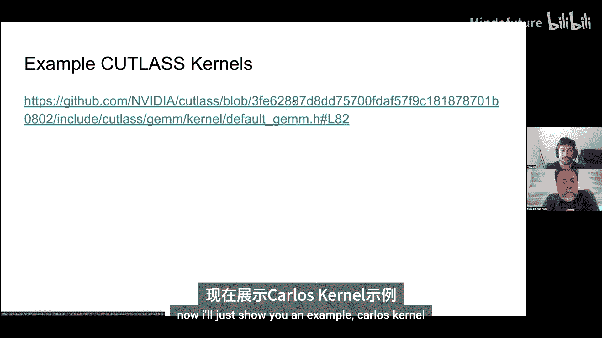
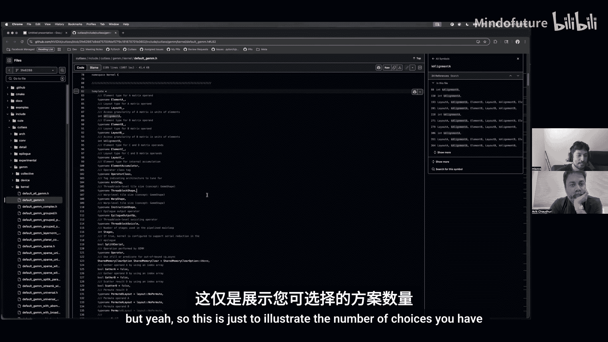
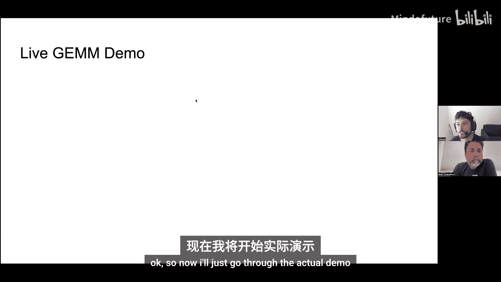
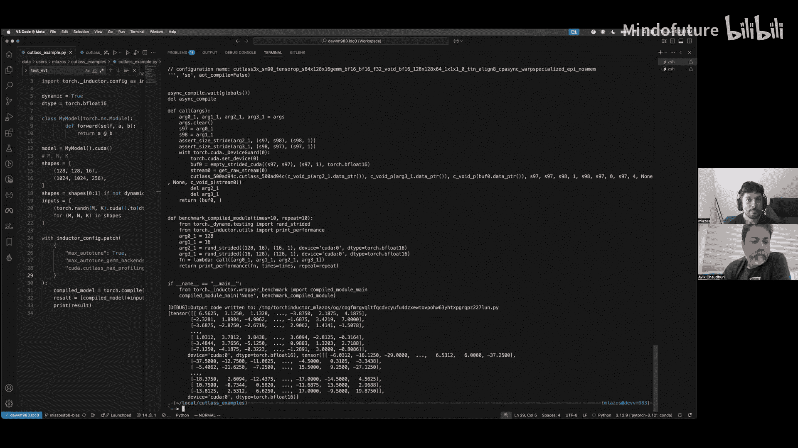
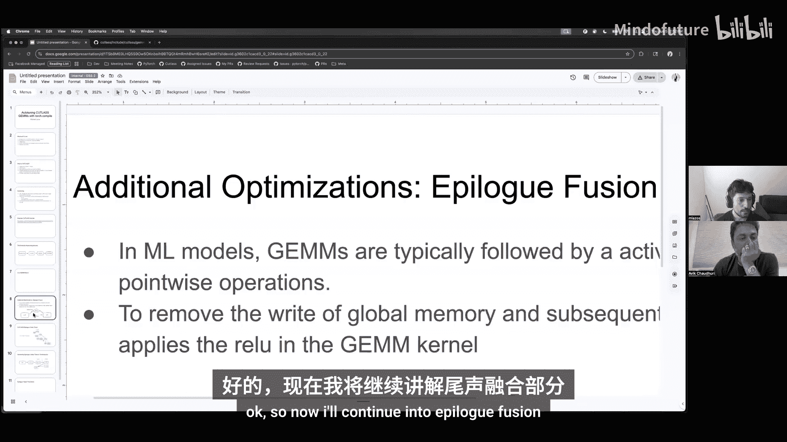
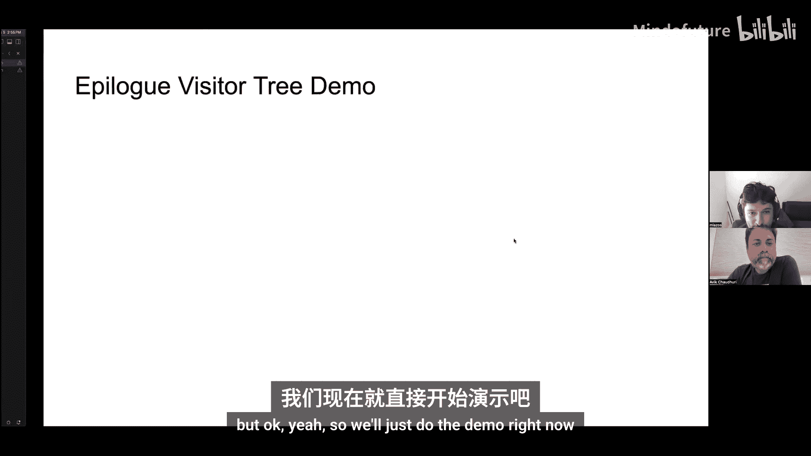
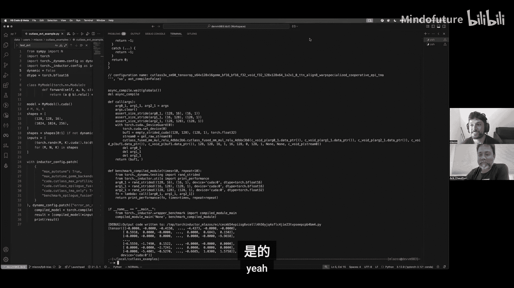

# 002：Inductor的CUTLASS后端与自动调优


在本节课中，我们将学习PyTorch Inductor编译器如何使用CUTLASS库作为后端来生成高效的CUDA内核。我们将探讨CUTLASS是什么、自动调优的过程，以及如何通过Epilogue Fusion进一步优化内核性能。

## 什么是CUTLASS？🤔

CUTLASS是一个仅头文件的CUDA C++模板库。它高度模板化，这意味着不同的GEMM（通用矩阵乘法）操作或其变体，其可配置选项都是编译时已知的模板参数。这种设计允许在构建不同内核时，灵活地组合各种类型和参数。

CUTLASS完全开源，这与闭源的cuBLAS库不同。因此，你可以确切地看到其内部实现，甚至可以在特定用例未被满足时提交PR。

这些原语性能很高，许多在大型GEMM运算上可以接近理论峰值性能。CUTLASS的主要吸引力在于它将自动调优作为首要用例。对于某些问题规模，CUTLASS内核的性能可以超越cuBLAS，这主要是因为它会针对你的具体问题规模和工作负载做出特定优化。

此外，CUTLASS还通过Epilogue Fusion提供定制化功能。如果在矩阵乘法之后有点状操作（如加法或ReLU），CUTLASS可以将该操作融合到矩阵乘法中，以获得更好的性能。而cuBLAS完全不支持这种融合。

## 自动调优过程 🔄

随着深度学习和AI用例的兴起，GPU架构变得极其复杂。硬件性能的提升不再仅仅依赖于晶体管尺寸的缩小，GPU内部集成了更多用于优化不同GEMM内核的选项。

以下是部分可调优的选项：
*   **分块大小**：执行矩阵乘法时使用的子矩阵大小。可以选择不同的分块大小以匹配特定GPU的缓存大小，从而获得更好的性能。
*   **Warp专业化**：这是NVIDIA引入的一项功能，允许对GPU上的线程组进行更细粒度的控制。过去，一个Warp（32个线程组）中的所有线程必须执行相同的步骤。现在，不同的Warp可以协作完成任务，例如一个Warp加载内存，另一个进行计算。
*   **异步内存传输**：在新的NVIDIA GPU（如Hopper和Blackwell）上，名为Tensor Memory Accelerator的功能允许在计算单元被使用的同时读取内存，这可以提升某些工作负载的性能。

以上只是一小部分示例，旨在让你了解可能的选择空间。



Inductor进行自动调优时，最简单的算法是尝试所有组合。但理想情况下你不会看到这种情况，因为这实际上会耗费极长的时间，因为有太多选择，编译会永远进行下去。因此，我们使用一些启发式方法来预先缩小高性能的选择范围，目标是减少编译时间，以便尝试更多组合。

以下是一个CUTLASS内核的示例，展示了选择的数量之多。

```cpp
// 示例展示了CUTLASS GEMM实现中的众多模板参数
template <
    typename ElementA,          // 输入A的元素类型
    typename LayoutA,           // 输入A的内存布局
    typename ElementB,          // 输入B的元素类型
    typename LayoutB,           // 输入B的内存布局
    typename ElementC,          // 输出C的元素类型
    typename LayoutC,           // 输出C的内存布局
    typename ElementAccumulator, // 累加器类型（如float32或bfloat16）
    typename ArchTag,           // GPU架构标签
    typename ThreadblockShape,  // 线程块形状（分块大小）
    typename WarpShape,         // Warp形状
    int Stages                  // 流水线阶段数
>
class DefaultGemm;
```

CUTLASS提供的生成脚本有一个API，可以让你获取这些选择。你可以为这些参数指定范围。例如，`Stages`是一个整数，但架构上对阶段数有限制，因此存在已知的良好范围。Inductor和CUTLASS都有已知的良好默认值，Inductor也可以自行调整。

分块大小通常是2的幂。根据输入张量的维度、步长以及是否需要批处理，我们可以应用不同的分块大小。如果必要，我们也可以通过填充和其他技巧使其工作。



## 自动调优流程概述 📋

上一节我们介绍了自动调优中众多的参数选择，本节我们来看看Inductor具体的自动调优流程。

以下是自动调优过程的概要：
1.  **生成所有选择**：Inductor会生成所有可能的配置组合。
2.  **预编译**：在独立的进程中预编译所有这些配置。
3.  **基准测试**：使用虚拟数据对编译好的内核进行基准测试。
4.  **缓存结果**：将结果缓存起来。这样，对于你的模型，这个过程基本上只执行一次。它会自动对所有不同的矩阵乘法应用自动调优，并缓存生成的内核以供将来使用。

另一个优点是，如果你在另一个模型上运行此过程，形状也会被缓存。如果另一个模型中有相似的形状，你不需要重新编译它们。我们仍然会进行基准测试阶段，但编译阶段可能耗时较长。



一个典型的方法是拥有某种远程缓存。我们最终可能会尝试这样做，即拥有一个所有不同形状和这些形状已知良好内核的聚合库。

目前，基准测试发生在你将运行的同一台机器上。当我们进行基准测试时，会尝试隔离环境，确保没有其他任务运行，但这无法完全保证。

## 代码演示：优化CUTLASS GEMM 🚀

现在，我们将通过一个代码演示来具体了解如何优化一个CUTLASS GEMM内核。

在演示中，我们在脚本顶部设置 `dynamic=True` 和 `dtype=torch.float16`。`dynamic=True` 会运行多种形状。在第二次编译时，`torch.compile` 会注意到某些形状发生了变化，然后为动态形状进行编译，并生成一个对形状无关的内核。我们将展示CUTLASS内核如何处理动态形状，其方式与其他内核处理动态形状类似，但会根据CUTLASS内核的标准对不同的步长等进行硬编码。

如果不在此脚本中启用动态形状，我们将只使用一种形状运行。我们可以尝试两种方式并查看输出。

以下是设置输入和Inductor配置的代码片段：

```python
import torch
import torch._inductor.config as config
config.max_autotune_gemm_backends = "CUTLASS"  # 指定使用CUTLASS后端
config.cutlass_max_profiling_configs = 2       # 限制选择数量以便演示

# 设置输入张量
x = torch.randn(128, 256, device='cuda', dtype=torch.float16)
w = torch.randn(256, 512, device='cuda', dtype=torch.float16)

# 定义并编译模型
@torch.compile(dynamic=True)
def model(x, w):
    return torch.nn.functional.linear(x, w)

# 运行模型
output = model(x, w)
```

运行此脚本后，Inductor会输出生成的CUDA内核代码。生成的CUTLASS内核主要包含两部分：
1.  **内核类型设置**：使用正确的编译时参数设置所有模板类型。
2.  **启动器**：使用实际数据启动内核并设置参数。

内核代码中会有一个 `MainLoop`，这是执行矩阵乘法的主循环。每个CUTLASS操作还会有一个 `Epilogue`，即使它什么都不做（此时是恒等操作），因为Epilogue的作用是将结果写入全局内存。

当进行Epilogue融合演示时，这部分会变得更复杂。这展示了其可组合性：你只需将Epilogue替换为其他内容并重新编译即可。






启动器代码中设置了参数，包括输入`X`、`W`，输出`Y`，以及不同的大小参数。这些参数在逻辑代码中被使用：我们设置参数，检查参数对内核是否有效，然后运行内核。

Epilogue的参数部分在拥有更复杂的Epilogue时会变大。这些只是主循环的参数。代码还显示了对应`X`和`W`的指针A和指针B的步长。指针C通常是偏置，但在此例中没有偏置，因此设置为空指针。指针D是输出，这里显示了输出的步长和数据类型。

## Epilogue Fusion 深入探讨 ⚙️

在典型的机器学习模型中，一个GEMM操作之后通常会跟着一个激活函数和一些点状操作。通常的情况是，GEMM的结果被写回全局内存，然后在ReLU内核中再次读入以执行ReLU操作。

通过融合，我们基本上是将这个ReLU直接放入矩阵乘法的主循环中。这消除了额外的读写操作，从而获得更好的性能。

CUTLASS中Epilogue的实现方式允许灵活的操作抽象语法树。其思想是，你可以拥有任何操作树，并使用C++中的树访问者类型来表示它们。

例如，一个操作可能是先计算A和B的乘积，然后乘以alpha，加上偏置乘以另一个标量，最后进行ReLU。这就是树表示的样子。

在PyTorch Inductor中，手动编写C++代码可能非常棘手，因为你最终会生成一棵由相互具有不同模板参数的模板类型组成的树。因此，我们选择的方式是：获取模型，生成Inductor IR，然后利用CUTLASS团队提供的Python追踪器。你可以基本上将你的Epilogue表示为一串Python操作，例如 `a_times_b + c`。



由于Inductor已经可以生成Python代码，这比生成C++代码简单得多。我们将该Python代码交给CUTLASS追踪器，它会生成Epilogue访问者树的C++代码。然后，我们将其与已经生成的GEMM内核结合起来，编译成一个共享对象，这就是我们最终使用的内核。

## Epilogue Fusion 代码演示 💻

现在，我们通过一个演示来具体了解如何将Python表达式编译成Epilogue。

以下是一个用于将Epilogue Python代码生成C++的小脚本示例：

```python
# 这是一个复杂的Epilogue示例
epilogue_code = """
def epilogue(accumulator, tensor_e):
    # accumulator 是 GEMM 的结果
    # tensor_e 是另一个张量
    relu_result = torch.relu(accumulator)
    final_result = relu_result + tensor_e
    return final_result
"""
# 调用CUTLASS追踪器生成C++代码
cutlass_tracer.generate_cpp(epilogue_code)
```

运行此脚本会生成C++代码。生成的代码中包含了Epilogue Visitor Tree API的不同结构：
*   `AuxLoad`：表示我们将从全局内存加载一个值。例如，加载累加器（GEMM的结果）或另一个张量`E`。
*   `AccumulatorFetch`：获取累加器。
*   `Compute`：执行计算操作，如ReLU。
*   `AStore`：存储结果。

在更复杂的例子中，操作可能无法用简单的树表示，而是一个有向无环图。这时会生成拓扑访问者来展示计算节点之间的依赖关系。

接下来，我们看一个在Inductor中启用Epilogue Fusion的完整示例：

```python
import torch
import torch._inductor.config as config

# 启用CUTLASS和Epilogue Fusion
config.max_autotune_gemm_backends = "CUTLASS"
config.cutlass_epilogue_fusion = True
# Epilogue Fusion仅在Tensor Memory Acceleration功能可用时启用
# 这将筛选所有选择，仅包含使用TMA的选择

# 设置动态形状和输入
dynamic = True
x = torch.randn(128, 256, device='cuda', dtype=torch.float16)
w = torch.randn(256, 512, device='cuda', dtype=torch.float16)
bias = torch.randn(512, device='cuda', dtype=torch.float16)

@torch.compile(dynamic=dynamic)
def model_with_fusion(x, w, bias):
    linear_out = torch.nn.functional.linear(x, w, bias)
    return torch.relu(linear_out) * 2.0  # 一个简单的Epilogue：ReLU后接乘法

output = model_with_fusion(x, w, bias)
```

运行此代码后，生成的GEMM内核与之前相似，但Epilogue部分会不同。现在，Epilogue中会包含代表ReLU和乘法操作的树节点（如`ComputeZero`和`ComputeOne`）。

参数部分也会变得更复杂。我们需要为`AuxLoad`提供信息，告诉它我们想要加载哪个张量及其步长。当使用动态形状时，我们将形状值传递给不同的形状参数。我们还需要包含Epilogue中任何操作可能用到的形状参数。

如果设置`dynamic=False`运行，形状值将会被硬编码在内核中。

## 总结与展望 🎯

本节课我们一起学习了PyTorch Inductor如何利用CUTLASS后端生成高效的CUDA内核。我们了解了CUTLASS库的特点、自动调优的必要性及其流程，并通过代码演示观察了基础GEMM内核和Epilogue Fusion内核的生成过程。

当前，该项目接下来的重点是**改进编译时间**，因为这是将其默认启用的最大障碍。此外，关于基准测试融合，每次融合时编译所有选择可能太慢。CUTLASS 4提供了一个新的DSL，可能能够绕过C++编译器，直接编译DSL，从而改善编译时间。

动态形状有助于减少编译时间，因为你不需要为每个新形状编译新内核。对于CUTLASS，动态形状内核的性能通常与静态形状内核接近，因为即使在静态形状情况下，我们也是将静态形状传递给相同的参数。主要的潜在缺点是，你没有针对该特定形状进行调优，因此可能存在更好的选择，但内核本身不一定会有性能下降。



通过本节课的学习，你应该对Inductor的CUTLASS后端及其在优化PyTorch模型性能方面的潜力有了基本的认识。