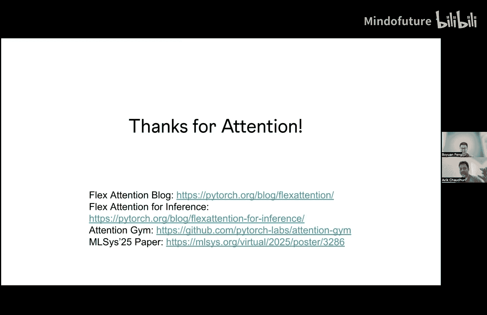

# 003：FlexAttention

## 概述
在本节课中，我们将学习FlexAttention，这是PyTorch团队近期推出的一个重要技术。它旨在解决为各种注意力变体手动编写高效内核的难题，同时提供灵活性和高性能。我们将了解其核心概念、工作原理、应用场景以及性能表现。

---

## 注意力机制的重要性与挑战
上一节我们介绍了注意力机制在Transformer模型中的核心地位。基本的注意力计算过程是：获取查询（Q）、键（K）、值（V），计算Q和K之间的点积，然后进行Softmax操作，最后与V相乘。这个过程在模型推理中占据了显著的延迟。

Flash Attention是最重要的注意力优化技术之一，它将所有计算融合到单个内核中，从而大幅提升了性能。下图展示了PyTorch原生实现与Flash Attention在延迟上的对比，后者明显更快。

然而，研究人员出于各种原因需要不同的注意力变体。例如：
*   **因果掩码**：当前标记只能关注过去的键标记。
*   **滑动窗口掩码**：只关注最近的一部分上下文。
*   **文档掩码**：在多个文档并存时，只关注同一文档内的标记。

此外，人们还可能希望将两个标记的相对位置信息融入注意力计算中，或者像ALiBi那样引入可训练的偏置。因此，存在大量不同的注意力变体。

为所有这些变体手动编写和调优内核非常困难。机器学习研究者提出新想法时，可能不具备编写高性能GPU内核的专业知识，而求助专家又耗时耗力。这就是FlexAttention要解决的问题。

---

## FlexAttention的核心：分数修改模式
FlexAttention引入了一个额外的“分数修改模式”，允许用户以非常灵活的方式修改Softmax之前或之后的结果。

分数修改模式本质上是一个函数，它接收原始的分数矩阵，并针对批次维度、头维度、当前查询索引和键索引，指定如何修改该位置的分数。这种方式非常灵活。

以下是可以用分数修改模式实现的功能示例：

**1. 相对位置编码**
我们可以直接计算查询索引与键索引的相对距离，并通过分数修改函数将其加到原始分数上。这样就将相对位置信息融入了注意力。

**优点**：我们无需将相对位置偏置具体化为一个完整的张量，从而避免了二次方的内存占用，并获得了更好的性能。与PyTorch的`scaled_dot_product_attention`相比，FlexAttention因此能实现更优的性能。

**2. ALiBi偏置**
假设我们有一个形状为`[num_heads]`的ALiBi偏置张量。我们可以通过分数修改函数，将这个偏置乘以相对距离后加到分数上。仅用几行代码就能轻松实现ALiBi偏置。

**3. Soft-Capping**
这是一种防止注意力分数过大的技术，在JaMa 2和Groq等模型中引入。我们同样可以用几行代码在FlexAttention中实现。

---

## 更高效的掩码模式
现在回到因果掩码的例子。我们如何实现它？我们可以使用分数修改模式：当查询索引大于等于键索引时，使用原始分数；否则，将其掩码为负无穷。这在逻辑上是正确的。

但这种方法不够快。因为对于上三角部分（未来位置），我们知道其分数最终会是负无穷，为什么还要计算它们呢？我们可以直接跳过这些计算来提升速度。

因此，我们引入了另一种模式：**掩码模式**。

掩码模式接收批次、头、查询索引和键索引，并返回一个布尔值，指示是否保留该位置。它与分数修改模式的区别在于，它不接收分数值，只判断“保留”或“丢弃”。

一旦有了掩码模式，FlexAttention可以自动计算块掩码来利用稀疏性。

**实现因果掩码**：只需返回 `q_idx >= kv_idx`。然后，我们可以使用FlexAttention的API `create_block_mask` 来创建块掩码。在调用FlexAttention时，除了Q、K、V张量，额外提供这个块掩码即可。

对于因果掩码这个例子，我们不需要分数修改模式，因为每个被掩码的元素值相同。但如果想将因果掩码与其他修改（如相对位置编码）结合，则可以同时提供掩码模式和分数修改模式。

**性能对比**：如果仅用分数修改模式实现因果掩码，其延迟如左图所示。而使用掩码模式后，由于跳过了大量计算，性能得到显著提升。

**更多掩码示例**：
*   **滑动窗口注意力**：计算查询索引与键索引的差值，与滑动窗口大小比较，距离太远则丢弃。
*   **组合掩码**：可以通过元素级的“与”操作，轻松组合因果掩码和滑动窗口掩码。
*   **文档掩码**：假设每个查询和键都有对应的文档ID，用一行代码即可实现文档掩码：`return doc_id_q == doc_id_kv`。

在性能上，FlexAttention通常能取得不错的表现。

---

## FlexAttention的工作原理
这是一个块掩码的详细示例。我们有一个分数修改模式（如相对位置编码）和一个掩码模式（如滑动窗口掩码）。我们可以实现任意的分数或掩码函数。

Q和K相乘得到分数矩阵。这里有两种类型的块：
1.  **完整块**：该块内的所有数据都会被使用。
2.  **部分块**：由于滑动窗口等限制，该块内只有部分元素被使用，部分被丢弃。

对于完整块，我们记录每一行需要使用的块索引。对于部分块，我们也进行类似记录。通过这种方式，我们编码了掩码模式的稀疏性，并在运行时利用它。

**编译过程**：
1.  我们定义了因果掩码和相对位置分数修改函数。
2.  使用`torch.compile`追踪这些函数，并进行 lowering 以生成相应的追踪代码。
3.  同时，我们构建了一个高效的注意力计算模板。
4.  在模板中预留位置，将生成的掩码模式和分数修改模式的追踪代码嵌入其中，以便在运行时修改分数矩阵。
5.  最终，生成一个高效的融合内核代码。

**关于外部依赖**：例如在文档掩码中，函数依赖于外部的`doc_id`张量。这个张量会被捕获在掩码计算图中，编译时会一并处理。

FlexAttention支持不同的后端模板（如CPU后端、CUDA后端），只要按照模板构建，就可以在不同的硬件或语言上运行FlexAttention。它覆盖了前向传播、反向传播和推理等多种使用场景。

---

## 推理优化：FlexDecoding
推理场景与训练不同。在推理时，通常有一个很短的查询序列（长度为1，因为我们是逐个生成token）需要关注一个超长的键值缓存（KVCache），其长度可能达到128K甚至更长。

这带来了挑战：由于只有单个查询token，我们无法在查询维度上进行并行计算。同时，键缓存的长度又非常长。

因此，出现了 **Flash Decoding** 优化。其思路是沿着键/值（KV）维度进行切分并行。例如，将KV缓存分成多个分片，每个分片并行计算局部结果，最后通过一次归约操作得到最终的输出。这样就能利用KV长度维度上的并行性。

FlexAttention 提供了 **FlexDecoding**，它采用了相同的优化思路，但同时允许应用分数修改模式，保持了灵活性。

**性能基准测试**：FlexAttention（及FlexDecoding）与专门的Flash Decoding内核性能相近，并且都显著快于标准的`scaled_dot_product_attention`。

在模型级基准测试（如Llama 3.1 8B和70B）中，FlexAttention在不同序列长度下都带来了显著的加速。

---

## 与PageAttention集成
PageAttention（由vLLM团队首创）对于推理至关重要。在推理时，我们有多个请求（A, B, C），每个请求的KV缓存长度不同。如果为每个请求的逻辑KV缓存都分配一个规整的张量，当序列较短时会造成大量内存浪费。

PageAttention 将KV缓存管理为一个紧凑的一维物理内存空间，并通过一个页表来映射逻辑KV块到物理位置，从而节省内存并支持更大的批处理大小。

我们希望FlexAttention能与PageAttention协同工作。

**第一步：块掩码转换**
FlexAttention使用块掩码来指示每一行（或批次）应该使用哪些KV块索引。对于物理KV缓存，我们需要一个对应的、基于物理索引的块掩码。

因此，我们提供了 **块掩码转换** 功能。它接收逻辑块掩码和页表，将其转换为基于物理KV缓存索引的块掩码。用户只需调用转换函数，无需关心内部细节。

**第二步：掩码模式与分数修改模式转换**
类似地，我们的掩码模式和分数修改模式函数原本在逻辑索引空间操作。在物理缓存空间，我们需要对它们进行转换。

我们提供了自动转换功能。对于转换后的掩码模式函数，它接收物理键索引，内部会通过计算找到对应的逻辑键索引，然后调用原始的逻辑掩码函数。分数修改模式的转换原理类似。这些自动化转换确保了结果的正确性，并屏蔽了复杂性。

**性能表现**：FlexAttention与PageAttention结合后，其性能与单独的FlexAttention或FlashAttention V2相近，额外延迟开销通常小于5%。在一个小规模服务示例中，使用PageAttention技术可以实现高达76倍的批处理大小提升。

这意味着，在内存受限或需要支持更大批处理量的真实服务场景中，可以结合使用FlexAttention和PageAttention，而无需付出过多的性能代价。

---

## 早期应用与未来方向
FlexAttention已经获得了一些早期采用者的积极反馈，被用于模型复现、训练加速、以及集成到Hugging Face等框架中。其设计思想也启发了其他优化工作。

**未来方向**：
1.  **性能持续优化**：集成更多新的GPU特性，使FlexAttention运行得更快。
2.  **支持更多用例**：随着更多用户的使用，可能会发现新的优化机会和应用场景。

---

## 总结
本节课我们一起学习了FlexAttention。我们了解到：
*   手动为各种注意力变体编写高效内核的挑战。
*   FlexAttention如何通过**分数修改模式**和**掩码模式**这两个核心抽象，为用户提供极大的灵活性来定义自定义注意力。
*   FlexAttention能够自动生成高效的内核代码，在保持灵活性的同时，性能接近甚至优于手写优化内核。
*   它支持**推理优化**（FlexDecoding）并与**PageAttention**无缝集成，以应对大模型推理中的内存和性能挑战。
*   FlexAttention已被多个项目早期采用，并拥有活跃的发展路线图。

如果你对灵活且高效的注意力实现感兴趣，强烈建议尝试FlexAttention。相关资源包括在线博客、示例代码库以及详细的技术论文。