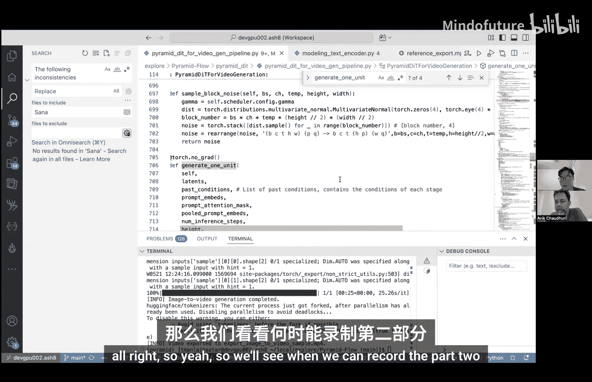

# 005：导出图像转视频模型（示例）🚀


在本节课中，我们将学习如何将一个开源的图像转视频模型（Parameter Flow）导出为PyTorch可执行图（ExportedProgram）。我们将重点关注模型的核心计算部分，并演示一个实用的分步导出工作流。

## 概述

我们将导出一个名为“Parameter Flow”的模型，它能够将静态图像扩展为动态视频。本次演示将聚焦于其“图像转视频”功能。导出过程的核心在于识别并分离模型中的计算密集型子模块，而非尝试导出包含所有预处理逻辑的完整脚本。

## 模型结构分析

上一节我们介绍了本次实践的目标模型。本节中，我们来看看这个模型的主要组成部分。典型的扩散模型工作流包含三个主要部分：

以下是模型的核心模块：
1.  **文本编码器**：将输入的文本提示（Prompt）转换为模型可理解的张量嵌入（Embeddings）。
2.  **核心扩散模型**：这是模型的主体，通常是一个基于Transformer的架构（如DiT），负责执行去噪和帧生成的核心计算。其前向传播函数类似 `output = model(noisy_latents, t, text_embeddings)`。
3.  **解码器**：将核心模型输出的潜变量（Latents）解码为最终的图像像素。

## 导出策略

理解了模型结构后，我们来看看具体的导出策略。`torch.export` 要求输入为动态张量，因此直接导出包含字符串处理等逻辑的完整生成管道是不切实际的。

合理的策略是**分别导出每个计算密集型子模块**。模型外部的“胶水代码”（如循环控制、数据预处理）则保留在Python驱动程序中。这样，我们可以利用`torch.export`优化核心计算，同时保持外围逻辑的灵活性。

## 实践：分步导出

以下是导出过程的关键步骤演示。

### 1. 拦截输入并导出文本编码器

首先，我们处理文本编码器。它的原始前向传播可能接收字符串列表，这不适合导出。我们需要在其被调用时，拦截已经处理好的张量输入。

```python
# 示例：包装并导出文本编码器子模块
class ExportWrapper(torch.nn.Module):
    def __init__(self, submodule):
        super().__init__()
        self.submodule = submodule
        self.example_inputs = None

    def forward(self, *args, **kwargs):
        # 记录第一次调用时的输入，作为示例输入
        if self.example_inputs is None:
            self.example_inputs = (args, kwargs)
        return self.submodule(*args, **kwargs)

# 包装编码器
text_encoder_wrapped = ExportWrapper(text_encoder_submodule)
# ... 运行一次推理，让 wrapper 记录下输入 ...
# 然后使用记录的示例输入进行导出
example_args, example_kwargs = text_encoder_wrapped.example_inputs
exported_text_encoder = torch.export.export(text_encoder_wrapped, example_args, example_kwargs)
```

### 2. 导出核心扩散模型

接下来是模型最耗时的部分——核心扩散模型。我们同样包装其子模块。注意，扩散模型中的迭代去噪步骤通常包含数据依赖的控制流，直接导出整个循环可能很困难或收益不高。因此，我们通常导出循环体内的那个核心网络。

```python
# 假设 `core_model` 是去噪步骤中调用的核心网络
core_model_wrapped = ExportWrapper(core_model)
# ... 运行推理记录输入 ...
exported_core_model = torch.export.export(core_model_wrapped, ...)
```

### 3. 处理动态形状

对于不熟悉模型具体输入形状的开发者，一个实用的技巧是使用 `dim=“auto”` 来定义动态维度，让导出器自动推断。

```python
# 定义动态形状约束
dynamic_shapes = {
    “input_tensor”: {0: torch.export.Dim(“batch”), 2: torch.export.Dim(“height”, min=256, max=1024), 3: torch.export.Dim(“width”, min=256, max=1024)},
    # ... 其他输入 ...
}
# 或者，更简单的方式：将所有维度标记为动态
dynamic_shapes = {k: {i: “auto” for i in range(v.dim())} for k, v in example_inputs.items()}

exported_program = torch.export.export(model, args=example_args, kwargs=example_kwargs, dynamic_shapes=dynamic_shapes)
```

### 4. 运行导出的程序

导出的 `ExportedProgram` 可以在Python环境中直接运行，就像运行一个普通的`torch.nn.Module`一样，这方便了调试和验证。

```python
# 运行导出的程序
with torch.no_grad():
    output = exported_program(*example_inputs)
```



## 总结

本节课中我们一起学习了如何实际导出一个复杂的PyTorch模型。关键要点在于：
1.  **聚焦核心**：不要试图导出包含所有预处理和后处理的完整脚本，应专注于计算密集的子模块。
2.  **分而治之**：将模型拆分为文本编码器、核心网络、解码器等部分，分别导出。
3.  **利用包装器**：通过包装器拦截运行时输入，可以方便地获取导出所需的示例输入。
4.  **拥抱动态性**：使用动态形状（`dynamic_shapes`）可以使导出的程序适应更多样的输入尺寸，提高通用性。


这种工作流与`torch.compile`（可以图形中断）不同，它要求子图必须完全可追踪。通过将优化重点放在真正的计算瓶颈上，我们可以有效地利用 `torch.export` 为后续的部署（例如通过AOT Inductor编译到C++）生成高质量的中间表示。