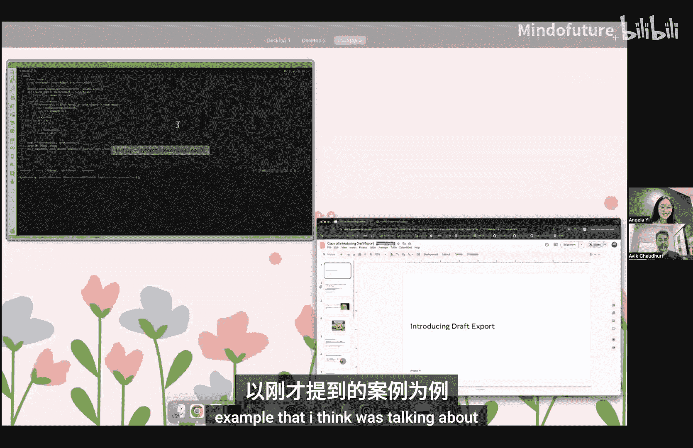
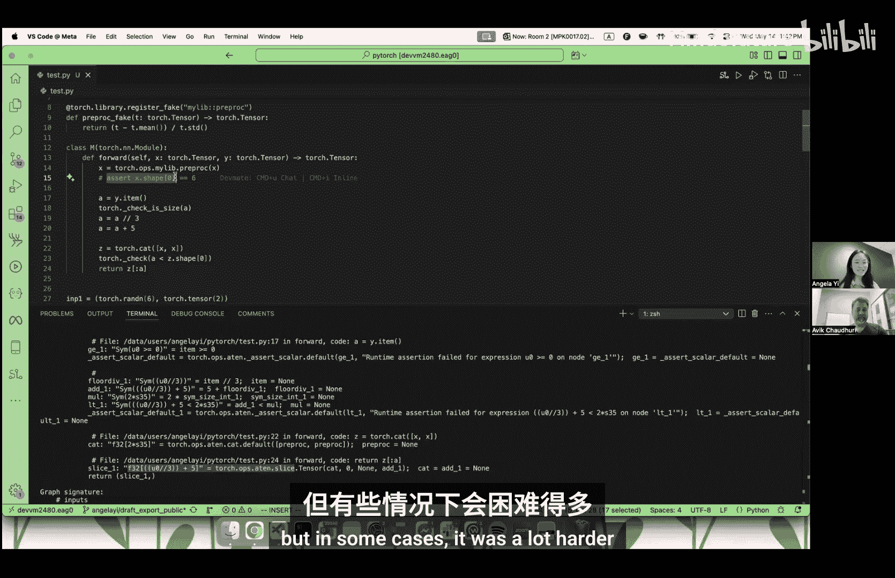
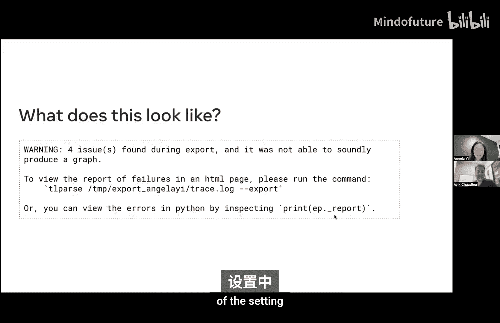
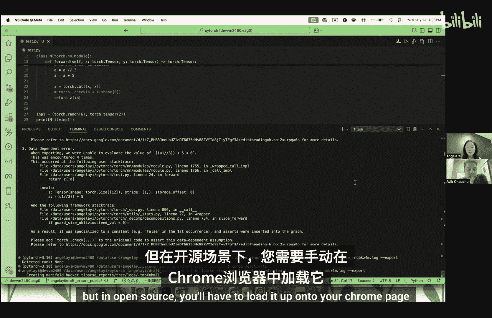
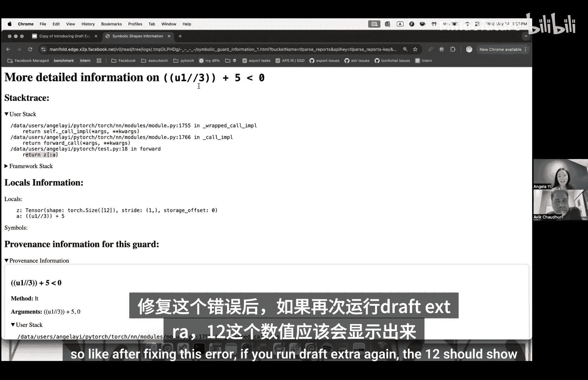
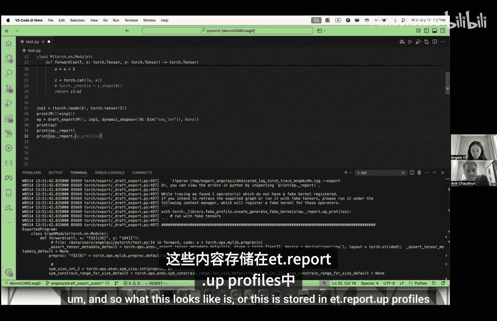
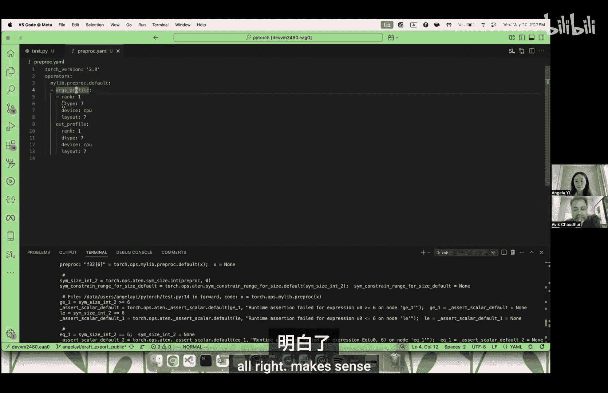
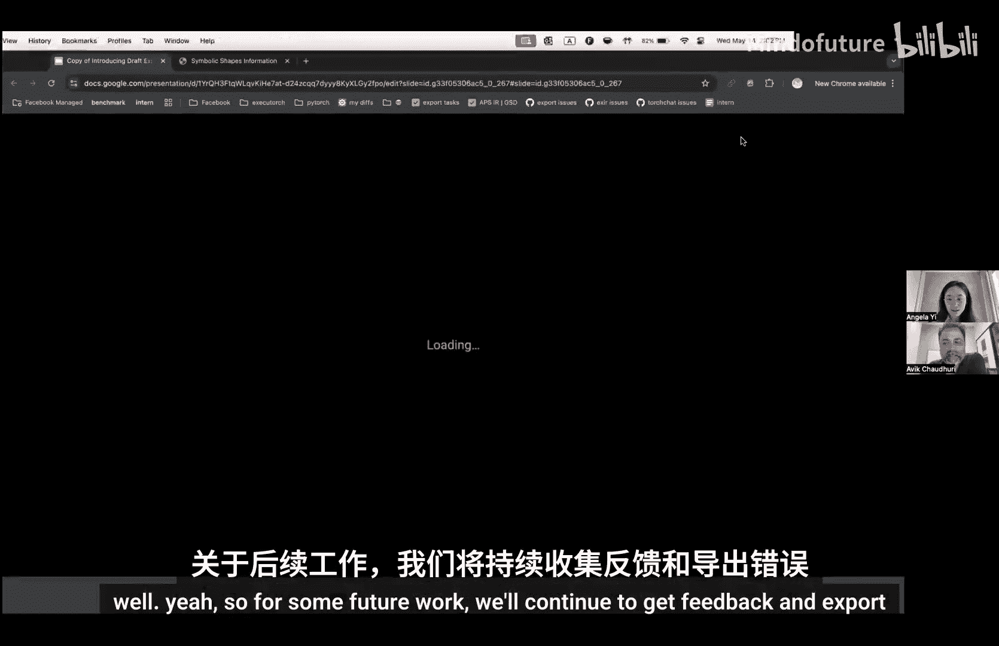

# 006：草稿导出（Draft Export）📄




在本节课中，我们将要学习PyTorch编译器中的一个新工具——**草稿导出（Draft Export）**。草稿导出是标准`torch.export`工具的增强版本，旨在解决在模型导出过程中需要反复处理错误的问题。通过草稿导出，你可以一次性获得所有潜在问题的报告，并快速得到一个可用的计算图，从而加速工作流程。

## 概述

标准的`torch.export`工具用于从PyTorch模型中捕获计算图，但它是一个“提前（Ahead-of-Time）”的图捕获机制。在捕获过程中，如果遇到问题（例如缺少算子实现、数据依赖的守卫等），它会一次抛出一个错误，用户需要逐一修复。许多用户希望一次性看到所有错误，并快速获得一个完整的图用于后续流程。草稿导出正是为此而生。

## 草稿导出的工作原理

为了理解草稿导出的优势，我们先来看一个标准导出可能遇到的典型问题。

### 一个导出失败的例子

假设我们有以下模型代码：

```python
import torch

def my_custom_preproc(x):
    # 一个自定义算子，可能包含C++逻辑或其他不希望暴露的“黑盒”操作
    return x * 2

class MyModel(torch.nn.Module):
    def forward(self, x, y):
        z = my_custom_preproc(x)
        a = y.item() // 3 + 5
        out = torch.cat([z, z])
        return out[a:]
```

我们尝试使用标准`torch.export`来导出这个模型：



```python
model = MyModel()
sample_inputs = (torch.randn(6), torch.tensor([2.0]))
dynamic_shapes = ({0: torch.export.Dim(“batch”)}, None) # 标记第一个输入的维度0为动态

try:
    exported_program = torch.export.export(model, sample_inputs, dynamic_shapes=dynamic_shapes)
except Exception as e:
    print(e)
```

运行上述代码可能会遇到一系列错误，例如：
1.  **缺少伪内核（Fake Kernel）**：`No fake impl found for my_custom_preproc`。这是因为自定义算子需要注册一个“伪实现”来告诉导出器如何传播形状和数据类型。
2.  **数据依赖守卫（Guard on Data-dependent Expression）**：`Could not guard on data-dependent expression: u0 // 3 + 5`。这是因为在切片操作`out[a:]`中，索引`a`的值依赖于输入数据（`y.item()`），导出器无法静态确定其范围。
3.  **约束违反（Constraints Violated）**：`Constraints violated ...`。这可能是因为代码内部的断言（如`assert x.shape[0] == 6`）与我们在`dynamic_shapes`中声明的动态维度假设冲突。

修复这些错误需要深入理解模型代码、添加伪内核实现、插入`torch.check`来约束符号值等步骤，过程可能比较繁琐。

### 草稿导出如何解决

草稿导出的核心思想是：**先获得一个图，再处理问题**。

它通过一种称为**真实张量追踪（Real Tensor Tracing）**的技术来实现。在追踪计算图的同时，它不仅使用不存储实际值的“伪张量（Fake Tensor）”来记录形状和类型，还会使用你提供的**真实样本输入**来实际执行一遍计算。

*   **对于数据依赖守卫**：当遇到像`y.item()`这样的操作时，伪张量会创建一个无具体值的符号`u0`。在标准导出中，这会导致错误。但在草稿导出中，它会使用真实样本输入中的值（例如`2`）来具体化这个表达式，从而绕过守卫，继续执行。
*   **对于缺少伪内核**：如果一个自定义算子没有注册伪实现，草稿导出会直接用真实张量执行该算子，获取输出。然后，它会为伪张量流返回一个具有相同秩但所有维度都是“无具体值（unbacked）”的张量，表示“我知道输出是一个N维张量，但具体形状未知”。
*   **对于约束违反**：草稿导出会记录下在样本输入下成立的所有假设，并将它们作为运行时断言（`assert`）插入到生成的计算图中。

这样做的结果是，草稿导出**几乎总能成功返回一个`ExportedProgram`**。这个计算图被**特化（Specialized）**到了你提供的样本输入上。它保证对这批样本输入有效，但对其他输入可能无效，因为图中包含了基于这些样本值所做的分支决策和断言。

## 如何使用草稿导出

使用草稿导出的API与标准导出几乎相同，只需将`torch.export.export`替换为`torch.export.draft_export`。

```python
from torch.export import draft_export

draft_ep = draft_export(model, sample_inputs, dynamic_shapes=dynamic_shapes)
```

如果导出过程中草稿导出版本自动绕过了一些错误，它不会静默处理，而是会生成一份详细的**问题报告**。

### 查看问题报告



你可以通过两种方式查看报告：

1.  **在Python中直接打印**：
    ```python
    print(draft_ep.report)
    ```
    这会输出一个文本摘要，列出遇到的所有问题类型和位置。

2.  **使用`tlparse`生成HTML可视化报告（更推荐）**：
    ```python
    # 首先确保安装了torchtune
    # pip install torchtune
    draft_ep.report.save(“report.json”)
    # 然后在命令行运行
    # tlparse report.json
    ```
    这会生成一个交互式的HTML页面，清晰地展示每个错误的堆栈跟踪、涉及的符号值（如`u0`）的来源（溯源信息），以及具体的代码位置。这对于理解复杂的守卫条件非常有帮助。

### 生成的图与断言

草稿导出生成的计算图中会包含插入的运行时断言。例如，对于之前切片操作的守卫，图中可能会添加类似`assert a >= 0`和`assert a < len(out)`的检查。如果你用不符合这些断言的输入运行该图，它会在运行时抛出错误。



## 高级功能：为自定义算子自动生成伪内核

草稿导出的另一个强大功能是能为缺少伪实现的自定义算子自动生成**伪内核配置文件**。

当草稿导出遇到没有伪内核的算子时，它会记录该算子在当前追踪过程中所见的所有**输入/输出对的形状和数据类型**，并将其保存在`draft_ep.report.op_profiles`中。



你可以将这个配置文件保存下来：

```python
import yaml
profile = draft_ep.report.op_profiles
with open(“op_profile.yaml”, “w”) as f:
    yaml.dump(profile, f)
```




然后，在后续的标准导出中，你可以加载这个配置文件，并使用一个辅助工具来**临时注册**基于此配置的伪内核，从而避免手动编写：

```python
from torch.export import generate_fake_kernels_from_profile

# 加载配置文件
with open(“op_profile.yaml”, “r”) as f:
    loaded_profile = yaml.safe_load(f)

# 使用配置文件为缺失的算子生成并注册伪内核
with generate_fake_kernels_from_profile(loaded_profile):
    # 现在可以正常使用标准导出了！
    exported_program = torch.export.export(model, sample_inputs, dynamic_shapes=dynamic_shapes)
```

**请注意**：这种自动生成的伪内核是基于观察到的特定输入/输出模式。如果遇到新的、未见过的形状，它可能无法正确工作。此时，你需要用新的输入再次运行草稿导出来丰富配置文件。

## 总结

本节课中我们一起学习了PyTorch的草稿导出工具：





*   **它是什么**：`torch.export.draft_export` 是一个旨在快速获得模型计算图的工具，通过真实张量追踪技术绕过常见的导出错误。
*   **核心价值**：它提供了一种“先拿到图，再逐步修复”的工作流，特别适用于模型探索、快速原型构建以及与下游工具链的早期集成。
*   **主要输出**：
    1.  一个**特化**于样本输入的计算图（`ExportedProgram`）。
    2.  一份详细的**问题报告**，帮助定位所有需要修复的守卫、缺失的算子实现等问题。
    3.  为自定义算子自动生成的**伪内核配置文件**，可辅助后续的标准导出。
*   **注意事项**：生成的图包含运行时断言，可能无法泛化到所有输入。它主要目标是提供开发便利性，而非生产就绪的通用图。


草稿导出仍在积极开发中，团队正在致力于提升其性能（因为同时运行真实张量会带来开销）并扩展其所能处理的错误类型。鼓励大家尝试使用，并通过GitHub提交反馈和问题。