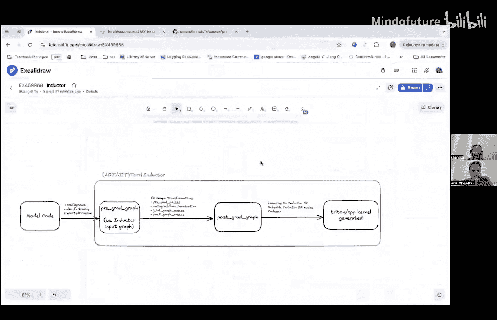
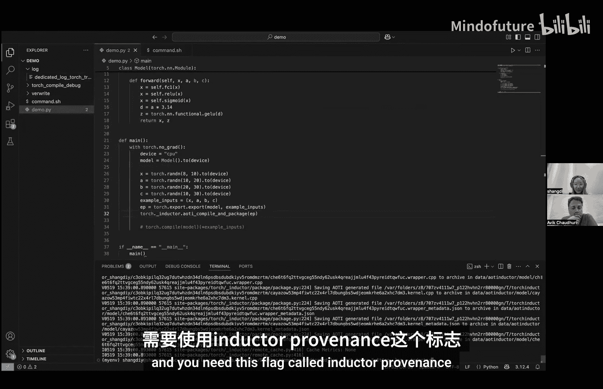
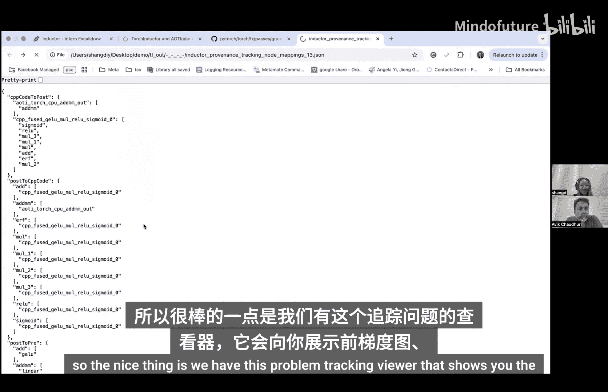
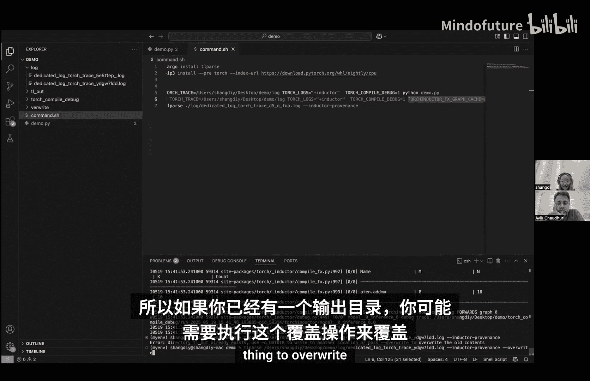
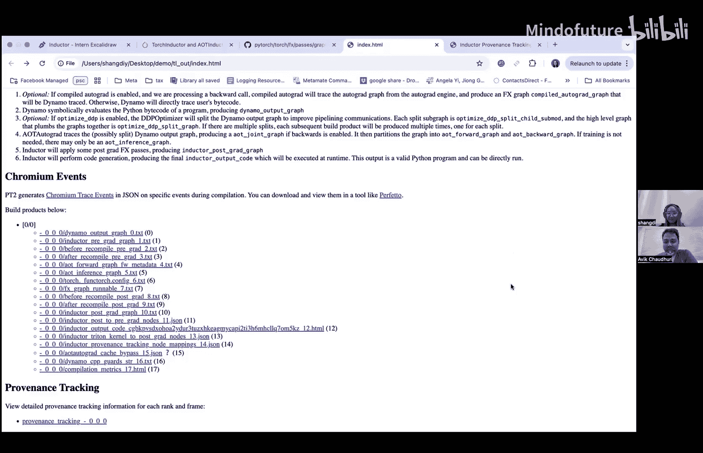

# 007：Inductor中的溯源追踪

## 概述
在本节课中，我们将学习一个用于PyTorch编译器Inductor的调试工具——溯源追踪。这个工具旨在帮助开发者理解在`torch.compile`和导出工作流中，计算图中的节点是如何从原始模型代码演变到最终生成的底层内核代码的。我们将了解其工作原理、如何设置环境并使用它来可视化整个编译流程。

## 背景知识
在深入使用工具之前，需要了解一些背景。在Inductor中，无论是AOT编译还是即时编译，其通用工作流程如下：
1.  从模型代码开始，通过图追踪得到一个输入计算图，我们称之为**前向图**。
2.  对这个前向图进行一系列FX图变换，得到**后向图**。
3.  最后，通过底层代码生成，将后向图转换为具体的内核代码（如Triton或C++代码）。

更具体地说，图追踪可以通过`torch.compile`、`make_fx`或加载导出的程序完成。FX图变换包括多组图优化过程，以及重要的`autograd.Functionalization`过程，因此第二个图被称为后向图。

溯源追踪工具将向您展示三个面板：前向图、后向图以及生成的代码，并清晰地展示三者之间的节点映射关系。

## 工具安装与环境设置
以下是开始使用溯源追踪工具前需要完成的准备工作。

首先，需要安装一个名为`tlparse`的R语言库。它是一个强大的调试工具，我们这里主要用其溯源追踪功能。

其次，确保安装了包含此功能支持的PyTorch版本。

接着，需要设置一些环境变量来启用日志记录：
*   `TORCH_LOGS`：指定日志输出目录。
*   `TORCH_LOGS`：设置为`inductor`，指示Inductor将日志输出到指定目录。
*   `TORCH_LOG_DEBUG`：设置日志的调试级别。

## 使用演示：导出工作流
让我们通过一个简单的模型演示如何在导出工作流中使用此工具。

假设我们有一个简单的模型，并对其进行导出和AOT编译。运行模型脚本后，可以在日志目录中看到生成的日志文件。

然后，使用`tlparse`命令解析日志，并添加`--inductor-provenance`标志来启用溯源追踪可视化。

解析完成后，`tlparse`会生成一个网页。在这个网页中，您可以找到：
*   **前向图**：即初始的计算图。
*   **后向图**：经过FX变换后的计算图。
*   **生成的代码**：包括包装器代码和内核代码。
*   **节点映射**：以JSON格式展示不同阶段节点之间的对应关系。

网页的核心是溯源追踪视图，它并排显示前向图、后向图和生成的代码。例如，您可以直观地看到前向图中的某个`gelu`操作如何在后向图中被分解为多个基础操作，而这些基础操作又如何最终被融合到一个C++内核（如`cpp_fused_gelu_mul_red`）中。

此外，在前向图和后向图的节点上，工具会以注释形式显示该节点对应的原始模型代码行号，这极大方便了代码定位。

## 使用演示：即时编译工作流
现在，我们看看在`torch.compile`（即时编译）工作流中的使用。

需要注意的是，在即时编译中，FX图可能会被缓存。如果日志中没有出现后向图，可以尝试设置环境变量`TORCHINDUCTOR_FX_GRAPH_CACHE=0`来禁用缓存，强制重新编译并生成日志。

后续步骤与导出工作流相同：运行模型、解析日志。唯一的区别是，此时生成的代码将是Triton代码而非C++代码，但溯源追踪视图的呈现方式是完全一致的。

## 工具扩展与未来展望
目前，该工具主要与Inductor集成。对于希望将其扩展到其他运行时的开发者，可以参考以下思路：

前两个图（前向图和后向图）的追踪基本上是免费的，因为它们只涉及FX图变换。任何自定义的图变换，只要使用`GraphTransformObserver`这个上下文管理器进行包装，其变换过程就能被捕获并纳入溯源追踪。追踪信息会存储在节点的`meta`字段（名为`from_node`）中。

要将后向图节点与自定义后端生成的内核代码关联起来，则需要手动建立映射关系，并生成一个与Inductor提供的格式类似的JSON文件。如果社区对此有广泛需求，未来可能会尝试将此功能模块化，以方便其他后端开发者集成。

## 总结
本节课我们一起学习了PyTorch Inductor中的溯源追踪工具。我们了解了其设计目的是为了解决编译过程中节点来源不透明的问题。通过具体的演示，我们学会了如何安装`tlparse`、设置环境变量，并利用该工具可视化前向图、后向图与生成代码之间的演变关系。这个工具对于调试复杂的图融合、分解等优化过程非常有帮助。目前该功能主要服务于Inductor后端，但其设计为向其他后端扩展提供了可能性。