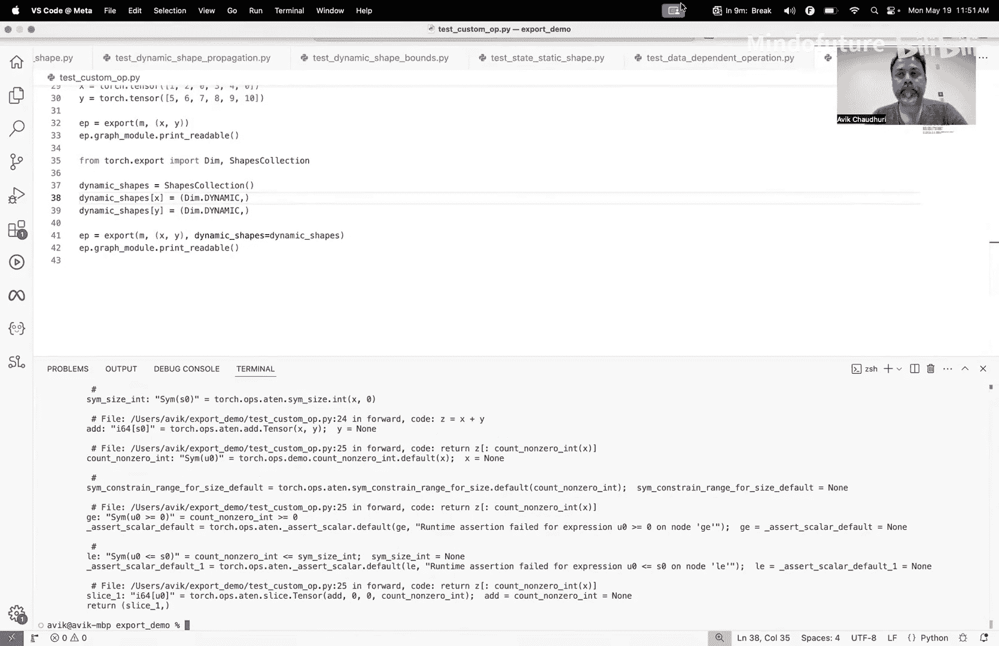

# 008：Torch Export 编程模型


在本节课中，我们将学习 PyTorch 的 Torch Export 功能及其背后的编程模型。我们将了解 Export 如何将模型转换为图表示，以及在此过程中需要遵循的设计原则和规则。通过一系列示例，我们将掌握如何预测 Export 对特定程序的行为，从而编写出更易于导出的模型。

## 概述：什么是 Torch Export？

Torch Export 的目标是获取一个模型，并创建该模型的图表示。其核心在于，给定一个具有代表性的示例输入，Export 会捕获模型执行该输入时所经过的路径，并生成一个计算图。这个图应该能够在一个较大的输入子集上，产生与原模型完全相同的输出。

任何图捕获机制的设计，都归结为一个关键决策：在导出之后，哪些部分可以改变（动态），哪些部分在导出时就被固定（静态）。这需要在安全性和覆盖率之间取得平衡。

*   **安全性**：导出的图在行为上应与原模型相似。
*   **覆盖率**：该机制能够成功处理大量不同的模型。

与之前的 JIT Trace（高覆盖率、低安全性）和 JIT Script（低覆盖率、高安全性）等技术相比，Torch Export 旨在同时实现高安全性和高覆盖率。

## 核心设计原则

Torch Export 的设计基于以下原则：

1.  **图不能依赖于张量数据**：我们假设张量数据在不同运行中会发生变化，因此图不能绑定到具体的数值。
2.  **基于张量形状进行特化**：张量形状是数据之上的抽象。虽然数据会变，但形状可以假设为不变，从而允许编译器进行特化和优化。
3.  **非张量内容将被固定**：程序中的常量以及使用的 Python 容器（如列表、字典）的结构将在导出时被固定并“烧录”到图中。

理解了这些原则，我们就可以通过示例来构建对 Export 编程模型的具体认知。

## 示例解析

### 常量特化

第一个示例展示了常量如何被内联和折叠到图中。

```python
import torch

class SimpleModel(torch.nn.Module):
    def forward(self, x, a):
        # `a` 是一个整数常量
        b = a + 7
        return x + b

model = SimpleModel()
x = torch.randn(3, 4)
# 在导出时传入常量 3
exported_graph = torch.export.export(model, (x, 3))
print(exported_graph)
```

**输出图示意**：你会看到图中出现了一个值为 `10` 的常量节点（即 `3 + 7` 的结果）。输入 `x` 保持为动态输入，而常量 `a` 的值被特化并烧录。

### 容器结构特化

Export 也会特化 Python 容器的结构。

```python
class ContainerModel(torch.nn.Module):
    def forward(self, tensor_list, const_list):
        # 对张量列表求和
        tensor_sum = sum(tensor_list)
        # 对常量列表求和
        const_sum = sum(const_list)
        return tensor_sum + const_sum

model = ContainerModel()
# 示例输入：两个张量，三个常量
tensor_list = [torch.randn(2), torch.randn(2)]
const_list = [3, 4, 5]
exported_graph = torch.export.export(model, (tensor_list, const_list))
print(exported_graph)
```

**输出图示意**：导出的图将有 5 个输入：2 个张量输入和 3 个常量输入。常量列表 `[3, 4, 5]` 被求和为 `12`，并作为常量出现在图中。容器的结构（列表长度）被固定。

### 处理自定义数据类

如果你想使用自定义数据类作为输入，需要向 Export 注册该类，以便它知道如何展开。

```python
from dataclasses import dataclass
import torch

@dataclass
class MyData:
    tensors: list[torch.Tensor]
    consts: list[int]

class DataClassModel(torch.nn.Module):
    def forward(self, data: MyData):
        return sum(data.tensors) + sum(data.consts)

model = DataClassModel()
data = MyData(tensors=[torch.randn(2), torch.randn(2)], consts=[3, 4, 5])

# 注册数据类，使其可被 Export 处理
torch.export.unflatten.register(MyData)
exported_graph = torch.export.export(model, (data,))
print(exported_graph)
```

**输出图示意**：注册后，Export 会将数据类展开，得到与上一个示例相同的图（5个输入，常量被求和）。

### 形状特化与传播

Export 会特化张量的形状，并且形状信息会在计算图中传播。

```python
class ShapeModel(torch.nn.Module):
    def forward(self, tensor_list):
        # 提取每个张量的形状并求和
        total_elements = sum(t.shape[0] for t in tensor_list)
        # 对张量列表本身求和
        tensor_sum = sum(tensor_list)
        return tensor_sum + total_elements

model = ShapeModel()
tensor_list = [torch.randn(3), torch.randn(4), torch.randn(5)]
exported_graph = torch.export.export(model, (tensor_list,))
print(exported_graph)
```

**输出图示意**：形状 `[3, 4, 5]` 被当作常量处理，它们的和 `12` 会作为常量出现在图中。通过 `exported_graph.graph_module.print_readable()` 可以查看输入张量的预期形状。

形状传播也适用于运算符。

```python
class ShapePropModel(torch.nn.Module):
    def forward(self, tensor_list):
        # 拼接张量，然后取其形状
        concatenated = torch.cat(tensor_list)
        concat_shape = concatenated.shape[0]
        tensor_sum = sum(tensor_list)
        return tensor_sum + concat_shape

model = ShapePropModel()
tensor_list = [torch.randn(3), torch.randn(4), torch.randn(5)]
exported_graph = torch.export.export(model, (tensor_list,))
print(exported_graph.graph_module)
```

**输出图示意**：图中会有一个中间节点表示 `torch.cat` 的输出，其形状为 `12`。这显示了编译器能够跨运算符跟踪形状。

### 基于形状的控制流

由于 Export 在编译时理解形状，因此可以解析基于形状的控制流，并只追踪实际执行的路径。

```python
class ControlFlowModel(torch.nn.Module):
    def forward(self, tensor_list):
        concatenated = torch.cat(tensor_list)
        if concatenated.shape[0] > 20:
            result = concatenated.sum() * 2  # 分支 1
        else:
            result = concatenated.mean()     # 分支 2
        return result

model = ControlFlowModel()
# 示例 1：走 else 分支
tensor_list_small = [torch.randn(6), torch.randn(7), torch.randn(8)] # 形状和=21
exported_graph1 = torch.export.export(model, (tensor_list_small,))
print(“分支1的图：“)
print(exported_graph1.graph_module)

# 示例 2：走 if 分支
tensor_list_large = [torch.randn(10), torch.randn(12)] # 形状和=22
exported_graph2 = torch.export.export(model, (tensor_list_large,))
print(“\n分支2的图：“)
print(exported_graph2.graph_module)
```

**输出图示意**：第一个导出只会包含 `else` 分支（`mean` 操作）的代码。第二个导出只会包含 `if` 分支（`sum * 2` 操作）的代码。图被特化到了示例输入所触发的具体路径。

### 动态形状

为了捕获更通用的图，避免过度特化于具体形状，可以使用动态形状。

```python
class DynamicShapeModel(torch.nn.Module):
    def forward(self, x, y, z):
        # y: [S0, S3], z: [S3, S1] -> mmul: [S0, S1]
        mm = torch.mm(y, z)
        # x 必须也是 [S0, S1]
        return x + mm

model = DynamicShapeModel()
x = torch.randn(3, 5)
y = torch.randn(3, 4)
z = torch.randn(4, 5)

# 定义动态形状约束
dynamic_shapes = {
    “x“: {0: torch.export.Dim(“dim_x0“), 1: torch.export.Dim(“dim_x1“)},
    “y“: {0: torch.export.Dim(“dim_y0“), 1: torch.export.Dim(“dim_y1“)},
    “z“: {0: torch.export.Dim(“dim_z0“), 1: torch.export.Dim(“dim_z1“)},
}

exported_graph = torch.export.export(model, (x, y, z), dynamic_shapes=dynamic_shapes)
print(exported_graph.graph_module)
```

**输出图示意**：图中的形状不再是具体数字，而是符号（如 `S0`， `S1`， `S3`）。编译器会进行符号推理，确保形状约束（如矩阵乘法的维度匹配）得到满足。如果后续运行时的输入违反这些约束，会在早期报错。

### 数据依赖操作与 Guard

图不能依赖数据，但有些操作（如 `torch.count_nonzero`）本质上是数据依赖的。

```python
class DataDependentModel(torch.nn.Module):
    def forward(self, x, y, z):
        # z 与 x 形状相同
        c = torch.count_nonzero(x).item()  # 数据依赖！
        # 用 c 进行切片
        return z[:c] + y

model = DataDependentModel()
x = torch.tensor([1, 0, 2, 0, 3, 0])
y = torch.randn(6)
z = torch.randn(6)

try:
    exported_graph = torch.export.export(model, (x, y, z))
except torch.export.ExportError as e:
    print(f“导出错误： {e}“)
    # 错误会提示需要添加约束（Guard）
```

直接导出会失败，因为 `c` 的值在编译时未知。Export 会将其标记为一个未知的符号整数（如 `U0`）。为了解决这个问题，我们需要添加运行时检查（Guard）。

```python
from torch.export import dynamic_shapes
import torch

class DataDependentModelWithGuard(torch.nn.Module):
    def forward(self, x, y, z):
        c = torch.count_nonzero(x).item()
        # 添加约束：c 非负且小于 z 的长度
        torch.export.constrain_as_size(c, min=0, max=z.shape[0])
        return z[:c] + y

model = DataDependentModelWithGuard()
x = torch.tensor([1, 0, 2, 0, 3, 0])
y = torch.randn(6)
z = torch.randn(6)

exported_graph = torch.export.export(model, (x, y, z))
print(exported_graph.graph_module)
```

**输出图示意**：图中会包含两个运行时断言，确保 `c` 在 `[0, 6]` 范围内。这样，图就可以安全地使用 `c` 进行切片了。

### 自定义运算符以改进形状推理

对于某些操作，我们可以通过自定义运算符（Custom Op）及其在导出期间使用的“假”实现（Fake Implementation）来提供更精确的形状推理，从而避免添加多余的 Guard。

```python
import torch.library
from torch.export import dynamic_shapes

# 定义自定义运算符
count_nonzero_int = torch.library.custom_op(“mylib::count_nonzero_int“, mutates_args=())
@count_nonzero_int.register_fake
def _(x):
    # Fake 实现：返回一个在 [0, x.numel()] 范围内的符号整数
    out = torch.export.Dim(“dynamic_count“, min=0, max=x.numel())
    torch.export.constrain_as_size(out, min=0, max=x.numel())
    return out
@count_nonzero_int.register_kernel
def _(x):
    return torch.count_nonzero(x).item()

class ModelWithCustomOp(torch.nn.Module):
    def forward(self, x, y, z):
        c = count_nonzero_int(x)  # 使用自定义op
        # 现在编译器知道 c 在 0 和 x.numel() 之间
        # 并且 z 与 x 同形（通过 x+y 保证）
        return z[:c] + y

model = ModelWithCustomOp()
x = torch.randn(6)
y = torch.randn(6)
z = torch.randn(6)
exported_graph = torch.export.export(model, (x, y, z))
print(“使用自定义Op导出成功“)
```

通过自定义 Op 的 Fake 实现，我们提前告诉了编译器 `count_nonzero_int` 输出值的范围，使得编译器能推导出切片是安全的，无需额外 Guard。这同样适用于动态形状场景。

## 总结

本节课我们一起深入探讨了 Torch Export 的编程模型。其核心在于明确区分动态与静态部分：

*   **静态（固定）**：常量、Python 容器结构、张量形状（除非指定为动态）。
*   **动态（可变）**：张量数据。



基于此，Export 通过追踪示例输入的执行路径来生成计算图，并利用形状传播和符号推理来保证图在更大输入范围内的正确性。我们学习了如何通过添加 Guard 来处理数据依赖操作，以及如何通过自定义运算符来增强编译器的推理能力。掌握这些概念，将帮助你编写出更兼容 Torch Export、更高效的模型。