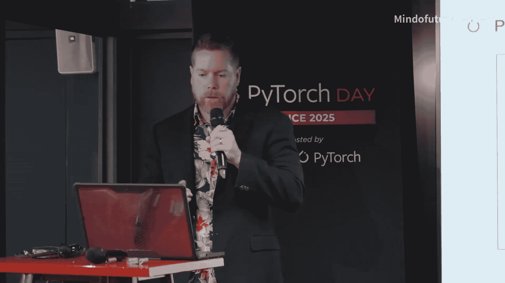
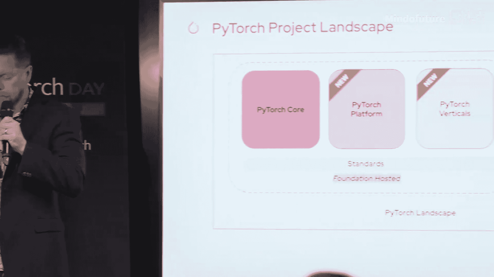
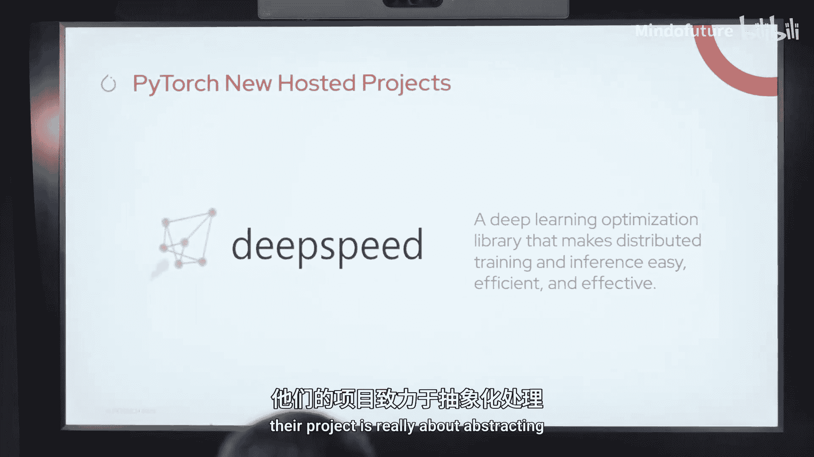
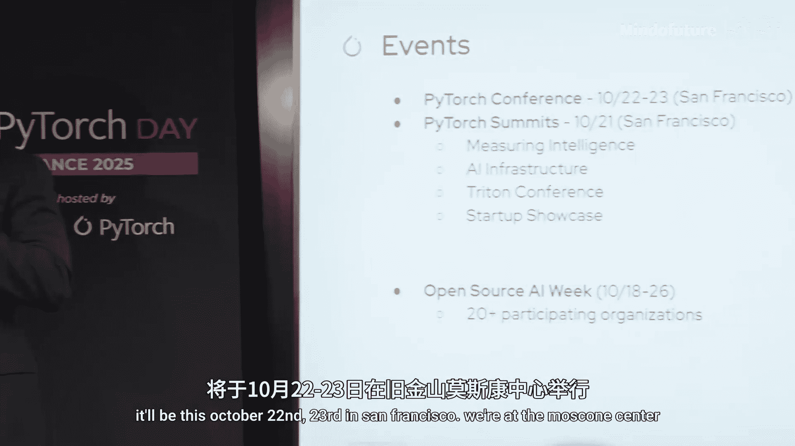
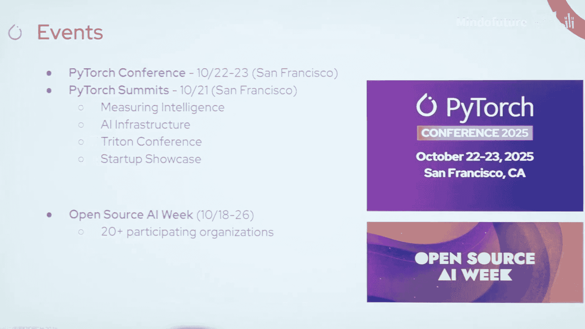

# 001：欢迎致辞与基金会新动向 🎉

在本节课中，我们将学习PyTorch基金会的最新发展，包括其从单一框架向“伞形基金会”的转型、新加入的项目、社区计划以及未来的活动安排。

## 概述

大家好，感谢各位的参与。我们现在正式开始今天的活动。

在开始之前，我要感谢CSDN和GoS主办此次活动。这是首届PyTorch Day，我们很高兴能在巴黎启动这个活动。

## 基金会使命与转型

接下来，我将快速介绍PyTorch的使命。我知道用这张幻灯片开始演讲可能最无聊，但它确实反映了基金会近期的一些变化。

最初的愿景是专注于PyTorch框架本身。我提前透露一些消息，如果你现在在线，可能已经看到了。我们现在正转向成为一个更全面、更广泛的基金会，我们称之为“伞形基金会”，它涵盖了解决整个AI生命周期问题的开源项目。

我要快速感谢我们所有的首要成员、普通成员和准成员。PyTorch基金会现在拥有超过30名成员，我们最近欢迎了高通和Snowflake加入这个大家庭。

## 蓬勃发展的生态系统

并非所有人都知道，我们拥有一个蓬勃发展的PyTorch生态系统。目前它由超过70个项目组成，并且还在持续增长。你可能认识幻灯片上的一些标志。如果你有项目，请与我们联系，我们仍在接纳并将继续接纳生态系统项目。

## 伞形基金会的含义

我有很多公告要宣布，我会尽量简洁。正如我提到的，PyTorch现在是一个伞形基金会。别问为什么伞在着火，这只是我的设计。

那么，伞形基金会到底意味着什么？它基本上意味着PyTorch基金会现在可以托管多个项目，不仅仅是PyTorch核心框架，我们现在正扩展到AI生命周期中的其他新项目。我们希望建立一个可信、可互操作的项目生态系统，从根本上减少下游用户、开发者、工程师以及研究人员的摩擦。

这有助于我们统一治理，使项目进入供应商中立的空间，在需要时协调路线图，并真正加强不同项目之间的协作。

它还支持来自我们将要合作的所有不同领域的多样化创新，从工具和推理，到基础设施之外，再到基准测试、智能体框架和其他领域。

这将真正帮助社区依赖这个生态系统中的项目获得长期性、可靠性，确保它们在未来得到长期支持。

## PyTorch项目全景图

以下是PyTorch全景图的快速概览。我们有很多不同的术语，全景图和生态系统可能有点令人困惑。但全景图涵盖了一切。显然，PyTorch核心今天仍然存在，然后我们增加了两个新的基金会托管领域：平台项目和垂直领域。

平台项目更为通用，它们是像推理、服务、微调和训练这样的工具，可以作为通用工具使用。

然后是垂直领域，垂直领域非常特定于领域，比如蛋白质折叠，或者非常特定于行业或应用场景的用例。

我们仍然有生态系统项目，这些是自托管项目。这些项目不由PyTorch基金会托管，它们没有相同的福利和保证，但它们是优秀的项目，有助于完善整个开源AI生态系统。

## 基金会托管项目的意义

那么，成为基金会托管项目意味着什么？我提到了基金会托管与自托管的区别。进入这种供应商中立治理模式的项目将受益于PyTorch伞形基金会。例如，商标和域名由基金会持有，这样其他公司就无法垄断商标的使用。

然后是CI基础设施，你可以依赖我们的CI基础设施并与之集成，你也可以管理自己的，但这是一个选项。我们还提供营销、活动等许多其他福利。

## 新加入的项目

我们确实宣布了两个新项目，这是除了PyTorch生态系统（或PyTorch核心）之外的前两个新项目。

第一个是**vLLM**，我相信你们许多人都熟悉vLLM。它是一个推理和服务引擎，是一个出色的项目，它解决了生命周期中的一个实际领域，即下游的推理环节。

第二个是**DeepSpeed**，我们也很高兴欢迎DeepSpeed加入。他们的项目真正关乎抽象和处理从训练到推理的整个AI生命周期。这同样是一个卓越的项目，我们很高兴它加入我们的大家庭。

## 托管项目的益处

以下是托管项目的一些好处，我不会深入探讨，因为我们已经严重超时了。我们提供大量基础设施支持，许多开发软件的人并不想处理的非核心支持，我们很乐意承担这些。我们帮助项目成长，我们的目标是帮助生态系统中的项目扩大影响、获得更广泛的采用，并为用户创造真正无摩擦的体验。

我们还有大量的运营支持，例如安全审计、技术最佳实践，以及许多其他方面，甚至包括治理建设，这不是很多人真正习惯的领域，而这些正是我们可以真正提供帮助的地方。

## 新启动的社区计划

我也很高兴地宣布，我们启动了**PyTorch大使计划**。该计划是一项全球性倡议，于今天启动，将使我们能够将社区扩展到全球，找到社区中能够推广PyTorch及其项目、主办地区活动、维护他们自己的社交媒体或其他渠道以帮助推广PyTorch的人士。

我们的目标是今年在全球举办大约20场不同的社区活动。我们真的希望展示本地创新，看看有哪些新兴项目，真正放大开源AI生态系统的影响力。如果你想申请，链接在这里。

## 新版网站

我们还有一个新网站，有一些小的改动。显然，现在我们是一个伞形基金会，我们拥有多个项目，因此我们做了一些微调。这是一个响应更快的网站，运行速度更快一些。我们很高兴能推出这个网站，它将使我们能够更敏捷地将我们的项目推向公众领域。

## 即将举办的活动

显然，你们现在在法国PyTorch Day现场。我们还有PyTorch Day中国，将于6月7日在北京举行。今年我们还将宣布在印度举办PyTorch Day。

当然，我们还有PyTorch Conference，将于今年10月22日至23日在旧金山举行，地点在莫斯科尼中心，这是一个非常棒的场地。请加入我们。今年我们实际上在创造额外的一天，即“第零天”活动，这将是我们的峰会。我们将有模型推理峰会、AI基础设施峰会，然后我们还将与Triton Conference联合举办活动。此外，我们还有半天的初创企业活动，今年我们将再次举办初创企业展示会，但会有更大规模的VC和能够帮助你的项目成长和融资的人士参与。

同一周，我们还在组织**开源AI周**。这将是开源AI周的第一年，我们正在与开源领域的许多不同合作伙伴合作，使这个活动得以实现。这实际上是九天的开源盛会。

## 重点关注的领域

我不会在这个话题上停留太久，也不会在我的主题演讲中花太多时间。我谈到了我们在ELF关注的四个领域。这些是我们在PyTorch内部真正希望建立一个非常强大和凝聚的AI生态系统的四个领域。因此，所有这些领域和项目类别正是我们现在真正在探索的。

## 即将推出的项目

我们有一些即将推出的项目启动计划。PyTorch基金会持续发展，我们将在六月启动**演讲者局**。这基本上是为全球各地的活动提供高质量演讲者，他们可以介绍他们的材料并谈论我们在PyTorch基金会的工作。这些演讲者可能是大使，也可能不是，但我们希望扩大这个项目。

我们还有一个**学术推广计划**，将于夏季开始。该计划从根本上将我们与AI研究实验室联系起来，让开发者、研究人员和工程师能够使用PyTorch。

**培训和认证**项目将在PyTorch Conference上启动，届时人们将有机会在现场进行培训和认证。

## 总结

本节课中，我们一起学习了PyTorch基金会的最新动态。我们了解到基金会已转型为“伞形基金会”，旨在托管和培育一个更广泛的AI项目生态系统。我们认识了新加入的vLLM和DeepSpeed项目，了解了基金会托管带来的益处。此外，我们还介绍了新启动的PyTorch大使计划、更新的网站以及今年一系列重要的全球活动，包括PyTorch Day、PyTorch Conference和首届开源AI周。最后，我们看到了基金会未来在演讲者支持、学术推广和培训认证方面的计划。

## 加入社区

说到这里，我将结束我的演讲。如果你还不是PyTorch社区的一部分，请扫描这个二维码，加入我们的某个社交媒体，我们很高兴你的加入。

非常感谢。