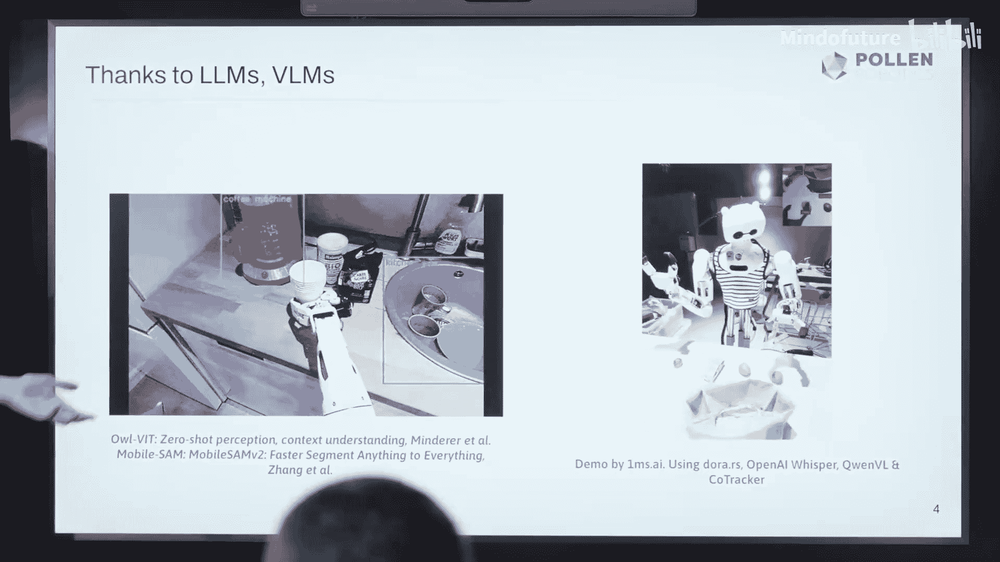
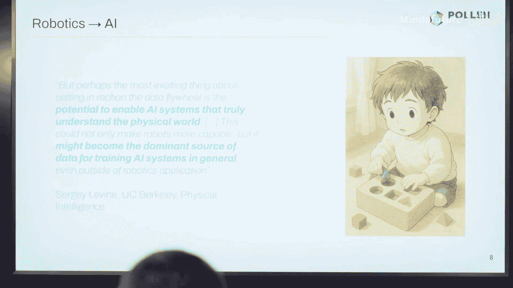

# 002：现实世界机器人学——人工智能的下一个前沿

在本节课中，我们将探讨人工智能与机器人学这两个领域的交汇点。我们将从机器人学的视角出发，了解AI如何推动机器人技术的发展，以及机器人如何为AI系统提供真实世界的测试平台。课程将涵盖机器人学的历史演变、AI带来的关键进步、当前面临的挑战以及面向未来的开源项目。

## 机器人学的演变：从工厂到家庭

上一节我们介绍了课程概述，本节中我们来看看机器人学的发展历程。

在过去的十年左右，机器人学经历了一个重大趋势，即从工厂环境走向更开放的空间。在工厂中，一切都被严格约束和设定。你精确地知道机器人的位置、周围环境以及几乎所有情况。基本上，唯一的交互是当出现异常时，系统会冻结、停止并呼叫工程师来修复程序，然后恢复例行工作。这更像是自动化。

但最近，我们看到了变化。机器人开始进入非结构化环境。然而，我们仍然倾向于让这些环境变得更加可预测。如今，我们看到许多大型研究实验室和公司正致力于将机器人产品推向家庭，使其更具反应性和交互性。

## AI驱动的关键进步

我们见证了机器人领域的巨大进步，这主要归功于人工智能，尤其是在以下两个关键领域。

### 视觉感知

视觉感知对于机器人适应环境至关重要。机器人需要能够检测周围环境，理解上下文以分析情况并采取行动。在这方面，AI模型表现出色。例如，如果你想识别一个“水杯”，它并没有非常特定的形状。水杯有多种形状、纹理，可能位于不同位置。这就需要一种真正的零样本学习方法，能够真正适应眼前的事物。

### 自然语言交互

另一个显著的进步体现在交互方面。如今，我们可以将大语言模型直接连接到机器人，并使用非常自然的提示。例如，你可以给出“抓起你的扳手，把它放进棕色袋子里”这样的指令。LLM可以填补所有其他所需的上下文细节和基本逻辑，以真正执行这个任务。

## 运动控制的突破

我想提到的另一个领域是运动控制，AI在此也带来了巨大进步。大约10年前，运动控制仍被认为极其复杂。但如今我们已经看到了巨大的进展。许多公司和研究机构已经让仿人机器人不仅能行走，还能跑步、跳跃，甚至表演功夫。在我看来，这些进步主要归功于使用了强大的强化学习算法，以及能够紧密模拟机器人内部物理和电机行为的仿真工具。我们正在这个领域努力缩小仿真与现实之间的差距。

需要指出的是，尽管这些运动任务看起来非常复杂和困难，但对于机器人而言，它们实际上是目标明确、功能定义清晰的任务。可以简化为：机器人需要遵循特定的轨迹，并满足一些约束条件，例如保持头部稳定或保持平衡。

## 现实世界操作的挑战

实际上，我们仍在其中挣扎的领域可能令人有些困惑。我的意思是，在座的大多数人都能清理自己的厨房，但我不确定所有人都会功夫。然而对机器人来说，情况恰恰相反。清理厨房在某种意义上实际上是困难得多的任务。

这种任务更加不受控制、更加通用。首先，你需要处理大量的泛化问题。厨房里有许多不同的盘子，它们形状、纹理、重量和物理交互特性都不同。厨房里的所有其他物品配置也略有不同。你所看到的视频是由Physical Intelligence公司制作的最新成果，他们是机器人操作领域的知名机构。他们使用机器人在旧金山的不同公寓中进行训练，以适应不同的配置。但你仍然可以看到，这是一个相当标准化、已经格式化过的厨房。但这正是我们努力的方向，也是我们仍在挣扎的地方。

试图解释为什么这更困难。如果我问房间里的另外五个人来清理厨房，他们可能会提出略有不同的解决方案、略有不同的步骤和执行路径。可能的一个解释是，与运动控制只需要规划未来几步（例如几秒钟）不同，这类任务需要规划更长的时段，比如30秒或1分钟。这正是现有模型仍然面临巨大挑战的地方。

## 数据：核心瓶颈与机遇

可能的主要原因之一是，正如AI在许多重大突破中所经历的那样，我们需要数据。我并不是说这是我们面临的唯一问题，但至少我们可以确定，我们需要更多这类数据。

实际上，我认为这是一种与我们目前拥有的数据不同的数据。这不像仅仅从整个互联网抓取大量视频那么容易。我们可能更需要一种嵌入式的第一人称视角数据，在这种数据中，你真正是试图解决的任务的主体。这类视频应该更具交互性，对环境的反应更灵敏，而不是我们目前使用的更静态的数据集。

我们需要封装这种我们希望更好地理解的世界的物理性和现实性。

因此，你可以看到，在我的幻灯片顶部，是一些人们尝试使用机器人在现场直接收集数据的例子。你可以想象，目前大多数研究机构甚至公司都在购买或组建自己的机器人车队，让它们在现场执行任务并收集数据。

但显然，这种方法的扩展性并不好。尤其是如果我们不确定需要多少这类视频，但很可能需要数百万个，所以这将耗费大量时间且难以实现。因此，也有大量工作集中在仿真上，或者直接使用人类执行任务的视频。但这里又存在仿真到现实世界或人类到机器人的差距，跨越这个差距并不容易，而且我们能否走这条路也不确定。

实际上，目前在这个领域有很多争论。关于数据，你有研究论文指出：“我在整个数据库中使用10%的真实世界机器人数据，我应该使用更多吗？还是应该使用仿真数据？”我认为另一方面，这也是Sage Levin（机器人操作领域的知名研究者）的一句话所表达的观点。其核心思想是：如果我们能够制造出真正以有用方式执行有用任务的机器人，这显然很好，因为它们可以完成任务。但它也可能成为我们获取新型数据的主要方式——那种真正具有交互性、封装了物理性以及我们与世界互动方式的数据。我认为这非常有趣，我想把它放在这里，因为我认为这可能也是AI和机器人学未来更加交叉融合的地方。

## 开源与可及性的重要性

实际上，虽然我不会详细解释为什么我们需要开源解决方案（Matthew在之前的演讲中已经做了很好的阐述），但我认为在谈论机器人学时，这一点尤其重要。因为我们仍然需要硬件才能开始，而硬件可能成本高昂、难以构建或维护，甚至可能具有威胁性。因此，我们确实需要在这个方向上付出大量努力，以便让来自不同领域的许多不同社区和人们都能在这些项目上工作，而不仅仅是机器人实验室或公司。

## 面向未来的开源项目

因此，实际上，我想通过介绍三个主要项目来结束我的演讲。在我看来，这些项目是启动这类进程并朝着这个方向前进的好方法。

以下是三个旨在降低机器人学门槛、促进创新的开源项目：

1.  **LocoManipulator by Locomotion Team**
    这是一个由Locomotion团队制造的灵巧操作机器人。你可能已经看到他们刚刚在走廊里举办了一场黑客松。这个项目的核心理念是任何人都可以购买或自己构建这种机器人。你可以获得设计图，可以用3D打印机自己打印部件，也可以在线订购零件。你拥有所需的所有电机和电子元件的物料清单。它直接兼容你的代码库，并且你可以直接访问最先进的学习算法库。例如，他们有一个教程，展示如何训练你自己的机器人来倒茶。目前，全球已有超过1000人构建了这种机器人并贡献了他们的数据集。

2.  **Mini-Dog by Open Dynamic Robot Initiative**
    另一个项目思路类似，但更侧重于运动控制，由在场的Wenxuan发起。我之前提到过运动控制，但你可以想象，大型仿人机器人仍然相当昂贵、复杂、易损坏甚至危险，尽管它们功能强大。这个项目的核心理念是构建一个低成本、任何人都可以接触和构建的东西。因此，他设计出了这个机器人，其灵感来自迪士尼的机器人。再次强调，其理念是让任何人都能开始训练自己的机器人，并开始复现研究结果，以更好地理解如何为商业应用训练机器人。他们还花了大量时间研究仿真到现实的迁移，这对于那些行为可能相当随机（或者至少更难预测）且随时间变化的模块化机器人尤其关键。他们致力于更好地理解这一点，并拥有接近现实的仿真环境。实际上，你在幻灯片左侧看到的是在真实Mini-Dog机器人上运行的策略与在仿真中运行的策略的对比。

3.  **从设计到部署的自动化流程**
    他们希望更进一步。其理念是：好的，我们有了这个机器人，可以训练它工作。但如果你想构建自己的机器人、自己的设计呢？我们如何建立从基本构思到设计，再到仿真，最后到真实机器人的流程？我们如何使这个过程尽可能简单和快速，以便你可以迭代尝试新事物，并拥有多种多样的机器人来测试算法？

## 总结

本节课中，我们一起学习了人工智能与机器人学的交叉领域。我们回顾了机器人学从结构化工厂环境向非结构化家庭环境的发展历程。我们探讨了AI在视觉感知、自然语言交互和运动控制方面为机器人带来的关键进步。同时，我们也认识到，在需要长时程规划和高度泛化的复杂现实世界操作任务中，机器人仍然面临巨大挑战，而高质量、交互式的第一人称视角数据是突破这些瓶颈的关键。最后，我们介绍了三个重要的开源机器人项目，它们通过降低硬件和软件门槛，致力于让更广泛的社区能够参与进来，共同推动AI与机器人学的融合与创新。开源和可及性对于加速这一领域的进步至关重要。

如果你对这些项目感兴趣，可以在整个会议期间看到Mini-Dog机器人。Charlotte今天下午也将做一个关于如何使用LLM通过情感让这个机器人更具表现力的演讲。你可以在Discord等平台上找到所有这些项目的详细信息。如果你有任何问题，欢迎提出。