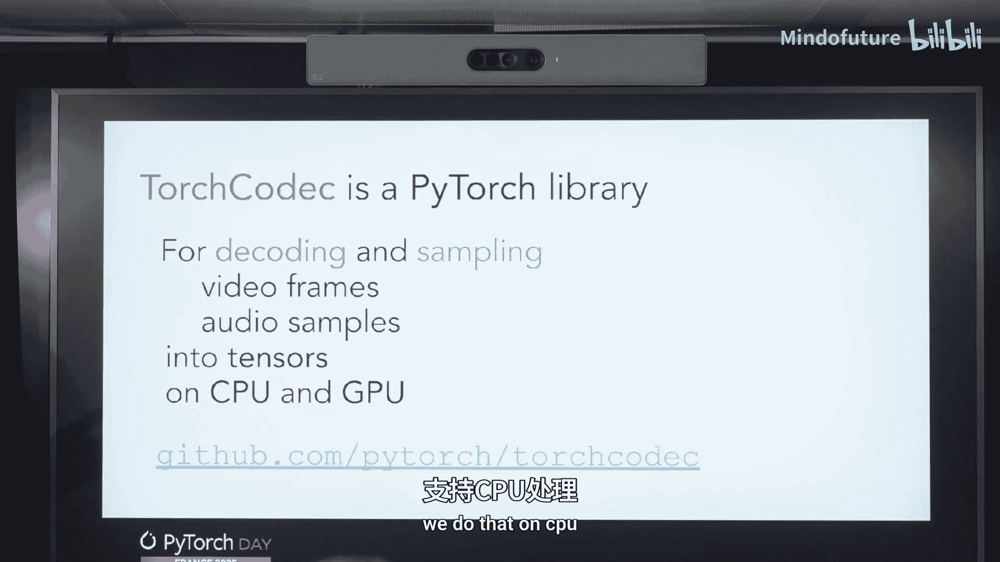
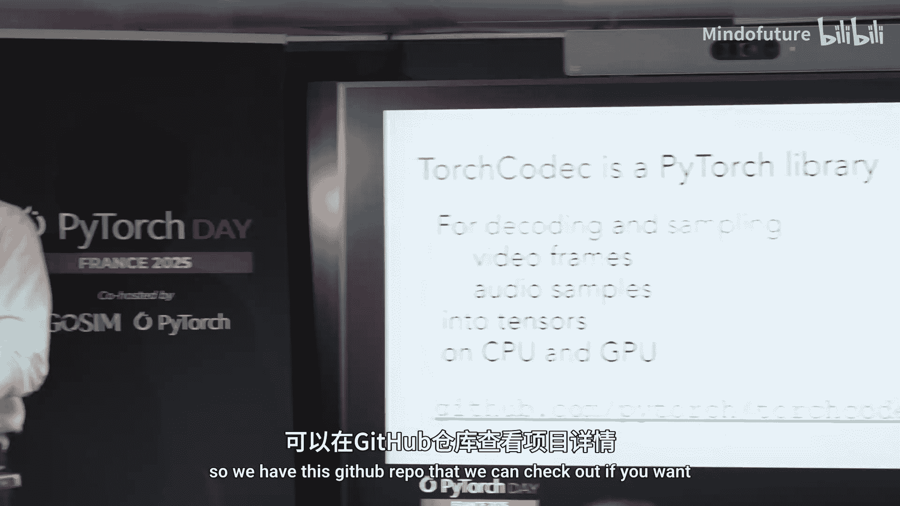
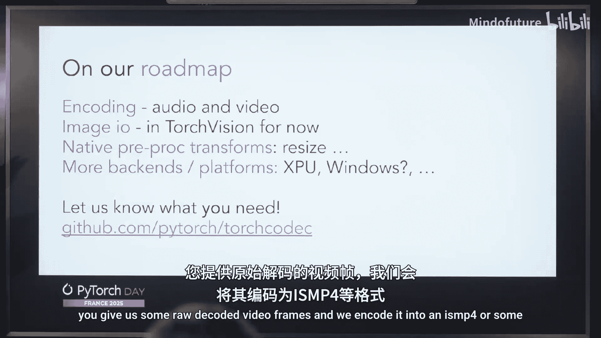
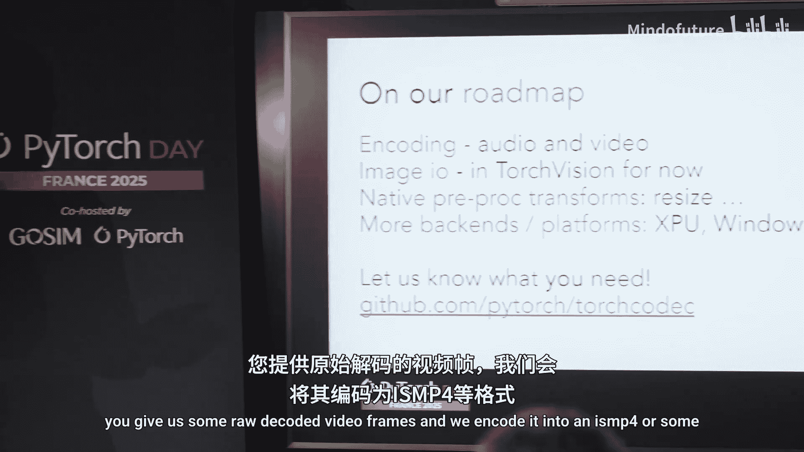

# 003：TorchCodec - PyTorch 的媒体解码库

在本教程中，我们将学习 PyTorch Codec，这是一个用于解码视频和音频数据的 PyTorch 库。我们将了解其核心功能、使用方法以及性能优化技巧。

## 概述





大家好，我是 Nicolas，是 Meta 伦敦 PO 团队的一名软件工程师。我主要负责 TorchVision 的维护与开发。近期，我致力于开发 Torch Codec，这是 PyTorch 全新的媒体编解码库。本次教程将介绍这个库。

Torch Codec 是一个 PyTorch 库，专注于解码和编码媒体数据。目前我们主要支持解码功能，编码功能正在开发中。它的作用是解码视频和音频数据，无论是本地文件、网络 URL 还是其他来源，最终都能输出为 PyTorch 张量。

我们支持在 CPU 和 GPU 上进行解码。我们的目标是易于使用，主要面向机器学习工程师。用户无需了解解码的内部原理，就能轻松获取所需数据。同时，我们也注重安装的便捷性，避免用户从源码构建的麻烦。此外，我们追求高速解码，并确保与 PyTorch 生态系统（如 TorchVision 和 TorchAudio）无缝集成。

Torch Codec 底层封装了 FFmpeg 库，我们将其复杂性抽象出来，为用户提供了一个简洁、符合 Python 习惯的接口。

## 核心功能与代码示例

接下来，我们将通过一些代码片段来展示 Torch Codec 的各项功能。所有示例均可在我们的在线教程中找到。

### 视频解码器对象

使用 Torch Codec 进行视频解码时，主要交互对象是 `VideoDecoder`。你可以通过传入视频文件路径或 URL 来实例化它，并指定在 CPU 还是 GPU 上进行解码。

```python
import torchcodec

# 实例化视频解码器，可指定设备
decoder = torchcodec.VideoDecoder("video.mp4", device="cuda:0")
```

实例化后，你可以获取视频的元数据。这些信息可能来自视频文件头，也可能由 Torch Codec 通过分析计算得出，以确保准确性。

```python
metadata = decoder.metadata
```

### 获取视频帧

获取视频帧非常简单，可以直接对解码器对象进行索引或切片操作，就像操作列表一样。输出是一个 PyTorch 张量，其形状为 `[通道数, 高度, 宽度]`。

```python
# 获取第一帧（张量）
first_frame_tensor = decoder[0]
```

如果你需要更多关于帧的信息（如显示时间戳），可以使用 `get_frame_at` 方法。它会返回一个包含张量数据和元数据的 `Frame` 对象。

```python
# 获取第一帧（Frame对象）
first_frame = decoder.get_frame_at(0)
frame_data = first_frame.data  # 张量数据
pts = first_frame.pts          # 显示时间戳
duration = first_frame.duration # 帧持续时间
```

### 批量解码帧

为了提高性能，解码多帧时不应循环调用单个帧的获取方法。我们提供了 `get_frames_at` 方法用于批量解码，它会返回一个批处理版本的 `FrameBatch` 对象。

```python
# 批量获取第0, 10, 20帧
indices = [0, 10, 20]
frame_batch = decoder.get_frames_at(indices)
# frame_batch.data 的形状为 [3, C, H, W]
# frame_batch.pts 是一个包含3个时间戳的张量
```

### 基于时间的API

除了基于帧索引的API，我们还提供了基于时间（秒）的API，方便你根据时间点获取帧。

```python
# 获取视频第1.0秒到第2.0秒之间的所有帧
frames = decoder.get_frames_between(1.0, 2.0)
```

### 视频片段（Clip）采样

在训练机器学习模型时，通常需要输入按时间顺序排列的帧序列，我们称之为“片段”。Torch Codec 提供了灵活的采样器来生成这些片段。

以下是获取随机时间点起始片段的示例：

```python
# 随机采样3个片段，每个片段包含2帧，帧间隔为3秒
clips = decoder.get_clips_at_random_timestamps(
    num_clips=3,
    frames_per_clip=2,
    frame_step=3.0  # 秒
)
# clips.data 的形状为 [3, 2, C, H, W]
```

我们也支持按固定间隔采样的片段采样器，并且所有采样器都同时提供基于时间和基于索引的版本。

## 性能优化技巧

默认情况下，实例化 `VideoDecoder` 时会执行一次视频“扫描”。这个过程并非完全解码视频，而是读取数据包以计算准确的元数据并建立关键帧索引，从而确保定位帧时的精确性。

虽然扫描开销不是特别大，但它与视频长度成线性关系。在某些情况下，你可以通过启用“近似模式”来跳过此扫描，从而显著加快解码器的实例化速度。

```python
# 使用近似模式，跳过初始扫描以提升速度（可能牺牲少量定位精度）
decoder_fast = torchcodec.VideoDecoder("video.mp4", precise=False)
```

在随机采样等场景下，微小的定位误差通常是可以接受的，因此我们推荐在一般情况下使用近似模式。

## 高级功能

### 流式处理与自定义数据源

除了本地文件和URL，你还可以传递任何具有 `read` 和 `seek` 方法的 Python 对象（即类文件对象）给 Torch Codec。

```python
import fsspec

# 使用 fsspec 创建类文件对象，支持从S3、HTTP等流式读取
file_obj = fsspec.open("s3://my-bucket/video.mp4").open()
decoder_stream = torchcodec.VideoDecoder(file_obj)
```

这种方式非常有用，因为它允许你在 `read` 方法中实现自定义逻辑，例如仅下载视频中你感兴趣的部分，而不是整个文件，从而节省带宽和时间。

### 音频解码

Torch Codec 同样支持音频解码，其接口与视频解码高度一致。

```python
# 实例化音频解码器
audio_decoder = torchcodec.AudioDecoder("audio.mp3")
# 获取元数据
audio_metadata = audio_decoder.metadata
# 获取所有音频样本（张量）
all_samples = audio_decoder[:]
# 或获取特定时间范围的样本
some_samples = audio_decoder.get_samples_between(10.0, 20.0)
```

音频解码没有“扫描”步骤，因此实例化速度很快。

## 迁移与未来规划

### 从旧库迁移



TorchVision 和 TorchAudio 中旧的视频/音频解码器 API 已被弃用，并计划在 2025 年底移除。如果你正在使用它们，现在应该开始迁移到 Torch Codec。



目前，TorchVision 中的图像解码器暂时安全，但未来也可能整合到 Torch Codec 中，以实现编解码功能的统一。

### 开发路线图

我们的未来计划包括：
1.  **实现编码功能**：将解码后的视频帧重新编码为视频文件。
2.  **集成预处理**：探索在解码器内部直接执行缩放、裁剪等预处理操作的可能性，这可能会比解码后再调用变换函数更高效。我们将谨慎设计此功能，以确保训练和推理阶段处理方式的一致性，避免结果出现偏差。
3.  **支持更多后端**：我们正在努力增加更多硬件后端支持，例如集成 DirectShow 以更好地支持 Windows 平台。

## 总结

本节课我们一起学习了 PyTorch Codec 媒体解码库。我们了解了它的设计目标：易用、易安装、快速且与 PyTorch 生态无缝集成。我们通过代码示例学习了如何使用 `VideoDecoder` 和 `AudioDecoder` 对象来解码媒体、获取元数据、批量处理帧以及进行灵活的片段采样。我们还探讨了使用“近似模式”来优化性能的技巧，以及如何通过类文件对象支持流式处理和自定义数据源。最后，我们了解了从旧API迁移的必要性以及库未来的发展方向。

如果你有任何功能需求或问题，欢迎在 GitHub 上提交 issue。