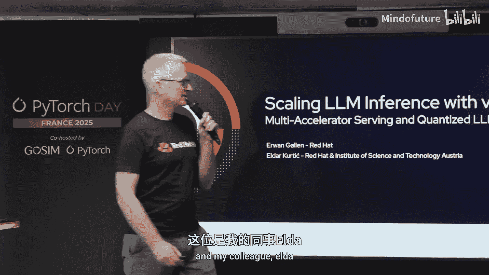
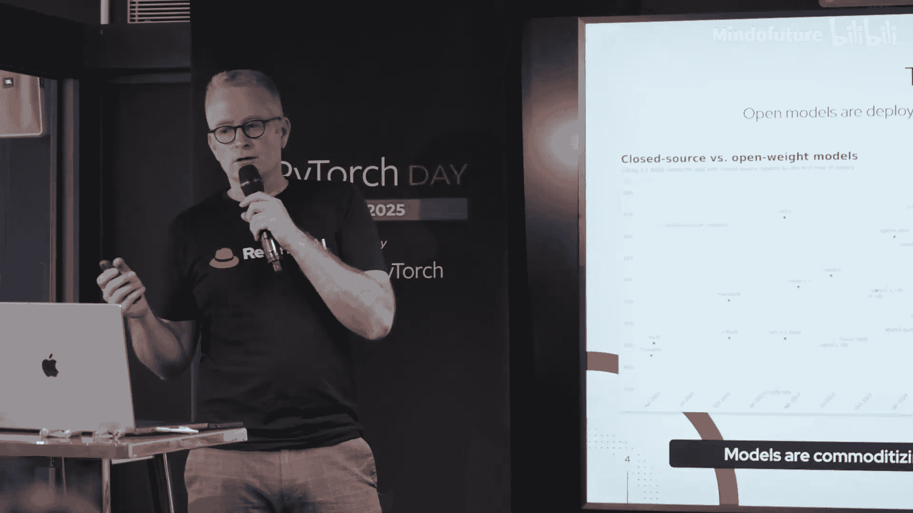
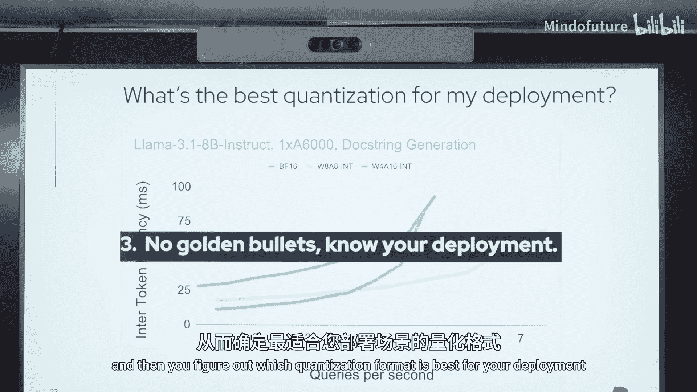

# 004：扩展与量化实践 🚀



在本教程中，我们将学习如何使用 vLLM 来扩展大语言模型的推理能力。我们将探讨如何利用多加速器进行扩展，以及如何通过量化技术来优化模型部署。内容涵盖 vLLM 的核心优势、多种并行技术以及量化模型的选择与评估。

---

## 概述 📋

大家好，今天我们将讨论如何使用 vLLM 来扩展大语言模型的推理。我们将探讨如何利用多个加速器进行扩展，以及如何在大型平台上进行扩展。首先，让我们快速介绍一下自己。

我是 Red Hat 的产品经理，负责跟踪所有 Red Hat 产品的开发。我们关注开发平台，也与其他平台合作，因此我们今天在这里讨论。




大家好，我叫 Alda，是 Red Hat 和奥地利科学研究所的研究员。我主要研究量化领域。

## 开源大语言模型的崛起 🌟

世界在 2022 年发生了变化。当 OpenAI 发布 GPT 时，世界开始关注生成式人工智能。对于公司和开源社区来说，OpenAI 的模型通过扩展数据集大小和参数数量，在流行系统和软件系统方面取得了巨大成功，使得开源模型难以与之竞争。

但在开源社区和优秀贡献者的努力下，情况发生了变化。2022 年，我们没有开源模型，因此无法与任何创意模型竞争。然而，Meta 的团队开始推出开源模型，许多法国团队也参与其中，这些模型在基准测试中表现越来越好。

今天，如果我们关注这些进展，开源模型在能力方面已经可以与闭源模型竞争。Meta 的 Llama 模型可以与最好的闭源模型竞争。


开源平台也得到了广泛应用。PyTorch 是这些平台的基础。同时，vLLM 也崭露头角。Hugging Face 创建的 TGI 在初期被广泛使用，而 vLLM 正逐渐成为推理平台的事实标准。它提供了先进的算法，可以从单服务器扩展到大规模数据中心环境，适用于任何用例。

在初期，TensorRT-LLM 引擎限制了所有开源模型的性能，但现在它可以与 TensorRT-LLM 竞争，成为任何替代方法的比较基准。

vLLM 易于使用。通过 vLLM，你可以直接下载模型。下载量惊人，平均每天达到 10 万次，上个月某些日子甚至达到 30 万次。Python 库也是如此，因此它被广泛使用。公司可以在这里贡献和合作。例如，Llama 4 在发布第一天就得到了支持，这就是为什么我们在社区中工作，并在新模型发布前 10 天收到通知。

此外，vLLM 提供了 OpenAI 兼容的 API，因此很容易与代理或现有平台集成。vLLM 是 GLM 的重要贡献者。Magic 是 GLM 的早期贡献者之一，该项目由 UC Berkeley 创建，现在我们是 GLM 的第一贡献者。

## vLLM 的核心优势 💪

vLLM 的一个关键优势是与垂直加速器的集成。它不仅仅局限于一种特定技术，而是支持任何模型和任何加速器。我们为这些加速器提供了不同级别的支持，但真正的优势在于开放性和贡献。许多公司和加速器都参与其中，例如 NVIDIA 的 H100 和 AMD 的 GPUs。

最近在 Google Next 大会上，我们的同事宣布了 Red Hat 对 Google TPU 集成的贡献。许多贡献者通过插件机制轻松集成加速器，支持多个加速器。

## 如何使用 vLLM 进行扩展 📈

作为用户，你可以在笔记本电脑上使用 vLLM，也可以在云上使用，甚至可以添加自己的加速器。但对于最近的模型来说，一个模型可能无法完全适配一个 GPU。因此，我们需要使用量化技术，并探讨如何从单设备扩展到多设备。

对于每种场景，vLLM 都可以扩展，并提供更高的计算能力和内存容量。但当你扩展到多设备和多节点时，硬件要求也会增加。例如，GPU 之间的网络连接和内存带宽会成为瓶颈。扩展需要平台具备额外的能力。

### 从单 GPU 扩展到多 GPU

vLLM 集成的一种关键技术是张量并行算法。张量并行允许在多个 GPU 上分割权重。这样，vLLM 就不需要加载全部数据，从而可以扩展并加载大型模型。

以下是张量并行的基本公式：

```
output = split(weight) * input
```

它提供了优化的实现，适用于输入和输出的水平分割。当设备数量较少时，这种方法效果很好，例如经典的边缘服务器。

### 扩展到多节点

当你想要扩展到多个节点时，除了张量并行，还需要使用流水线并行技术。在这种情况下，你将使用点对点通信，而不是扩展通信。每个 GPU 可以处理一定数量的层，从而连接这些层并允许更多的 GPU 参与。

在 vLLM 中实现这一点，你需要使用 Ray 进行通信共享，并使用流水线并行来运行。你可以通过设置 `pipeline_parallel_size` 参数来混合多个并行技术。

### 专家混合模型

我们还广泛使用专家混合模型。与分割层或复制层不同，vLLM 提供了一种机制，可以在每个设备或 GPU 上分配特定的专家模型。通过这种技术，你可以将特定的计算分配给正确的设备。然而，专家之间的平衡可能很复杂，但你可以混合使用这些技术。许多最近的模型已经使用了专家混合。

## 量化实践 🔧

接下来，我们将讨论量化实践。标准的量化生命周期在实践中应该如下所示。

基本上，当你想部署一个模型时，可以采取两种路径。第一种是从 Hugging Face 获取模型，然后通过 LM Compressor 进行量化。LM Compressor 是一个实现了最先进量化算法的库，支持不同的量化方案。这应该是一个迭代过程：量化模型、评估准确性、如果不满意则重复此过程。

或者，你可以使用像 Red Hat Model Zoo 这样的平台，它包含超过 400 个量化模型，并且我们每天都在积极发布新模型。

一旦你对量化模型的准确性满意，就需要对模型的推理性能进行基准测试，以了解量化带来的收益。这里我展示了 KLLF，这是我们的库，用于在部署上模拟真实工作负载。它与 vLLM、TGI 和其他 OpenAI 兼容库兼容。

在这里，你可以看到延迟如何变化，以及在不同负载下的吞吐量表现。一旦你满意，就可以部署模型，例如在 vLLM 中。

### 量化的三个关键要点

今天，关于量化，我想分享三个主要要点。

1. **并非所有量化模型都是相同的**：量化在过去一年中变得非常流行，许多模型出现在 Hugging Face 上。但不幸的是，量化因此获得了一些不好的声誉，因为大多数模型没有经过适当的评估。例如，用户可能会看到 FP8 量化模型的准确性比未量化基线低 5 个百分点，这导致社区对量化模型在实际部署中的采用产生了怀疑。

   我的意思是，当我们应用特定的量化格式时，有无数不同的选择，从使用哪种格式、如何应用、使用哪种算法，到是静态量化还是动态量化，是否使用校准数据，使用哪种观察器，以及量化的粒度等等。这促使我们启动了一个名为 “Give me BF16 or give me that” 的项目。我们量化了所有流行模型，从解码器模型到 MoE 模型，模型大小从 11B 到 671B 不等，并将它们量化为三种不同格式：FP8、INT8 和 INT4。我们通过适当的校准调优，获得了满意的准确性恢复。

   我们发现，当校准调优适当时，INT8 和 FP8 量化模型的准确性恢复率可以达到 98% 到 99%，而 INT4 模型的恢复率在 95% 到 99% 之间，通常取决于模型的大小。非常小的模型通常在 95% 到 96% 的恢复范围内，而更大的模型则更容易恢复。

2. **量化为我们提供了改进 LLM 部署质量的新途径**：在学术环境中，我们通常设计新的量化算法，并始终关注相对于未量化模型的准确性恢复。这是一个完美的公平设置，用于比较不同算法。

   然而，在现实世界中，我们主要问自己的问题是：**给定我的部署约束，我可以部署的最佳模型是什么？** 通常，主要的部署约束是我们可以为该应用程序分配的 GPU 内存量。

   例如，假设我们的部署目标有 14GB 的 GPU 内存。在没有量化的情况下，我们可以部署的最佳模型是 7B 模型，其准确性得分为 65。但量化使我们能够部署更大的模型，例如 14B 模型。原始未量化的 14B 模型占用 28GB 内存，但通过 8 位量化，我们可以将其减少到 14GB 以内。这样，我们可以享受更高的准确性，即使相对于未量化模型损失了一两个百分点，但仍然比小的未量化模型好得多。

3. **没有通用的最佳量化格式**：当我们对量化模型的准确性满意时，下一个问题是：**对于我的特定部署和特定目的，最佳的量化格式是什么？** 这里我们展示了交互延迟如何随着每秒查询数的变化而变化。我们在单个 A6000 GPU 上测试了 Llama 8B 模型，并观察了三种不同的量化格式：BF16（未量化基线）、INT8 权重和激活量化、以及 INT4 权重量化。

   有三个主要观察点：
   - 当每秒查询数少于 4 次时，最佳的量化格式是 INT4，因为它提供了最低的延迟。
   - 一旦达到每秒 4 次查询以上，我们就从内存带宽限制转变为计算限制。在这种情况下，仅权重量化不是最佳选择，INT8 权重和激活量化成为更好的选择。
   - 最后，当我们进一步增加每秒查询数时，在某些情况下，量化模型的性能可能比未量化基线更差。这主要是因为在这种情况下，我们严重受限于计算能力，而权重量化并不能改善这一点，反而需要支付额外的量化成本。

   因此，最后的结论是：**没有通用的最佳解决方案**。你应该了解你的部署情况，并通过使用 Gu LLM 或其他库来自动化这个过程，从而找到最适合你部署的量化格式。



## 总结 🎯

在本教程中，我们一起学习了如何使用 vLLM 扩展大语言模型的推理能力。我们探讨了 vLLM 的核心优势，包括其开放性和多加速器支持。我们还深入讨论了多种并行技术，如张量并行、流水线并行和专家混合模型，以及如何通过这些技术实现从单设备到多设备的扩展。


此外，我们详细介绍了量化实践，包括量化模型的评估和选择。我们强调了并非所有量化模型都是相同的，量化可以为我们提供部署更大模型的机会，并且没有通用的最佳量化格式，需要根据具体部署情况选择。

最后，我们提供了一些资源链接，如 LM Compressor、Gu LLM、Ray 和 vLLM，帮助你进一步探索和实践。希望本教程对你有所帮助，祝你在扩展和优化大语言模型推理的旅程中取得成功！