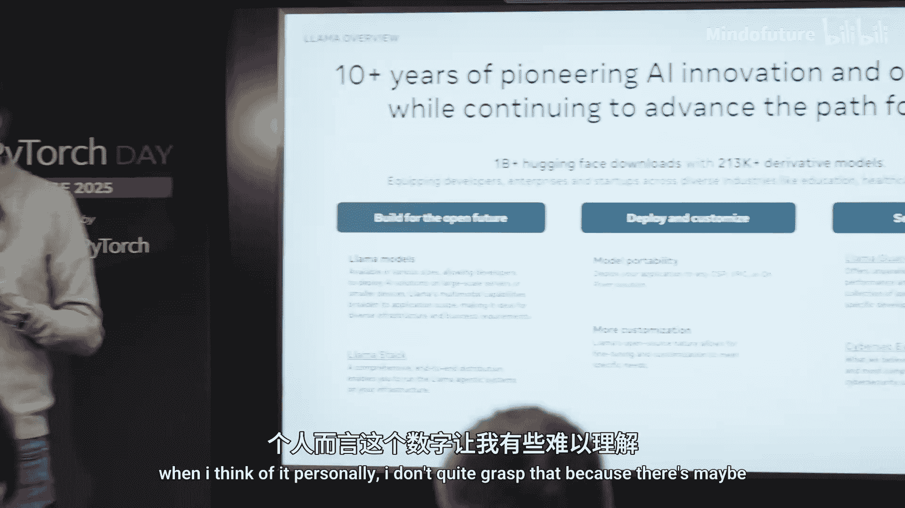
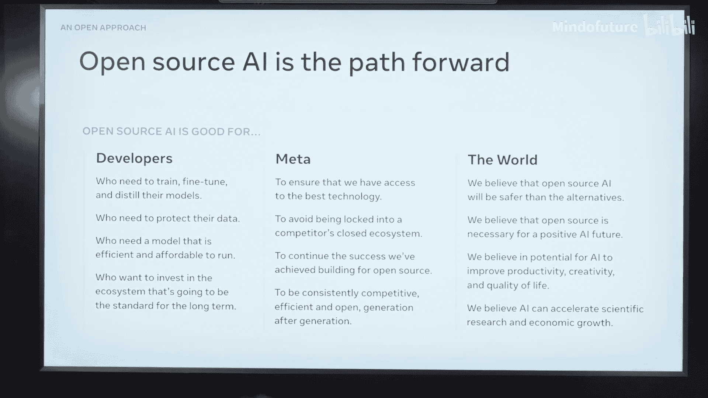
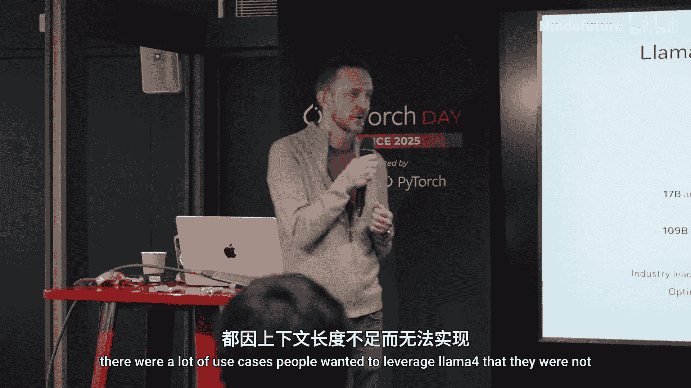
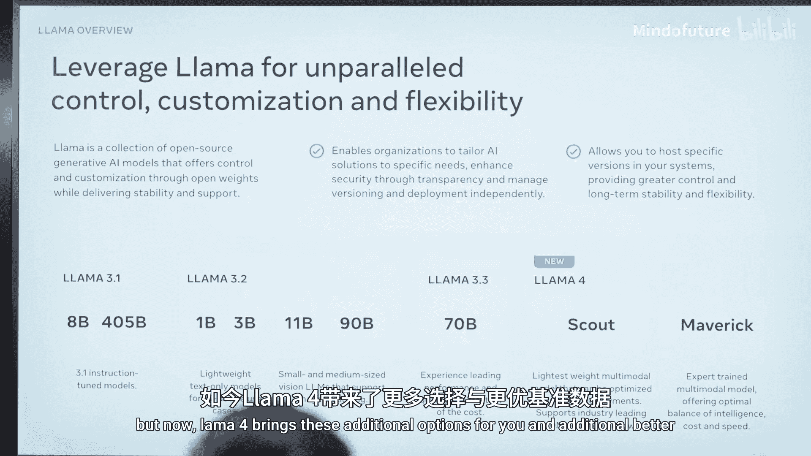
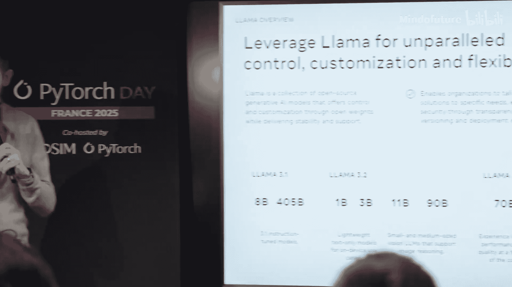
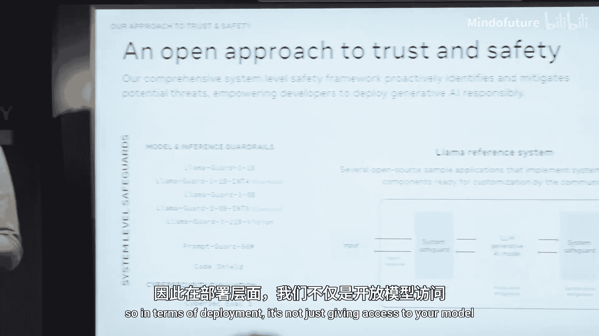

# 005：Llama 4 模型介绍与生态应用 🦙

在本节课中，我们将学习 Meta 最新发布的大语言模型 Llama 4 系列，了解其核心特性、技术栈构成、应用场景以及如何负责任地构建 AI 应用。

大家好，我是 Christian。我在 Meta 工作了六年，之前在美国，现在在巴黎。我曾在 PyTorch 团队工作，后来领导了 Llama 的发布。目前，我在 Meta 的基础人工智能研究实验室担任产品经理，专注于世界模型的研究。今天，我们将聚焦于 Llama。

---

## 大语言模型的崛起与未来

上一节我们介绍了背景，本节中我们来看看大语言模型的现状。大语言模型正在改变世界，每个人都在讨论它。AI 被集成到许多产品中，从创意工具到广告，无论是图像生成还是文本处理。

AI 不仅仅是生成式模型，它最初也用于图像分类和推荐系统等。生成式 AI 现在占据了主导地位。我们的目标是让这些模型“思考”得更好，朝着通用人工智能迈进。Llama 4 虽然不是通用人工智能，但它是迈向该目标的一步。

---

## Llama 的发展历程与社区影响



很多人不知道的是，Llama 1 和 Llama 2 是在巴黎的办公室构建的。我个人参与了 Llama 3 的工作。Llama 3 的发布是我们表明要在这个领域认真竞争的方式，特别是拥有 4500 亿参数的 Llama 3.1 模型。去年年底，我们发布了 Llama 3.3，成功地将 Llama 3.1 的很多能力压缩到了一个 700 亿参数的模型中。

创新有两种形式：一是提升模型的能力以解锁新应用；二是提高效率，降低成本，从而让更多用例在经济上可行。

今年四月，我们发布了 Llama 4 系列的前两个模型：Llama 4 Sc 和 Llama 4 Maverick。

Llama 在 Hugging Face 上的下载量已超过 10 亿次。这背后是一个活跃的社区，有超过 20 万个基于 Llama 构建的衍生模型。Llama 的力量不仅在于模型本身，还在于其完整的生态栈、灵活的部署选项以及围绕它构建的工具。

---

## Llama 的核心优势与应用场景

以下是 Llama 模型的主要优势：

*   **功能强大且灵活**：可用于翻译、内容创作、教育等多种任务。
*   **可随处部署**：无论是在本地环境还是在云端，这增强了对数据和隐私的控制。
*   **丰富的生态系统**：社区构建了大量工具，用于连接和改进智能体行为。
*   **易于定制**：产品经理等非专业研究人员也可以使用 PyTorch 等工具进行微调。
*   **掌控未来技术栈**：允许围绕模型构建完整的技术栈，并随模型更新而演进。

---

## Llama 技术栈与开发工具



Llama 技术栈是一个抽象层，旨在让开发者的生活更轻松。它连接了不同的部署方式、硬件后端和云服务提供商。

以下是两个关键的 PyTorch 工具示例：

1.  **TorchTune**：这是一个用于微调 Llama 模型的工具。例如，你可以使用它来微调 Llama 3.1，有详细的教程指导整个过程。
    ```python
    # 示例：使用 TorchTune 微调 Llama 的伪代码框架
    from torchtune import Recipe, Config
    recipe = Recipe.from_config(Config.from_yaml(“llama_finetune_config.yaml”))
    recipe.run()
    ```

2.  **Executorch**：这是我个人很关注的项目，它允许你将 Llama 或其他模型部署在边缘设备上。我们为 Executorch 提供了优化版的 Llama，能以极低的开销在各种目标设备上运行。

---

## Llama 4 系列模型详解

现在，让我们深入了解 Llama 4 系列模型。我们发布了两个模型：Llama 4 Sc 和 Llama 4 Maverick。

它们引入了几项创新：
*   **混合专家模型**：它们在任意时刻激活使用 170 亿参数，总共有 128 个专家。
*   **超长上下文**：Llama 4 Sc 拥有 1000 万的上下文长度，足以加载整个代码库进行处理。
*   **原生多模态**：能够理解和处理图像及文本输入。
*   **多语言支持**：支持 12 种语言，性能优于以往。
*   **高性价比**：Llama 4 Sc 可以运行在单个 NVIDIA H100 GPU 上，降低了基础设施门槛。

选择模型时，没有万能方案。对于许多用例，参数更少的密集模型如 Llama 3 70B 可能更易于部署。Llama 4 则提供了更多选项和更强的基准测试表现。



以下是 Llama 4 的核心特性总结：
*   **模型类型**：混合专家模型。
*   **核心特性**：原生多模态、超长上下文窗口、图像理解、多语言支持、更低成本下的卓越性能。

在评估模型时，建议不要只看所有基准测试，而是找到最能代表你目标任务的基准，并以此为依据进行选择和后续微调。

---





## 负责任的人工智能与安全部署

由于我们开源模型，无法在 API 层面控制使用，因此构建全流程的安全机制至关重要。

我们提供了 **Llama Guard** 工具。Llama Guard 是一个被微调为分类器的 Llama 模型，用于判断内容是否安全。

一个典型的负责任部署系统流程如下：
1.  用户输入首先经过 **Llama Guard** 进行风险分类。
2.  根据分类结果，决定是否将输入发送给主 LLM 模型。
3.  模型在调用外部工具（如数据库）前，会再次经过安全检查。
4.  模型的输出在返回给用户前，也会经过内容适当性检查。

我们为不同用例（视觉模型、纯文本等）提供了不同版本的 Llama Guard。Meta 在负责任 AI 领域已有超过十年的研究积累，我们发起了 AI 联盟，并为每个模型发布系统卡片，详细说明安全措施。网上也有相关的教育资源。

---

## 总结与资源

本节课中，我们一起学习了 Llama 4 系列模型的核心特性、其强大的开源生态与技术栈、以及如何利用工具进行模型定制和安全部署。Llama 不仅仅是一个模型，它是一个包含工具、社区和最佳实践的完整平台，旨在赋能开发者和研究者构建下一代 AI 应用。



如果你想了解更多关于 Llama 的信息，可以扫描相关二维码访问我们的资源页面。

---
**本节课中我们一起学习了：**
1.  Llama 模型的发展历程与社区影响力。
2.  Llama 4 Sc 和 Maverick 模型的核心技术创新（混合专家、长上下文、多模态）。
3.  Llama 技术栈及其关键工具（如 TorchTune, Executorch）。
4.  如何负责任地部署 AI 系统，并利用 Llama Guard 构建安全护栏。