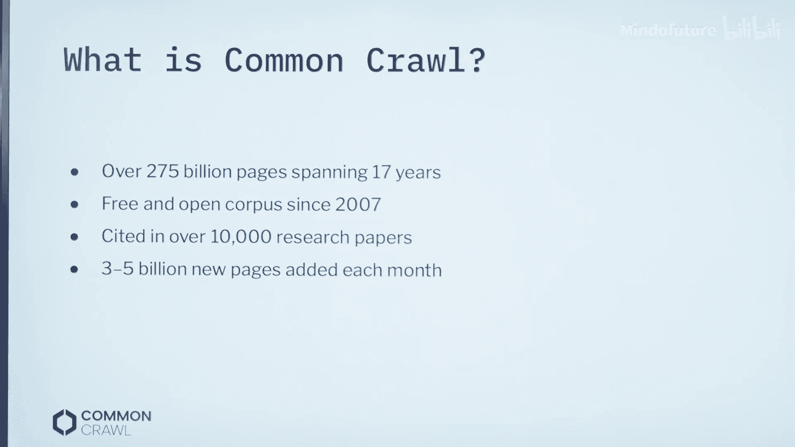
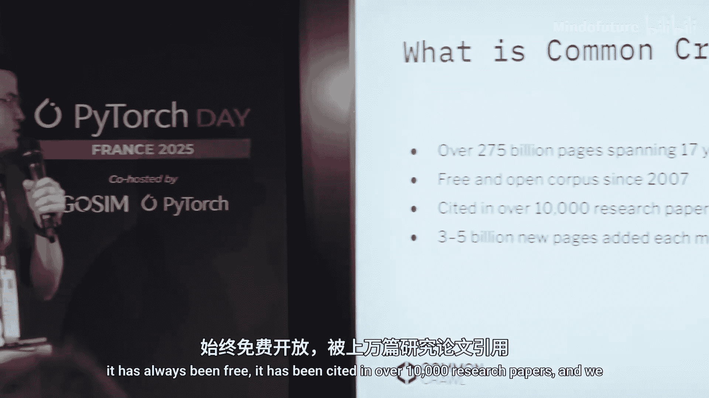
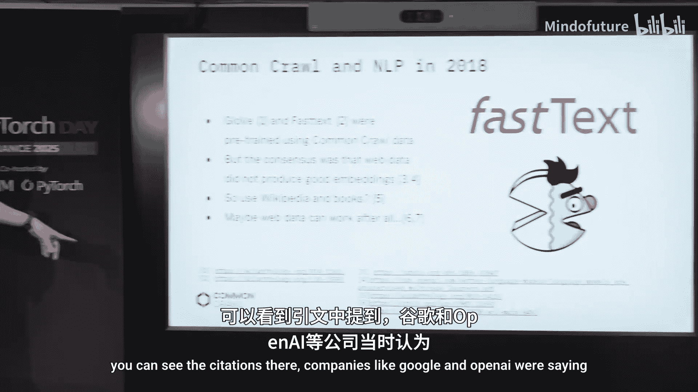
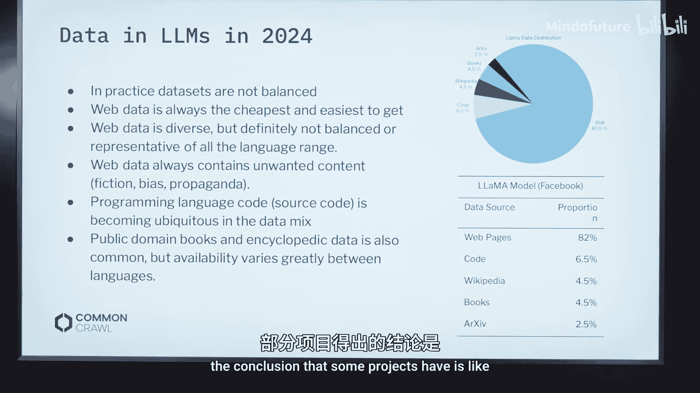
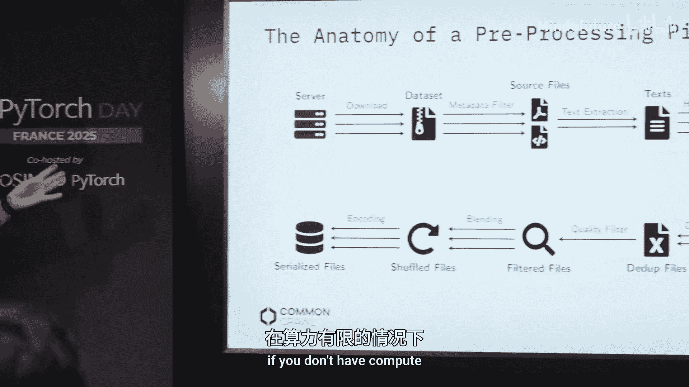
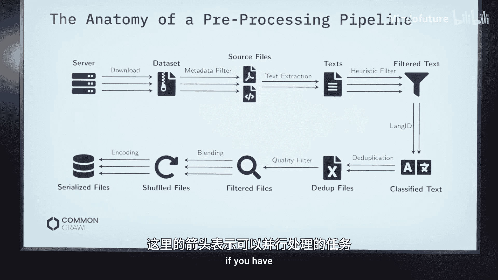

# 006：数据处理与社区倡议

在本节课中，我们将学习如何利用 Common Crawl 这一庞大的网络爬取数据集来支持 AI 和机器学习项目。我们将了解 Common Crawl 的基本情况、其在 AI 领域的应用、数据处理流程，以及如何参与社区倡议来改善数据覆盖。

## 概述

Common Crawl 是一个非营利性基金会，致力于提供免费、开放的网络爬取数据。它已持续运行超过 17 年，累积了约 2750 亿个网页，被超过 10,000 篇研究论文引用。该数据集每月更新，是当前预训练大型语言模型的主要数据来源之一。

## Common Crawl 简介

Common Crawl 始于 2007 年，最初旨在服务于研究和搜索引擎索引。如今，随着大型语言模型的兴起，它已成为预训练模型的关键数据基础。

截至 2024 年底，Common Crawl 已发布超过 100 次爬取数据，总量超过 9 PB。数据可以通过 AWS S3 存储桶或 HTTPS 免费获取。

数据以三种主要格式发布：
*   **WARC 文件**：包含原始的 HTML 文件。
*   **WET 文件**：包含从 HTML 中提取的纯文本。
*   **WAT 文件**：包含元数据和链接信息，对于构建多模态数据集（如图像数据集）非常有用。

Common Crawl 遵循机器人排除协议，并每月生成一个网络图，可供用户使用。为了方便下载，项目还提供了一个专用的客户端工具。

## 爬取工作原理与责任

Common Crawl 使用基于 Apache Nutch 的开源爬虫进行工作。其流程始于一个种子 URL 列表，通过跟踪链接发现更多内容。爬取过程会使用“调和中心性”等指标对网页进行排名，并始终尊重网站的 `robots.txt` 规则。

上一节我们介绍了 Common Crawl 的基本情况，本节中我们来看看其运作原则。负责任地爬取网络并非易事，Common Crawl 秉持以下原则：
*   尊重 `robots.txt` 规则。
*   响应删除和法律请求。
*   缓慢爬取，避免对网站造成过大负担。

Common Crawl 鼓励研究者和开发者使用其现有数据，而非自行进行大规模爬取，并正在与国际组织合作，探索为 AI 训练数据引入偏好信号的新标准。

## Common Crawl 在 AI 领域的应用

在大型语言模型兴起之前，Common Crawl 已被用于词嵌入项目。一个有趣的转折是，在 2018 年左右，一些公司曾认为网络数据过于嘈杂，不适合训练 LLM。然而，Meta 公司的 RoBERTa 和 CamemBERT 等项目证明了网络数据的价值，它能提供丰富的语言风格和用例覆盖。

目前，主流大型语言模型的训练数据中，约有 80% 来源于网络数据。但需要指出的是，网络数据应作为基础，还需要补充书籍、学术论文等来源，以确保数据的语言多样性和质量。

## 数据处理流程

了解了 Common Crawl 的应用价值后，我们来看看如何处理这些海量数据。一个高效的数据处理管道至关重要，尤其是当计算资源有限时。

以下是构建处理管道的核心思路：优先进行可并行化且成本较低的操作，以尽早过滤掉大量数据；将不可并行或计算成本高昂的操作（如复杂的质量过滤）放在流程末尾，从而减少需要昂贵处理的数据量。

一个典型的数据处理管道可能包括以下步骤（顺序可调整以优化资源）：
1.  **文本提取**：从 WARC 或 WET 文件中提取原始文本。
2.  **基础过滤**：进行去重、语言识别、移除低质量文本（如导航栏、模板文字）等操作。
3.  **文档质量评估**：使用启发式方法或机器学习模型评估文档的整体信息量和可读性。
4.  **内容质量过滤**：应用更复杂的过滤器，例如基于教育价值或特定领域质量的筛选（此步骤通常计算成本较高）。

## 利用网络图进行排名

除了内容处理，Common Crawl 还提供了一项未被充分利用的资源：网络图及基于此的域名排名。

网络图可以计算每个节点（如域名）的“调和中心性”。其公式简单表示为：

`HC(v) = sum( 1 / distance(v, u) )` （对于图中所有其他节点 u）

其中，`distance(v, u)` 是节点 v 到节点 u 的最短路径距离。孤立节点的调和中心性为 0。这个指标衡量了一个节点在网络中的连接重要性。

你可以在数据处理管道的后期，利用 Common Crawl 提供的域名排名信息，对你筛选后的文档进行优先级排序，从而为模型训练选择更重要的内容。

## 社区倡议：改善语言覆盖

最后，我们关注一个关键挑战：语言覆盖。当前的语言识别工具在干净数据上表现良好，但在论坛、社交媒体等嘈杂的网络文本上性能会显著下降。

为了改善非主流语言的数据覆盖，Common Crawl 推动了两项社区倡议：
*   **网络语言项目**：邀请用户提交其常用语言网站的 URL，以丰富爬虫的种子列表。
*   **LangID 项目**：提供一个众包平台，让用户帮助标注文本片段的语言，以此生成高质量的训练数据来改进语言识别模型。

这对于推动英语之外的语言 AI 技术发展至关重要。

## 总结

本节课中我们一起学习了 Common Crawl 数据集及其在 AI 领域的核心作用。我们了解了如何获取其数据、构建高效的处理管道以应对海量数据挑战，并探索了利用网络图排名和参与社区倡议来进一步提升数据质量与多样性的方法。对于希望利用真实网络数据开展 AI 研究的开发者和研究者而言，Common Crawl 是一个不可或缺的宝贵资源。