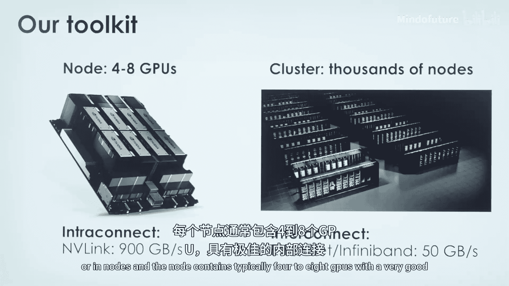
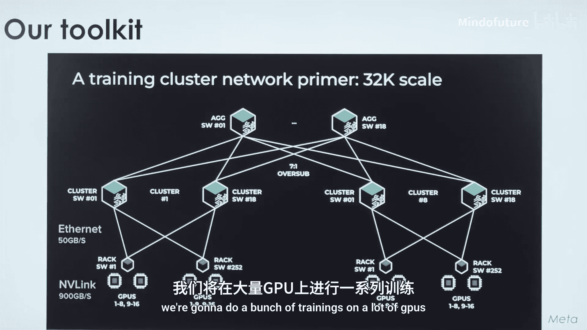
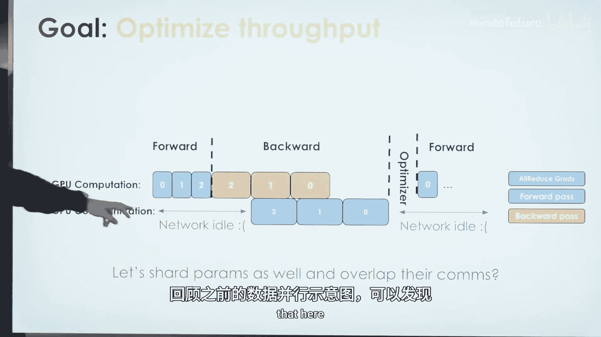
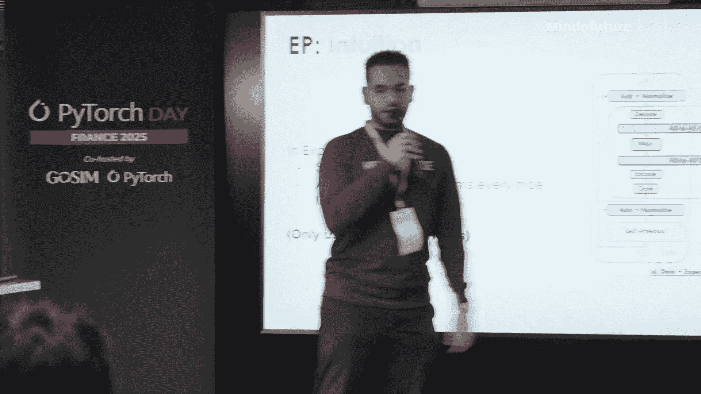
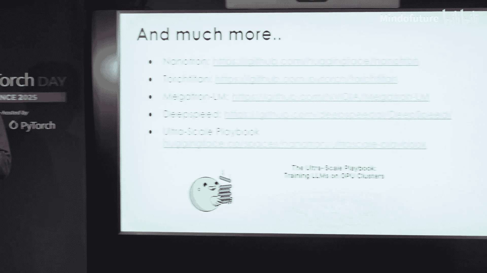

# 007：超大规模训练——在数千个GPU上进行扩展 🚀

在本节课中，我们将学习如何将大语言模型的训练扩展到数千个GPU上。我们将探讨数据并行、张量并行、流水线并行和专家并行这四种核心并行策略，理解它们如何协同工作以克服内存、计算和通信的限制，从而实现高效的大规模训练。

## 集群硬件基础 🖥️

上一节我们介绍了课程目标，本节中我们来看看训练所依赖的硬件环境。在集群中，我们使用GPU进行工作。这些GPU通常以节点为单位组织，每个节点包含四到八个GPU，它们之间通过高速内部互连（如NVLink）连接。多个节点则通过速度较慢的网络（如以太网）连接成一个集群。这种速度差异意味着我们需要高效地利用内部互连进行通信。

以下是硬件架构的关键点：
*   节点包含4-8个GPU，内部通过高速互连。
*   节点之间通过速度较慢的网络（如以太网）连接。
*   通信策略必须考虑这种带宽差异，以优化训练效率。

## 从单GPU到数据并行 📈

在单GPU上训练模型的过程很简单：前向传播、反向传播、计算梯度，然后执行优化器步骤来更新模型。当处理大批量数据时，由于无法一次性将整个批次放入GPU内存，我们会使用梯度累积，即分多个小步骤顺序执行前向和反向传播。

既然数据批次是独立的，为什么不在多个GPU上并行处理呢？这就是数据并行的核心思想。我们将不同的数据批次分配给不同的GPU，让它们并行执行前向和反向传播，然后通过通信同步梯度，确保所有GPU上的模型保持一致。

其计算-通信流程如下：每个GPU独立完成前向和反向传播，然后进入一个同步梯度的通信步骤。在这个过程中，GPU在通信阶段会处于空闲状态。为了充分利用GPU，理想情况是在进行计算的同时进行网络通信。PyTorch的DDP（分布式数据并行）通过其分桶系统，巧妙地实现了反向传播与梯度同步的重叠，从而减少了GPU的空闲时间。

既然DDP效果很好，为什么不能简单地使用与GPU数量相同的数据并行规模来加速所有训练呢？这引出了第一个限制：我们需要满足全局批次大小的要求。研究表明，如果用于每次优化器更新的全局批次过大，会因更新次数减少而影响模型性能。通常，训练会使用一个相对较小的批次大小（例如百万token级别）。因此，如果设置了32K的批次大小，却使用32，000个GPU进行纯数据并行，会迅速超过这个全局批次大小限制，损害性能。

另一个限制是，数据并行假设整个模型可以放入单个GPU。以Llama 3 70B模型为例，它需要约140GB内存，无法加载到单个GPU中。此外，可用的GPU数量本身也是一个限制。

因此，我们的目标是高效利用可用GPU，尽可能快地训练。这需要优化吞吐量。回顾之前的数据并行示意图，我们发现网络有时处于空闲。一个想法是：能否在计算的同时进行通信？

## 全分片数据并行与模型分片 🧩

上一节我们看到了数据并行的通信瓶颈，本节中我们来看看如何通过分片模型参数来进一步优化。为什么不将模型参数分片，并尝试在前向传播过程中就重叠通信呢？这就是FSDP（完全分片数据并行）所做的。

FSDP将模型参数分片。例如，当需要执行模型某部分的前向传播时，我们会预取该部分所需的参数。通过这种方式，我们可以在前向和反向传播中实现计算与通信的良好重叠。集群保持高效工作，因为GPU一直在忙碌。

然而，FSDP仍然受限于数据并行的扩展性。如果我们拥有大量GPU，不能仅仅依赖FSDP。另一个问题是，当我们使用一种并行形式（如DDP或FSDP）时，通信可能会穿过节点，从而无法高效利用节点内的高速NVLink连接。例如，如果我们有8个GPU进行张量并行，那么这8个GPU会高效使用NVLink，而集群的其他部分则使用较慢的以太网。既然为整个集群付费，我们希望充分利用每一部分资源。

## 张量并行：分割计算负载 ⚖️

这就引出了第二种并行形式：张量并行。其背后的直觉是，矩阵乘法可以在维度上进行分割。对于两个矩阵的乘法同样成立。每个GPU持有部分权重，并且只执行部分计算，但处理相同的数据。这就是TP的巧妙之处：数据并行是分割数据，而张量并行可以使用相同的数据，通过分割计算来分布计算负载。

但TP在每次前向和反向传播内部都有一个关键的、必须进行的同步通信。这意味着，如果不完成同步，就无法继续前向传播。因此，TP需要非常高的内部互联带宽。TP的优点在于可以分片模型、分布计算负载（特别是在计算密集的注意力层和FFN层），帮助克服模型无法放入单卡的限制，但它对互联带宽要求很高。

## 序列并行与流水线并行 🔄

第三种并行是序列并行，当需要扩展序列长度时使用。显然，更长的序列会占用更多内存。CP所做的是沿着序列维度分割数据。例如，用128K上下文长度训练时，就沿着这个维度分片。

在Transformer中，需要看到完整序列的模块是注意力机制。因此，我们需要调整注意力层的计算，这意味着在每个注意力层都需要进行通信。同时，由于每个GPU看到的是序列的不同部分，在反向传播时需要同步梯度。通过预取机制，序列并行中的计算也可以很好地重叠。

接下来是流水线并行。其背后的思想是，Transformer有很多层，我们可以沿着层数进行分片。假设一个模型有四层，我们将每一层放在一个GPU上。我们有一些数据批次，从第一个批次开始，在第一层GPU上前向传播，然后将激活值发送到第二层GPU，以此类推。反向传播过程类似。

PP的问题是存在较大的“流水线气泡”，导致某些GPU处于空闲状态。为了解决这个问题，DeepSpeed提出了一个非常精巧的流水线调度器，称为“1F1B”（一次前向对应一次反向）调度。通过这种调度，GPU的空闲时间几乎被消除，每个GPU都能高效工作。

## 专家并行与总结 📊

最后是专家并行，它用于混合专家模型。在MoE中，有多个专家网络，路由器会将不同的token分发到对应的专家。如果专家被分片到不同设备上，路由器就需要将token发送到正确的设备，这涉及`all-to-all`通信。在专家计算完成后，结果也需要通过另一次`all-to-all`通信收集回来。因此，EP只在MoE层增加通信，并且专用于MoE模型训练。当然，DeepSpeed也提供了高效的EP实现，能很好地重叠计算与通信。

总而言之，我们制作了一个很好的图表来总结所有并行策略，清晰地展示了在哪些环节会发生通信（例如，序列并行影响注意力层，专家并行影响MoE层），以及这些通信影响的是参数还是激活值。我们还制作了一个速查表，包含了我们进行训练时的配置推荐。更多细节可以在torch.distributed文档和DeepSpeed中找到。

最后，当我们将训练扩展到数千个GPU时，必须意识到其能源影响，并负责任地使用它们。我们的目标就是尽可能高效地使用所有GPU进行训练，尽可能快地完成训练，以避免能源浪费。

本节课中我们一起学习了四种关键的分布式训练并行策略：数据并行、张量并行、流水线并行和专家并行。我们了解了它们如何解决内存、计算和通信的挑战，以及如何根据硬件特性和模型结构组合使用这些策略，以在数千个GPU上实现高效的大规模模型训练。