# 008：使用PyTorch与NVIDIA对Mistral进行后训练以增强推理能力 🧠

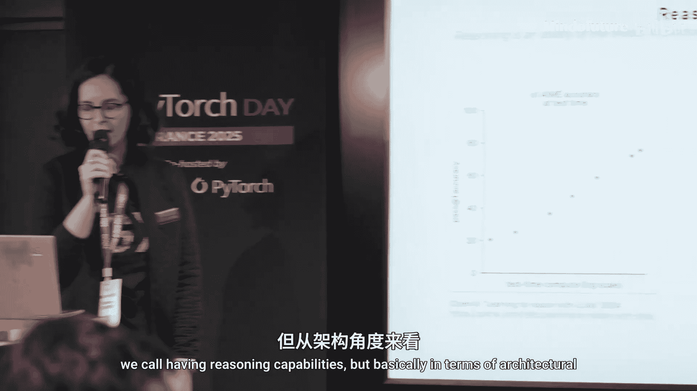

在本节课中，我们将学习如何通过后训练技术为大型语言模型（LLM）添加推理能力。我们将以Llama和Mistral模型为例，介绍从数据生成、监督微调到强化学习的完整流程，并了解NVIDIA在此领域的最新贡献。

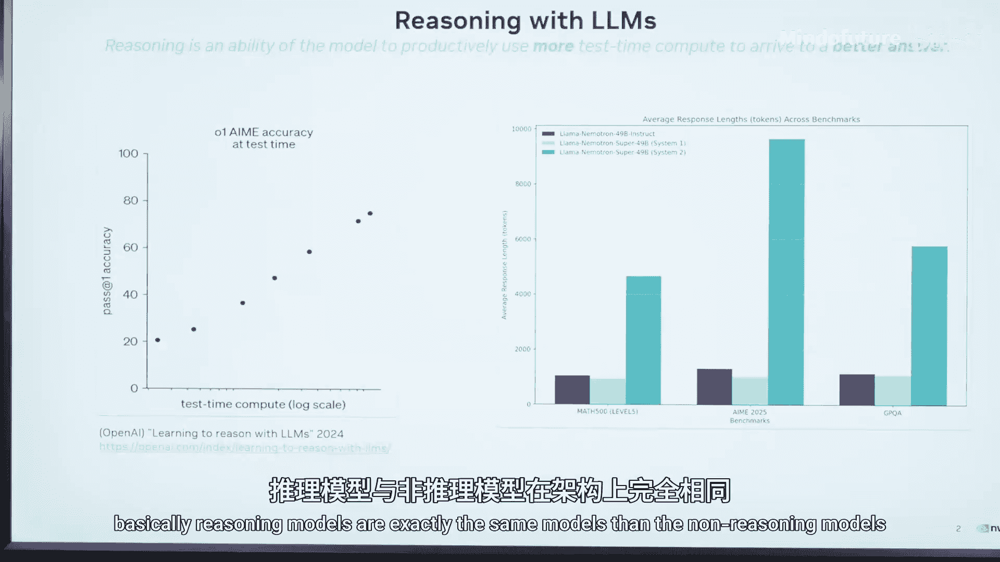

## 什么是推理模型？🤔

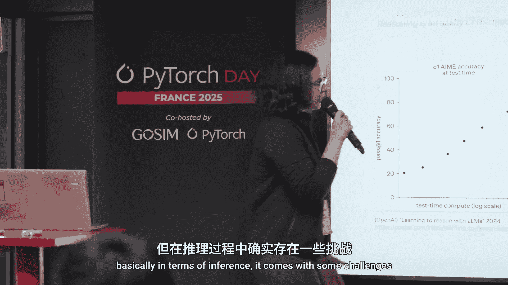

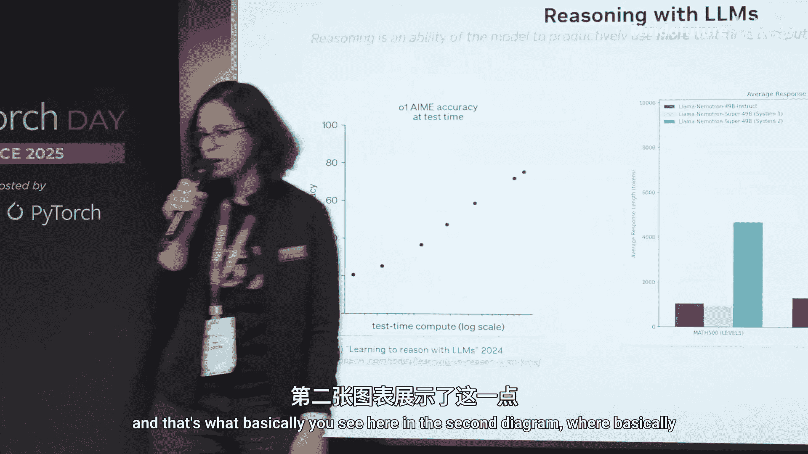

上一节我们介绍了课程概述，本节中我们来看看什么是推理模型。

从架构角度看，具备推理能力的模型与不具备推理能力的模型完全相同，它们很可能都是基于Transformer架构的。两者的区别在于，推理模型能够利用所谓的“测试时间计算”在回答问题前进行“思考”。

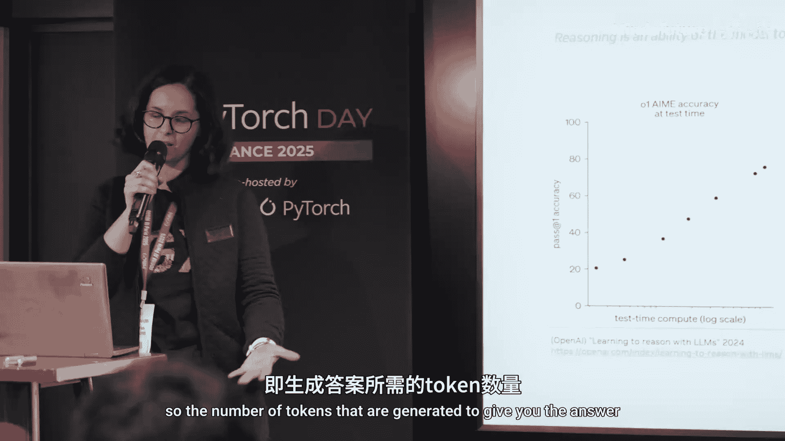

例如，OpenAI的o1模型在解决数学难题等复杂任务时，如果给予更多“思考”时间，其准确率会显著提升。这就是推理模型的核心特征。

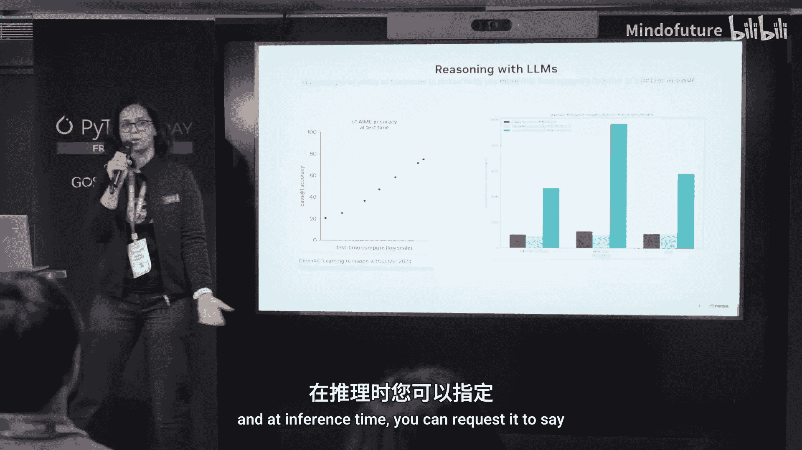

然而，这种能力也带来了挑战。在推理时，模型需要生成更多的中间“思考”令牌，这直接增加了推理时间和计算成本。

以下是推理开启与关闭时，模型生成令牌数量的对比示意图：

```
推理开启 (System 2): 生成大量“思考”令牌 + 最终答案令牌
推理关闭 (System 1): 直接生成最终答案令牌
```

## 推理模型的应用与挑战 ⚙️

上一节我们了解了推理模型的基本概念，本节中我们来看看它的具体应用和面临的挑战。

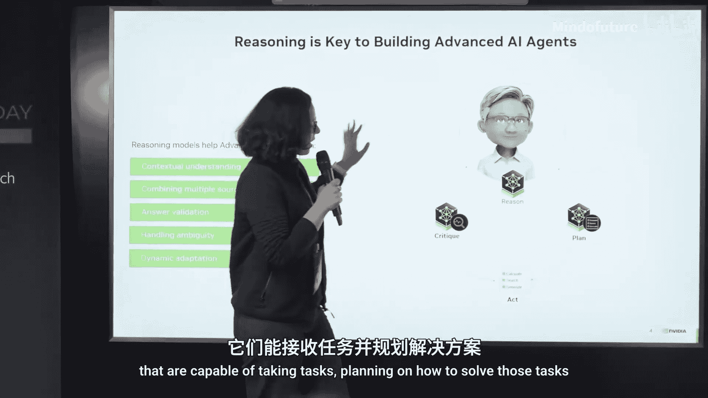

推理模型在智能体（Agent）AI的开发中大有可为。一个先进的AI智能体系统通常能够：接收任务、规划解决方案、调用工具（如计算器、搜索引擎）、执行行动，并在最终输出前对方案进行自我评估与修正。

我们认为，推理模型可以在多个方面助力智能体AI的发展：
*   **整合刚性数据源**：帮助模型理解和融合来自不同结构化数据源的信息。
*   **答案验证**：在输出前对生成的答案进行逻辑检查和验证。
*   **处理模糊性**：当用户指令不明确时，通过推理来澄清意图，这是最常见的应用之一。
*   **动态适应**：在执行任务循环中，当接收到新信息时，能够灵活调整计划。

## 大语言模型后训练技术概览 🛠️

在深入如何添加推理能力之前，我们需要先了解对大语言模型进行后训练的三种主要技术家族。

以下是三种核心的后训练算法：
1.  **持续预训练**：在基础模型上，使用无监督数据继续以“预测下一个令牌”为目标进行训练。这种方法通常用于向模型中注入特定领域的知识。例如，NVIDIA的ChipNeMo项目就是对Llama模型进行持续预训练，以融入芯片设计知识。
2.  **监督微调**：在预训练或持续预训练之后，使用带有输入-输出对的数据集对模型进行训练。这常用于为模型注入诸如遵循指令、理解对话、以及我们今天重点关注的**推理能力**等技能。
3.  **强化学习**：使用奖励函数来调整模型，使其输出与人类偏好或其他特定目标对齐。PPO（近端策略优化）和GRPO（梯度奖励策略优化）是常用的算法。

## 为模型注入推理能力 🧪

上一节我们介绍了通用的后训练技术，本节中我们具体看看如何利用这些技术为模型添加推理能力。

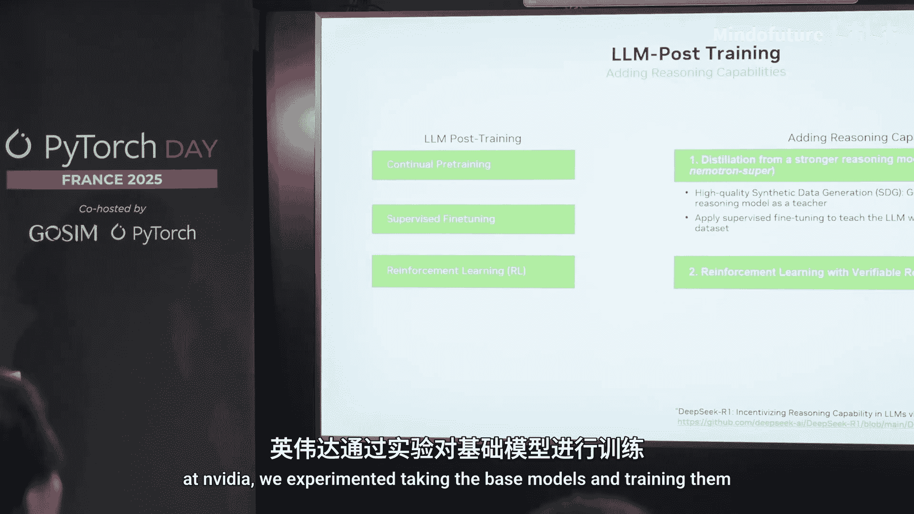

目前，主要有两种思路为LLM（尤其是较小模型）添加推理能力：

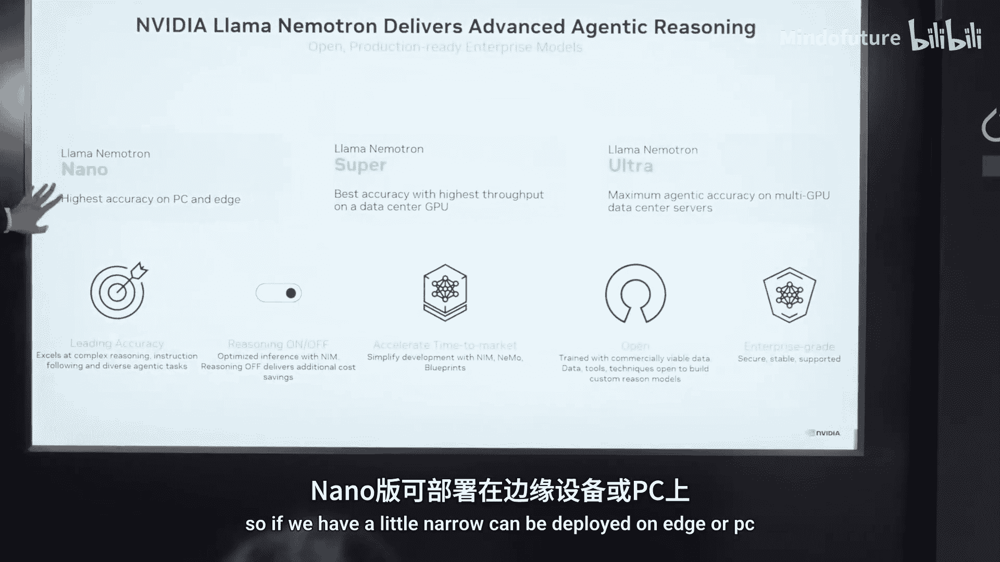

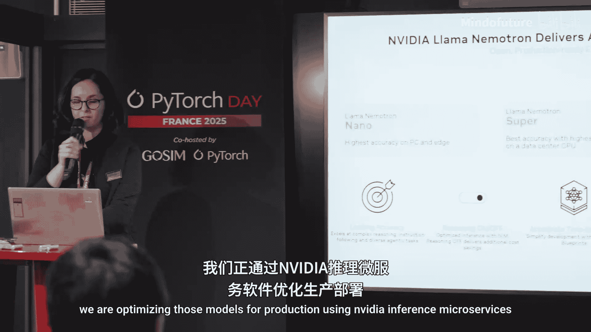

**方法一：从强推理模型进行知识蒸馏**
利用GPT-4或Llama 3.1 405B等拥有强大推理能力且许可较宽松的模型，生成高质量的推理过程数据集（合成数据）。然后，使用这些数据以**监督微调**的方式训练较小的模型。

**方法二：使用带虚拟奖励的强化学习**
不依赖外部强模型，而是通过设计奖励函数，在强化学习框架下直接训练模型学会推理。

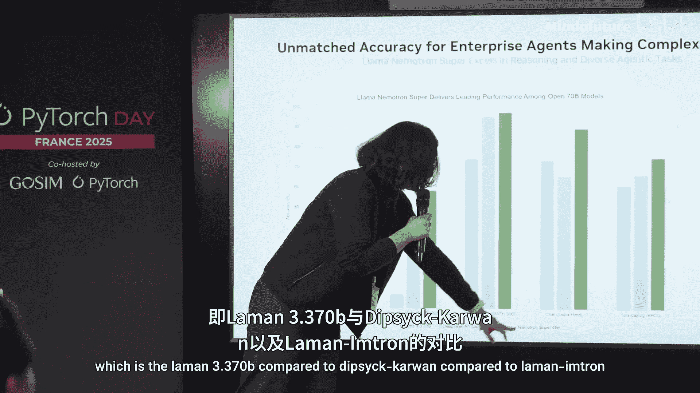

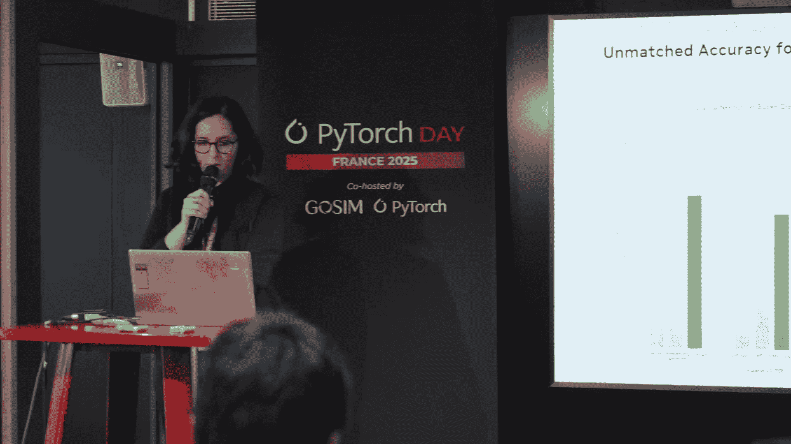

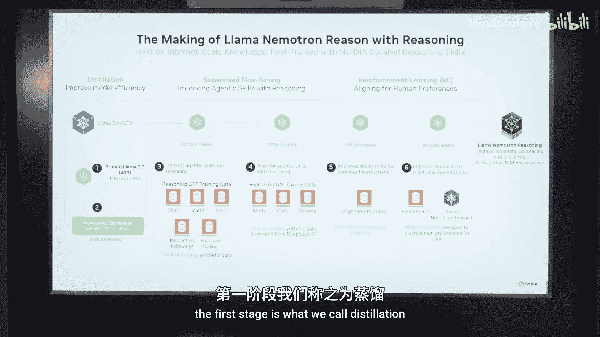

NVIDIA基于这些方法，研发并开源了**Llama-NeMo**模型家族。该家族包含三个尺寸的模型：
*   **Nano (8B)**：可部署在边缘设备或PC上。
*   **Super (40B)**：针对单颗H100 GPU推理进行优化。
*   **Ultra (405B)**：需要多颗GPU进行部署。

这些模型的关键特点是：**同一个模型在推理时，可以按需开启或关闭推理模式**。对于简单问题，可以关闭推理以提升速度；对于复杂问题，则开启推理以获得更准确的答案。

## Llama-NeMo模型的构建流程 🏗️

那么，像Llama-NeMo这样的模型是如何构建的呢？其流程主要分为三个阶段。

以下是构建Llama-NeMo模型的三个阶段：
1.  **蒸馏与剪枝**：从更大的模型（如Llama 3.1 405B）出发，通过神经架构搜索等技术进行剪枝，得到一个参数更少（如40B）但能力相近的“瘦身”模型。随后进行持续预训练以恢复可能损失的能力。此时模型尚无推理能力。
2.  **大规模监督微调**：使用合成数据集对模型进行监督微调。数据集涵盖数学、代码、科学、对话等多个领域，且每个领域都包含“推理开启”和“推理关闭”两种模式的数据。这一步为模型注入了核心的推理能力。
3.  **强化学习对齐**：分两步进行。首先，使用强化学习提升模型遵循指令的能力。然后，使用特定的奖励函数来增强模型的对话安全性和有用性。最后，使用NVIDIA NIM微服务对模型进行生产环境优化。

整个流程中使用的代码、技术和数据均已开源。

## 实战：为Mistral模型添加推理能力 💻

理论需要实践来验证。最后，我们通过一个实际案例，看看如何使用NVIDIA NeMo框架为Mistral 7B模型添加推理能力。

我们基于DeepSeek-R1论文中的方法，将其适配到Mistral模型上。以下是核心步骤的代码片段概览：

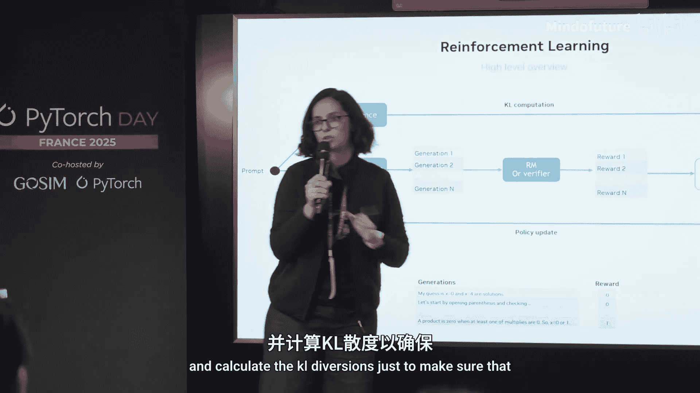

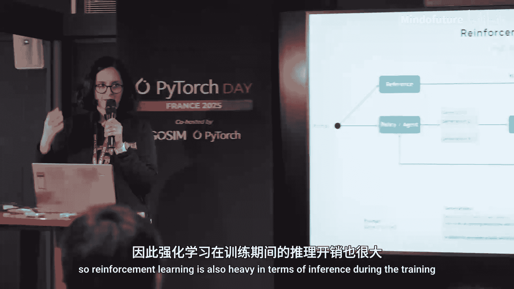

首先，下载并准备Mistral 7B模型。
```python
# 示例：使用NeMo工具加载模型
from nemo.collections.nlp.models import GPTModel
model = GPTModel.restore_from(‘mistral-7b.nemo’)
```

其次，准备用于微调的推理数据集。数据集中包含“思考开始”、“思考结束”、“答案开始”、“答案结束”等特殊标记来构建推理链。
```python
# 数据格式示例
{
  “instruction”: “单词‘strawberry’中有几个‘r’？”,
  “reasoning”: “<|begin_of_thought|>我们需要数一数‘strawberry’中的字母‘r’。单词是 s-t-r-a-w-b-e-r-r-y。从前往后数：第3个字母是r，第8个字母是r，第9个字母也是r。等等，再确认一下：s,t,R,a,w,b,e,R,R,y。所以是第3、8、9位，总共3个r。<|end_of_thought|>”,
  “answer”: “<|begin_of_answer|>3<|end_of_answer|>”
}
```

接着，使用NeMo框架对模型进行监督微调。
```python
# 启动微调任务 (简化示意)
python finetune_mistral_reasoning.py \
  --model-config mistral_7b.yaml \
  --dataset reasoning_data.jsonl \
  --output-dir ./mistral-7b-reasoning
```

最后，对微调前后的模型进行对比评估。例如，向原始模型提问“1.19和1.111哪个大？”，它可能直接错误地回答“1.111”。而经过推理训练的模型则会先进行逻辑思考：“比较小数时，先对齐位数：1.190 vs 1.111。从高位比起，十分位1=1，百分位9>1，所以1.19更大”，然后给出正确答案“1.19”。

## 总结与要点 📝

本节课中我们一起学习了为大型语言模型添加推理能力的完整路径。

主要收获如下：
*   **监督微调是关键**：在高质量合成数据上进行监督微调，是向较小模型注入推理能力的一种有效且相对直接的方法。
*   **强化学习用于突破**：若想使模型的推理能力超越其“教师模型”，则需要借助强化学习技术。
*   **多阶段训练策略**：为了均衡提升模型在不同领域（如指令遵循、代码、数学）的推理能力，通常需要设计包含多个阶段（SFT、RL）的训练流程。
*   **灵活部署**：像Llama-NeMo这样的模型实现了“按需推理”，允许在应用层面根据查询复杂度动态切换模式，平衡性能与精度。

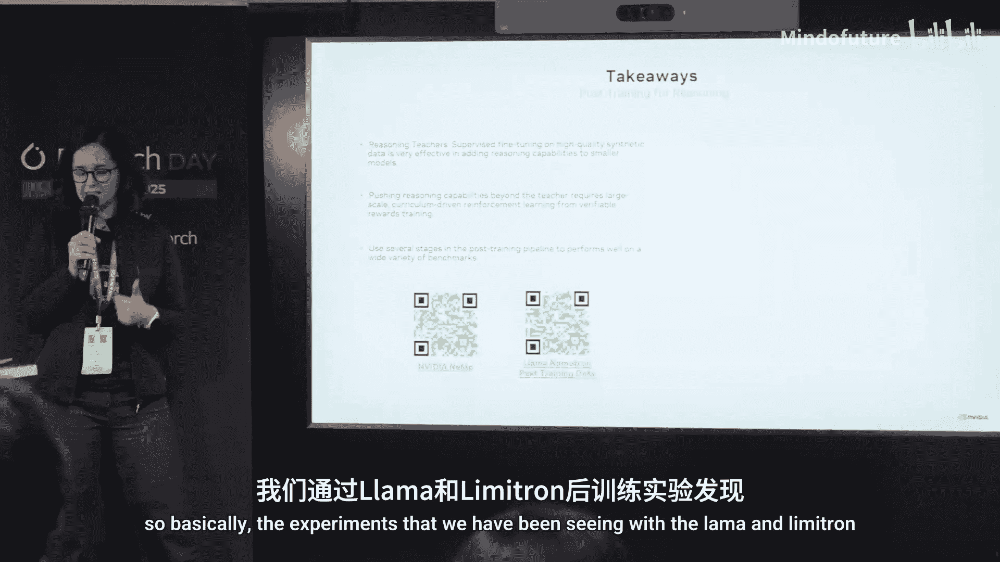

通过利用NVIDIA NeMo等开源框架和已公开的配方，开发者可以尝试为自己的模型赋予“思考”的能力。