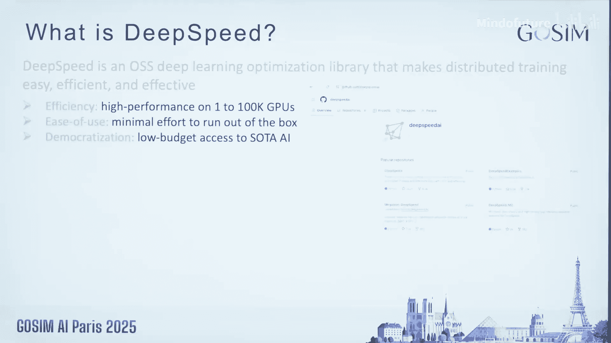
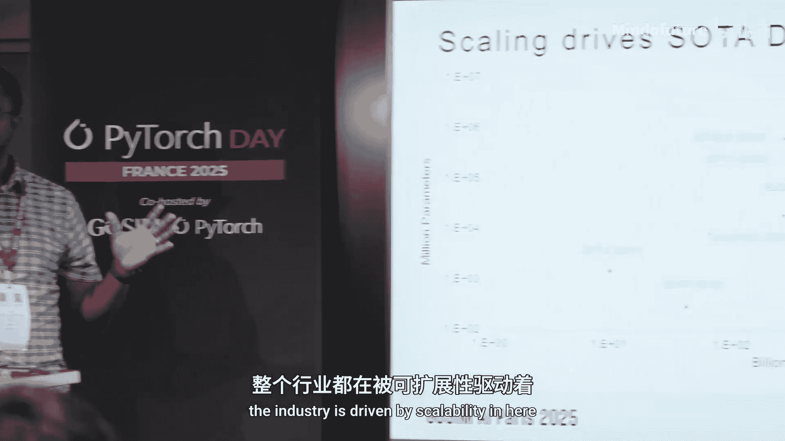
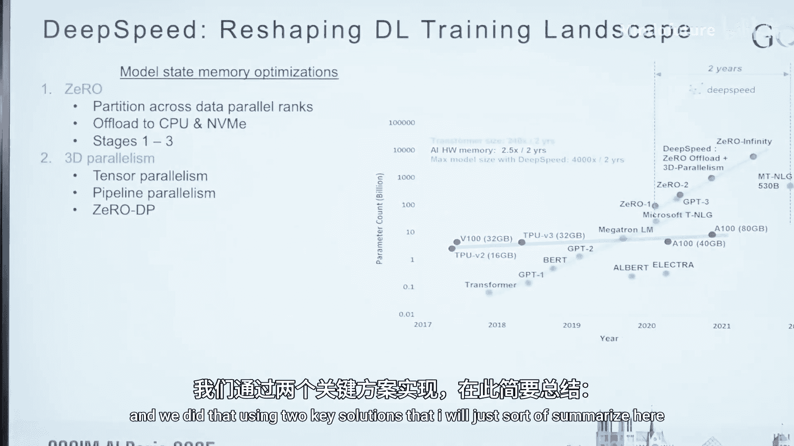
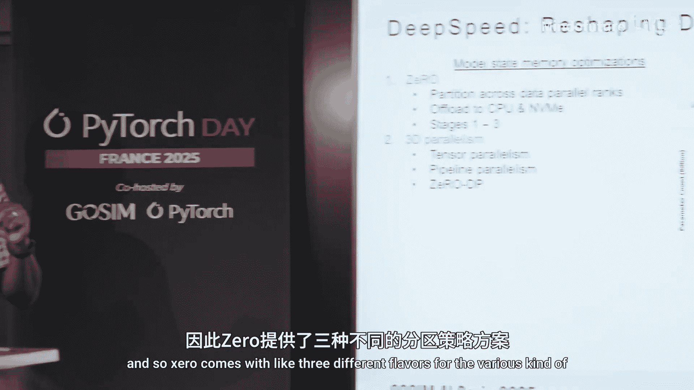
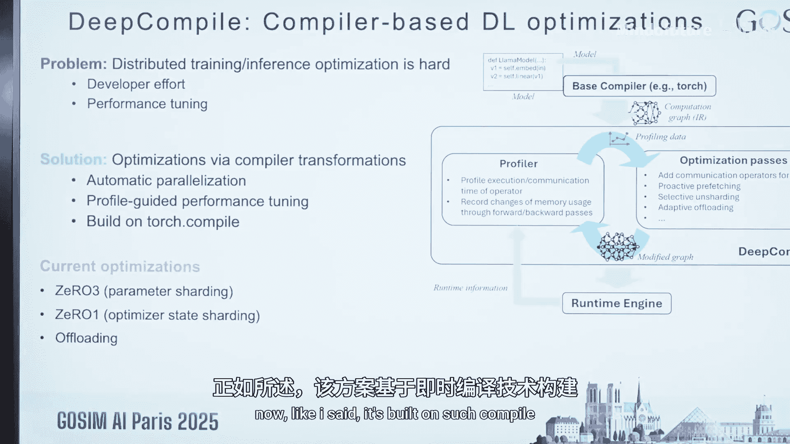
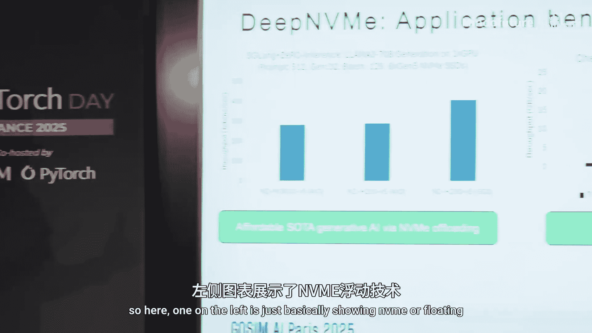
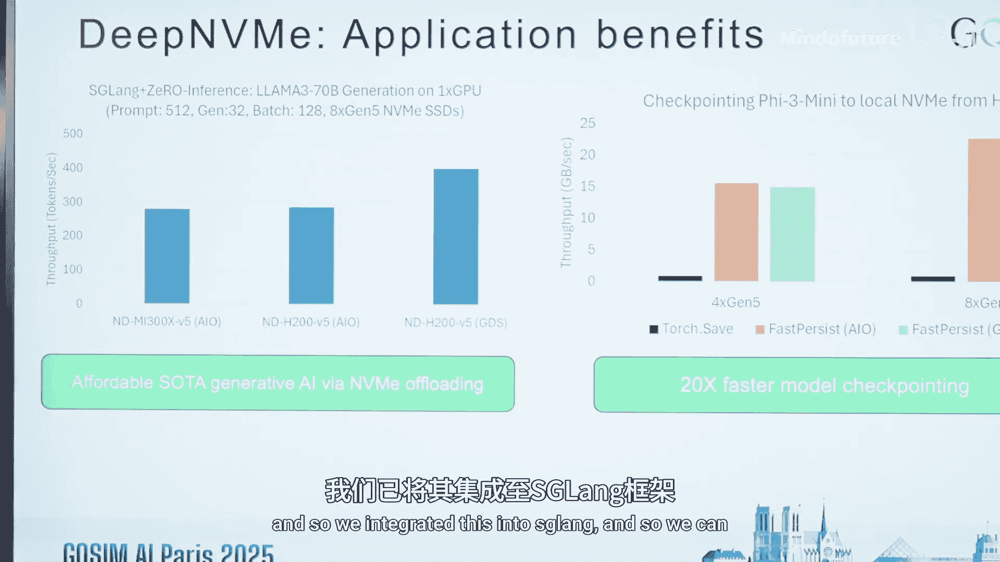

# 009：深度学习模型的高效训练与扩展性

## 概述

在本节课中，我们将学习DeepSpeed库，这是一个用于实现高效、可扩展的分布式深度学习训练的开源库。我们将探讨其核心目标、解决的关键挑战（如GPU内存墙问题），并深入了解其最新的技术进展，包括通用检查点、通信优化、编译技术以及存储I/O优化。



---

## 为什么需要DeepSpeed？🚀



上一节我们介绍了DeepSpeed的概况，本节中我们来看看其诞生的根本原因。DeepSpeed的创建基于一个核心观察：**可扩展性是推动深度学习行业发展的关键驱动力**。

可扩展性主要体现在两个维度：
1.  **模型规模**：以**数十亿参数**为单位增长。
2.  **训练数据量**：以**数十亿乃至数万亿token**为单位增长。

从早期的GPT-3（约3000亿参数，数千亿token）到如今的Llama 4（数千亿参数，数万亿token），模型规模和数据量的爆炸式增长对系统资源造成了巨大压力，主要体现在：
*   **计算资源**
*   **内存资源**
*   **通信开销**
*   **I/O与数据**

因此，深度学习的进步高度依赖于在上述四个支柱上的创新。DeepSpeed自诞生起就致力于为这些挑战提供解决方案。

---

## 攻克核心挑战：GPU内存墙 🧱

上一节我们了解了可扩展性带来的系统压力，本节我们聚焦DeepSpeed解决的第一个关键挑战：**GPU内存墙**。

问题在于，模型参数规模每年增长约100倍，而GPU的高带宽内存（HBM）容量每两年仅增长约2倍。这导致模型很快无法装入单个GPU。



DeepSpeed通过两大关键技术解决此问题：



以下是两种核心的解决方案：

1.  **ZeRO（零冗余优化器）**：针对数据并行训练范式进行优化。传统数据并行会在所有GPU上复制完整的模型状态（参数、梯度、优化器状态）。ZeRO的核心思想是**分区**而非复制。它将模型状态分区存储在不同的GPU上，从而显著降低单个GPU的内存占用。
    *   ZeRO有三个主要阶段（ZeRO-1, ZeRO-2, ZeRO-3），分别对应优化器状态、梯度和参数的分区。

2.  **异构内存利用**：除了GPU的HBM，服务器还拥有容量大得多的CPU内存（DRAM）和本地NVMe存储。DeepSpeed通过**卸载（Offloading）** 技术，将部分模型状态（如优化器状态、参数）临时存储到CPU内存或NVMe中，仅在需要时与GPU交换，从而突破GPU内存容量的限制。

结合ZeRO和3D并行（张量并行、流水线并行与数据并行），DeepSpeed使得训练超大模型成为可能。其系统能力的扩展速度甚至超过了模型规模的增长速度，早在2021年就能支持训练万亿参数模型。这些优化思想也启发了后续的框架，如PyTorch的FSDP。

---

## 最新技术进展 🆕

前面我们介绍了DeepSpeed的基础和核心优化，接下来我们将了解其最新的四项技术进展。

### 1. 通用检查点（Universal Checkpoint）

**动机**：在分布式训练中，训练状态（检查点）与创建它时所用的硬件配置（GPU数量、并行策略）紧密耦合。这导致无法在不同配置下恢复训练，缺乏灵活性。

**解决方案**：将检查点与硬件并行策略**解耦**。DeepSpeed提供了一种机制，允许你在不同的并行策略（如不同的TP/PP配置）之间**重塑（reshape）** 模型状态。

**优势**：
*   **容错性**：节点故障后，可用剩余健康节点继续训练，无需等待替换。
*   **弹性训练**：当有额外资源可用时，可动态增加GPU以加速训练；资源被回收时，也能调整配置继续训练。
*   **便携性**：通过一种描述并行策略的语言，可以轻松地将检查点从一种配置转换到另一种。

**效果**：实验表明，重塑并行策略不会影响模型的收敛性。该技术已成功应用于BigScience等大型项目，使其在训练中途GPU数量减半时仍能继续训练。

### 2. 通信隐藏：Domino

**动机**：张量并行、流水线并行等策略在分区计算的同时，引入了GPU间的通信开销。随着跨节点训练，通信时间可能占据总时间的40%以上。

**解决方案**：Domino通过**细粒度的计算与通信重叠**来隐藏通信延迟。它可以在Transformer层内或跨层进行重叠调度。

**原理**：传统方式中，计算和通信是顺序执行的，存在GPU空闲间隙。Domino通过精细调度，使得通信操作与后续的计算操作同时进行，从而填满这些间隙。

**效果**：在H100 GPU上，Domino能够在单节点内完全隐藏张量并行的通信开销。与Megatron-LM相比，在多节点场景下实现了约16%的加速。目前正与Hugging Face、MegaTron等框架集成，目标是在MoE、推理和长序列训练等场景实现100%的通信隐藏。

### 3. 大编译：Big Compile

**目标**：手动为不同模型和硬件配置分布式训练策略以获取峰值性能非常困难。Big Compile旨在通过**编译器技术自动化**这一过程。

**核心思想**：
1.  **自动应用分布式技术**：编译器自动对计算图应用张量并行、流水线并行等优化。
2.  **基于性能分析的优化**：让训练先运行一段时间，分析性能瓶颈，然后自动调整并行策略等参数，重新编译模型以获得最佳性能。



**流程**：
```
原始模型 -> PyTorch Compile（获取计算图）-> 应用并行/优化变换 -> 运行并性能分析 -> 调整策略并重新编译 -> 循环直至最优
```

**示例：ZeRO-3优化**
*   **自动分片**：编译器自动完成参数分片，无需用户手动编写。
*   **预取优化**：参数分片带来通信开销，通常用预取来隐藏。编译器通过分析训练时的内存使用模式，智能决定预取的时机和数量（例如，在前向传播初期内存充足时更激进地预取）。

**效果**：在Dance模型和稀疏混合专家模型上，实现了最高50%的加速。对于ZeRO-3卸载优化，相比基线有超过1.5倍的加速；对于ZeRO-1（仅优化器状态分片），也有超过30%的加速。

### 4. 深度存储I/O优化：Deep NVMe

**动机**：随着深度学习规模扩大，I/O（尤其是与持久化存储的交互）成为关键瓶颈，体现在数据集加载、预处理、模型检查点保存以及张量卸载等场景。

**核心思想**：利用存储领域的最新硬件和软件创新（如高速NVMe SSD、Linux异步I/O栈、NVMe Direct等），在存储和GPU HBM之间构建高效的直接数据通路。

**优化成果**：
*   在最新的Azure VM上，可实现接近**70 GB/s的读取速度**和**25 GB/s的写入速度**，并且I/O性能随NVMe数量增加而线性扩展。
*   **应用案例**：
    1.  **大模型单GPU推理**：通过NVMe卸载，可以在单个GPU上运行原本因内存不足而无法加载的超大模型，适用于基于LoRA的微调后推理，速度提升显著。
    2.  **快速模型检查点**：相比PyTorch原生方法，模型检查点保存速度提升高达**20倍**。

---

## 总结与展望 🌟



本节课中，我们一起学习了DeepSpeed库如何通过解决GPU内存墙问题（ZeRO、异构内存），为大规模深度学习训练奠定基础。我们还深入探讨了其最新的四大技术方向：
1.  **通用检查点**实现了训练状态与硬件配置的解耦，提升了训练的灵活性和弹性。
2.  **Domino通信隐藏**通过计算与通信的重叠，有效降低了分布式训练的通信开销。
3.  **Big Compile编译技术**利用自动化编译和性能分析，简化了分布式优化，并显著提升了训练速度。
4.  **Deep NVMe存储优化**充分利用高速存储硬件，大幅缓解了训练中的I/O瓶颈。



DeepSpeed是一个充满活力的社区项目，拥有超过400名贡献者，并已加入PyTorch基金会。它始终致力于通过技术创新，降低先进AI模型的使用门槛和成本，推动AI的民主化。我们鼓励大家加入社区，共同构建让最先进的AI技术惠及每个人的未来。