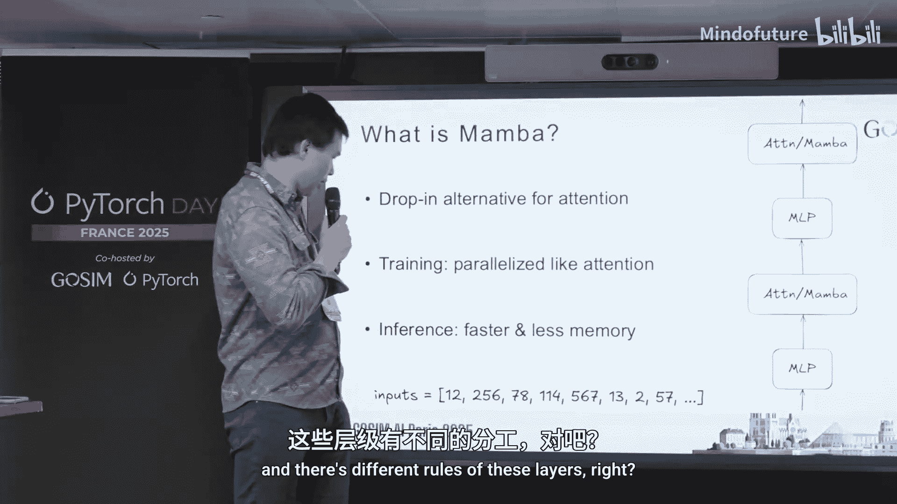
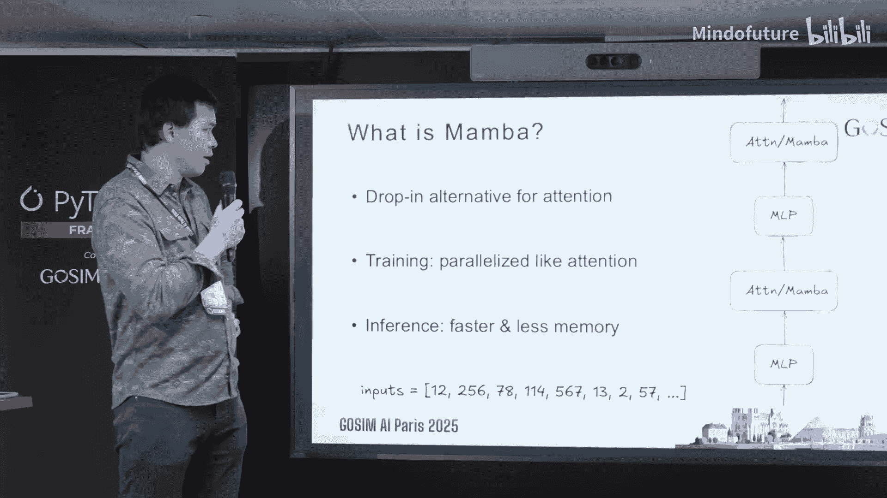

# 010：在 PyTorch 中推进 Mamba 模型 🚀

在本节课中，我们将学习 Mamba 模型的核心概念、其相对于传统 Transformer 的优势，以及 IBM 在 PyTorch 生态中为推进 Mamba 模型所做的具体工作。我们将涵盖长序列训练、无填充微调、核心算子支持、专家混合模型和推理优化等关键主题。

---

## 什么是 Mamba？🤔

上一节我们介绍了课程概述，本节中我们来看看 Mamba 是什么。

Mamba 本质上是标准注意力层的一种替代方案。它具有两个重要特性：
1.  训练过程具有高度的序列维度可并行性，类似于 Transformer。
2.  推理过程效率更高，速度更快且内存占用更少。

Mamba 是一种现代循环层，可以看作是过去循环神经网络（RNN）的改进版本。它由 Albert Gu 和 Tri Dao 等人提出。其核心思想是：模型扫描并汇总输入序列，逐步构建一个固定大小的内部状态，并利用该状态进行预测。

---

## 为什么需要 Mamba？⚡

了解了 Mamba 是什么之后，我们来看看为什么需要引入这种新架构。

在标准 Transformer 推理时，为了避免重复计算，需要构建一个键值（KV）缓存。对于一个 80 亿参数的模型，仅权重就可能占用 16GB 内存，而 KV 缓存可能更大。这个缓存会随着序列长度的增加而增长，这是一个不希望出现的特性。

相比之下，Mamba 在推理时虽然也有缓存，但其大小不随序列长度增长。同时，在推理时无需花费大量时间在 GPU 高带宽内存和芯片内存之间搬运缓存，从而获得了更好的算术强度和 GPU 利用率。

此外，在推理时生成下一个 token 是常数时间操作，只需参考最新生成的状态，无需像 Transformer 那样进行随时间增长的计算。

随着长上下文应用（如处理整个代码库、视频、音频、时间序列数据）变得越来越重要，以及推理模型生成长度不断增加，Mamba 的这些优势显得尤为突出。

在训练阶段，Mamba 也有类似优势。任何涉及生成的训练（如强化学习）都能从上述推理优势中获益。Mamba 在序列维度上可并行化，这是其主要技术创新，使其优于过去的 RNN。训练时的计算复杂度是序列长度的线性函数，不同于注意力的二次复杂度，这对长上下文训练非常有利。

---

## Mamba 模型的现状与应用 🏗️

基于以上原因，将 Mamba 层集成到模型中已成为一个非常流行的趋势。

以下是当前一些融合了 Mamba 层的混合模型案例，它们通常不会只使用 Mamba 层，而是与注意力层结合使用：
*   **BoomBa**：这是 IBM 与合作者共同构建的协作模型。在推理时，它比同等规模的 Llama 3 模型快约 2.5 倍，延迟也改善了约 2 倍。理论上，通过完美的工程实现，吞吐量提升可达 5 倍。
*   **Mamba 2**：这是 BoomBa 模型的进一步训练版本。根据某些指标，它在使用更少训练数据的情况下，性能优于 70 亿参数的 Llama 3。

---

## IBM 在 PyTorch 生态中的推进工作 🔧

Mamba 作为新技术，其生态系统支持不如传统注意力机制完善。接下来，我们将介绍 IBM 为扩展 Mamba 能力并为其提供高级支持所做的几项关键工作。

### 长序列支持 📏

长序列处理能力至关重要，我们希望以可扩展的方式训练模型处理超长序列。

实现这一点的根本挑战在于激活内存。这些在反向传播中需要保存的张量会随序列长度增长。可扩展的解决方案是上下文并行。其方法是将长序列在序列维度上分割，分发给不同的 GPU 进行处理。

IBM 基于 Mamba 原始代码库，构建了高性能的上下文并行实现。实验表明，使用 128k 到 200 万长度的序列进行训练时，能够保持良好的吞吐量曲线，并且可以通过增加 GPU 和上下文分片来进一步扩展，没有严格的内存增长限制。

理论上，在完美工程实现下，Mamba 模型在更长上下文下的 tokens/秒/GPU 可以保持恒定。而对于使用全注意力的模型，由于其计算复杂度是二次的，性能会随着序列长度增加而下降。

### 无填充监督微调 🧩

在监督微调阶段，我们使用高质量数据教导模型遵循指令。我们希望尽可能高效地利用这些数据，避免不同样本之间相互影响。

传统方法是将不同序列批量处理，但这需要添加填充，造成计算和内存的浪费。更好的方法是使用无填充训练，即将样本直接拼接，并通过特殊标记记录边界，同时编写专门的内核以确保不同样本间不会相互关注。

IBM 的工作是将 Mamba 原始代码库中已有的无填充训练能力，集成到 Hugging Face 生态中，使其更易于使用。其改进效果取决于具体的训练设置和数据分布，通常可以看到约 2 倍的效率提升。

### 核心 PyTorch 算子支持 ⚙️

在 PyTorch 核心层面，有几项工作旨在为 Mamba 操作提供更好支持：
1.  **关联扫描算子**：Mamba 的核心数学运算是关联扫描。目前其实现依赖于高度优化的 Triton 内核，虽然性能高，但不易修改和实验。一项工作是在 PyTorch 中引入一个原生的关联扫描算子，让开发者能够更容易地重新实现 Mamba、尝试新想法并进行实验。理想目标是拥有一个类似于 `scaled_dot_product_attention` 的原语。
2.  **DTensor API 支持**：DTensor 是 PyTorch 原生的张量分片 API。为了让 Mamba 模型中的操作（如扫描和序列维度上的卷积）在分片张量上能获得一流支持，需要进行特殊的调度逻辑开发。IBM 正在为此贡献力量。

### 专家混合模型支持 🧠

专家混合模型用多个 MLP“专家”层替代单一的 MLP 层。为了有效训练这些模型，一种方法是将不同专家放置在不同的 GPU 上，然后通过通信协调计算。

IBM 正在 Mamba 代码库中致力于为此类分片设置提供一流支持，使训练 MoE 模型变得更加容易。例如，IBM 最近发布了下一代 Granite 4.0 模型的预览版，这是一个融合了 Mamba 层、注意力层和 MoE 的混合模型。

### 推理优化 🚄

推理优化是一个庞大的主题。IBM 正在 `vLLM` 等推理引擎中为 BoomBa 及 Mamba 模型提供一流支持。相关工作包括：
*   **缓存系统**：Mamba 的缓存机制与 Transformer 的 KV 缓存不同，团队正在开发一个灵活的通用解决方案来适配现在及未来的各种缓存需求。
*   **分块预填充**：这是一种提升 GPU 利用率、节省服务成本的技术。
*   **更快的计算内核**：持续优化内核，努力将吞吐量从当前的 2.5 倍提升接近理论上的 5 倍。

---

## 总结 📝

本节课我们一起学习了 Mamba 模型的基本原理及其在长序列处理和高效推理方面的优势。我们探讨了 IBM 在 PyTorch 生态中为推进 Mamba 模型所做的多项工作，包括实现长序列上下文并行、集成无填充监督微调以提升数据效率、贡献核心 PyTorch 算子以增强灵活性和支持、为专家混合模型提供训练框架，以及在 `vLLM` 等引擎中优化推理性能。这些努力旨在使 Mamba 这一有前景的架构更强大、更易用，并融入现代大语言模型的开发生态。