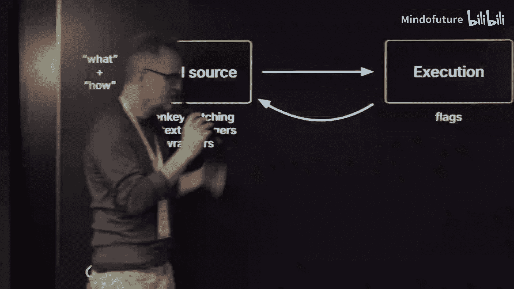
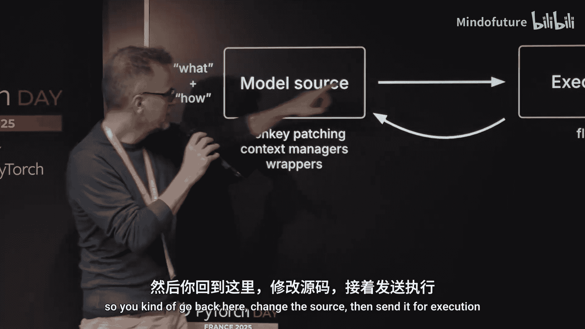
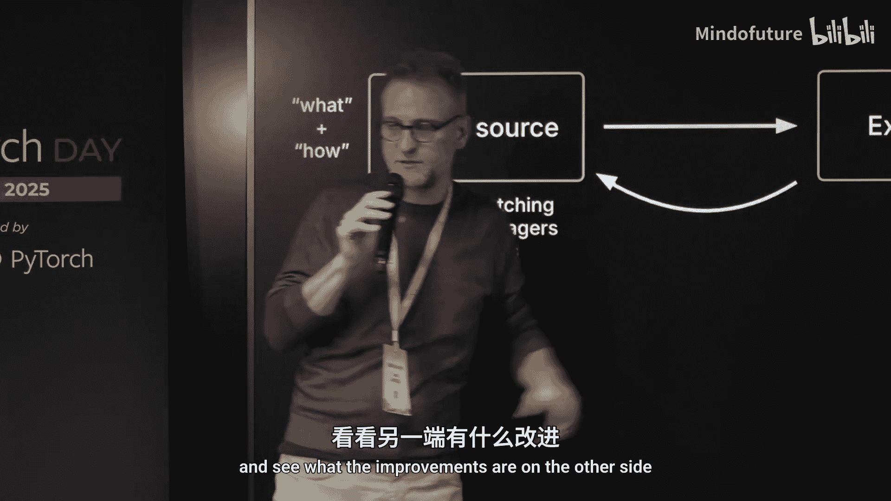
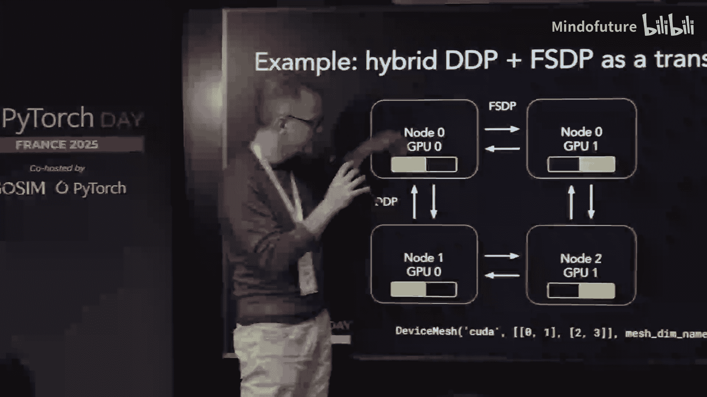

# 011：为现代硬件超级充电的PyTorch


在本节课中，我们将学习 Lightning AI 的 CTO Luca Antiga 介绍的 **Thunder** 项目。这是一个旨在解决现代硬件（如多GPU系统、新型互连架构）上高效运行大型模型所面临挑战的“登月计划”。我们将了解为何传统的一键优化方法不再有效，以及 Thunder 如何通过一个可组合的编译器系统，让研究人员能够以开发者友好的方式，将复杂的性能优化“传递”到他们的模型中。


---


## P11.1：现代硬件带来的挑战 🚀

上一节我们介绍了课程概述，本节中我们来看看当前硬件演进带来的具体挑战。

计算机硬件正在快速演进。例如，一个 ML 72 系统由 144 个高度互连的 GPU 组成。硬件拓扑结构变得非常特定，这意味着为一种架构编写的代码可能无法在另一种上高效运行。为了榨取新硬件的全部性能，开发者需要了解许多底层细节。

以下是开发者必须考虑的几个关键方面：
*   **互连拓扑**：不同的互连方式（如 NVLink, InfiniBand）需要不同的数据交换策略。
*   **内存层级**：硬件暴露了多种内存池（如 HBM, SRAM）和访问路径的 API，需要合理利用。
*   **新数据类型**：硬件支持新的数据类型（如 FP8, INT4），量化模型可以运行得更快。
*   **内核融合**：将多个连续操作融合成一个内核执行，避免在计算核心和高速内存（HBM）之间频繁搬运数据。

最终，性能来自于你对所有这些层面的控制程度。从你的神经网络模块开始，你需要确保在模型中正确地应用内核融合、混合精度、定制内核以及各种分布式策略（如 3D 并行）。

---

## P11.2：研究者的困境与Thunder的答案 💡

上一节我们了解了硬件复杂性，本节中我们来看看这对研究者意味着什么，以及 Thunder 提出的解决方案。

作为研究者，你希望专注于模型本身，而不是底层优化。你可能会想：“我有一个模型，在单 GPU 上运行良好，现在只需要‘套上’一些优化就完成了。”这在2019或2020年或许可行，但如今却困难得多。

因为优化不再是简单的函数调用，它们需要深入到模型内部。并且，所需的优化是**任务特定**（训练/推理）、**模型特定**（是 Mamba 还是 Transformer？）和**硬件特定**（运行在 H100 还是 B200？拓扑如何？）的。

我们的答案是正在构建的 **Thunder** 项目。它是一个开源项目，你可以访问其代码库查看进展。它尚未完全就绪，但正在快速进步。

数据显示，在 H100 上使用 Thunder 可以获得可观的加速。更有趣的是，当硬件升级到 B200 时，未优化代码（Eager模式）本身会变快，但优化与未优化代码之间的**性能差距反而会扩大**。这证实了之前的观点：新一代硬件需要更精细的控制来释放全部性能，否则就无法物尽其用。

---

## P11.3：Thunder是什么？一个优化交付系统 ⚙️

上一节我们介绍了Thunder项目的动机，本节中我们来具体定义Thunder是什么。

我们称 Thunder 为一个“编译器”，但这个术语很宽泛。更准确地说，Thunder 是一个 **优化交付系统** 。它的目标与 DeepSpeed 等框架类似：你有一个以研究风格编写的模型，Thunder 负责将各种性能优化“交付”到这个模型中。

这些优化包括：
*   替换高性能内核。
*   执行**内核融合**（`fusion`）：将多个顺序操作合并为一个内核，减少数据在计算核心和HBM间的搬运。
*   降低内存占用。
*   实现各种并行化策略。







在高层次上，使用 Thunder 类似于理想的“渴望模式”：你编译一个 PyTorch 的 `nn.Module`，然后可以组合使用一系列插件（即优化变换）。


---

## P11.4：工作流程对比：从现状到理想 🔄

上一节我们定义了Thunder，本节中我们通过对比工作流程来理解它的价值。

通常，开发者的工作流程（不使用 Thunder）是这样的：
1.  **模型源码**：定义模型是什么（如 Mamba, Vision Model）。
2.  **手动优化**：通过组合使用钩子（hooks）、猴子补丁（monkey-patching）、包装器（wrappers）等技术，使模型支持分布式、混合精度等。
3.  **执行**：发送到执行后端（如 PyTorch Eager, Torch Compile），可能附带一些标志或编译选项。
这个过程需要你反复修改源码，然后测试性能提升。

Thunder 追求的理想工作流程是：
1.  **模型源码**：同样的研究风格模型。
2.  **获取计算跟踪**：Thunder 将模型转换为一个中间表示（IR），即计算跟踪。
3.  **应用变换**：关键的一步。我们将**变换（transforms）作为一等公民的 Python 代码**。开发者可以编写或使用可组合的变换，对计算跟踪进行修改。
4.  **执行优化模型**：最终得到一个与原始模型计算等价但深度优化过的版本，用于执行。

Thunder 专注于 **“如何以开发者友好的方式获取并变换模型的内部表示”**。

---

## P11.5：Thunder内部机制浅析 🛠️

上一节我们对比了工作流程，本节中我们深入一点，看看Thunder内部是如何运作的。

假设我们有一个简单的模型（例如一个包含线性层、ReLU、线性层的序列）。我们使用 Thunder 编译它，过程与 `torch.compile` 类似（注：Thunder 并非与 `torch.compile` 竞争，事实上它在某些环节会使用 `torch.compile`）。

编译后，我们得到几个函数：一个前奏（prologue）函数将面向对象的模块转换为纯函数形式，一个纯粹的函数化计算跟踪，以及一个尾声（epilogue）函数转换回面向对象的形式。这个计算跟踪就是模型的等效计算图，其中参数形状、类型等信息已被“冻结”。

现在，如果你想添加一个优化，例如 DeepSpeed 的 ZeRO 阶段 0（一种数据并行策略），你需要做什么？你需要在多个环节介入：在将模型移动到设备之前，你需要对模型进行分片，确保每个 GPU 只持有其分片对应的参数，然后再移动到 GPU。这意味着模型的捕获和中间表示必须在“元设备”上完成（即参数的符号表示，而非实际设备）。

Thunder 的变换架构允许你在加载、保存、前向传播、后向传播等阶段注入可组合的变换。

---

## P11.6：实例：可组合的分布式变换 🔗

上一节我们了解了变换如何介入，本节中我们看一个具体的例子：组合两种分布式策略。

假设我们想组合两种变换：FSDP（完全分片数据并行）和 DDP（纯数据并行）。为什么需要这样？例如，你的模型可能刚好能放入 2 块 GPU，但你有 4 块 GPU（或两个节点，每个节点 2 块 GPU）。你不想把模型分片到 4 块 GPU 上，因为那样可能浪费。相反，你可以在一个维度上使用 FSDP 分片（比如跨 2 块 GPU），在另一个维度上使用 DDP 仅同步梯度（跨另外 2 块 GPU）。

在 Thunder 中，你可以利用 PyTorch 新引入的 `DeviceMesh` 概念，将其表达为两个维度的组合。然后，你可以通过组合两个独立的变换（FSDP 变换和 DDP 变换）来实现这一点，它们彼此不知道对方，但知道如何不冲突。



以下是应用变换后计算跟踪可能的样子（简化示意）：
```python
# 原始计算跟踪（部分）
def forward(x, weight):
    a = linear(x, weight)
    b = relu(a)
    c = linear(b, weight2)
    return c

# 应用FSDP和DDP变换后（概念性）
def forward_sharded(x, weight_shard):
    # FSDP维度：收集全量参数
    weight_full = all_gather(weight_shard, group=fsdp_group)
    a = linear(x, weight_full)
    b = relu(a)
    # DDP维度：同步梯度（在反向传播中体现）
    c = linear(b, weight2_shard) # weight2 可能在另一个FSDP分片中
    return c
```
你会看到计算图中插入了 `all_gather` 等同步原语，权重大小等元数据也发生了变化。Thunder 的中间表示不仅是 IR，也是有效的 Python 函数，便于调试和分段执行。

---

## P11.7：当前状态与未来展望 📈

上一节我们通过实例了解了Thunder的威力，本节中我们总结一下它的当前状态和未来方向。

Thunder 的目标是创建一个系统，让我们能够获取模型并对其进行程序变换推理，从而根据具体上下文（模型、硬件、任务）自动化地从非优化状态转换到优化状态。

目前的情况是：
*   **模型覆盖**：良好且正在改进，目前正专注于 Transformer 模型以确保其完美运行。
*   **可组合变换**：已有一些，并正在添加更多。项目已进入能够高效驱动变换开发的阶段。
*   **执行后端支持**：支持多种后端，如 cuDNN、TorchCompile、Transformer Engine 以及自定义内核。
*   **尝试使用**：如果你尝试使用，体验可能因人而异。如果遇到问题，欢迎提交 Issue，团队非常乐于反馈并正在积极完善。

---

本节课中我们一起学习了 Lightning AI 的 Thunder 项目。我们认识到，面对现代硬件的复杂性和多样性，传统的“一键优化”方法已不再足够。Thunder 作为一个优化交付系统，通过将变换提升为一等公民，并提供可组合、可调试的中间表示，旨在让研究人员能够以更灵活、更可控的方式，为他们的模型注入所需的性能优化，从而充分利用新一代硬件的强大算力。