# 012：构建属于你的最佳AI模型

在本教程中，我们将探讨为何以及如何通过微调来构建超越通用大模型（如GPT-4）的、专属于你特定任务的AI模型。我们将从动机、方法到实践平台，系统地介绍微调的核心概念。

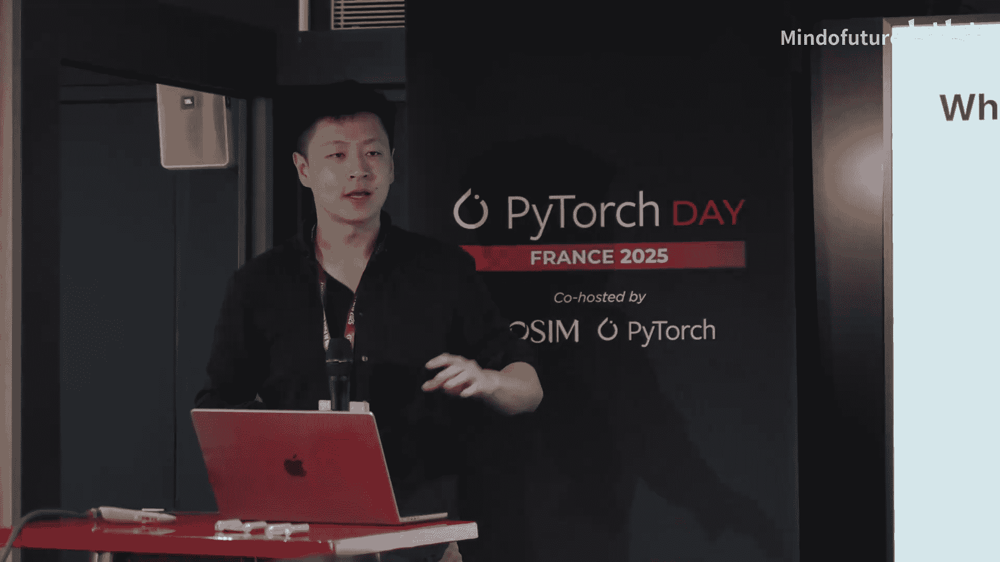

## 动机：为何需要微调？

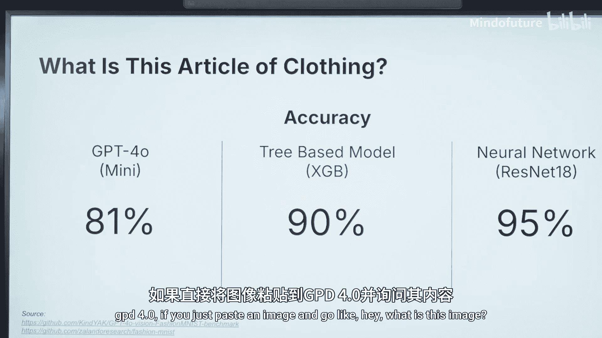

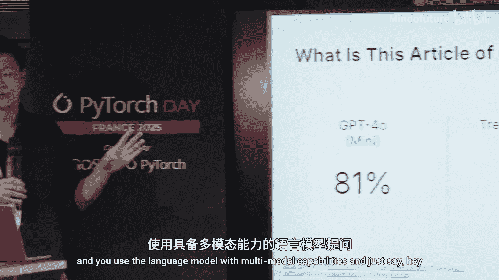

上一节我们介绍了课程概述，本节中我们来看看微调的核心动机。

通用大模型并非万能。以识别服装图像为例，Fashion MNIST数据集包含鞋子、T恤等物品。

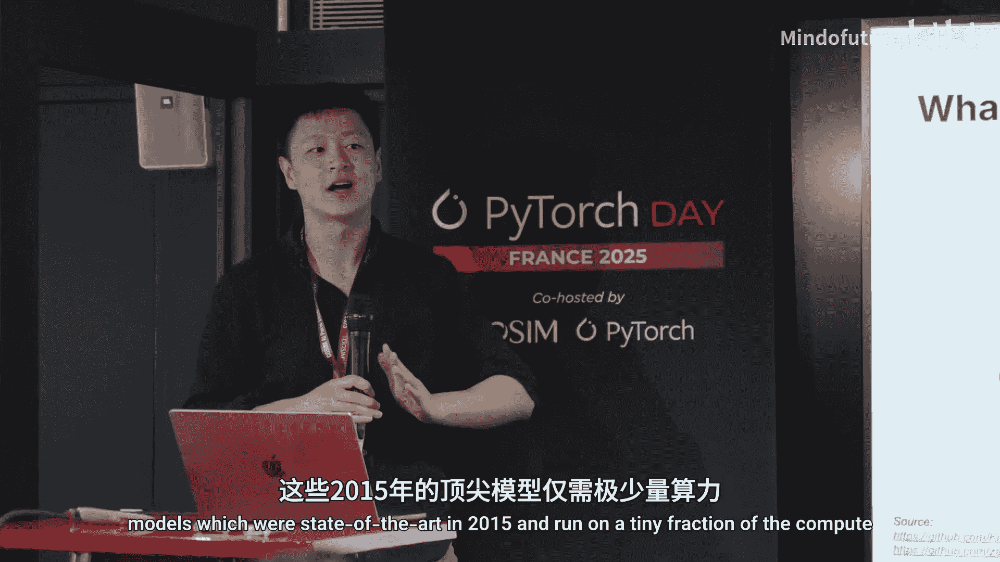

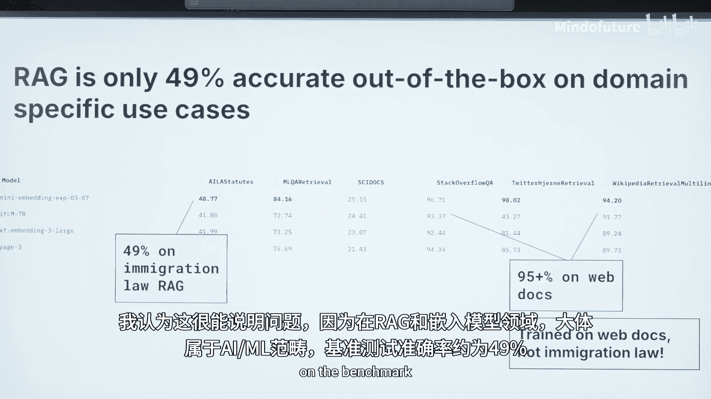

当使用具备多模态能力的GPT-4直接询问“这是什么图像”时，其准确率仅为**81%**。

然而，一个在机器学习入门课程第一天就能学到的树模型，准确率可达**90%**，显著优于GPT-4。更进一步，使用ResNet等2015年的先进模型，仅需极少的计算资源（甚至单CPU推理），就能达到**95%**的准确率，完全超越GPT-4。

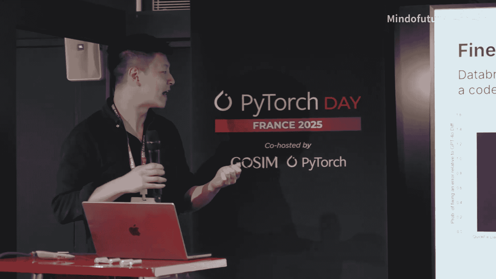

这个例子有力地证明：**针对特定领域、经过专门优化的模型，其性能可以远超通用大模型**。

## 数据的力量：领域知识是关键

上一节我们看到了微调带来的性能提升，本节中我们来深入理解其背后的原因。

这种现象在RAG（检索增强生成）领域同样明显。以下是不同任务上嵌入模型的准确率对比：

*   **移民法RAG任务**：通用嵌入模型准确率约为 **49%**。
*   **Web文档检索任务**：经过针对性训练的嵌入模型准确率高达 **95%**。

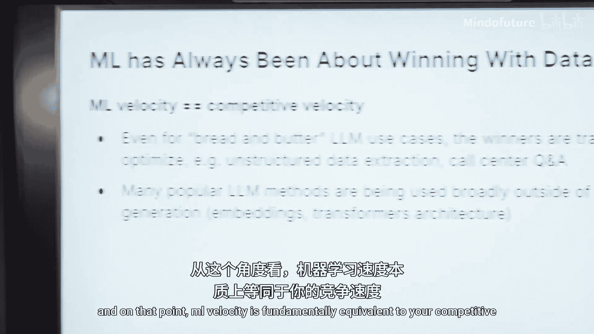

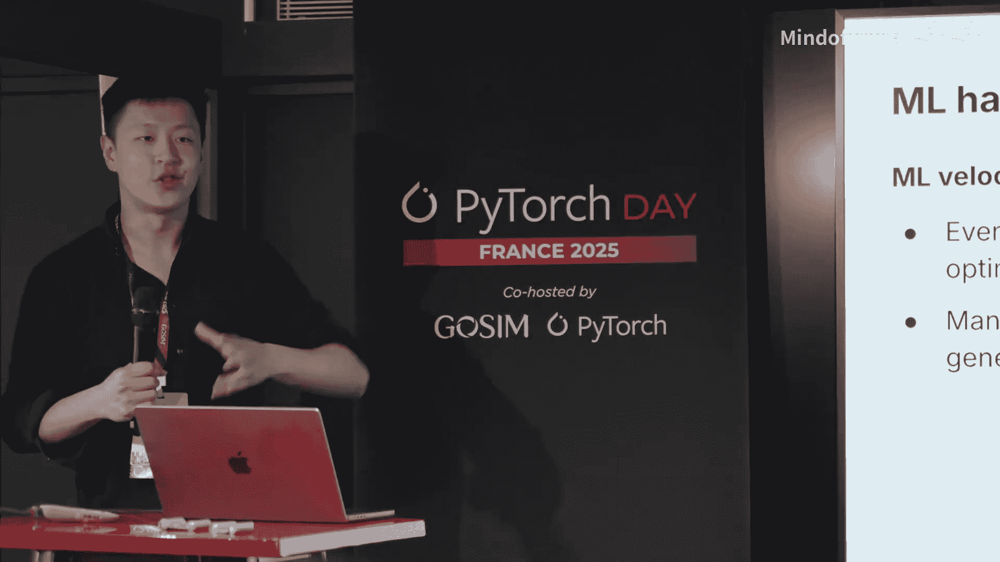

性能差异巨大的原因在于，后一个模型专门为查找Web文档进行了训练和数据“动员”。这引出了核心观点：**你需要为自己的AI解决方案动员（mobilize）专有数据**。

公司层面也印证了这一点。例如，Voyage AI公司因其构建微调嵌入模型的能力，被MongoDB以2.2亿美元收购。微调能带来多重收益：

以下是微调的主要优势：
1.  **领域特定知识**：让模型精通你的业务领域。
2.  **任务特定成功**：针对具体任务优化，效果更好。
3.  **速度与成本**：可以做到更快、更便宜，这取决于你选择的微调技术和方案。

## 成功案例：微调如何工作

上一节我们讨论了微调的理论优势，本节中我们来看一个具体案例。

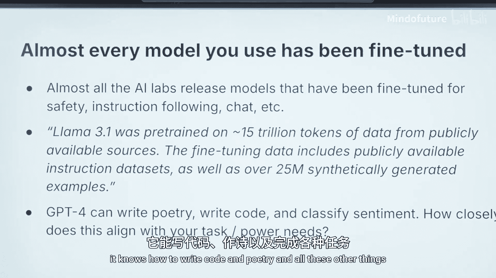

Databricks公司提供了一个绝佳范例。他们取了一个80亿参数的Llama模型，将其微调用于生成修复代码片段的指令（CodeFix）。

与GPT-4（修复成功率为100%）相比，这个微调后的模型：
*   修复错误的可能性高出 **40%**。
*   生成令牌的延迟比GPT-4快 **2倍以上**。

这个案例展示了微调的权衡艺术：你可以选择用更大的模型追求更好的性能，或者像Databricks那样，为了速度而选择较小的模型，同时仍能获得优于GPT-4的结果。这证明了微调是有效的，并且日益成为先进部署解决方案的基础。

## 微调的本质：数据系统而非模型检查点

上一节我们看到了成功的微调案例，本节中我们来构建更系统的认知。

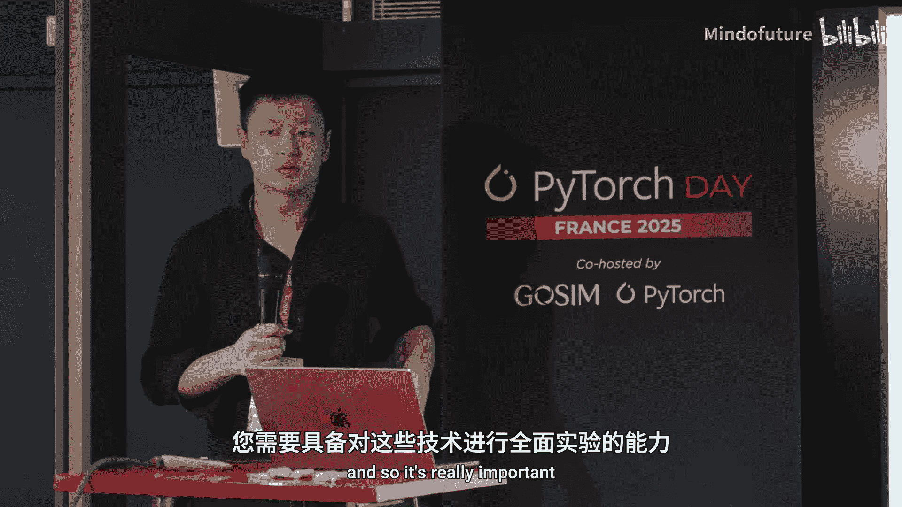

机器学习始终是关于“用数据取胜”。类比广告系统：Meta（Facebook）绝不会直接用Google的广告平台，因为那样无法构建其核心竞争力。同样，依赖外部通用API无法构建你独特的竞争优势。

**机器学习速度本质上等同于你的竞争速度**。在微调中，你能让损失函数下降的速度，就是你建立优势的速度。

一个关键洞察是：所有你使用的大模型都经过某种形式的微调（或后训练）。例如，Llama 3.1在15万亿令牌上进行了预训练，但仅在约2500万合成生成的令牌上进行了后训练。这意味着，**改变模型行为所需的努力量级（数据量）比从头预训练低了好几个数量级**。

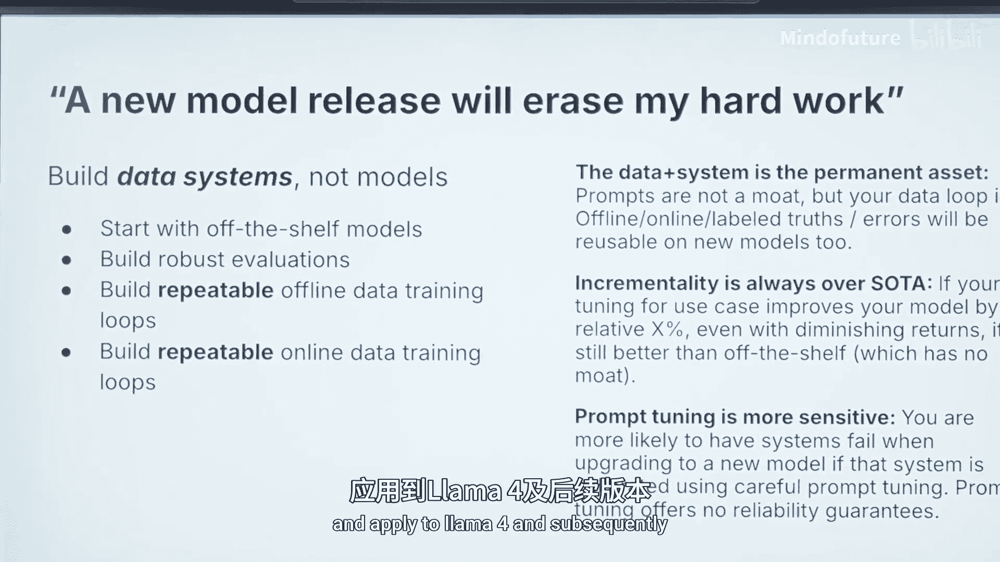

虽然2025年从头预训练模型是不明智的，但利用已有模型，仅需**几百个标注样本**（比预训练数据少1-2个数量级），就能产生针对你用例的新行为。

抽象来看，GPT-4“懂得太多”（写代码、诗歌等），而你通常只需要它精通一件事。你的领域知识和专有数据在这里具有巨大影响力。

## 技术概览：方法与流程

上一节我们理解了微调的战略价值，本节中我们系统性地看看有哪些技术方法。

首先，数据来源可分为离线和在线两种，将用户反馈融入系统是传统产品与工程思维的延伸。例如，Character AI早期通过让用户选择低分辨率图片来收集数据；在代码修正中，可以将模型生成的补全与实际成功运行的代码进行对比，生成训练样本。

微调技术多种多样，从全参数微调到更高效的LoRA等方法。关键在于**实验速度**，你需要有能力尝试不同的技术和数据组合。

需要警惕的是，**提示工程（Prompt Engineering）难以扩展**。它对于早期探索有帮助，但本质是手动的、脆弱的，并且严重依赖于特定模型版本。它无法像真正的数据系统那样，自动、规模化地将反馈传播到模型中，也无法轻松迁移到下一代模型（如Llama 4）。

一个稳健的微调系统构建流程如下：
1.  **从现成模型开始**。
2.  **构建鲁棒的评估体系**（这是构建自学习系统的P0优先级任务）。
3.  **建立可重复的离线数据训练循环**。
4.  **建立可重复的在线数据训练循环**。

**你的数据和系统是永久资产，而非某个模型检查点**。这与所有机器学习系统（如推荐系统）一样。只要你在使用开源模型，并拥有评估体系，你就能利用专有数据持续迭代，始终领先于通用技术的最新进展。

## 实践挑战：大模型感觉为何不同？

上一节我们梳理了方法流程，本节中我们来看看实践中会遇到哪些独特挑战。

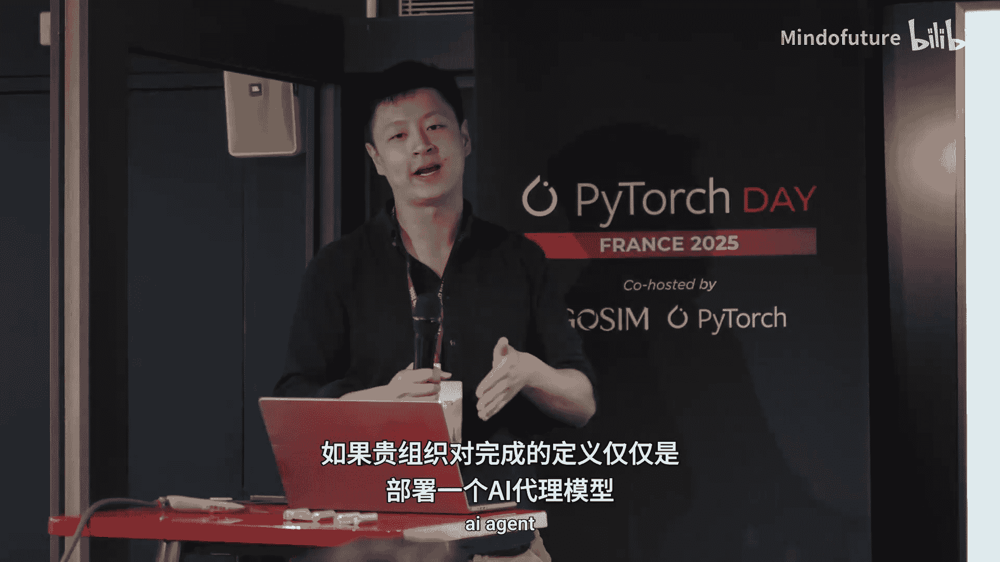

从技术上讲，微调本质上就是PyTorch训练。如果你能训练一个PyTorch模型，你就能为你的用例构建一个比GPT-4更好的大语言模型。

然而，大语言模型感觉起来与众不同，其程度类似于机器学习曾经感觉与传统软件不同。主要挑战在于：
1.  **模型规模**：模型权重远大于其他深度学习模型。
2.  **数据规模**：数据集和可训练令牌数量非常庞大。
3.  **缺乏本地迭代路径**：无法像调整网站CSS那样在本地快速迭代训练大模型。传统的“本地开发 -> CI构建 -> 生产部署”的软件开发生命周期（SDLC）循环在此失效。
4.  **目标指标缺失**：许多团队将“上线一个RAG应用或AI智能体”视为终点，而非瞄准某个具体的改进指标（如推荐系统的准确率提升）。没有目标指标，就难以衡量成功和持续优化。

## 核心瓶颈：实验迭代速度

上一节我们指出了大模型微调的特殊性，本节中我们聚焦最关键的瓶颈——实验速度。

主要成本并非金钱（微调一个130亿参数模型仅需几百美元），而在于**基础设施和实验速度**。

问题在于，许多团队缺乏合适的机器学习平台。虽然Hugging Face Trainer、Accelerate、Lightning等工具让编写训练代码变得简单，但如何**进行实验**？

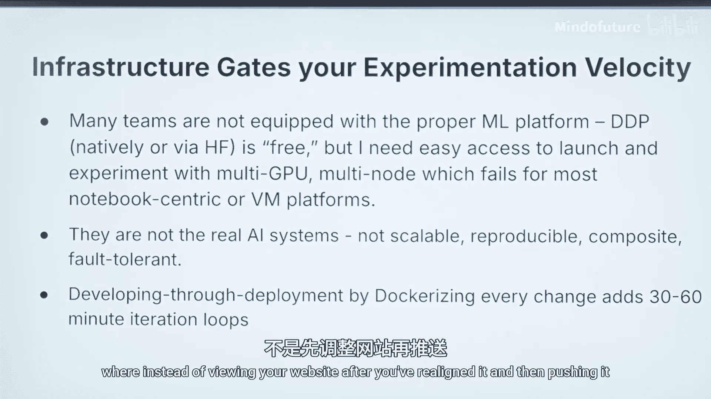

*   **笔记本（Notebook）开发**：无法处理多GPU、多节点场景，且通常不可复现、不可组合、缺乏生产环境容错能力。
*   **容器化部署开发**：每次代码修改（即使是加一个`print`语句）都需要重新构建Docker镜像，通过CI/CD管道部署到Kubernetes集群，耗时从30分钟到3小时不等。这严重拖慢了从数据预处理、分布式训练到推理部署的整个迭代循环。

这导致了**实验逃逸速度（Experiment Escape Velocity）**问题：由于感知到的启动实验的难度太高，团队根本不愿意尝试，即使他们相信微调能带来价值。

检验一个ML平台好坏的标准是：当你看到一个有趣的开源Repo（如Lightning Thunder），能否直接克隆、稍作修改并运行它，而无需担心底层平台限制？

## 解决方案：构建高效的ML平台

上一节我们分析了实验速度的瓶颈，本节中我们探讨解决方案的方向。

理想的平台应该提供抽象，让开发者无需关心底层分布式计算的复杂性。这类似于Snowflake在数据领域的革命：无论查询10行还是10亿行数据，你只需写`SELECT COUNT(*) FROM my_table`，Snowflake会自动处理分布式计算。

我们需要为ML/AI构建类似的平台，实现**交互式实验的快速迭代**，以突破提示工程的瓶颈，真正释放数据的力量。无论你使用Runhouse的Cubetorch还是其他平台，关键在于找到一种方法，能让你在Kubernetes等生产级基础设施上快速进行交互式实验。

## 总结与行动指南

在本节课中，我们一起学习了为何以及如何通过微调构建超越通用大模型的专属AI。以下是核心要点与行动指南：

1.  **始终从评估开始**：没有评估，就无法优化。建立鲁棒的评估体系是第一步。
2.  **动员数据是魔法**：你的专有数据和反馈循环是构建持续竞争优势的核心。
3.  **你需要一个平台**：选择一个能支持快速交互式实验的ML平台，这是突破实验速度瓶颈、实现从提示工程到真正微调跨越的关键。

具体的实践步骤可以包括：
*   继续预训练（Continued Pretraining）。
*   生成响应并蒸馏模型到更小尺寸。
*   创建数百个高质量标注样本的数据集。
*   使用大语言模型作为评判员（LLM-as-a-Judge）来引导数据获取过程。
*   深思熟虑地利用你的反馈响应。

最终，**AI/ML平台的速度就等同于你业务迭代的速度**。构建一个统一的、高效的平台来支持你的AI应用微调，是成功的关键。