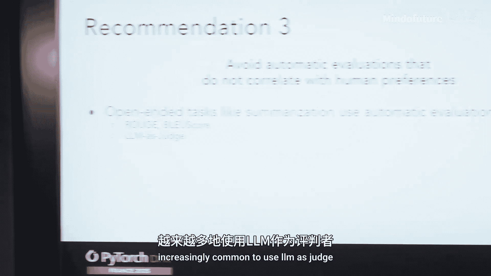
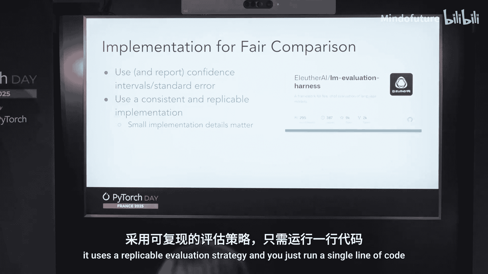

# 013：最佳实践指南 🚀

在本课程中，我们将学习如何为多语言大模型（LLM）选择和运行评估基准，并了解创建新基准时的关键考量。这些实践对于所有语言都至关重要，尤其是在基准稀缺的低资源语言场景中，每个基准的选择都显得尤为重要。

## 选择评估基准的最佳实践 📊

上一节我们概述了课程目标，本节中我们来看看如何为你的目标语言或任务选择合适的评估基准。以下是选择基准时需要遵循的五个核心原则。

**1. 选择难度合适的任务**
许多覆盖多语言的现有基准对于当前强大的模型来说过于简单。例如，SIF 200（一个涵盖200种语言的主题分类任务）已无法有效区分最新的大型模型。另一个例子是 **MultiLing**，它评估模型为语法正确的句子分配更高概率的能力，其公式可表示为：`P(grammatical) > P(ungrammatical)`。然而，即使是像 **Llama 3 8B** 这样的模型在该基准上的表现也已接近饱和（例如，在高资源语言上达到95-97%的准确率），使其区分能力有限。

**2. 避免使用机器翻译的基准**
尤其是那些未经语言专家验证的机器翻译基准。机器翻译会引入噪声，干扰我们通过基准准确评估模型真实能力的最终目标。以 **EU 21** 基准为例，它将多项任务从英语机器翻译成21种欧洲语言。模型在右侧语言上的性能下降，不仅与各语言的训练数据量相关，也与用于翻译该语言的机器翻译系统本身的质量紧密耦合。这使得我们难以判断性能差异是源于模型能力，还是翻译系统的缺陷。

**3. 避免使用与人类偏好不相关的自动评估指标**
对于摘要生成等开放式任务，常使用 **ROUGE**、**BERTScore** 或 **LLM 即评委** 等方法进行评估。但这些自动指标和LLM评委需要在每种语言中进行广泛评估和校准。研究发现，在英语、中文和印尼语中，这些自动指标与人类偏好的相关性较差。例如，LLM评委可能能生成流畅的韩语文本，却无法识别文化表述不当的情况。

**4. 基准应具有文化适应性并针对目标语言进行本地化**
本地化的基准与人类判断有更高的相关性。这意味着不仅仅是翻译，还要进行文化适配。例如，法律类基准应适配特定国家的法律。优秀的例子包括针对中文和韩语的 **CMMLU** 和 **KMMLU**，以及 **Cohere** 发布的包含文化特异性子集的 **Global MMLU**。

**5. 使用与人类判断相关的任务和指标**
某些任务可能更能预测模型在“聊天机器人竞技场”等场景中的通用表现。一项研究发现，**多语言小学数学** 基准比 **MMLU** 更能预测人类偏好。在缺乏数据的情况下，选择与你的预期用例最匹配的基准是明智之举。**多语言小学数学** 基准较好地满足了上述多项原则，尽管其语言覆盖范围相对较窄。



目前不存在一个能覆盖大量语言且完全符合所有最佳实践的“完美”基准。因此，在实践中需要根据目标语言和具体任务，在这些原则之间进行权衡。

## 如何公平地运行多语言评估 ⚖️

在选择了合适的基准后，如何运行评估以确保结果公平、可靠同样关键。本节我们将探讨评估执行阶段的最佳实践。

**使用置信区间或标准误**
评估设置中必须包含不确定性度量。下图展示了仅进行一次评估运行与进行超过10次运行并计算置信区间结果的对比。后者能提供更可靠的模型性能比较，可能影响你选择性价比更高的模型（如 **GPT-4 Turbo**）的决策。


**确保使用一致且可复现的实现方式**
我们发现，即使是提示词中空格的微小变化，也可能显著改变基准分数。好消息是，**LM 评估工具** 可以很好地解决这些问题。它支持众多基准，能自动计算标准误，并采用可复现的评估策略。你通常只需运行一行代码即可开始评估。

```python
# 使用 LM 评估工具运行评估的示例
from lm_eval import evaluator
results = evaluator.simple_evaluate(
    model="your_model",
    tasks=["your_benchmark"],
    num_fewshot=0
)
```


**按语言拆解并报告结果**
在多语言场景中，仅报告所有语言的平均准确率会掩盖重要信息。必须按语言拆解结果以了解性能分布。例如，两个模型集合（如 **Llama 70B** 和 **Goldfish 模型**）可能平均分相似，但 **Llama** 在某些语言上的分数明显偏低。查看全部分布有助于识别模型的薄弱环节。

## 关于创建新多语言基准的思考 🛠️



最后，如果我们想要创建新的多语言评估基准，应该考虑哪些方面？

我们将牢记上述所有最佳实践：聚焦合适的任务难度、如需翻译则使用专家翻译并进行本地化、寻求社区偏好验证等。主要目标是**改善语言代表性**，特别是关注那些基准稀缺的“长尾”语言。我们计划通过大型国际协作来实现这一目标，汇聚来自不同语言社区和用例的专家。目前，**Aluther** 社区正在开发一个多语言、自然主义的开放式问答基准，并欢迎合作者加入。

## 总结 📝

本节课中我们一起学习了评估多语言大模型的全流程最佳实践：
1.  **选择基准**时，需关注难度、避免机器翻译、确保文化适应性、选用相关性高的指标。
2.  **运行评估**时，要使用置信区间、保证可复现性，并务必按语言拆解结果。
3.  **创建新基准**时，应以改善语言覆盖为核心，并通过广泛合作确保质量。

所有讨论的建议都总结在这篇 [博客文章](https://example.com/blog-post-link) 中。如果您对参与多语言基准开发感兴趣，欢迎通过此 [Discord 链接](https://discord.gg/example-link) 加入 **Aluther** 社区进行交流。