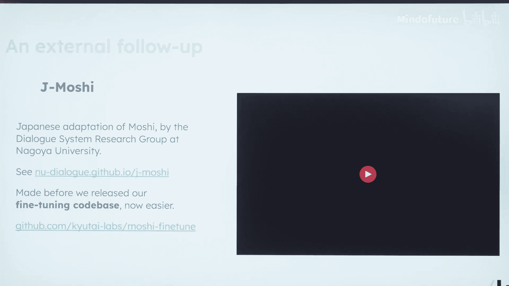
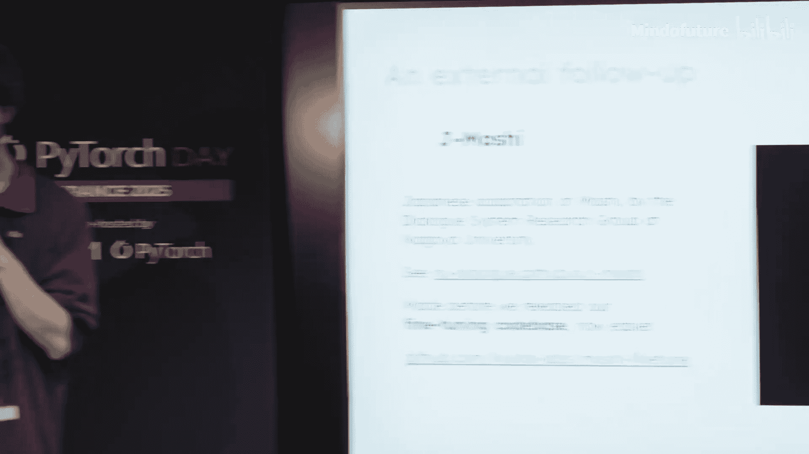
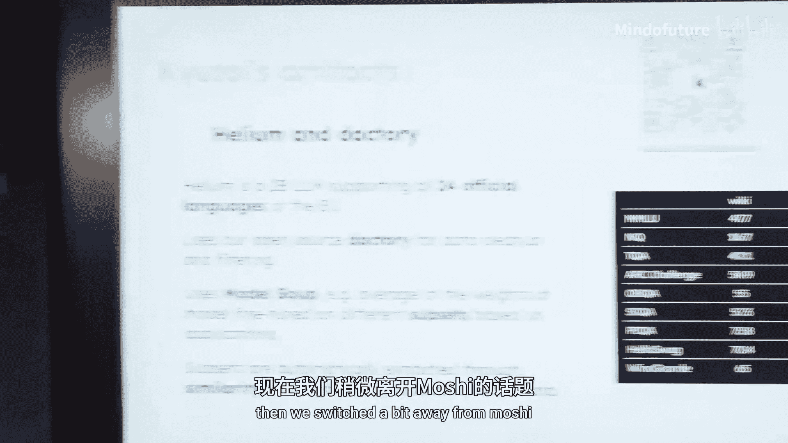
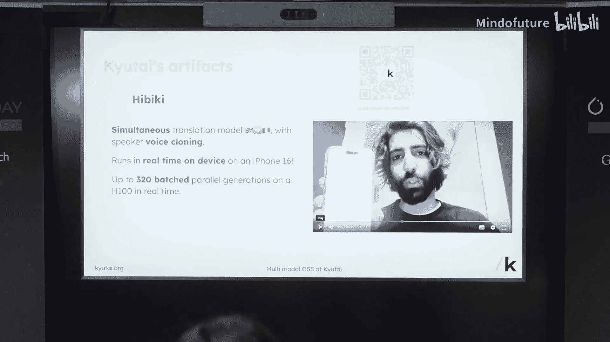
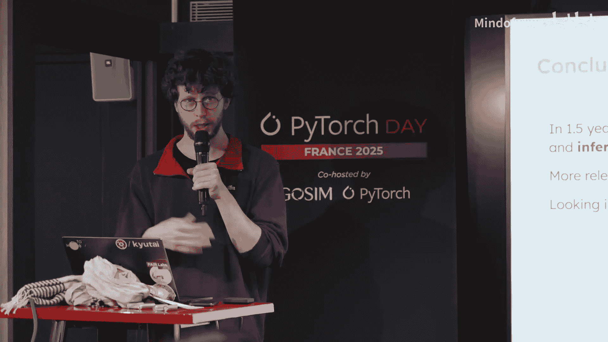
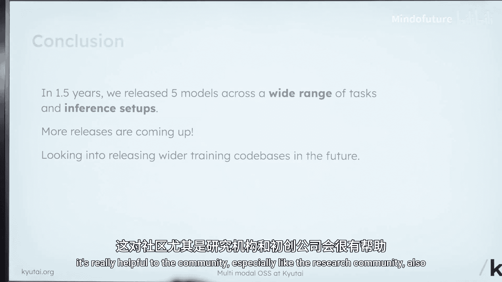
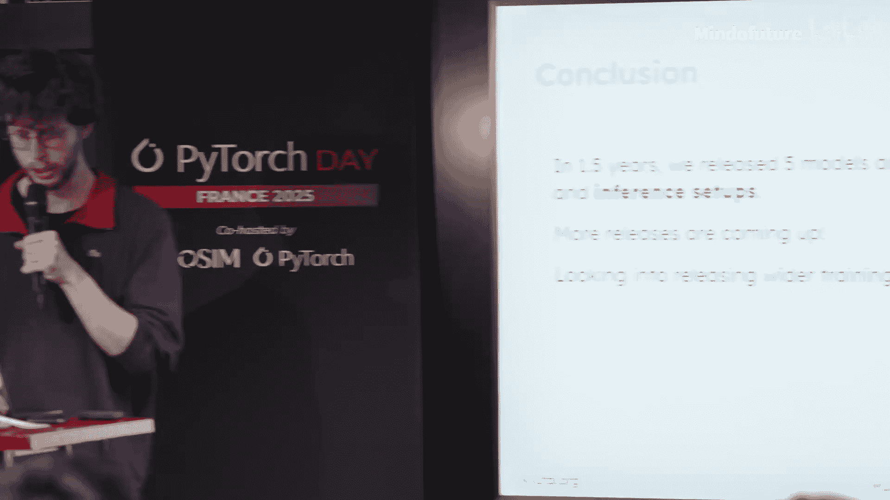

# 014：从在线演示到设备端部署

在本节课中，我们将学习Kyutai实验室在开源多模态大语言模型方面的实践。我们将了解他们发布的不同模型、面临的工程挑战，以及一个能显著提升推理性能的关键技巧。

## 概述：Kyutai实验室与开源使命

Kyutai是一家位于巴黎的非营利研究实验室，成立约一年半。其目标是进行开放科学与开源研究。实验室初期重点围绕多模态大语言模型，但也对任何具有巨大下游应用潜力的核心机器学习研究感兴趣。团队从最初的6人发展到超过20人，包括研究员、工程师、博士后和博士生。实验室的使命之一是培养下一代科学家，并认为让他们尽早接触工业级的训练能力是最有效的方式。

## 章节1：为何重视开源

我们认为开源主要有三个动机。

首先是科学层面。科学的一个支柱是可复现性。我们需要能够对现有方法进行公平比较，但如果只能信任在不一定完全了解的条件下获得的数字，这会很困难。通过开源模型，可以真正理解或复现达到特定性能的工作，测试其在新应用中的表现，从而衡量有意义的进展。我们开源的模型也可以作为研究项目的基础，无论是直接作为预训练模型、用于微调，还是仅仅作为灵感来源。当然，理想情况是完全开源数据和训练代码，但这在每个项目中都很难实现，且非常耗时。

第二个原因是为了所有AI从业者。我们希望成为开源社区的一部分，帮助其成长，并让人们能够构建很酷的东西。

最后，显然是为了初创公司和企业。作为非营利组织，我们理解训练基础模型极其昂贵，基本上只有资金最雄厚的初创公司才能负担得起训练基础模型，但它们无法覆盖所有可能的应用程序。因此，我们拥有的开源模型越多，就越有可能在可及性、教育、身心健康等领域出现更多优秀的下游应用。

## 章节2：已发布的开源成果





上一节我们讨论了开源的价值，本节中我们来看看Kyutai实验室具体发布了哪些模型。

以下是目前已发布的主要模型：

*   **Moshi**：这是一个全双工的70亿参数语音对话模型。“全双工”意味着模型和用户可以随时说话，没有明确的回合切换，这避免了传统语音交互中的许多问题（如因环境噪音导致的误中断），从而实现非常流畅的对话。目前，这类模型的智能程度可能不如纯文本模型，但这是未来改进的方向。该模型可以在云端L4 GPU上运行，也有量化版本可在最新的Mac Pro等设备上本地运行。开源后，甚至有日本名古屋大学的团队在没有官方微调指南的情况下，成功制作了日语版本。

*   **Moshi-V**：该模型旨在为Moshi增加视觉感知能力，同时保持其实时、低延迟的核心特性。它不仅能描述图像，还能进行通用对话。为了实现轻量化，仅增加了2亿参数，并使用大量图文数据进行训练，其中仅约10%的数据合成了音频（约2万小时）。该模型同样提供在线演示和可在多种推理设置上运行的开源版本。

*   **ToBe**：这是一个支持欧盟24种语言的大型语言模型。在评估方面，团队承认并未完全遵循所有最佳实践，但使用翻译数据进行了评估，未来会改进。一个有趣的发现是“模型汤”概念的应用：对同一预训练模型在不同数据子集上进行微调，然后平均权重，有时能获得比在所有数据上联合微调更好的模型，组合了不同领域的特定能力。



*   **DA TO**：这是一个完整的从HTML到文本的数据处理管道，用于高质量数据筛选和整理。例如，可以从海量预训练数据中，快速识别出与高质量语料（如维基百科、技术书籍）最相似的数据，并将其组装成子集用于微调。

*   **EBK**：这是一个实时语音翻译模型，支持说话人音色克隆。目前仅支持法语到英语的互译。该模型的一个关键目标是能够在iPhone上实时运行（需要较新型号）。得益于在推理效率上的优化，它也能在单张H100 GPU上实现超过300个批次的并行生成，这对于未来以有限成本在API上部署此类模型很有吸引力。

## 章节3：工程挑战与多后端支持

在介绍了各种模型之后，我们来看看在实现和部署这些模型时遇到的实际工程挑战。

对于我们的大多数模型，我们实际上至少维护着三个实现（有时更多）。第一个是训练实现，即训练代码库。这部分有很多遗留代码，修改时需要非常小心，以免破坏旧的检查点。这是正确的参考实现，通常也是最可靠的。

第二个是Kendle Rust实现。我们的CTO喜欢Rust，但这也确实有优势。在推理场景下，尤其是在本地运行、批大小为1时，Python调度内核的开销与GPU实际运行时间处于同一量级甚至更大，这会导致巨大的延迟。而Rust没有这个缺点，因此我们许多在Web上运行的演示，其后台实际上是通过Rust后端在GPU上运行的。



第三个是Core ML版本，这使我们能够在iPhone和Mac上运行。显然，对于iPhone，我们还需要一个Swift封装。我们当然也需要一个体面的PyTorch版本，因为这是最容易进行修改和实验的。通过一些技巧（稍后讨论），我们成功让PyTorch版本的性能非常接近Rust版本。

最后，对于某些模型，我们可能还会提供基于Hugging Face `transformers`库的实现，这能极大地扩大模型的受众面。然而，我们不能只依赖这个实现，因为我们需要一个自己能完全控制的实现来使用LoRA等技术，并且维护自己的实现也更方便。

这已经有好几个实现了，我们必须确保它们功能一致，并且都具备相同的特性（如是否支持量化、是否支持设备端、是否支持分块或流式输出、是否及时更新）。这非常困难。以量化为例，目前仍然非常混乱，有太多不兼容的格式和检查点表示方法。我们正在尽力让模型能在所有地方运行。

## 章节4：推理性能优化技巧：CUDAGraph

面对多后端的挑战，一个核心目标是提升推理效率。本节将介绍一个在推理代码中非常有效的技巧。

我最喜欢的两个推理技巧之一是CUDAGraph。正如之前所说，如果用Python调度内核，速度太慢。虽然可以使用`torch.compile`或其他工具，但`torch.compile`不一定能捕获所有内核，行为可能随版本变化，而且得到的追踪错误信息往往晦涩难懂。

相比之下，CUDAGraph的推理逻辑更简单，运行速度极快，并且基本上消除了所有调度开销。它不做的只是图捕获。需要注意的是，你必须小心处理任何已分配的张量。假设你有一个模型的前向传播函数，你对其使用CUDAGraph。任何在前向传播函数内部分配并会在函数结束时消失的张量都不需要担心。但如果你有任何外部状态（如键值缓存，甚至是模型的输入和输出张量），这些张量需要保持不变。

一旦遵守这个规则，操作就很简单了：你捕获图，它会按顺序运行你的代码并记录下来。它会保持你的输入张量处于已分配状态。下次你想运行模型时，你只需将新输入复制到之前分配的输入张量中，然后调度运行CUDAGraph，结果就会输出到之前分配的输出张量里。

以下是一个简化的示例代码，展示了如何使用CUDAGraph包装一个前向传播函数：

```python
import torch

def make_cuda_graph_module(module, example_inputs):
    # 为输入和输出创建静态张量
    static_inputs = [inp.clone().to(device='cuda') for inp in example_inputs]
    # 预热运行
    with torch.no_grad():
        _ = module(*static_inputs)
        torch.cuda.synchronize()
    # 捕获图
    graph = torch.cuda.CUDAGraph()
    with torch.cuda.graph(graph):
        static_outputs = module(*static_inputs)
    # 定义包装函数
    def run(*new_inputs):
        # 将新数据复制到静态输入张量中
        for static_inp, new_inp in zip(static_inputs, new_inputs):
            static_inp.copy_(new_inp)
        graph.replay() # 重放图
        return static_outputs
    return run

# 使用示例
graph_module = make_cuda_graph_module(my_model, example_inputs)
output = graph_module(*actual_inputs)
```

通过使用CUDAGraph，你可以看到GPU的利用率曲线变得非常干净，GPU能尽可能快地获得工作负载。我强烈推荐使用它，它总能带来巨大的性能提升。

## 总结







本节课中，我们一起学习了Kyutai实验室在开源多模态模型方面的实践。我们了解了他们开源模型的动机（促进科学、赋能开发者、助力企业），回顾了包括Moshi语音模型、Moshi-V多模态模型、ToBe多语言模型等在内的主要成果。我们还探讨了维护多版本实现（训练、Rust推理、CoreML、PyTorch）所带来的工程挑战，并学习了一个能极大提升推理效率的关键优化技巧——使用CUDAGraph来消除Python调度开销，实现极低延迟的模型运行。Kyutai实验室表示将继续发布更多模型，并希望在未来能开源更多完整的训练代码库，以更好地回馈社区。