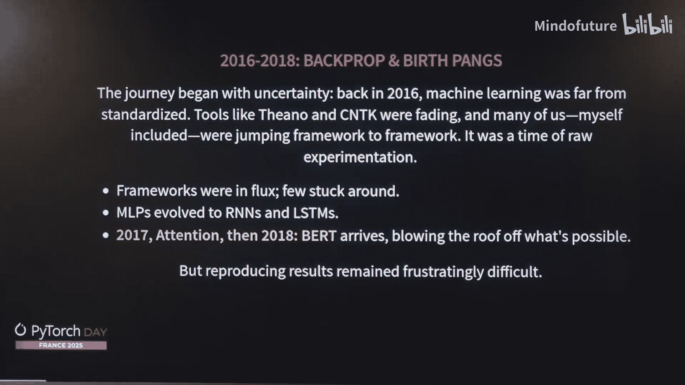
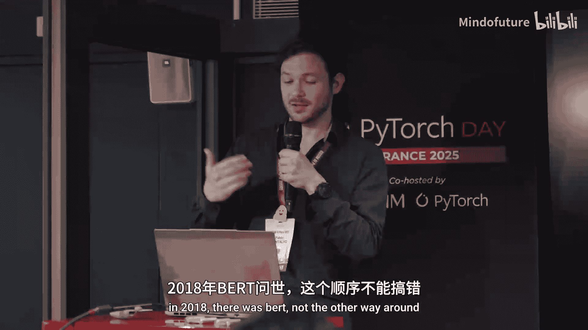
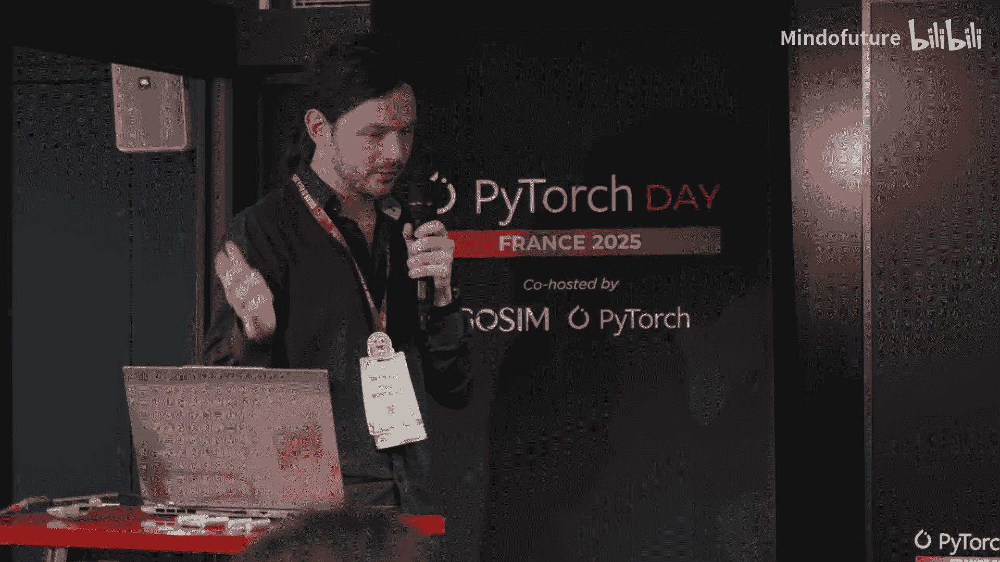
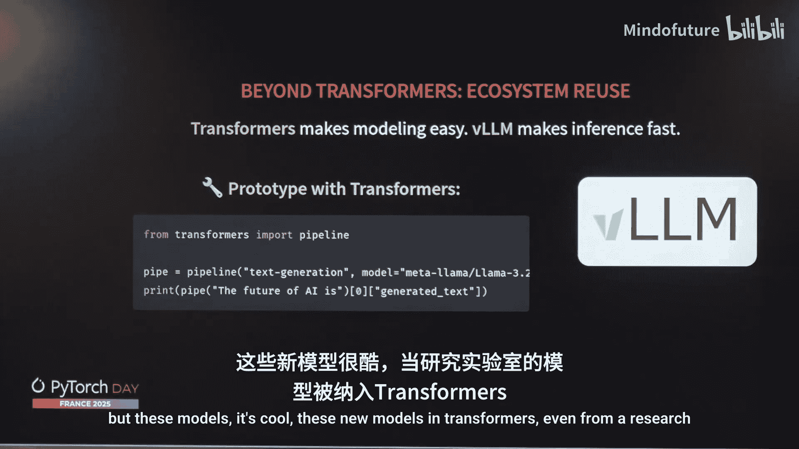
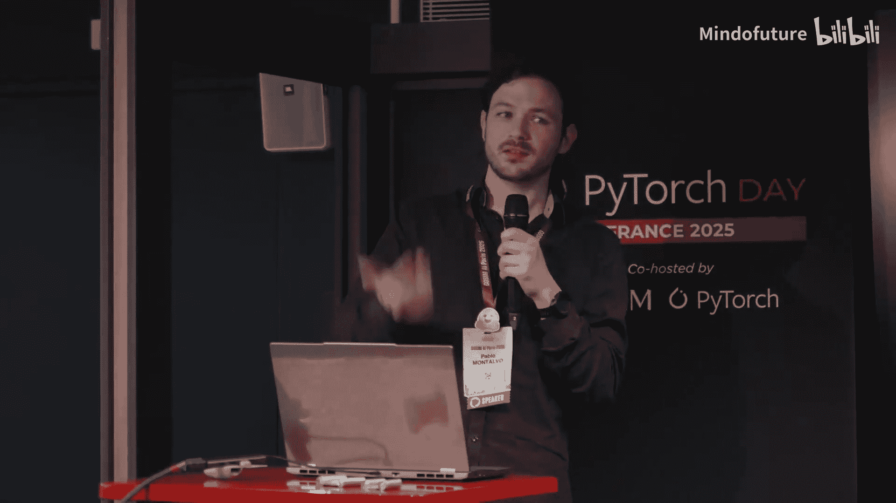

# 015：Hugging Face Transformers库的演进与未来


在本节课中，我们将跟随Hugging Face的Pablo Montalvo，回顾Transformers库如何从早期框架混战中脱颖而出，并了解其核心设计理念、近期重要特性以及未来的发展方向。我们将重点关注其如何通过模块化、可复现性和生态系统集成来支持现代机器学习模型的快速发展。



## 从物理学家到机器学习工程师



上一节我们介绍了课程背景，本节中我们来看看讲者Pablo Montalvo的个人经历。他最初是一名物理学家，大约在2015-2016年左右转向机器学习领域。


当时正处于机器学习框架的“蛮荒时代”，许多框架诞生又消亡。Pablo曾使用过Theano、Caffe等框架。许多开发者从其他框架转向了PyTorch。

## Transformers库的诞生与核心范式

上一节我们了解了背景，本节中我们来看看关键转折点。2017年出现了Attention is All You Need论文，2018年BERT模型发布。

当BERT出现后，业界意识到必须将其纳入技术栈，因为它能为推荐系统等产品带来巨大提升。但在当时，部署这些模型非常困难。



一个关键的改变因素是`pytorch-pretrained-bert`库的出现，这是Transformers库最初的名字。它基于PyTorch的动态计算图特性，并由许多优秀开发者设计，遵循了一些核心范式。

以下是其核心设计理念之一：

*   **可 hack 性**：开发者需要能够拆解模型，自定义组件，并以自己想要的方式重新定义和训练它。

动态计算图等特性使得开发团队的迭代周期大大缩短，从几小时缩短到几分钟，这并非夸张。但这只有在库的设计遵循特定范式时才可能实现。

## 统一文件与向后兼容性

上一节我们介绍了可 hack 性，本节中我们来看看另外两个关键范式。Transformers库基于许多范式，其中之一是“一个文件至关重要”。

*   **统一文件**：模型的所有组件、前向传播、参数加载方式都定义在一个地方，没有复杂的继承关系。这意味着当需要集成新模型时，评审者只需查看差异部分，决策速度更快。

第二个至关重要的范式是**向后兼容性**。为了确保结果在10年甚至20年后仍可复现，API一旦确定就几乎不允许更改。这是一个艰难的决定，但它允许模型和功能不断堆叠发展。

这使得Transformers库能够大规模增长，定义越来越多的模型。科学界和公司都能为其贡献代码。这也反过来推动了PyTorch生态系统的演进。

当然，强范式也带来挑战：维护压力大，代码重复度高，并且在一定程度上牺牲了库的“Pythonic”特性。

## 现代化升级：模块化Transformers

上一节我们提到了强范式的挑战，本节中我们来看看为应对这些挑战而引入的现代化升级。其中之一是**模块化Transformers API**。

它允许开发者定义一个不可调用的模块化配置文件。以下是一个真实示例（GLM模型）：

```python
# 这是一个概念性示例，展示模块化配置的思想
model_config = {
    “architecture”: “GLMForCausalLM”,
    “hidden_act”: “gelu”,  # 与LLaMA不同
    “attention”: “LlamaAttention”,  # 但有细微改动
    “mlp”: “GLUMLP”,  # 使用GLU结构的MLP
}
```

通过这种方式，模型架构被一次性定义。建模代码变得可运行且自动化。评审者只需关注与现有模型的差异。目前这主要用于重构模型，使其定义更清晰。研究社区也可以利用它快速定义新模型变体。

## 开发与调试工具

上一节我们介绍了模块化，本节中我们来看看提升开发效率的工具。由于一切依赖于`nn.Module`，我们可以追踪流经模型的每一个激活值。

这有助于确保复现性，避免在实现模型时错误地修改了激活函数。实现方式非常简单：

```python
# 伪代码，展示追踪思想
tracer = ActivationTracer(model)
output, traced_activations = tracer(input)
# 将 traced_activations 与参考值对比
```

这是一个简单的调试工具，但在集成复杂模型时非常有用。

## 分布式张量与高效加载

上一节我们介绍了调试工具，本节中我们来看看性能优化特性。**分布式张量**（DistributedTensor）支持张量并行。

以前，为了跨设备进行线性投影等操作，需要修改建模代码。现在，只需在模型配置中通过正则表达式指定张量并行方案：

```json
{
  “tensor_parallelism”: {“pattern”: “layerwise”, “size”: 2}
}
```

建模代码的架构骨架无需改变，改变的只是配置类型。系统会自动处理初始化和分发。例如，一个100B参数的模型可以分布在多个GPU上。

另一个改进是**智能缓存分配器**。在加载大模型时，它能最小化内存分配操作次数。例如，加载50B或100B参数的模型现在可以在约1分钟内完成，而之前可能需要8分钟。

## Python生态与内核社区

上一节我们讨论了性能，本节中我们来看看底层生态。Transformers的成功部分得益于Python的低入门门槛、可读性和高级抽象能力。开发者可以先用Python实现想法，再依赖底层扩展（如C++内核）进行加速。

但Python速度相对较慢，且来自研究实验室的代码通常不是生产级别的。为了优化，Transformers库推出了 **Kernel Community** 计划。

其思想是，例如，一个激活函数可以从 `kernels/activation` 仓库获取，并通过装饰器应用到运行代码中。建模代码依然不变，但利用了优化后的内核。这允许内核开发者构建并上传优化内核到Hub，供整个社区使用。

## 多模态支持与生态系统集成

上一节我们聚焦于文本模型，本节中我们来看看更广阔的应用。Transformers库不仅支持密集文本模型，也支持图像、视频、音频等多种模态。

其API对所有模态保持一致。越来越多的模型被集成进来，得益于PyTorch、TorchVision和TorchAudio等库，处理速度得到了大幅提升。例如，使用TorchVision后端处理单张图像比使用PIL更快。

以下是Transformers库中按模态统计的模型贡献趋势图（概念描述）：文本模型（蓝色）占据主导但增长平稳，图像模型（红色）增长迅速，音频和视频模型也在稳步增加。目前已有超过300种架构得到支持，且每周都有新模型加入。

当一个新模型被集成到Transformers库后，游戏才刚刚开始。它使得该模型能够被生态系统中的其他成员轻松复用。

例如，**vLLM** 以其极快的推理速度闻名。开发者可以用Transformers库快速原型设计，然后通过指定后端为vLLM，轻松切换到生产级推理。理论上，所有在Transformers中可用的模型都能在vLLM中得到支持。



同样的情况也适用于其他推理库，如TGI（Text Generation Inference）。因此，Transformers库正在成为整个生态系统的**后端模型定义中心**。



## 总结与未来展望

本节课中，我们一起学习了Hugging Face Transformers库的发展历程。

我们回顾了它如何通过**可 hack 性**、**统一文件**和**向后兼容性**等核心范式，在早期框架竞争中胜出，并极大地缩短了模型开发迭代周期。

接着，我们探讨了其为适应现代模型爆炸式增长而引入的现代化特性：**模块化Transformers API** 提升了代码清晰度和复用性；**激活追踪**和**分布式张量**增强了调试能力和训练/推理效率；**智能缓存分配器**大幅优化了大模型加载速度。

我们还了解了其如何依托 **Python生态** 和 **Kernel社区** 来平衡易用性与性能。最后，我们看到了Transformers库对**多模态模型**的广泛支持，以及它如何作为**后端模型定义中心**，与vLLM、TGI等高性能推理库深度集成，推动整个开源机器学习生态系统的发展。

展望未来，Transformers库的目标是继续巩固其作为模型架构“唯一事实来源”的地位，确保新的模型研究能够以最快速度被整个社区应用和优化。