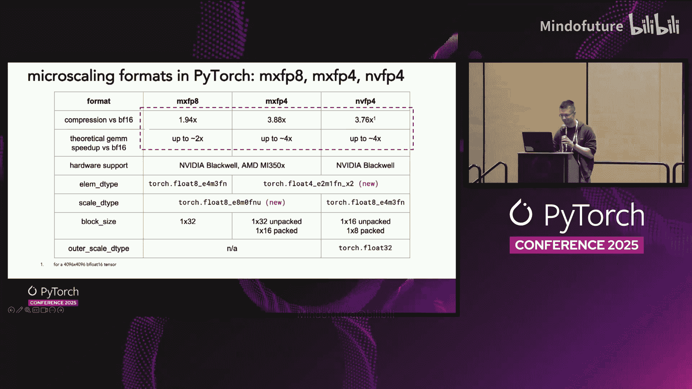
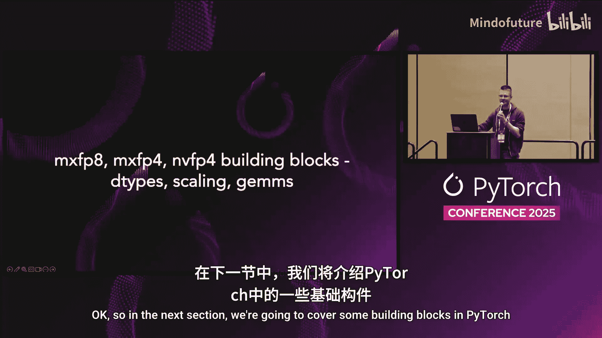
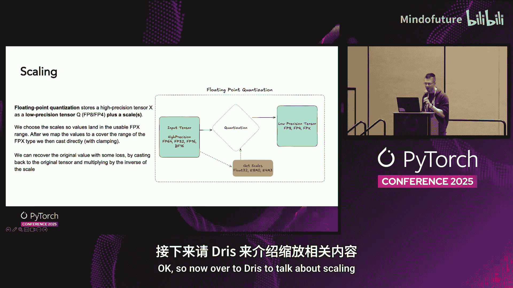
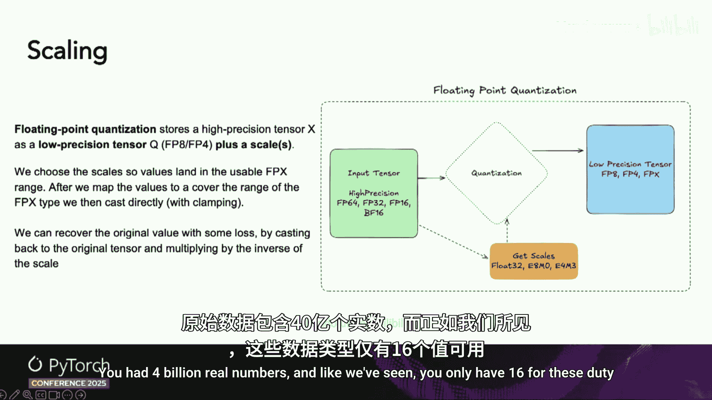
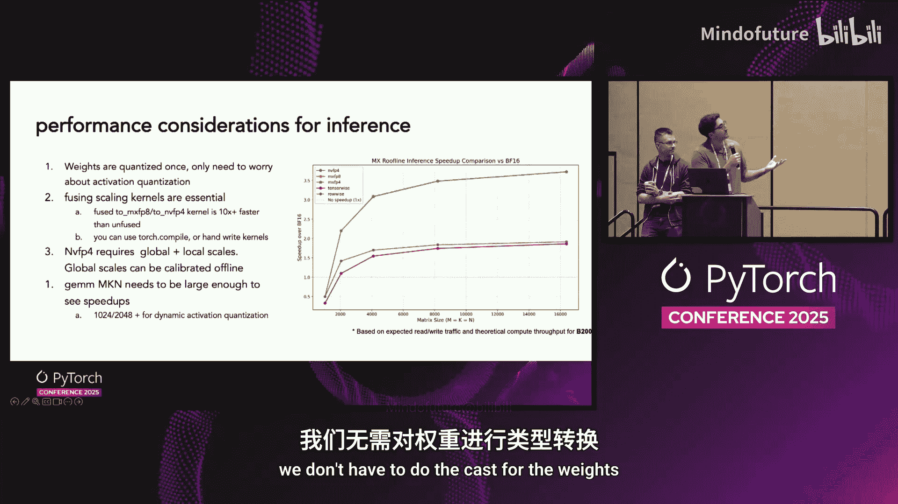
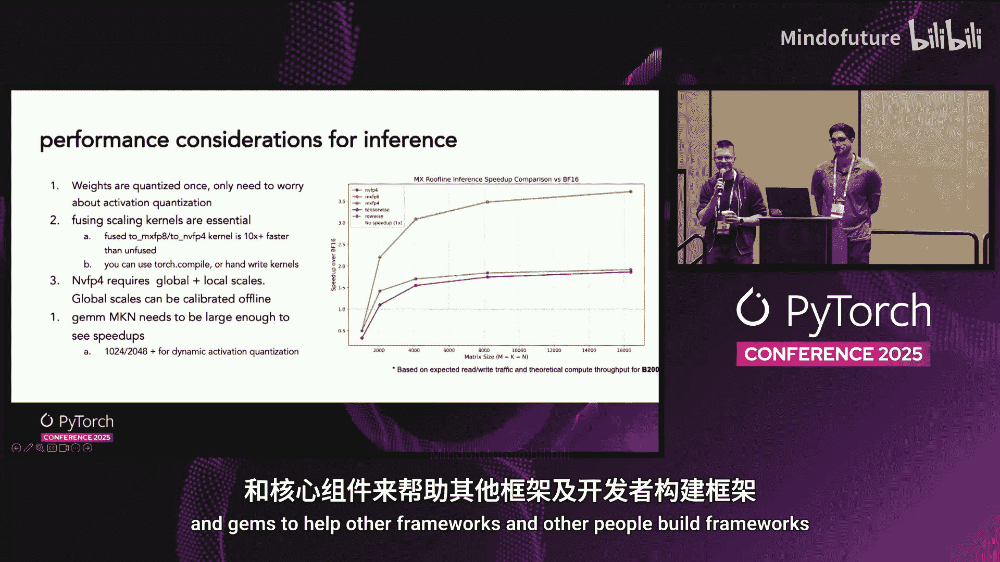
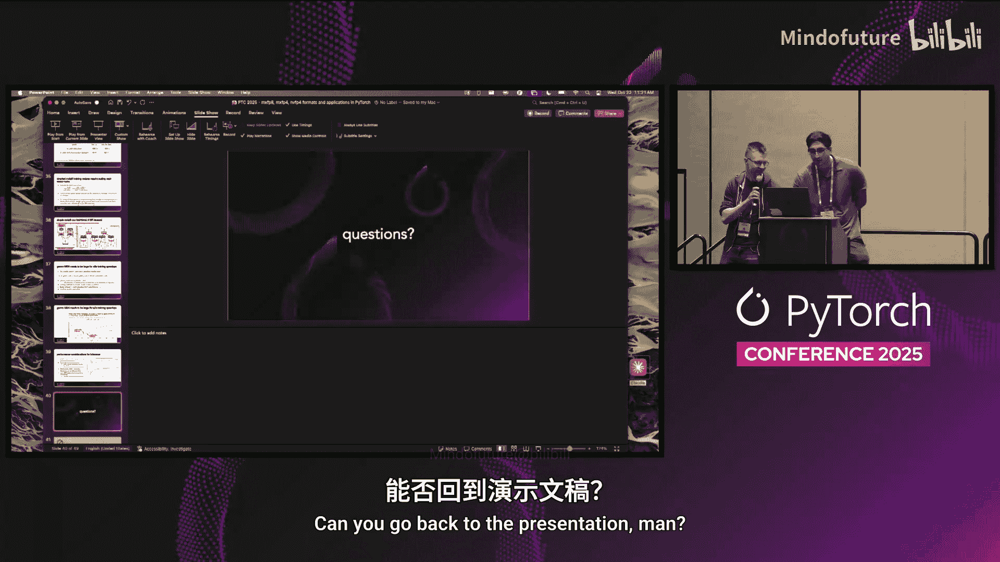

# 001：MXFP8、MXFP4、NVFP4 格式及其在 PyTorch 中的应用

在本教程中，我们将学习三种新的低精度浮点格式：MXFP8、MXFP4 和 NVFP4。我们将了解它们是什么、为什么使用它们，以及如何在 PyTorch 中利用它们来加速训练和推理。课程将涵盖核心概念、新的数据类型、缩放技术、性能考量以及相关的 PyTorch 构建模块。

## 概述：什么是低精度格式？ 🤔

在深度学习中，模型参数和激活值通常使用高精度数据类型（如 FP32 或 BF16）存储和计算。然而，这需要大量的内存和计算资源。低精度格式通过使用更少的比特位（如 8 位或 4 位）来表示数据，从而减少内存占用并可能提升计算速度。

左侧是标准的 BF16 矩阵乘法流程。如果你想使用这些新格式，需要先将张量量化为 8 位或 4 位。这可能会引入一些精度损失和类型转换开销，但你会得到一个更小的张量，并且矩阵乘法运算可以运行得更快。如果使用 4 位格式，张量会更小，矩阵乘法也会更快。这本质上是一种性能与精度的权衡。

## 核心格式介绍 📊

以下是三种新格式的具体定义和特性。

*   **MXFP8**：
    *   **压缩比**：接近 2 倍。
    *   **GEMM 加速**：理论峰值可达 2 倍。
    *   **支持硬件**：新一代 NVIDIA 和 AMD 硬件。
    *   **元素数据类型**：`fp8_e4m3fn`。
    *   **缩放因子数据类型**：`fp8_e5m2fnuz`。
    *   **块大小**：1 x 32。
*   **MXFP4**：
    *   **压缩比**：接近 4 倍。
    *   **GEMM 加速**：理论峰值可达 4 倍。
    *   **支持硬件**：与 MXFP8 相同。
    *   **元素数据类型**：`fp4_e2m1fn`（两个数打包在一个字节中）。
    *   **缩放因子数据类型**：`fp8_e5m2fnuz`。
    *   **块大小**：1 x 32。
*   **NVFP4**：
    *   **压缩比**：接近 4 倍。
    *   **GEMM 加速**：理论峰值可达 4 倍。
    *   **支持硬件**：仅限 NVIDIA 硬件。
    *   **元素数据类型**：`fp4_e2m1fn`（两个数打包在一个字节中）。
    *   **缩放因子数据类型**：`fp8_e4m3fn`。
    *   **块大小**：1 x 16（解包后）或 1 x 8（打包后）。
    *   **额外缩放**：一个 FP32 的全局缩放因子。

## PyTorch 中的构建模块 🧱

上一节我们介绍了这些格式是什么，本节中我们来看看 PyTorch 提供了哪些基础构建模块来使用它们。

下图展示了使用这些格式量化张量并进行矩阵乘法的高层流程。第二个方框代表缩放，你需要使用新的缩放格式。第三个方框是需要新的数据类型来表示 MX 格式张量中的数据。最后，你可以调用新的低精度矩阵乘法函数来获得性能提升。

### 新的数据类型

首先，让我们详细了解两种新的数据类型。

**1. `fp8_e5m2fnuz`**

这个数据类型表示一个 FP32 或 BF16 数字的指数部分。如果你只取 FP32 的指数位（可能经过舍入），就会得到一个 `fp8_e5m2fnuz` 数。`fn` 表示有限编码且包含非规格化数，`uz` 表示无符号编码。

**用途**：它是微缩放格式 MXFP8 和 MXFP4 的**缩放因子数据类型**。你可以用它进行 2 的幂次缩放。它在 PyTorch 2.7 及更高版本中可用。

这是一个**受限数据类型**，你只能在其上执行非常有限的操作。

**支持的操作**：
*   创建该类型的张量。
*   移动字节。
*   拼接（concatenate）。
*   改变视图（view）和形状（reshape）。
*   从高精度类型转换到该类型。
*   作为新矩阵乘法函数的缩放因子输入。

**2. `fp4_e2m1fn`（打包格式）**

这本质上是两个 fp4 数字打包进一个字节。想象从两个高精度数（如 float16）开始，经过一些舍入操作压缩为 fp4，然后将两个打包在一起得到这个新类型。`fn` 表示有限编码且无无穷大，`x2` 表示两个数打包进一个字节。

**用途**：它是我们现有的两种 4 位格式 **MXFP4 和 NVFP4 的元素数据类型**。它在 PyTorch 2.8 中可用，同样是一个受限数据类型。

**支持的操作**：
*   创建该类型的张量。
*   作为 4 位矩阵乘法函数的输入。

## 缩放技术：保留精度的关键 🔑

了解了新的数据类型后，我们来看看如何使用这些新格式。如果直接将一个高精度 FP32 张量存储为 FP4，会丢失太多信息。为了在转换到新格式时保留精度，一个关键技术叫做**缩放**。

其核心思想很简单：我们将一个高精度张量存储为一个低精度张量加上一些缩放因子，这些缩放因子通常也是张量。这样做是为了最小化信息损失。

### 为什么需要缩放？

在本次分享之前，你可能会想：“我知道怎么做，直接调用 `Tensor.to(fp8)` 就行了。” 但我们的目标是说服你不要这样做。

假设有一个正态分布的张量，其极值在 800 左右。如果直接转换为 FP8，我们需要将这些值裁剪到 FP8 可表示的最大值 448。所有超过此限制的值都会被裁剪到 448。与原始张量相比，这种量化-反量化版本的平均绝对误差和最大误差会非常高。

而如果使用一种非常基础的缩放方法（称为**每张量缩放**），从数字上可以看到，这个基础方法已经大大改善了平均绝对误差和最大误差。

### 缩放公式

以下是计算缩放因子的基本公式：

**`scale = (max_representable_value / runtime_amax) * (2 ^ power_of_two_adjustment)`**

分子是目标数据类型的最大可表示值（例如 FP8 是 448，FP4 是 6）。分母是运行时计算的张量绝对值最大值。额外的 2 的幂次调整与 `fp8_e5m2fnuz` 数据类型有关。

直观理解是：如果缩放因子大于 1，我们将拉伸适合范围内的值；如果小于 1，则压缩它们。

### 流行的缩放方案

让我们看看在 Hopper 和 MI300 GPU 上使用的两种流行缩放方案。

*   **每张量缩放**：整个张量使用一个缩放因子。这是最简单的理解方式。
*   **每行缩放**：顾名思义，不是每个张量用一个窗口，而是每行用一个窗口。这给了我们 M 个不同的窗口和 M 个不同的缩放因子。这最终提供了更多的总缩放因子，经验上可以减少异常值的影响，从而降低重建损失。

请注意，在这两种情况下，缩放因子本身都存储在 FP32 中。

### 更先进的方案：DeepSeek V3

另一个非常流行的方案由 DeepSeek V3 引入。根据张量是线性层或 MLP 层的激活还是权重，他们实际上使用了两种不同的方案。

使用不同方案的原因与需要在反向传播期间转置权重有关。如果你的块大小是方形的，重新计算会更快。

*   **对于激活**：使用 1 x 128 的窗口。换句话说，我们将张量按行拆分，然后将列拆分为大小为 128 的块。这个方案让我们更接近新的微缩放格式及其使用的方案。但同样，缩放因子是 FP32。
*   **对于权重**：使用 128 x 1 的窗口。

### MX 格式和 NVFP4 的缩放

现在，我们来看 MX 格式有什么新内容。这有点像对 Vasily 所讲内容的回顾，但我们将采用新的分块缩放方案。

*   **MXFP8/MXFP4**：我们采用类似 DeepSeek 的新分块缩放方案，但不是使用 1 x 128 的块，而是使用 **1 x 32** 的块。并且，缩放因子不再存储在 FP32 中，而是使用 PyTorch 中引入的新 `fp8_e5m2fnuz` 数据类型。
*   **NVFP4**：这是 Blackwell 上的另一个重要方案。块大小是 **1 x 16**。NVFP4 实际上进行两级缩放：一个**每张量的全局缩放因子**（FP32），然后是 1 x 16 的块缩放因子（存储在 `fp8_e4m3fn` 中，而不是 `fp8_e5m2fnuz`）。

### 可视化流程

我们通过动画来可视化这些流程。从一个 BF16 高精度张量开始。

1.  **每张量缩放**：获取整个张量的一个 AMax 值，将其转换为缩放因子，广播到每个元素，进行逐点乘法，然后直接转换到新数据类型。
2.  **每行缩放**：类似，但广播仅限于行内窗口。
3.  **分块缩放**：每个块缩放因子仅应用于相应的数据块。

## 性能考量：内核融合与形状大小 ⚡

上一节我们介绍了如何使用缩放来应用这些格式，本节我们关注性能。对于端到端的方案，**内核融合**变得至关重要。

### 为什么需要内核融合？

这些数字是在 B200 GPU 上收集的。我们可以看到，每行缩放和 MX 缩放可以在单个内核中完成，而每张量缩放需要多个内核。未融合的缩放操作很慢。

原因是：没有融合，它们需要多次往返全局内存，而这些内核的算术强度使它们严格受内存带宽限制，因此这最终非常浪费。

### 低精度矩阵乘法

这些低精度 MX 格式的主要好处之一是在新一代硬件上显著提高的计算吞吐量。具体来说，这些格式对矩阵乘法最重要，因为那是所有浮点运算发生的地方。

我们已经完成了将数据量化为低精度格式的工作，并探索了最小化误差的不同方案。现在，我们能够在单次计算中完成这个操作，但为了真正实现好处，我们需要能够消费这些格式的专用矩阵乘法操作。

这就是 PyTorch 新的 `torch._scaled_mm` 的用武之地。它让你可以表达缩放方案、数据格式、这些缩放的布局，我们会自动将其匹配到你所处特定硬件的高性能矩阵乘法内核。你描述你想要什么，PyTorch 处理路由，你得到正确的内核。

虽然幻灯片中没有显示，但我们也有一个新的公共低精度矩阵乘法内核 API，这对于当前非常流行的混合专家模型非常重要。

### 速度提升多少？

基准测试很难，有很多陷阱。这是在 B200 GPU 上使用最新版 PyTorch 测试的。灰色条形图是 BF16 性能，紫色是 MXFP8，橙色是 NVFP4。我们看到的明显趋势是，对于更大、更受计算限制的内核，总 FLOPS 和相对于 BF16 的加速比接近它们的理论值（MXFP8 为 2 倍，NVFP4 为 4 倍）。

## 训练与推理的性能贴士 🏃

我们将分享一些在进行低精度训练时，仅考虑性能的重要因素。我们只讨论为什么使用融合内核很重要，以及它能带来多少性能提升，还有为了在低精度训练时期望获得加速，你应该拥有多大的矩阵乘法形状。

### 训练性能

首先，这里有一个表格来证明你需要有尽可能少的内核。

表格有两行。第一行是一个未融合的内核，用于跨设备将你的 BF16 张量转换为 MXFP8，使用原生 PyTorch 操作实现。第二行代表了相同操作但融合后的性能，我们选择使用 `torch.compile` 或类似 Triton、CUTLASS 或 handwritten kernel 来实现。对于这些实现，融合版本快 3-4 倍，甚至 10 倍或更多。因此，你真的需要融合内核。

此外，如果你考虑你朴素的低精度训练方案，你有前向和反向传播的矩阵乘法公式。常见的矩阵乘法内核目前要求第一个操作数为行主序，第二个操作数为列主序内存布局。由于这个要求，对于缩放因子是 1D 的格式，你实际上需要将每个张量缩放两次，以获得所有这六个低精度张量。在示意图中，你可以看到这里有六个 `to_mxfp8` 内核。因此，基本上你真的需要融合你的内核，无论是通过像 `torch.compile` 这样的编译器，还是通过手写与你模型相关的融合内核，以获得相对于 BF16 的加速。

第二点，为什么你需要有大的矩阵乘法才能从低精度训练中看到好处。我将以 MXFP8 为例，但 MXFP4 和 NVFP4 非常相似。

这里有一个非常简化的公式。基本上，如果你尝试进行低精度训练，你的基线是 BF16 矩阵乘法时间，因为你不需要为 BF16 缩放任何东西。只有当公式右侧小于左侧时，你才会看到加速。在矩阵乘法上，你可能会得到 1.7-1.8 倍的加速，略低于 2 倍，然后你需要支付一些开销来将张量从高精度转换为低精度。对于大形状，矩阵乘法时间是立方的，而缩放内核和内存带宽是平方的。形状越大，立方项越占主导，那就是你看到加速的地方。

因此，如果你把所有这些东西代入一个简单的屋顶线模型，并代入你硬件的内存带宽和报告的或峰值计算能力（本幻灯片使用的是 NB200 的数据），你可以看到，随着矩阵乘法大小的增加，最终量化矩阵乘法带来的好处会大于缩放张量所支付的开销。所以，形状越大，你从低精度训练中获得的收益就越多。

### 推理性能

对于推理，由于权重是静态的，我们将量化它们一次，并通常将它们存储在检查点中。与训练类似，激活的动态缩放也应该融合到内核中。这可以通过自定义 CUDA、Triton 内核或 `torch.compile` 来完成。

我们已经看到，计算全局缩放因子与局部缩放因子相比可能非常昂贵。因此，对于 NVFP4 或其他需要每张量缩放的方案，通常最好在代表推理期间将看到的数据上进行离线校准。

同样，矩阵乘法形状需要显著大才能看到性能好处。这又是一个简单的屋顶线模型，只是现在我们不需要为权重进行转换。

## 总结 📝

在本节课中，我们一起学习了三种新的低精度格式：MXFP8、MXFP4 和 NVFP4。我们了解了它们通过减少内存占用和提升计算吞吐量来加速训练和推理的潜力。课程详细介绍了 PyTorch 中支持这些格式的新数据类型（`fp8_e5m2fnuz` 和打包的 `fp4_e2m1fn`），并深入探讨了缩放技术作为保留精度的关键，包括每张量、每行和分块缩放等方案。我们强调了内核融合对于实现端到端性能提升的重要性，并讨论了在训练和推理中，为了从这些低精度格式中获益，所需的矩阵乘法形状大小等性能考量。掌握这些构建模块和概念，将帮助你更有效地在 PyTorch 中利用新一代硬件的低精度计算能力。