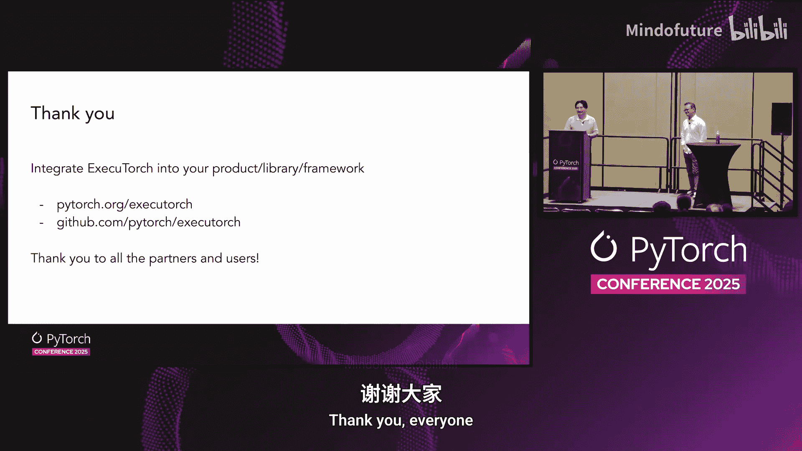

# 002：ExecuTorch 1.0 - 移动与嵌入式平台通用可用性状态概述

## 概述

在本节中，我们将介绍 PyTorch 的端侧 AI 解决方案 **ExecuTorch 1.0** 的正式发布。我们将探讨其设计目标、核心优势、面临的挑战、关键特性以及生态系统集成情况。ExecuTorch 旨在让开发者能够轻松地将 PyTorch 模型部署到移动和嵌入式设备上，实现高效、低延迟的本地推理。

---

## 端侧 AI 的优势与挑战

大家好，我是 Billin，PyTorch 端侧团队的工程经理。这位是 Mergen，我们在 ViML 领域的技术负责人。今天我们将为大家带来 ExecuTorch 1.0 正式发布的消息。

**ExecuTorch 是 PyTorch 的端侧 AI 解决方案。** 我们构建 ExecuTorch 主要为了提升隐私性，确保用户数据保留在设备本地。例如，您可以在 WhatsApp 中进行实时翻译。它通过避免数据往返服务器的需求来降低延迟。通过在边缘运行机器学习工作负载，而非依赖昂贵的数据中心 GPU，它还能有效降低成本。此外，它提供了无需网络连接的远程访问能力。

在生成式 AI 和大语言模型领域，模型正变得越来越小、越来越智能。几年前需要大型模型才能完成的任务，如今通过更小的模型在边缘设备上即可实现。

然而，端侧 AI 也面临一些根本性挑战。**电池续航和功耗**是首要问题，在小型设备上很容易耗尽电量。这些边缘设备还存在**内存限制、内存带宽限制和散热限制**。当在边缘设备上运行这些工作负载时，您的眼镜等设备很容易发热。**硬件异构性**也是一个巨大挑战，市场上有多种不同的芯片组，为每个平台进行优化是一项艰巨的任务。

为了解决这些挑战，我们从头开始构建了 ExecuTorch。

---

## ExecuTorch 工作流程与设计原则

通过 ExecuTorch，我们得以保持在同一个 PyTorch 生态系统内，从模型创作到部署无缝衔接。您可以从 PyTorch 程序开始，利用 **Torch Export** 进行完整的计算图捕获，并通过渐进式降低，将 PyTorch 模型部署到边缘设备，而无需任何转换或重写。

以下是一个展示其简洁性的代码示例。初始化并导出模型非常简单：

```python
# 初始化您的模型
model = YourModel()
# 导出模型
exported_program = torch.export.export(model, ...)
```

在后续阶段，您可以将程序发送到边缘设备。在这个特定案例中，我们使用 **XNNPACK 分区器** 来利用 CPU 加速器。最后，您将程序写入 FlatBuffer 格式。

在运行时方面，给定模型文件后，仅需四行代码，您就能加载模型文件、创建示例张量，并通过简单的模块前向传播进行推理。我们在 C++ 端提供了简单的 API，在 iOS 端为 Swift 提供了相同的简洁性，在 Android 端为 Kotlin 也提供了类似的简洁体验。

我们的设计原则强调以下几点，希望这些对大家来说并不陌生：
*   **可移植性**：支持从强大的移动芯片组到嵌入式系统的多种边缘平台。
*   **高性能**：确保运行时轻量级，并与硬件合作伙伴紧密合作进行性能优化。
*   **开发效率**：保持在 PyTorch 工具链内，确保您能从创作到部署全程无忧，无需进行繁琐的转换和调试。
*   **开源与社区**：这是我们两年前发布 ExecuTorch MVP 版本的主要驱动力，我们希望与社区共同构建。
*   **模块化**：为 PyTorch 程序提供定义良好的工作流，涵盖从捕获、转换到执行的各个环节，并提供开箱即用的组件。

---

## 发展历程与 1.0 发布

回顾发展时间线，我们从 MVP 版本开始，主要目的是收集反馈并与社区共同构建 ExecuTorch 技术栈。不久之后，我们增加了 Llama 支持并发布了 Alpha 版本，这时视觉语言模型支持和 ExecuTorch 开始获得关注。我们大幅改进了 SDK，进行了许多委托后端增强。在去年的会议上，我们展示了大语言模型上的强劲性能数据，分享了一些早期采用案例，并提供了 API 稳定性保证。

今天，经过所有这些努力，我们正式宣布 **ExecuTorch 1.0 达到通用可用性**，并拥有多个成功案例。

我将从内部采用开始介绍。ExecuTorch 已集成到 Meta 的所有应用中，包括 Facebook、WhatsApp、Instagram 和 Messenger，为多种不同的用例提供支持，为数亿用户服务了数十亿次推理。这需要极高的可靠性和稳定性工作。它不仅为我们的知名应用提供动力，还为我们的 VR 头显和智能眼镜提供支持，我们在 Oculus 头显和 Ray-Ban 智能眼镜上运行着多个用例。

在外部成功案例方面，我们与多家公司合作，多个模型正通过这些外部合作伙伴提供服务。在软件层面，也有许多生态系统集成。我们与 Hugging Face 合作，通过 Optimum 增加了模型覆盖范围。与 TorchAO 在量化方面实现互操作性。与 OnLux AI、Us 和 Media Flair 在设备端训练方面合作，与 Digica 在他们支持的多个用例上合作。这些生态系统集成和采用案例正在不断增加，我们期待未来会有更多。

自 Beta 版本以来，我们改进的另一个领域是**后端覆盖范围**。目前生产就绪的后端包括：
*   **XNNPACK** 与 Arm Compute Library：用于 CPU 加速。
*   **Apple CoreML**：用于 Apple Silicon。
*   **Qualcomm AI Engine**：用于高通 Hexagon NPU。
*   **Arm Ethos-U NPU** 和 **Vulkan GPU**。

这些后端都在为 Meta 的多个用例提供服务。

在过去六个月到一年里，我们还增加了许多其他后端，包括 Arm GPU、NXP 的 Neutron NPU、三星的 EnnoS NPU、Intel 的 OpenVINO，以及 Cadence DSP、MediaTek NPU、Apple NPU。我们将继续强化这些委托后端，确保它们也能为数百万用户服务。

在将演示交给 Mergen 之前，我再介绍几个为通用可用性版本开发的功能。本次发布的一个关键工作领域是**可靠性和稳定性**。为数亿用户和不同硬件的多种用例服务并非易事。ExecuTorch 现在已达到 Meta 的规模，能够扩展并提供这种可靠性。

得益于与合作伙伴的紧密合作，我们获得了强大的覆盖范围和性能保证。例如，在高通 AI 引擎后端，尤其是在大语言模型上，一些性能数据将在我们的网站上公布。在 Arm 侧，通过启用 CLDNN SMM2，多个用例可以在低功耗的 Arm Ethos-U 上高效运行。

我们还增加了 **Windows 支持**，并改进了 Swift Package Manager 和 Maven 的构建体验。我们添加了**程序与数据分离**功能，例如，现在可以运行 LoRA，这是社区长期期待的功能。**TorchAO 互操作性**对我们来说也至关重要，因为它使我们能够运行多种量化算法，如 GPTQ。我们还增加了一个实验性功能，通过 WebAssembly 实现 JavaScript 和浏览器支持。

---

## 演示与未来展望

现在，我将把时间交给 Mergen，让他带大家看一些演示。

谢谢 Billin。大家好，我是 Mergen。正如 Billin 所说，ExecuTorch 是一个通用运行时，任何可以用 PyTorch 编写的模型，都可以通过导出功能以最小的工作量进行部署。我们支持多种示例模型，包括大语言模型、计算机视觉模型、语音模型等等。

让我们以多模态模型为例。多模态架构现在相对标准化，通常包含音频编码器或视觉编码器、投影层和解码器层。我们正与 Hugging Face Transformers 库合作，尝试将其标准化，并以兼容的方式导出到 ExecuTorch。您可以使用在线脚本来运行它。例如，VoxStr 是一个处理音频输入模态的模型，您可以将其导出到 ExecuTorch，然后直接在运行时使用 Java、C++ 或 iOS 的 Swift 这三种 API 进行调用。

我们有几个演示。我们选择这个演示：它正在运行 **Gemma 3，一个 40 亿参数的视觉与文本输入模型**。它接收一张图像和一段文本作为输入，并在启用了 Arm CLDNN 的 XNNPACK CPU 后端上运行。这是一个受内存带宽限制的演示，因此预填充阶段较慢。但当它开始生成令牌时，速度大约能达到每秒 8 到 9 个令牌。

另一个演示是 **VoxStr 描述音频**。它尝试描述手机接收到的音频内容。例如，描述一段两人之间的对话。

第三个演示是关于 **LoRA** 的，这是我们常听到的需求。其理念是，您创建一个基础模型，比如使用 Llama 作为基础模型，然后使用两个数据集对其进行微调。在这个例子中，一个数据集是关于 2025 年诺贝尔奖得主的信息，另一个数据集是关于 ExecuTorch 教程的。我们展示了可以同时加载两个 LoRA 适配器，而不会产生额外的内存或二进制大小开销。

这些只是我们的一部分演示，您可以在我们的网站上查看更多成功故事和演示。

接下来，我想谈谈我们对 **1.1 版本及未来**的规划。迄今为止我们工作非常努力，但我们希望在未来做得更多。

首先，**后端强化**。目前我们有 12 个后端，其中 4 个已生产就绪。我们希望继续努力，让其余 8 个后端也达到生产就绪状态。

其次，**生态系统与中间件**。我们将 ExecuTorch 视为一个底层库。我们认为自然的下一步是出现中间层或更高级别的中间件，例如建模库或 SDK 可以直接集成 ExecuTorch，应用于机器人、物联网和移动空间。

第三，**桌面与笔记本电脑支持**。我们一直在谈论边缘设备，但房间里的大象是：能否在游戏 PC 上运行？许多人正在游戏 PC 上进行本地推理。我们受到 Llama.cpp 和 MLX 等优秀运行时的启发。ExecuTorch 传统上没有 CUDA 后端，但现在我们有了。

让我展示一个演示：这是一首诗歌，我们正在 Windows 系统的 RTX 580 显卡上运行这个模型，完全不需要 Python、任何 PyTorch 依赖或 LibTorch。我们询问模型“演讲者此刻感受如何？”，这个提示是特意选择的，因为与 Whisper 等模型不同，Whisper 无法传达情感，但通过这个演示，我们能够检索到音频中的情感信息。

我们还有更多演示。例如，**Gemma 3 模型**已可用。我们今天早上还启用了 **Whisper 语音转录模型**。让我们看看它能否在消费级笔记本电脑上快速转录音频。它成功地快速转录了文本。

我们已有一些初步的性能数据。这绝不是最终数字，但这是一个非常早期但充满希望的方向。其理念是，ExecuTorch 是**模型无关的**，因此您可以运行任何模型，而不仅仅是视觉或语言模型。您可以保持在 PyTorch 生态系统内，无需 Python 运行时，因此可以在原生 C++ 环境中运行，节省二进制大小。PyTorch 本身已有 CUDA 后端，我们不想重复造轮子，因此直接利用其编译器技术并与 ExecuTorch 实现互操作。我们已验证了在 Windows、WSL 和 Linux 上的支持。这为进入新的 AI PC 市场指明了方向。

此外，我们目前正在 MacBook 上试验类似的方法，利用 Metal GPU 和 AOT 编译。这是另一个例子，展示了如何将 PyTorch 核心的内核用于 Metal 后端，编译后进行推理。

---

## 总结

最后，我想退一步总结。我们讨论了 ExecuTorch 1.0，移动和嵌入式平台确实是我们的核心领域，我们将继续致力于此。

首先，我要感谢所有合作伙伴，在房间里看到许多熟悉的面孔，正是因为合作，我们才能成功宣布 ExecuTorch 达到通用可用性。同时，也要感谢 PyTorch 端侧团队的辛勤工作，让我们走到了今天这一步。




谢谢大家。