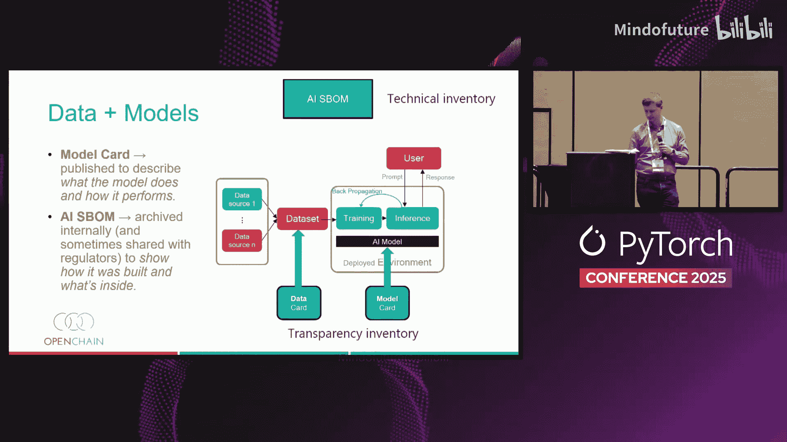
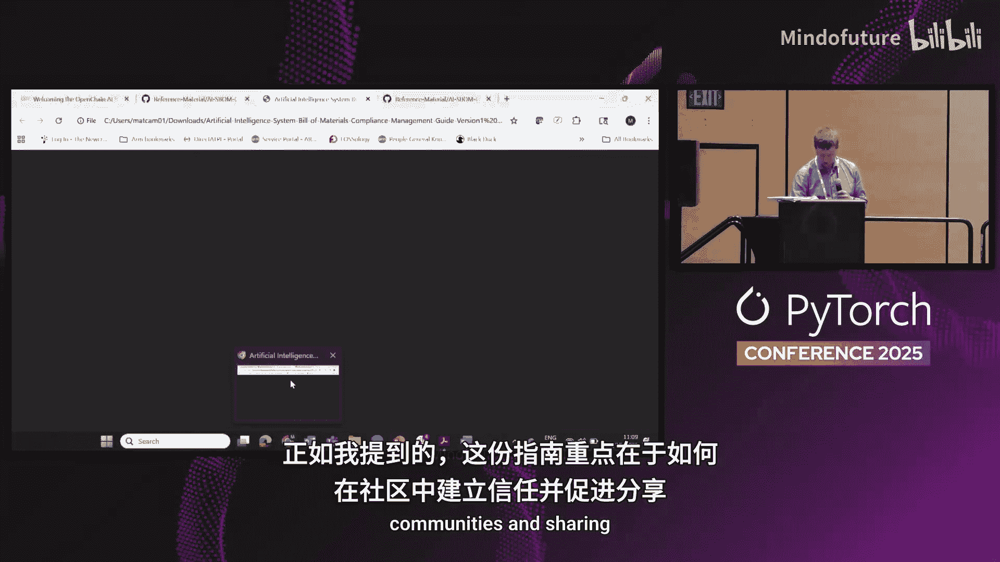
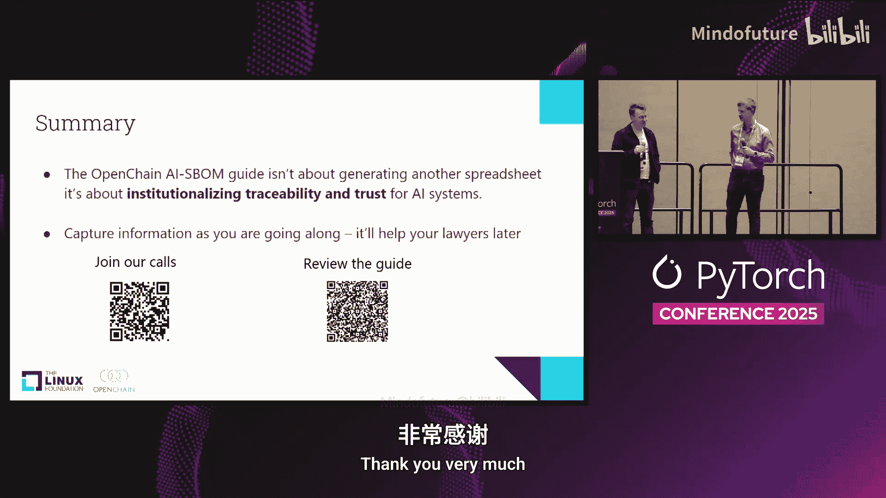

# 003：每个AI物料清单背后的雷区——如何规避风险

## 概述
在本节课中，我们将要学习如何通过建立可信的流程和创建AI物料清单来规避AI供应链中的风险。我们将重点介绍OpenChain社区及其AI工作组发布的指南，探讨如何通过标准化流程在生态系统中建立信任，并了解AI物料清单的核心概念与重要性。

## 建立生态系统中的信任
信任是任何合作关系的基础。在工作中，当我们从新的合作伙伴那里快速获得一份格式规范、内容准确的系统物料清单时，会立即对该组织产生信任。这种信任源于对方拥有成熟、可靠的流程来生成这份文档。

OpenChain社区在过去十年中，一直致力于通过与SPDX等社区合作，关注并优化生成此类文档的**流程**，从而在整个供应链中建立信任。这个流程包括文档的创建、审核以及人员培训等环节。

## OpenChain的愿景与成果
OpenChain的愿景是在供应链中建立信任。它通过创建标准、与社区合作以及提供参考资料来实现这一目标。其核心是分享最佳实践，使整个行业流程更高效、成本更低。虽然短期效益难以量化，但从长远来看，整个社区都能获得回报。

目前，OpenChain拥有25名董事会成员和数千名贡献者，并已推动创建了两项ISO标准：
*   **ISO/IEC 5230**：开源许可证合规性标准，于2020年成为ISO标准。
*   **ISO/IEC 18974**：开源安全保证标准，于2023年发布。

这些是高级别的流程标准，适用于各种规模的公司。它们不规定具体操作，但要求企业为关键活动建立流程。近期，全球各地的立法者（如欧盟的《网络弹性法案》和美国的行政命令）也开始要求提供软件物料清单，这印证了OpenChain等社区所做工作的基础性价值。

## AI工作组的诞生与使命
随着AI的快速发展，其合规性问题超越了传统的开源许可证范畴，涉及数据来源、隐私和模型行为等新风险。为此，OpenChain在2023年成立了AI工作组。

该工作组由AI合规领域的行业专家组成，目标是撰写指南，明确AI合规的最佳实践。经过18个月的讨论与撰写，工作组于昨日正式发布了《OpenChain AI SBOM指南》。

## 《OpenChain AI SBOM指南》详解
这份指南旨在帮助开发AI模型的组织分享最佳实践，建立信任。它分为三个部分，其中第三部分是核心内容。

以下是该指南要求组织建立的关键流程概述：
*   **制定AI政策**：公司应制定明确的AI政策。
*   **配备合格人员**：确保组织内拥有具备合适技能的人员，无论是治理、技术、隐私还是其他相关领域，他们都应了解其角色的要求。
*   **定义模型范围**：公司应定义AI模型的范围并予以记录。
*   **履行许可证义务**：建立流程来审查训练数据及模型所涉及的各种许可证（开源或专有），确保合规。
*   **明确透明度义务**：重点是审查需要披露的内容，而非规定必须披露什么。
*   **确保资源与访问权限**：项目应获得必要的资源和人员访问权限。
*   **创建AI物料清单**：应建立创建AI物料清单的流程。清单格式不限，但SPDX是一种推荐格式。清单内容应包含模型构建信息及其内部组成。
*   **建立治理与监督**：应有人员负责模型的治理，并关注不断出台的新法规（如欧盟《人工智能法案》），确保流程符合最新要求。

这份指南共6页，内容较为概括，是一种“轻触式”的流程建议。其目的是希望组织能尽早采用，从而在AI革命中通过建立可靠的流程来构建信任。

## AI物料清单的核心概念
传统的软件物料清单主要关注软件组件及其许可证，而AI系统结合了软件、数据和模型，其风险已超越许可证合规。

SPDX 3.0标准为此增加了AI和数据集配置文件，以捕获这些新信息。一个AI物料清单应包含以下关键字段：
*   **模型类型**
*   **训练信息**
*   **能耗**
*   **可解释性**
*   **偏差**
*   **模型大小**
*   **更新机制**
*   **风险评估**

AI物料清单的具体内容可能差异很大。未来几年，随着实践发展，哪些字段是必需的或属于最佳实践将逐渐明晰。目前，监管机构已开始要求提供AI物料清单，用于披露和审计准备。

## 总结与行动呼吁
本节课我们一起学习了OpenChain AI物料清单指南。这份指南的核心是关于在AI系统中建立信任。它不仅仅是另一张需要填写的表格。

对于开发者而言，现在就开始记录模型的训练数据、数据许可证等信息至关重要。这将在未来需要依法披露信息时，为法务团队提供极大帮助。

我们呼吁大家：
1.  如果您对AI系统合规性感兴趣，请加入OpenChain AI工作组的月度会议。
2.  审阅这份指南，并通过会议反馈您的意见。
3.  开始尝试采纳指南中的建议，因为我们需要共同构建对AI系统的信任。

通过标准化流程和创建透明的AI物料清单，我们可以减少供应链中的摩擦，加快交易速度，让各方都能更专注于开发优秀的产品本身。这正是OpenChain指南希望达成的目标。