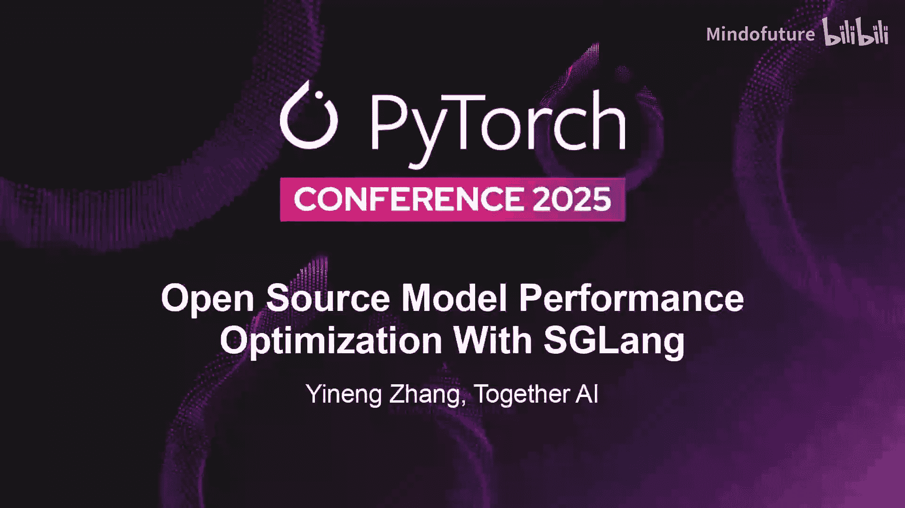
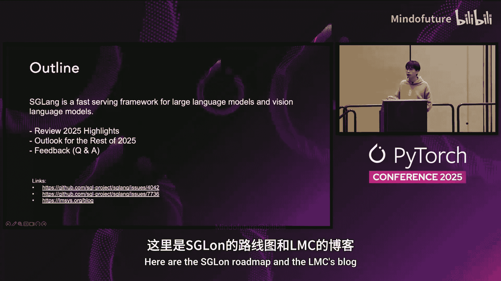
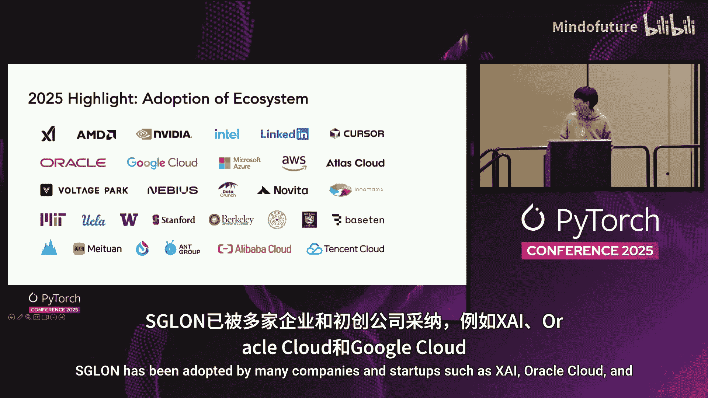
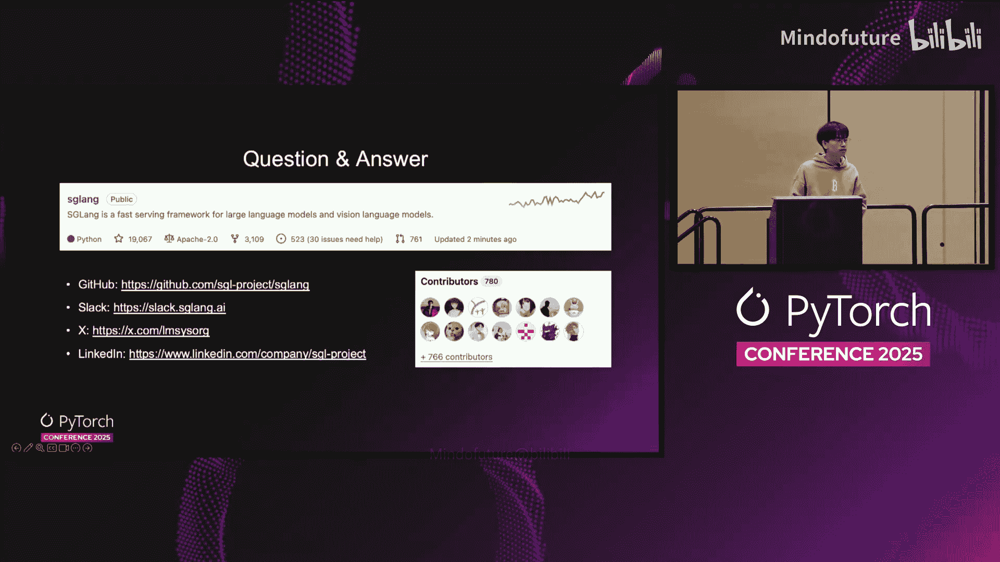
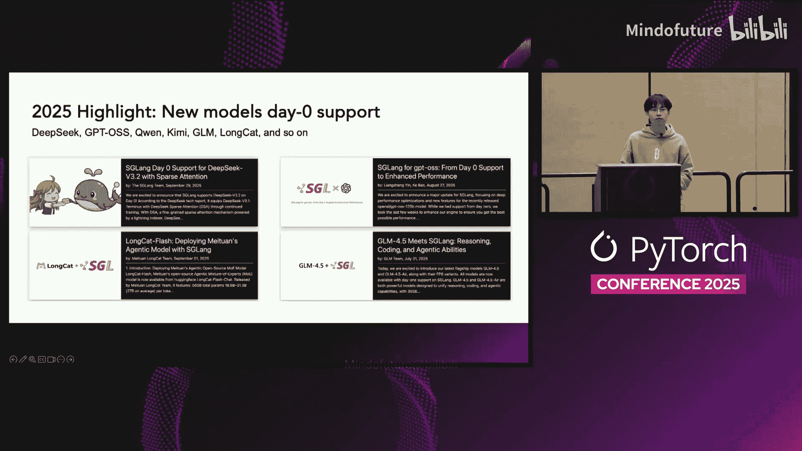
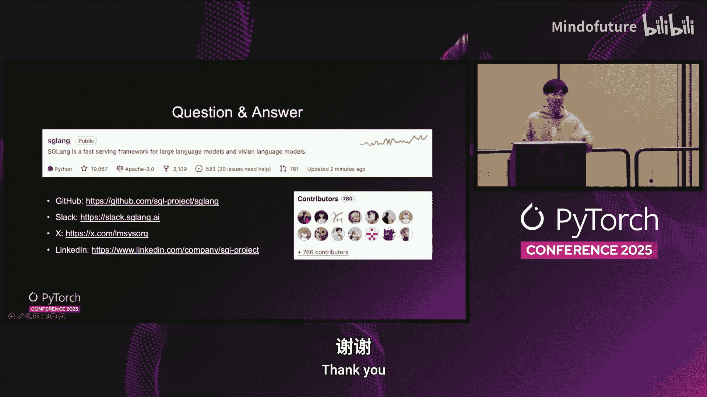

# 004：使用SGLang优化开源模型性能

在本节课中，我们将学习如何使用SGLang框架来优化开源大语言模型和视觉语言模型的推理性能。我们将回顾SGLang在2025年的主要亮点，并展望其未来的发展路线图。

## 概述

SGLang是一个用于大语言模型和视觉语言模型的快速推理框架。本次分享将介绍其在2025年的关键优化、大规模部署、强化学习集成等方面的进展，并探讨其生态系统的发展。

## 2025年亮点回顾

接下来，我们来看看SGLang在2025年取得的一系列重要成就。

以下是2025年的主要亮点：
*   **DeepSeek-V3优化**：实现了多项优化，使吞吐量提升近2倍。
*   **大规模部署**：通过优化，实现了单节点52K输入令牌/秒和22K输出令牌/秒的性能。
*   **强化学习集成**：SGLang被用于SLIME框架，支持了GLM-4.5/4.6等模型的大规模训练。
*   **推测解码训练**：推出了SpecForge项目，支持Quen-3、GPT-OAS等先进架构的训练。
*   **高性能缓存**：通过高缓存和GPU辅助I/O架构，实现了高达6倍的吞吐量提升和84%的TTFT降低。
*   **确定性推理**：支持完全确定性的推理，性能提升超过2倍。
*   **新模型支持**：为DeepSeek-V3、GPT-OAS、Quen、Kimi、GLM、LongChat等模型提供了支持。
*   **模型部署编排**：与OME项目集成，支持企业级大模型的一键部署。
*   **生态系统采用**：已被X.AI、Oracle Cloud、Google Cloud等多家公司和初创企业采用。

## 2025年展望

上一节我们回顾了SGLang已取得的成就，本节中我们来看看其未来的发展计划。

以下是SGLang在2025年剩余时间的展望：
*   **推测解码内存池**：正在开发相关功能。
*   **多平台抽象**：计划支持NVIDIA、AMD、Intel、NU和TPU等多种硬件平台。
*   **持续模型优化**：将继续优化DeepSeek-V3、GPT-OAS、Quen等模型，追求顶级的性能和可靠性。
*   **Astro路由器升级**：下一代SGLang模型网关正在开发中，旨在实现更便捷的部署。

SGLang项目已在GitHub上获得19k星标，欢迎社区贡献和反馈。

## 问答环节总结

在本次分享的最后，我们进行了一场问答交流，探讨了多个技术细节。

以下是问答环节的核心内容：
*   **引擎对比**：在开源领域，vLLM、SGLang和TGI是主要推理引擎。在NVIDIA GPU上，vLLM性能最佳；SGLang则在易用性上具有优势。
*   **SGLang的流行原因**：因其对DeepSeek-V3等前沿模型的“Day 0”支持而广受欢迎，与前沿实验室保持了良好的合作关系。
*   **硬件支持**：SGLang主要支持NVIDIA、AMD和TPU，其他硬件由合作伙伴提供支持。
*   **SpecForge训练数据量**：训练一个Eagle-3 draft模型大约需要1T的公开数据集数据。
*   **B200优化**：最新版本支持FP4量化，在MOE模型上推荐使用，可达到约300 tokens/秒（batch size=1）的性能，且对GSM8K、MMLU等基准测试的精度影响很小。
*   **SLIME框架价值**：解决了将内部训练代码与开源推理引擎桥接的痛点，已用于GLM-4.5/4.6的生产训练。
*   **消息队列**：目前使用ZeroMQ和CMQ，暂无替换计划。
*   **确定性推理性能**：启用确定性推理会影响性能，但通过与CUDAGRAPH兼容，仍能获得2.8倍的加速。
*   **OME一键部署**：与Kimi和OME团队合作，支持根据模型配置和流量模式动态调整预处理与解码节点的比例。
*   **传输引擎**：支持Mooncake、NCCL以及AMD开发的传输引擎等多种后端。
*   **新架构支持**：已支持Quen-3-Next混合架构和Mamba架构。
*   **FlashAttention-4**：已集成，目前支持预览版，可用于混合注意力（如预填充使用FA4，解码使用其他注意力后端）。
*   **选型建议**：对于企业垂直应用，建议根据具体用例、模型架构、目标硬件和工作负载进行基准测试，以选择最合适的推理引擎。

## 总结

本节课中，我们一起学习了SGLang框架在2025年如何通过一系列技术创新优化开源模型的性能。我们从DeepSeek-V3优化、大规模部署、新架构支持等多个维度进行了探讨，并了解了其未来的发展方向。SGLang凭借其性能、易用性和活跃的社区，正成为开源大模型推理领域的重要选择。