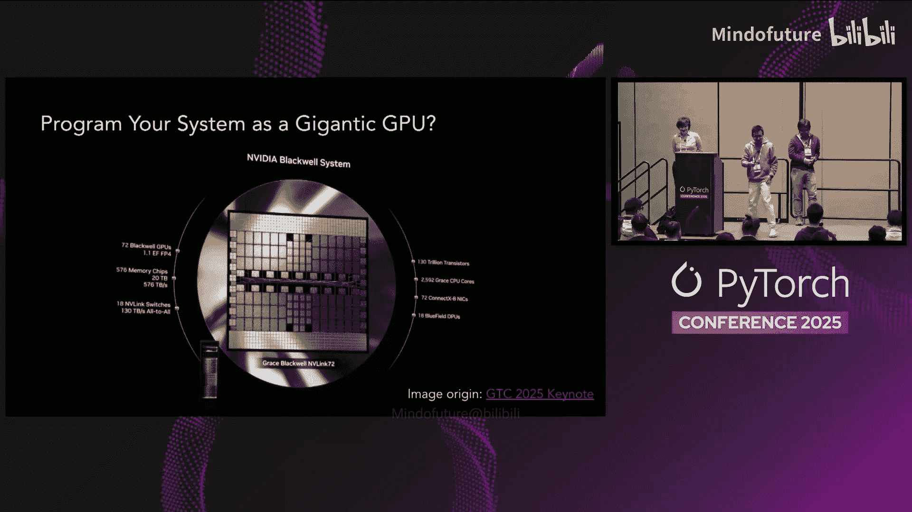
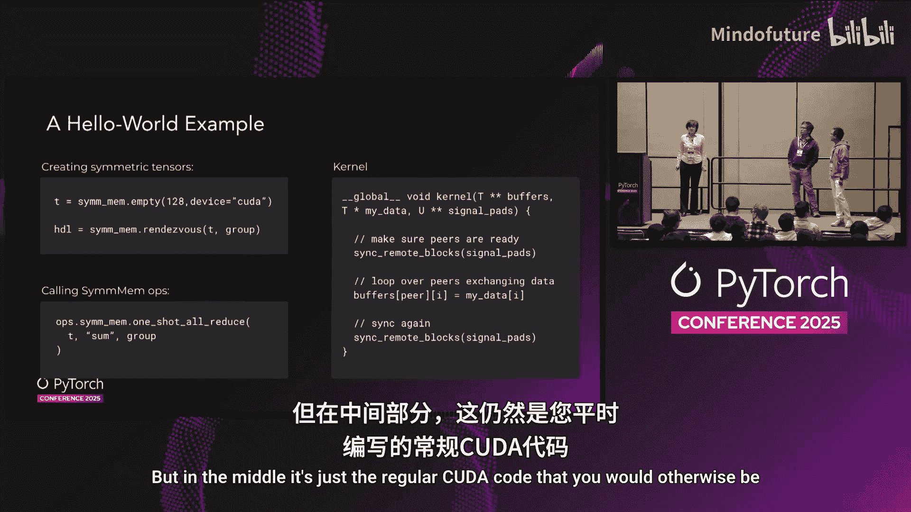
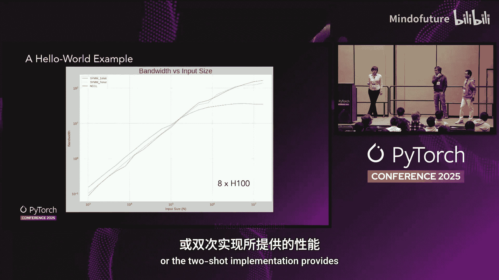
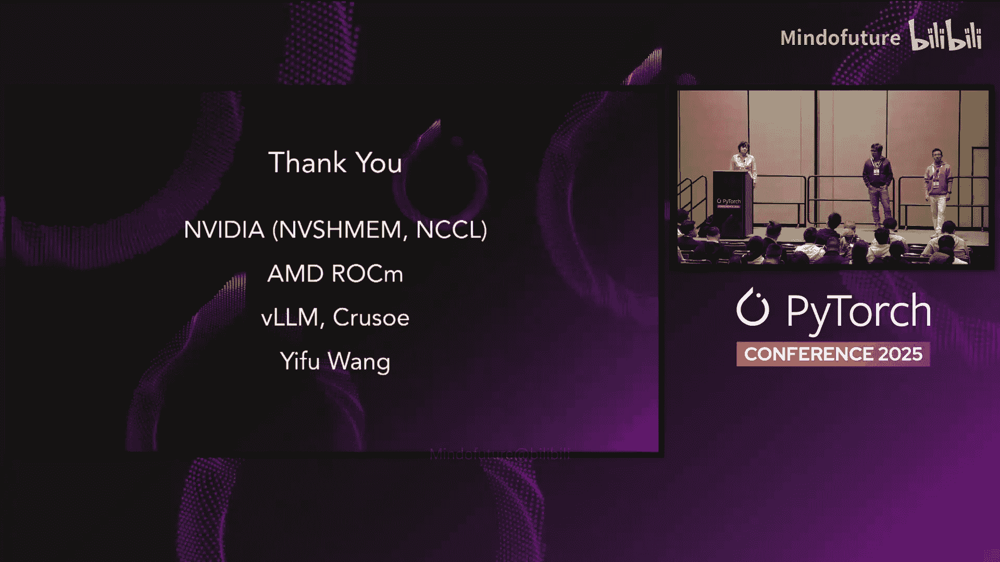

# 005：分布式AI的新编程范式 🚀


在本教程中，我们将学习PyTorch对称内存（Symmetric Memory）这一新的分布式编程范式。它允许开发者像操作单个巨型GPU一样编程多GPU系统，并能在单个设备内核中融合通信与计算。



---

## 什么是PyTorch对称内存？🤔

在深入之前，我们先回顾进程间的两种基本通信机制。

上一节我们介绍了通信的基本概念，本节中我们来看看对称内存如何实现更灵活的通信。

**消息传递**类似于将信息打包进盒子，送到邮局寄出。由于往返邮局的延迟，你会希望尽可能多地将信息塞进盒子，这限制了通信的灵活性。

**共享内存**是另一种方式，两个进程各自开辟一部分内存空间让对方可见。数据访问可以在非常细的粒度上任意进行，因此非常灵活。

既然共享内存如此强大，PyTorch应如何启用它呢？接下来，我们将从技术层面进行讲解。

---

## PyTorch如何实现对称内存？🔧

正确启用对称内存涉及几个技术挑战，PyTorch对称内存旨在为您解决所有这些问题。

以下是实现对称内存需要克服的主要难点：
*   **内存分配**：需要在所有可用于进程间通信的GPU上正确分配内存。这需要使用不同厂商的API，这些API文档不全且调用顺序容易出错。
*   **启用对等内存访问**：过程繁琐，如果每次实验分布式API都需要手动操作，会给开发者带来很大摩擦。
*   **内存访问同步**：即使内存区域已开放，进程间仍需协商何时写入或读取特定内存才是安全的。GPU内存空间是一个复杂的话题，正确实现很困难。

PyTorch对称内存的解决方案是：在每个设备上划分地址空间，将部分区域指定为所有对等设备可访问的对称内存。之后，您就可以编写自己的通信内核或实现任何想要的通信模式。

---

## 使用现有对称内存内核 🛠️

了解了对称内存的概念后，本节我们来看看如何在PyTorch中使用现有的对称内存功能。



使用PyTorch对称内存的简单示例如下：
1.  以与分配其他PyTorch张量非常相似的方式分配对称内存。
2.  在张量上调用 `rendezvous`，以确保所有对等设备都知道如何与您内存中的这个区域通信。
3.  之后，您可以在内核或其他通信模式中使用它。

简单的方法是调用PyTorch中已实现的对称内存内核，例如 `one_shot_all_reduce`。



如果您想进行更复杂的操作，右侧的示例展示了编写自定义内核所需的最基本代码。您将获得可用于通信的对等设备指针。通常，您会通过同步来启动此内核，确保所有参与者都已准备就绪且内存已就绪，并在最后执行相同的操作。否则，您的内核可能会失去同步。但在中间部分，它就是您平时会编写的常规CUDA代码。

以下是代码示例的核心部分：
```python
# 伪代码示例：获取对等设备指针并同步
peer_ptrs = get_symmetric_memory_peer_pointers(tensor)
sync_all_peers()
# ... 您的自定义通信逻辑 ...
sync_all_peers()
```

---

## 对称内存解锁的能力 💪

上一节我们看到了基本用法，本节中我们来看看对称内存带来的核心优势。

对称内存解锁了以下关键能力：
*   **实现任意通信模式**：例如，如果只想让设备的一个子集参与某些集体通信，使用NCCL很难实现。但使用对称内存，您只需编写自己的内核，仅调用所需的那些对等设备，而无需创建新的进程组。
*   **通信与计算融合**：正如开头提到的，可以在单个内核内融合通信与计算，使实验更容易、更普及。
*   **低延迟远程访问**：在延迟受限的场景中，若想尽可能快地访问对等设备内存，对称内存是最佳选择。

接下来，我们将探讨由对称内存实现的一些自定义通信模式。

---

## 自定义通信模式示例：MoE与分块张量 🔄

对称内存支持灵活的通信模式，本节我们将通过两个具体例子来展示其威力。

**第一个例子是混合专家模型中的令牌交换**。其架构在注意力层和专家层之间混洗令牌，关键部分是每个GPU上运行一个路由器来决定哪个令牌去哪个专家。由于决策是动态做出的，我们面临一个问题：当查看全交换的输入缓冲区时，专家块的划分是动态决定的，且信息存在于GPU上。

如果使用传统的NCCL API执行此全交换，一个问题是我们必须将划分决策同步回主机，然后等待主机发出下一个GPU操作（全交换）。由于这种设备到主机的同步，GPU将等待更多指令执行，从而在GPU时间线中产生停顿，损害性能。

使用对称内存，所有操作都可以在内核内部完成。左侧是一个设备函数，用于进行划分信息交换；右侧是另一个设备函数，对等设备读取这些元信息，并使用它们从我的对称内存缓冲区执行实际的数据获取。这样，我们避免了设备到主机的同步，在特定推理工作负载上实现了**4倍加速**。查看跟踪信息可以看到，我们完全消除了GPU侧的间隙，每个内核（无论是计算还是通信）都紧密排列在一起。由于没有同步计算，我们可以应用CUDA Graph，这是快速运行AI应用程序的关键。

**第二个例子来自分块张量通信**。假设有一个大张量，每个进程都有这个张量（数据不同）。我将张量切成四个块，并希望将每个块归约到不同的进程以进行某些数据处理，从而并行化整个大张量的数据处理。这是高阶优化器中进行分块优化的常见模式，因为您希望不同的进程优化参数的不同部分。

同样，使用NCCL等传统API，这是不可能的，因为NCCL不支持非连续内存，而分块正是非连续的数据布局。但使用对称内存，我们可以轻松控制CUDA线程应去哪里查找数据。我们可以指定连续行的起点和终点。这样，您就可以编写自己的通信内核。我们在PyTorch对称内存包中提供了一个名为 `multi_root_tile_reduce` 的API。您只需提供一堆像这样的分块，然后为每个分块指定一个根进程，API将在每个进程输出结果分块。

这些只是我们实现功能的一些例子，但我们希望您能成为自己设计的画家。下一节，我的同事将告诉您如何轻松编写自己的内核。

---

## 使用Triton编写自定义内核 ✍️

上一节我们看到了对称内存的强大功能和一些有趣的通信内核，本节中我们来看看如何利用Triton轻松编写自己的通信内核。

Triton是OpenAI开发的一种非常流行的Python DSL，用于编写GPU内核。那么，可以将Triton与对称内存一起使用吗？当然可以。

本幻灯片展示了一个用Triton编写的通信框架。该Triton内核的输入是对称内存缓冲区、信号量和本地数据。我们首先使用Triton的加载和存储指令将数据加载并放入对称内存缓冲区，远程进程随后可以访问该缓冲区。然后，我们再次使用加载指令从远程进程缓冲区加载数据。之后，您可以使用这些加载的数据进行任何想要的计算。所有这些都可以使用原生的Triton原语完成。

但如前所述，我们需要一些同步。我们如何知道远程缓冲区是否就绪？这部分需要一些底层的PTX实现，我们将其封装在您可以使用的API中。

有了这个框架，让我们看看如何将Triton和对称内存应用到实际用例中。

这是一个来自真实模型的代码片段，首先执行全归约，然后为结果添加偏置，最后执行归一化，是一个相当简单的函数。

当我们使用此模型进行推理时，输入可能小至10 kB。这带来了几个问题：
1.  NCCL归约并非为低延迟用例设计。
2.  由于输入非常小，三个内核启动的开销可能不成比例。

让我们看看如何使用Triton和对称内存来解决这两个问题。

对于第一个低延迟问题，有一个众所周知的全归约算法：单跳全归约。该算法非常简单：每个进程直接从所有其他进程接收数据并在本地执行归约。我们实际上在右侧实现了该算法的核心逻辑。有两个循环：外循环遍历所有数据块，内循环遍历所有进程（无论是本地还是远程）。我们计算每个进程上每个块的数据地址，再次使用加载指令加载数据（无论是本地数据还是远程数据，方法相同），加载此数据并执行计算（即归约）。这样，我们就完成了单跳全归约的实现，解决了第一个问题。

那么第二个问题——内核启动开销呢？我们能扩展这个实现吗？这正是我们要做的。

在左侧，这是我们最终的实现。我们简单地扩展了循环以包含偏置加法，因为偏置加法和归约都是逐元素操作，因此可以轻松放入同一个循环中。在右侧，我们有Triton中ReLU的标准实现。我们将它们全部放在同一个内核中，因此只有一个内核启动。

最后，我们还实现了类似2D归约的操作，并在A100机器上进行了实验。我们可以看到，对于小的输入大小，我们的对称内存实现实际上比NCCL通信快两倍。当我们增加输入大小时，差距变小，最终我们需要切换回NCCL的实现。但这展示了对称内存的一个非常重要的用例：它允许您编写自己的自定义通信内核，以解决传统通信库未涵盖的某些问题。

我们将所有这些API以及融合内核都放在了Quiken中。如果您感兴趣，Quiken中还有许多更有趣的内核，您可以从今天下午的Quiken海报展示开始探索。

接下来，我们将讨论如何扩展对称内存的规模。

---

## 跨节点扩展对称内存 🌐

我们绝不希望止步于此。我们希望您的内核甚至能够跨节点内存运行。

我们如何做到这一点？让我们看看传统方式是如何工作的。这实际上是一个三方协作的游戏：
1.  GPU必须准备数据，并通知CPU数据已就绪。
2.  CPU作为助手，准备网络事务的元数据，并在NIC处“按门铃”。
3.  NIC从GPU获取数据并发送出去。

这个三步往返过程有很多开销。这是网络全交换的性能表现。

但我们希望让GPU直接与NIC对话，而不是通过CPU。我们如何做到这一点？

NVIDIA有一个很棒的库叫`ibgda`，它本质上允许GPU直接与NIC初始化网络事务，因此初始化时间更短。此外，我们知道CUDA块有很多线程，因此我们可以同时准备所有消息，并让大量线程将消息注入网络管道。这有助于提高网络带宽的爬升速度。最后，`RTMA`是允许NIC访问远程节点内存空间的核心机制。

刚才，我的同事告诉您我们如何用Triton进行进程内内存匹配。那么我们如何让Triton也跨节点运行呢？方法如下：通过Triton调用`en_wishman`插件。



您只需用Triton DSL编写常规的Triton内核。在内核内部，您可以用Pythonic的方式调用`en_wishman`功能。例如，`en_wishman.put`发送一些数据到某个目的地。Pythonic API甚至遵循张量语义，您实际上不需要给出字节数，只需给出元素数量，就像操作张量一样。

为了让Triton识别这是外部插件，使用PyTorch非常简单。您只需添加`@require_en_wishman`装饰器，Triton在编译代码时就会引入来自内核本身和`en_wishman`库的汇编代码。

在主机端，就是常规操作：分配对称张量，填充随机数，然后使用对称张量调用Triton内核。这使得内核能够跨节点运行。

---

## 未来展望与总结 🎯

我们不会止步于此。未来，我们将在PyTorch本身中加入新的兴趣点和操作，并希望您作为社区能够使用对称内存来实现一些开发计划。我们也希望对称内存能积极用于我们的DSL中，例如Triton和Heliion，人们已经在积极致力于在Heliion中使用对称内存。同样，一些细节可以在今天的Quiken海报展示中看到。最后，我们希望更好地进行剖析和性能报告。

本次演讲的主要收获是：您不应该害怕编写自己的通信内核。类似于Triton最近让许多非CUDA专家能够编写CUDA内核，您也应该能够编写通信内核，而无需做大量额外的准备工作。

感谢我们出色的同事们在这个项目上的工作。

---

## 本节课总结 📚

在本节课中，我们一起学习了PyTorch对称内存这一新的分布式编程范式。我们从对称内存的基本概念讲起，了解了它如何通过共享内存机制提供更灵活、细粒度的通信。接着，我们探讨了PyTorch实现对称内存所解决的技术挑战，并学习了如何使用现有的对称内存API。通过具体的例子，我们看到了对称内存如何解锁任意通信模式、实现通信计算融合以及提供低延迟远程访问。最后，我们介绍了如何使用Triton DSL轻松编写自定义的对称内存内核，并展望了其跨节点扩展的能力。希望本教程能帮助您开始利用这一强大工具，探索分布式AI编程的更多可能性。