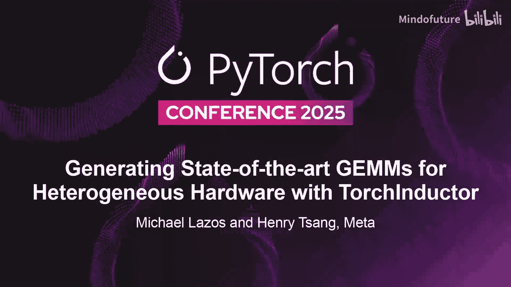
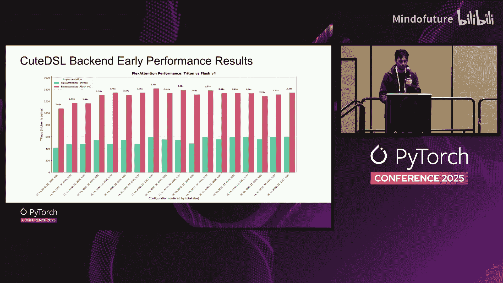

# 006：为异构硬件生成先进的通用矩阵乘法算法

在本课程中，我们将学习如何通过 Torch Inductor 集成 NVIDIA 的 cuBLAS、AMD 的 Composable Kernel 等硬件厂商库，以生成高性能的通用矩阵乘法算法。我们将探讨其动机、集成方法、如何通过尾融合技术进一步优化，以及如何利用这些技术加速 FP8 矩阵乘法。最后，我们将展望未来与 NVIDIA QDSL 的集成。

---

## 1️⃣ 背景与动机

上一节我们介绍了课程概述，本节中我们来看看项目启动的背景和核心动机。

在本次工作之前，Torch Inductor 处理通用矩阵乘法的方式如下：当未启用自动调优时，Inductor 会扫描模型，将所有矩阵乘法调用转换为 `aten::mm` 调用，并分派到 NVIDIA 的 cuBLAS 或 AMD 的 hipBLAS。这种方法的主要缺点是无法进行算子融合，因为我们无法与已编译的二进制文件进行融合。

为了绕过这个限制，我们使用了 Triton。由于 Torch Inductor 使用 Triton 生成逐点运算，因此我们可以与之融合。但为了获得与 cuBLAS 或 hipBLAS 相当的矩阵乘法性能，我们必须进行自动调优。

自动调优之所以必要，是因为在过去十年中，为了处理多样化的深度学习与 AI 工作负载，GPU 架构变得极其复杂。新增的硬件特性增加了架构复杂性，导致在设计矩阵乘法内核时存在海量选择。这些选择的一个子集包括：
*   **分块大小**
*   **是否使用 Warp 专业化**
*   **指令形状**
*   **是否使用异步内存传输**

最简单的自动调优方案是尝试所有组合，但有时组合过多，耗时过长。许多库会配置用户可调的“旋钮”来调整搜索空间，或引入启发式方法来缩小搜索空间。

为了在矩阵乘法上达到最先进的性能，我们选择使用 AMD 的 Composable Kernel 和 NVIDIA 的 CUTLASS 库。这两者都将自动调优作为首要用例。我们的理念是，编译器也应该能够优化选择。作为一个即时编译器，我们在运行时拥有关于要处理的问题大小的信息，因此应该能够做出最优选择。

需要说明的是，我们的目标并非在所有形状上都击败 cuBLAS。cuBLAS 和 hipBLAS 都是基于启发式的方法，无法覆盖所有形状，否则二进制文件会变得过大。我们的自动调优方法旨在覆盖那些 cuBLAS 和 hipBLAS 未能很好覆盖的形状，并对它们进行优化。

这种方法还具有支持融合的灵活性优势，并且我们不会依赖 Triton 在新硬件上的性能优化。一个最近的例子是 Warp 专业化功能，Triton 在新型硬件发布后很久才添加此功能，而其他厂商特定库则更早支持。这源于一个行业趋势：为了利用每个厂商的架构优势，你需要将这些能力暴露给你所使用的语言。

---

## 2️⃣ 与 Torch Inductor 的集成

上一节我们介绍了使用厂商库的动机，本节中我们来看看如何将它们集成到 Torch Inductor 中。

我们希望提供一个易于使用的解决方案，使其在 Torch Inductor 层面与硬件无关。用户只需使用 `torch.compile` 并开启一个标志，就能使用由 CUTLASS 和 CK 生成的矩阵乘法。关键在于，我们能够通过 Torch Inductor 复用为 Triton 后端已有的组件。

以下是 Torch Inductor 当前生成矩阵乘法的方式：
1.  我们有一个问题形状，例如矩阵乘法的 `M`、`N`、`K`。
2.  我们拥有 `torch.mm` 所需的元数据，如数据类型、内存布局。
3.  在 Torch Inductor 内部，我们会根据硬件生成一个 cuBLAS 或 hipBLAS 选项。
4.  同时，我们会使用模板为 Triton 生成多个选项。
5.  接着，我们使用 Triton 编译器即时、并行地编译这些选项。
6.  最后，我们对所有选项进行基准测试，找出针对我们特定形状、数据类型和布局最快的那个。

换句话说，如果我们遵循这个模式，我们需要做的就是在为 Triton 生成模板的同时，也为 CUTLASS 和 CK 生成 C++ 代码。我们不再使用 Triton 编译器进行编译，而是根据所使用的后端，使用 NVCC 或 Clang 即时、并行地编译它们。之后，我们拥有数十个选项，只需对它们进行基准测试，就能找出针对我们问题形状的最佳矩阵乘法内核。

以下是自动调优的工作流程。这种方法的一个优势是，我们无需过多思考。我们可以查看任何参数组合，将它们传入模板，生成 C++ 代码，然后尝试编译和运行它。我们并不保证所有组合都能完美编译或运行，但从用户的角度来看，你只需传入元数据，我们就会提供一个性能优异的矩阵乘法内核供你使用。

我们默认支持以下功能：
*   **`torch.compile`**：Python 使用的推荐入口点。
*   **AOTInductor**：用于在 C++ 运行时服务模型的 `torch.compile` 的“训练兄弟”。
*   **动态形状**：我们尝试模仿对 Triton 的支持。特别要强调的是我们在动态形状方面的创新：在进行模板化时，我们使矩阵乘法内核的输入形状无关。这样，你会生成一个 C++ 代码，编译成一个 `.so` 文件，它就能够处理你传入的几乎所有形状。我们仍然会在一个形状上进行自动调优，但该内核有能力服务多种形状。
*   **各种缓存**：我们使模板化的矩阵乘法内核与形状无关，因此它们对于不同形状具有高度可重用性，你可以直接复用相同的 `.so` 工件。这有助于缓解可能较长的编译时间。

**在 H100 上使用 CUTLASS 后端的结果**：与 Triton 相比，我们看到了不错的性能，并且略微优于 Triton。我们再次重申最初的动机：我们的目标并非在所有形状上都击败 cuBLAS，我们关心的是通过自动调优实现形状的全面覆盖以及融合的灵活性。

**在 AMD 硬件上使用 CK 后端的结果**：我们看到的结果是混合的。在某些形状上，Triton 表现更好；在另一些形状上，hipBLAS 表现更好。这正是我们希望看到的。我们测试了正常形状，但实验表明，在一些非标准形状（如拆分形状）上，我们看到了更好的性能。

---

## 3️⃣ 利用尾融合进一步定制 CUTLASS 内核

上一节我们介绍了如何将厂商库集成到 Inductor 中，本节中我们来看看如何通过尾融合技术进一步优化 CUTLASS 内核。

在机器学习模型中，矩阵乘法之后通常跟着一个激活函数或其他逐点运算，也可能跟着归约操作。关键在于，矩阵乘法之后是一个内存受限的操作，其中矩阵乘法的计算将主导尾操作的内存读取。尾融合的主要目标是通过在矩阵乘法的结果元素被计算出来后直接对其应用这些操作，从而隐藏内存读取。这也消除了通常在矩阵乘法之后会发生的内存事务。

最初，我们尝试直接生成 C++ 代码，但这并不顺利。直接生成 CUTLASS C++ 代码非常复杂，性能虽然很好，但编译器的维护负担太高。因此，我们搁置了这项工作，直到 CUTLASS 的新功能让我们能够以更灵活的方式实现它。

CUTLASS 新增的功能包括 **尾融合访问者树 API** 和 **Python 追踪器**。尾融合访问者树是一个可组合的 CUDA 内核库，由模板化的内核类构建而成，类似于 CUTLASS 已有的通用矩阵乘法模板。它们提供了通过类本身的模板类型来改变所有不同内核元参数的扩展性，允许你像自动调优矩阵乘法一样自动调优尾融合部分。这一切都是开源的。

此外，CUTLASS 还提供了一个 Python 追踪器来生成 C++ 模板。Torch Inductor 已经擅长生成 Python 代码（因为我们生成 Triton 操作），因此与生成 C++ 相比，这是一个简单的扩展。

尾融合访问者树将左侧的表达式表示为右侧的操作抽象语法树。这允许你在矩阵乘法之后任意组合一系列操作，并且随着你添加更多操作，可以轻松地将其视为任何其他尾融合部分，具有可组合性。

为了生成 Python 代码，我们使用了一个称为 **操作处理器** 的技术。Torch Inductor 的 IR 使用这种技术。操作处理器本身是可重写的，因此你可以基本上重写任何操作的含义。在我们的案例中，当我们想要生成 Python 代码时，我们只需实现一个 Python 打印操作处理器，这样 `ops.relu` 就会打印出右侧的 `relu` 表达式。

为了与 NVIDIA EVT 追踪器集成，你需要通过其 API 传入一些元数据：定义一个字典，将示例尾融合中使用的每个名称映射到一个“假张量”。这些假张量包含追踪器生成正确 CUTLASS 代码所需的一些元数据，例如数据类型和形状。

传入字典后，你可以直接追踪该 Python 代码并获得所需的 C++ 代码。本质上，你将树结构嵌入了 C++ 类型系统中。

整个系统的工作流程如下：
1.  模型通过 `torch.compile` 生成 Inductor IR。
2.  从 Inductor IR 我们生成 Python EVT 代码。
3.  从那里，我们追踪该 Python EVT 代码到 C++ EVT 代码。
4.  我们将该代码与之前描述的常规 C++ 矩阵乘法代码拼接在一起。
5.  我们从这两个 C++ 代码片段生成编译后的 `.so` 文件。

**性能结果**：在 BF16 的 `ReLU` + `Add` 基准测试中，在 Llama 模型使用的形状上，相比 Triton 有 6% 的几何平均加速，相比 cuBLAS 有 8% 的加速。最大加速在某些问题上可以达到 50% 到 60%。分析显示，CUTLASS 通常优于 Triton，并且两者都明显优于未进行融合的 cuBLAS。

---

## 4️⃣ 利用尾融合加速 FP8 矩阵乘法

上一节我们介绍了如何利用尾融合优化常规矩阵乘法，本节中我们来看看如何将此技术应用于加速 FP8 矩阵乘法。

我们使用尾融合访问者树技术，不仅用于任意的尾融合，也用于我们预先知道尾融合操作的情况。对于 FP8 矩阵乘法，你通常需要按行或按张量缩放输出。为了将值恢复到 BF16，你必须对其进行缩放，并且可以选择性地添加一个偏置。

我们希望为此使用尾融合访问者树，因为与其硬编码每一个可能的选项（例如是否添加偏置或允许额外的融合），使用该 API 允许我们为未来保留灵活性，以便拥有更多选择。

**使用方式**：在模型中，你首先通过量化获得输入 `X` 和权重 `W` 的 FP8 矩阵，以及相应的反缩放矩阵。然后，你可以指定是否使用 `fastAccum` 模式，该模式利用 NVIDIA GPU 中的张量核心累加器技术，在速度与精度之间进行权衡。通常推理时设置为 `True`，训练时设置为 `False`，因为精度损失会影响训练。

**性能结果**：我们展示了所有后端在使用 `fastAccum` 和不使用时的性能对比。在 Llama 模型的形状上，我们通常获得了 8% 的几何平均加速。使用 CUTLASS 且不使用 `fastAccum` 时，相比 Triton 有 16% 的加速。最大加速也非常显著。FP8 加速如此之高的部分原因可能是 cuBLAS 的 FP8 在某些形状上启发式地表现较慢。

图表显示，在所有 Llama 形状上，CUTLASS 表现都非常出色。在较小的 `M` 值上，CUTLASS 主导其他后端；在较大的 `M` 值上，结果更加混杂，Triton 也表现良好。

---

## 5️⃣ 未来工作：集成 QDSL

上一节我们探讨了 FP8 的优化，本节中我们来看看未来的发展方向，即集成 NVIDIA 的新 DSL——QDSL。

QDSL 是 NVIDIA 即将发布的新领域特定语言，旨在最终成为用于自动调优的新语言。该语言更易于维护，因为它是用 Python 实现的。其主要优势是编译速度更快（约 100 倍），这是因为它使用自定义的 MLIR 编译器直接从 Python 代码生成 PTX，而不是使用 NVCC。

已经有大量的开源项目采用 QDSL，例如 TreeD、FlexAttention 和 FlashAttention。它使用与 CUTLASS 相同的抽象，因此在理论上应该能在 PTX 级别获得相同的性能。

与 CUTLASS 类似，我们采取在 Torch Inductor 中为 QDSL 实现模板的方法。这些模板更易于维护，编译速度更快。一个缺点是，由于 QDSL 级别较低，代码可能非常冗长，一些矩阵乘法实现可能长达数千行代码。但总体而言，性能相当不错，证明了这项投资的合理性。

**早期性能结果**：展示了使用 Triton 的 FlexAttention 版本与使用 QDSL 的 FlashAttention-v4 实现的对比。这充分说明，在 Blackwell 架构上，Triton 在所有不同 FlashAttention 形状上的性能并非最佳。我们获得了超过 2 倍的性能提升。因此，未来我们将继续致力于让 QDSL 实现更多操作。

---

## 6️⃣ 总结与问答

在本课程中，我们一起学习了如何通过 Torch Inductor 集成 CUTLASS 和 Composable Kernel 来生成高性能的矩阵乘法算法。我们探讨了自动调优的动机、集成的工作流程、利用尾融合访问者树进行深度定制以支持算子融合和 FP8 加速，并展望了与未来 QDSL 集成的潜力。核心目标是通过编译时优化和运行时自动调优，为各种硬件和模型形状提供全面、高性能的矩阵乘法解决方案。

**问答环节摘要**：
*   **动态形状支持**：内核接受张量指针和元数据（如形状和步长）。编译时未将形状硬编码，因此内核可以处理大多数形状和动态形状，仅在维度和布局方面有少量约束。
*   **编译时特化**：作为即时编译器，我们在运行时运行 CK 内核的静态构建流程。我们根据工作负载获取形状，然后在运行时运行整个编译流程。如果形状发生变化（动态形状），我们会复用相同的内核。如果未使用动态形状且遇到新形状，我们会重新编译。
*   **编译开销**：首次编译开销尚可，因为我们并行编译内核。CK 每个内核编译需要几秒钟，CUTLASS 耗时更长，但并行化后可以接受。