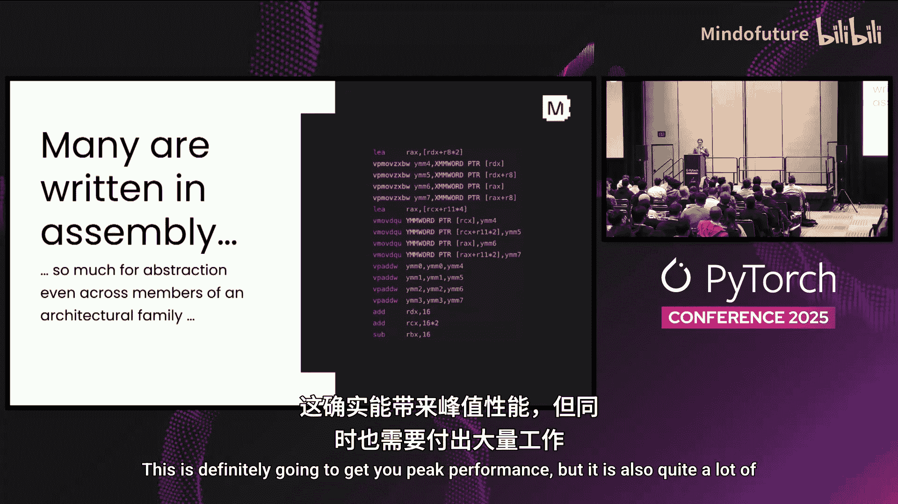
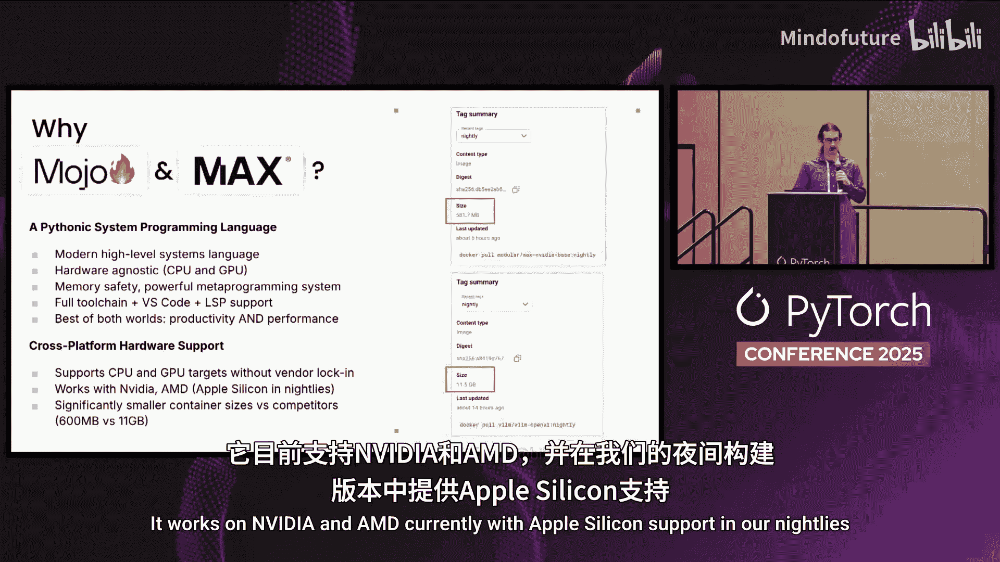
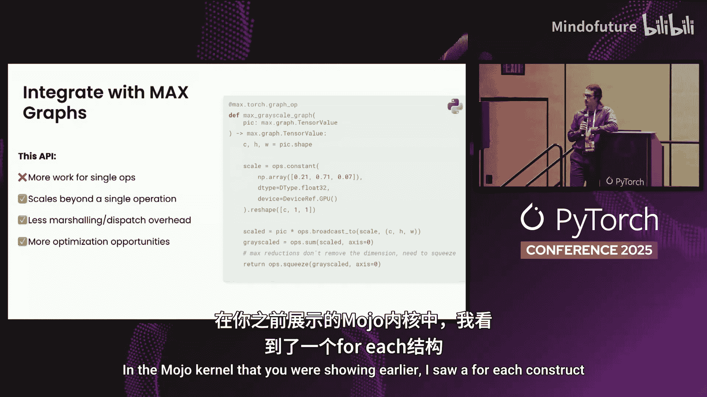
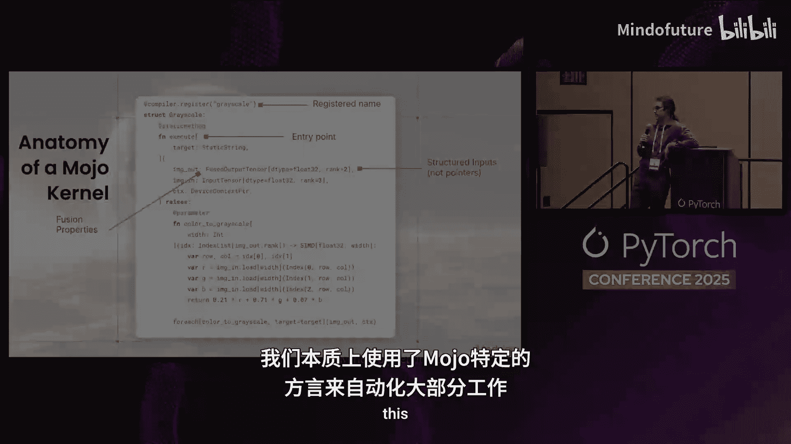

# 007：使用 Mojo 实现高性能定制内核的捷径


在本节课中，我们将学习如何使用 Modular 公司的 Mojo 语言，为 PyTorch 编写高性能的自定义算子。我们将探讨为何需要 Mojo，如何用它编写内核，以及如何轻松地将其集成到 PyTorch 工作流中。通过本教程，你将了解一种在开发效率和运行时性能之间取得更好平衡的新方法。


## 为何选择 Mojo？🤔



在深入代码之前，我们首先需要理解为什么在已经有了众多选择的情况下，我们还需要 Mojo 这样的新语言来实现内核。

为了从硬件中获得极致性能，开发者们尝试了各种方法。

### 追求极致性能的传统路径

许多高性能内核至今仍使用汇编语言或 PTX（NVIDIA 的并行线程执行指令集）编写。这确实能带来峰值性能，但开发工作量巨大，且代码通常可移植性很差。

### 元编程的解决方案

其他解决方案则依赖于各种形式的元编程，例如使用 C++ 模板。像“可组合内核”这样的库正确地指出了问题在于元编程，只是在 C++ 中进行元编程体验并不友好。开发者通常需要提供数十个不同的模板参数来针对数据类型、累加器、底层内存布局和硬件特性等进行特化。虽然方向正确，但使用起来仍然相当繁琐。

### 领域特定语言


此外，还有各种风格的领域特定语言，它们通常只是在汇编代码之上进行抽象。例如，oneDNN 使用 C++ DSL 来生成汇编代码，而 Tensile 则使用 Python DSL 来生成汇编代码。还有一些基于模板的奇特解决方案，它们都属于元编程的范畴。


所有这些方法都表明，**元编程可以解决问题**，但也反映出在许多现有语言中，你无法完全信任编译器能自动完成优化。这就是为什么开发者需要费尽周折手动优化。

最终结果是，这些代码通常属于“一次性编写，永不阅读”的范畴，非常难以调试，并且大多数系统缺乏帮助编写此类代码的工具支持。

### 开发者的两难选择

因此，当需要选择系统来实现自定义算子时，开发者往往面临两难选择：
*   **追求峰值性能**：选择像手写 CUDA/PTX 或复杂模板系统这样的方案。这能以高昂的开发时间为代价获得优异性能，但结果通常可移植性差。
*   **追求开发便捷**：选择近年来涌现的基于 DSL 的解决方案，如 Triton、Glow、Tile 等。它们通常更易于移植，从开发者体验上看更像在编写普通的 Python 代码。但为了获得这种易用性，通常需要牺牲一部分性能，可能损失 **10% 到 20%** 的峰值性能。

## Max 平台与 AI 编译器的挑战 🧩

在机器学习领域讨论 Mojo，很难不提及 Max 平台。让我们简要了解一下 Max 的历史背景和它要解决的问题。

### 传统框架的困境

在过去，所有深度学习框架都会发布庞大的内核库。正如之前的演讲所提到的，算子融合非常重要，不能只发布少量正交的内核。在实际应用中，在各种融合算法出现之前，框架需要发布所有可能的手动融合版本的内核。这种组合爆炸导致需要发布成千上万个手动融合的内核，如果是预编译库，通常会有数 GB 的编译后代码。

### AI 编译器的进步与局限

AI 编译器通过自动化部分融合过程解决了这个问题。识别计算图中的子图，判断哪些融合是合法且有益的，然后合成一个单一的可调用内核，这已成为任何现代 AI 编译器的先决条件，并且在实践中效果很好。

但这里存在一个**通用性问题**：在很多边缘情况下，自动融合会失效。例如，动态形状、稀疏性和量化都会使自动融合问题变得更加复杂。编译器需要判断更多因素来决定融合是否合法且有益。在这些情况下，编译器通常会添加启发式规则，这使得融合过程变得不那么可靠。

### 自定义算子的挑战

另一个常见情况是自定义算子。在许多系统中，自定义算子在编译器看来是“黑盒”。编译器看到它时会说“我不知道如何处理这个东西”，为了正确性，只能选择不融合它。

生成式 AI 的兴起使这个问题更加严重。新的建模模式（如复杂的注意力机制）快速创新，在实践中导致了手动融合内核的爆炸式增长，因为你无法信任编译器能正确完成工作。像 KV 缓存这样的领域也存在类似问题，它们有自己特定的优化，基本上需要从头开始教给编译器。




### 核心问题：编译器工程师无法规模化

这真正说明了问题所在：如果你依赖编译器来完成所有这些工作，那么编译器工程师无法很好地规模化。我们（编译器工程师）需要很长时间才能在编译器中实现新功能。如果你的模型开发周期包括构思新的建模模式，然后去找编译器工程师说“请为我们优化这个”，那么首先你需要雇佣这位编译器工程师，其次他们实际实现可能需要数周甚至数月的时间。这使得在新模型上快速迭代变得非常困难。

**Max 平台正是为解决这个问题而设计的**。你可以将 Max 视为构建在 Mojo 之上的平台。Mojo 是我们技术栈中实现高性能内核的语言。在其之上，是像 Python 图 API 这样的接口，它提供了类似原生 PyTorch 的张量计算接口。其输出由我们的图编译器消费，这是一个非常传统的图编译器，执行你所熟悉的许多自动优化，如形状推断和自动内核融合。此外，我们的系统还包括优化的 GPU 内核，其中包含许多硬件特定的优化，以及我们提供的各种硬件抽象，以允许你在多种硬件上部署模型。

## Mojo 语言的核心优势 ⚡

Mojo 是这个系统的“秘密武器”。它是如何实现这种生产力的呢？

Mojo 本身是一种**现代的高级系统编程语言**。这意味着你可以编写相当高级的代码并快速迭代。但作为一种系统语言，它让你能够紧密控制编译器后端最终生成的代码。此外，它是**硬件无关的**，目前可在 CPU 和 GPU 上运行，并具备现代编程语言所期望的许多高级特性，如内存安全性和强大的元编程系统（其本身是我们为特定目标生成高度专业化代码的关键部分）。你还将获得完整的工具链，包括编译器和调试器，以及所有预期的编辑器集成（如 VS Code 和 LSP 支持）。

这为你提供了两全其美的体验：你可以高效地编写高级算法并快速迭代；当你需要性能时，可以深入底层，对算法进行精细控制。如果你需要算法跨平台运行，Mojo 不仅支持 CPU 和某一特定 GPU 供应商，目前可在 NVIDIA 和 AMD 上运行，并且在我们的 nightly 版本中提供了对 Apple Silicon 的支持。

## 实战：用 Mojo 编写自定义内核 🖥️

了解了 Mojo 的理论优势后，让我们看看实际编写 Mojo 自定义内核的代码是什么样子。

以下是一个在 Mojo 中实现的灰度转换内核。选择灰度转换没有特别原因，只是它适合放在幻灯片上且易于解释。对于本次演讲的目的，这里的所有细节都适用于你将编写的任何其他内核，包括我们所有的内部内核。

```mojo
from max import register_kernel, fused_output_tensor, input_tensor

@register_kernel("grayscale")
struct GrayscaleKernel:
    fn execute(
        self,
        out: fused_output_tensor[DType.float32, 2],
        inp: input_tensor[DType.float32, 3]
    ) -> None:
        @parameter
        fn color_to_grayscale(i: Int, j: Int):
            let r = inp.load[2](i, j, 0)
            let g = inp.load[2](i, j, 1)
            let b = inp.load[2](i, j, 2)
            out.store[2](i, j, 0.299*r + 0.587*g + 0.114*b)

        for_each[inp.shape(0), inp.shape(1)](color_to_grayscale)
```

### 代码解析

所有内核都始于一个编译器注册装饰器 `@register_kernel`。这只是将名称与你的内核关联起来，该名称将用于从 PyTorch 层面或 Max 图 API 中引用它。

所有内核都是至少包含一个方法的结构体，这里就是 `execute` 方法。`execute` 是内核的入口点，显然包含了调用内核时要执行的所有代码。但它的接口也很重要，因为它反映了 Python 层面算子的接口。我们使用 `fused_output_tensor` 和 `input_tensor` 这样的结构化类型，它们分别成为 PyTorch 层面算子的输出和输入。在 Mojo 层面，这些是普通的 Mojo 类型，但它们代表结构化的索引缓冲区，保存着数据的底层数据类型，知道形状和底层布局。因此，这里不是裸指针，你不需要进行任何低级的指针运算。

请注意 `fused_output_tensor` 中的 `fused` 前缀，这是我们指示算子融合的方式。你编写的任何自定义算子都可以选择与我们 Max 执行引擎中的其他算子进行融合，这是基于每个操作数（输入或输出）进行的。在这里，`fused_output_tensor` 意味着该输出有可能被融合到其消费者中。

其余代码是实际的实现。这里的一切都是基于 `for_each` 函数实现的。`for_each` 只是我们标准库中的一个普通 Mojo 库函数，它会在 CPU 或 GPU 上并行化和向量化一个给定的函数。在这里，我们给它传递了 `color_to_grayscale` 函数，该函数为迭代空间中的给定点计算一个或多个输出像素，通过加载三个颜色通道并进行正确的算术运算来实现。如果你愿意，也可以使用基于块索引的低级 CUDA 风格 API 来实现，这完全取决于我们的标准库是否包含适合你试图实现的算法的内容。

### 性能对比

为了证明 Mojo 在性能上的优势，这里有一个快速对比：将相同的灰度转换内核与等价的 Triton 实现进行比较。Y 轴是吞吐量（越高越好），我们在 H100、B200 和 MI300 上进行比较。根据具体系统，我们的实现比 Triton 快 **1-2% 到大约 15%**。

当然，这是一个非常简单的内核，不能代表你通常使用某些工具实现自定义算子时所处理的复杂内核。在 Modular，我们实际上用 Mojo 实现了所有内核，目前数量相当多。它们都由一个相对较小的工程师团队（大约 10 人）维护，该团队为我们支持的所有硬件（CPU 以及来自三家供应商的七种 GPU 架构）维护所有这些内核，并且我们仍然能在真实生产模型上获得先进的吞吐量报告。在我看来，这强有力地表明了 Mojo 和 Max 生态系统所带来的生产力提升。

## 集成 Mojo 内核到 PyTorch 🔗

前面的内容都是关于 Mojo 代码的，但这显然是一个 PyTorch 会议。接下来，让我们谈谈如何将 Mojo 集成到 PyTorch 中。我将展示两种 API：一种用于直接调用单个自定义内核，另一种用于调用更大的 Max 计算图（当你开始集成大量内核时）。

### 方式一：直接调用单个内核

调用单个内核非常简单。你只需加载你提供的自定义算子库，这里没有额外的编译步骤。使用 `custom_op_library` 类型，并给它一个指向内核在磁盘上位置的路径。在内部，这会加载所有的编译器注册，并通过 `custom_ops.已注册的名称` 来暴露它们。

在接下来的代码片段中，我们将灰度转换内核包装成更具 PyTorch 风格的接口，即接收 `torch.Tensor` 并返回 `torch.Tensor`。为此，我们为结果分配一个新的空张量，并通过 `custom_ops.grayscale` 调用灰度转换内核（由于它是目标传递风格），并传入结果张量和输入图像张量，然后像返回普通值一样返回它。如果你曾经包装过 Triton 内核，这个过程非常相似。值得一提的是，这个 API 与 `torch.compile` 完全兼容，下一个 API 也是如此。

**这种 API 的权衡**：该 API 使用起来非常简单，当你想对算子进行某种测试时很好用。但由于延迟和流同步问题，它的扩展性不是特别好。当张量跨越从 PyTorch 到我们系统的边界时，会出现这种情况（这是我们正在努力改进的）。此外，如果你调用的是单个内核，那么你就无法获得我们之前讨论过的所有融合优势，因为我们的系统没有额外的上下文来执行融合。

### 方式二：通过 Max 图 API 集成

一旦你集成了不止几个自定义操作，很可能你会想使用这个特定的 API。这个 API 在超越单个操作时扩展性要好得多，主要是因为它减少了 PyTorch 和我们执行引擎之间的边界，并为我们的执行引擎提供了更大的优化上下文。

右侧的代码是相同灰度计算的实现，它是基于 Max 图 API 实现的。如前所述，图 API 旨在让你组合张量计算，感觉非常类似于使用原生 PyTorch。要进行灰度计算，我们创建一个包含每个颜色通道校正因子的新常量，将输入张量与之相乘，然后在三个颜色通道上求和。



将其暴露给 PyTorch 同样简单，你只需在函数上添加一个 `@max.torch.graph_hook` 装饰器，它就会处理所有实际的编译以及在我们的系统和 PyTorch 之间编组张量的工作。

## 总结与要点 🎯

在本节课中，我们一起学习了如何使用 Mojo 为 PyTorch 开发高性能自定义算子。

我们首先探讨了现有高性能内核开发方法的局限，从而理解了 Mojo 语言诞生的必要性。Mojo 作为一种现代的高级系统编程语言，在开发效率和运行时性能之间取得了更好的平衡。

接着，我们介绍了构建在 Mojo 之上的 Max 平台，它通过提供类似 PyTorch 的图 API 和强大的图编译器，解决了 AI 编译器中自动融合在面对自定义算子、动态形状等场景时的局限性。

然后，我们深入实战，剖析了一个用 Mojo 编写的灰度转换内核示例，了解了其从编译器注册、结构化接口定义到利用 `for_each` 进行并行化实现的完整流程。

最后，我们学习了两种将 Mojo 内核集成到 PyTorch 工作流的方法：直接调用单个内核的简单 API，以及适用于复杂计算图的、能启用融合优化的 Max 图 API。

**核心要点如下：**
*   **Mojo + Max** 提供了一个统一的系统，让你可以原型化和优化内核，无需经历通常的“在 Triton 中原型设计，再迁移到 CUDA”的转换过程。
*   你可以这样做而无需受限于任何特定硬件供应商。
*   现在我们有了简单的 API 来提供与 PyTorch 的集成。



希望本教程能帮助你理解 Mojo 如何成为实现 PyTorch 高性能自定义算子的一条更简捷、高速的路径。