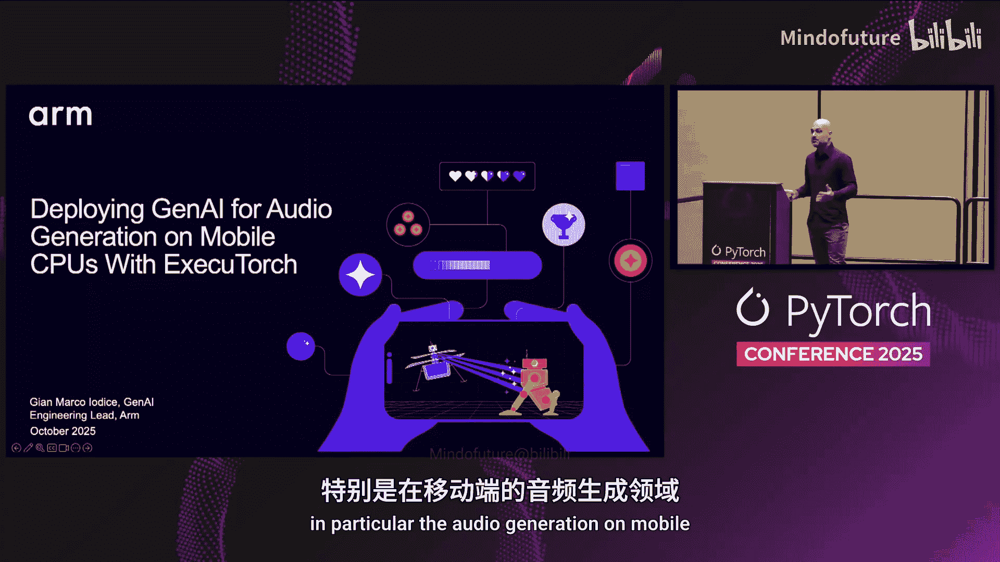
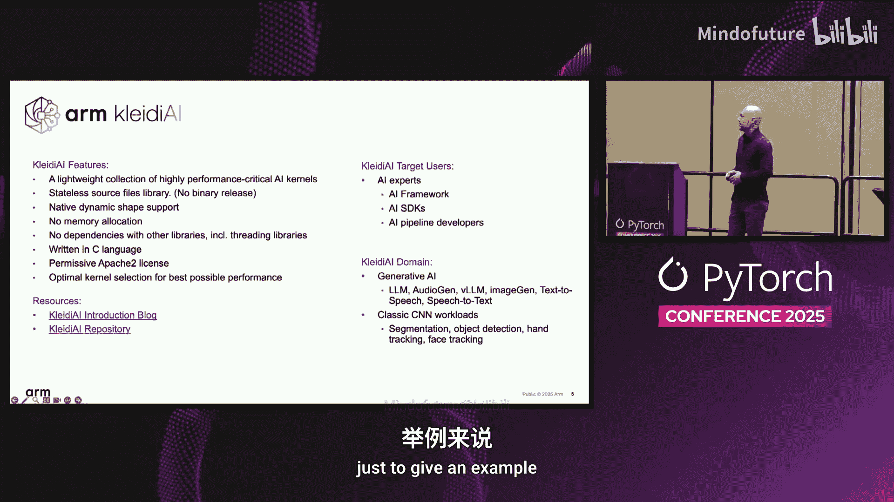
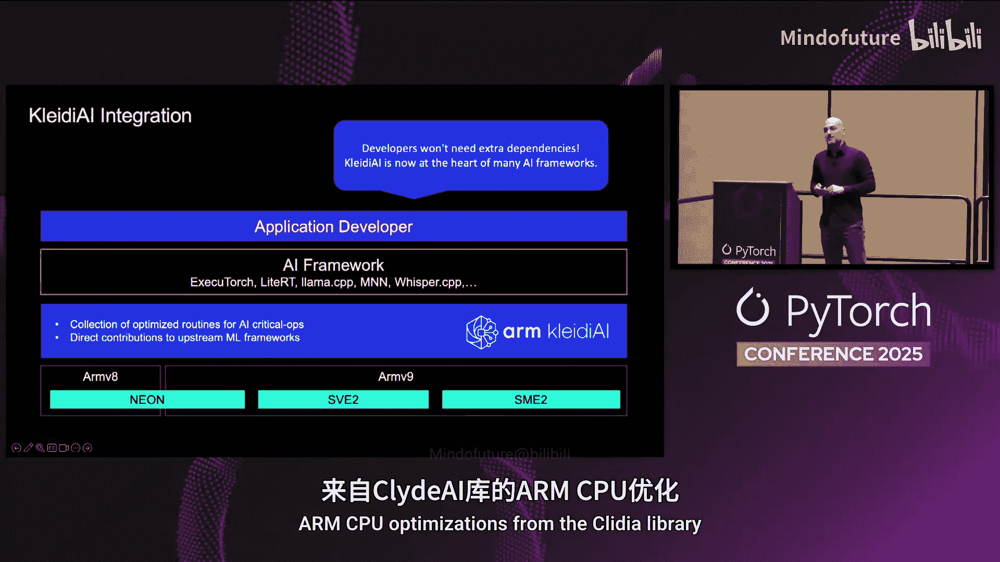
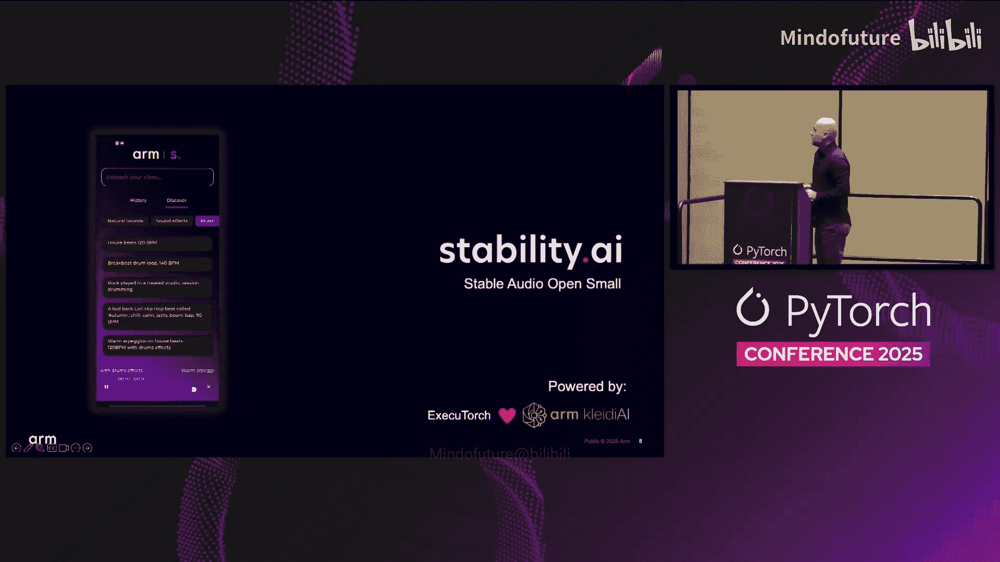
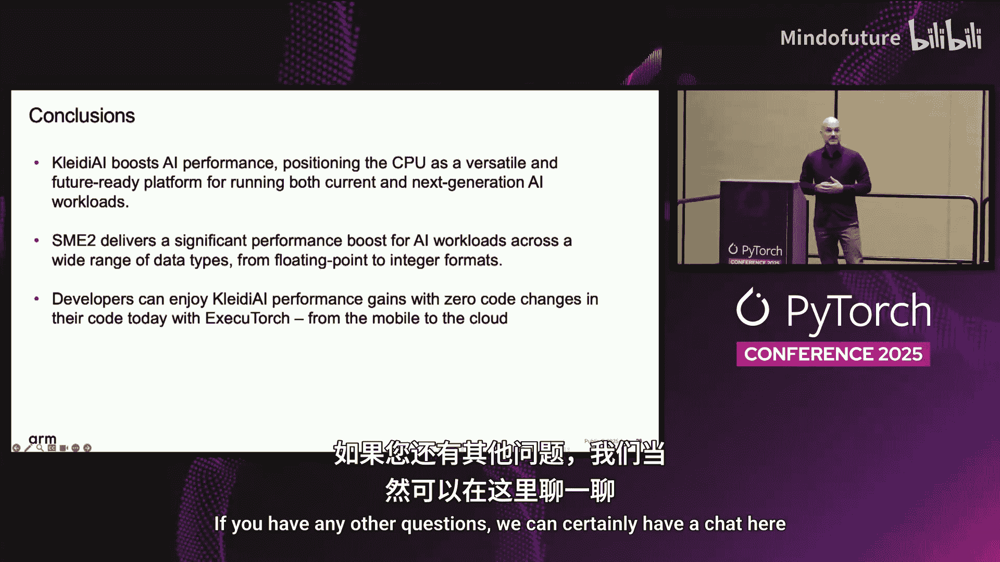

# 008：基于 ExecuTorch 在移动端 CPU 部署生成式音频 AI

## 概述

在本节课中，我们将学习如何利用 **ExecuTorch** 和 **Arm** 的 **Clyde AI** 库，在移动端 CPU 上高效部署生成式音频 AI 模型。我们将探讨性能优化、跨平台部署策略以及最新的 **SME2** 技术如何提升推理速度。

---

## 1：背景与工具介绍

再次来到 PyTorch 大会非常荣幸。我去年也在这里做过分享。

我将简要回顾去年介绍的内容，但更令人兴奋的是，在 Mergenberg 关于 ExecuTorch 1.0 的精彩演讲之后，我来分享我们共同成功构建的成果。

我们将看到一些性能数据，以及一个特别有趣的生成式 AI 用例：在移动设备上进行音频生成。

今天要讲述的故事，核心是关于**性能**和**跨不同设备的可移植性**。

等等，这不是关于移动端的演讲吗？是的，这确实是关于移动端的演讲。但如果你是移动开发者，你会知道在设计完移动应用后，需要在某个地方测试它，可能是在模拟器上。但性能呢？我如何知道我的模型是否能以我期望的性能运行？当我想在移动端部署时，有什么工具或解决方案可以估算性能？

信不信由你，如果你的目标是 **Arm CPU**，你会有多种选择。这就是我今天要借助强大的 **ExecuTorch** 和 **Clyde AI** 讲述的故事。

---

## 2：生成式 AI 用例与核心工具

本次演讲从我去年介绍的一些生成式 AI 用例开始。当你想到移动端的生成式 AI 时，我们之前已经看到过一些例子。

我们想到文本，例如向聊天机器人提问。正如去年演示的，我们可以扩展聊天机器人的功能，例如提供群聊摘要。假设我有 50 条未读的群聊消息，我不想全部阅读，就可以使用大语言模型来给我一个摘要，了解朋友们决定为我的朋友买什么礼物。

这些演示背后是什么？你也可以自己实现，因为我们在演讲最后提供了链接。真正驱动这些演示的是 **ExecuTorch** 和 **Clyde AI**。

Clyde AI 在之前的演讲中也提到过，它是一个非常轻量级的库，包含了在 **Arm CPU** 上高效运行 AI 工作负载的关键算子。

这些关键算子是什么？例如矩阵乘法或卷积运算，它们支持各种数据格式。我们生活的世界不仅有浮点数数据类型，还有 **BF16**、**FP16**、**INT8**、**INT4**，甚至 **INT2**、**1-bit** 量化等。Clyde AI 包含了所有这些关键算子，以便在 Arm CPU 上高效运行 AI 工作负载。

这个库另一个有趣的特点是它没有任何依赖，你可以按需取用。它被设计为 AI 框架开发者的库，因此你需要是专家才能将这些算子集成到你的 AI 框架中。

它不仅是生成式 AI 工作负载的库，也可以用于加速传统的卷积神经网络。

那么，如果你是开发者，需要考虑什么？需要集成 Clyde AI 吗？完全不需要。只需使用 **ExecuTorch**，你就能免费获得 Clyde AI 的好处，因为它默认已经启用。你不需要在流程中考虑额外的依赖，只需使用 ExecuTorch 并以 Arm CPU 为目标，就能自动获得所有 Arm 优化。

这些 Arm 优化是在运行时选择的，因为 ExecuTorch 提供了一种机制，能在运行时检测 Arm CPU 的硬件能力，并从 Clyde AI 库中选择合适的优化版本。

---

## 3：移动端音频生成用例

但是，我在开头提到的用例呢？移动端音频生成，这非常酷。它非常酷，因为它开启了移动设备上其他有趣的应用场景。

有哪些用例？如果你是内容创作者，可以使用此类应用生成完美的音频片段。或者，如果你是 DJ，可以使用这个应用或模型来生成完美的采样，用于创作音乐。

但生成什么样的音乐？让我们看看，因为这是一个视频。是的，这是我们创建的一个演示。我们有一些预设提示用于演示。

音频质量请相信我，非常出色。我们谈论的是 **44 kHz**、**11 秒**长度的立体声音频样本。你可以为你的 DJ 控制台生成节拍，也可以为你的视频生成音效，比如雷声、魔法咒语。你只需要给出提示，就可以生成它。

大多数开发者实际上会问我一个问题：我应该本地运行这个模型，还是在云端运行？没有一个适合所有情况的单一解决方案。当然，这个用例我们希望看到在本地运行，为什么？因为如果你是内容创作者，我百分之百确定，你输入提示后，第一次尝试不会得到完美的音频样本。这将是一个迭代过程。你会尝试，会失败，会再试一次。你会调整提示，可能还会调整其他参数，以获得你需要的完美样本。

既然这是一个迭代过程，你可以推断出，什么实际上非常耗能？是网络连接。你不想向云端发送无限次的请求，对吧？这就是为什么你希望有东西在本地运行，以尽量减少数据传输，而数据传输实际上可能很多，并且会严重影响能耗。

但在某些场景下，确实需要云端。可能是因为你想要更长的音频样本，不只是 11 秒，也许是 20 秒的音频。或者可能是因为你希望在不同平台上获得相同水平的性能。你知道，市面上有很多不同性能的手机。在某些情况下，我们当然可以从用户体验角度达到目标性能。我们希望达到什么水平？对于 11 秒的音频，至少低于 10 秒的生成时间是可接受的。超过这个时间，从用户参与度来看可能就不太好了。也许在那种情况下，我们可以考虑云端部署。

但是什么样的云端部署？我们可以考虑 **Arm CPU 云端部署**。这里我将展开讨论为什么你可以使用云端：原因可能是为了在不同设备上提供相同水平的性能，也可能是为了估算在手机上能达到什么样的性能。

这就是美妙之处。**ExecuTorch** 和 **Clyde AI** 的美妙之处在于：**相同的代码，相同的模型可以到处运行**。如果你的目标是 Arm CPU，你不需要改变任何东西。你拿着同一段代码，在手机上运行，它也能在云端运行。

---

## 4：模型架构与优化策略

让我们解析这个基于 Stability AI 的 Stable Audio Open Small 的音频生成模型背后的流程。它由三个不同的模型组成：
1.  **条件器**：接收文本提示并进行嵌入。
2.  **扩散步骤**：被调用八次。
3.  **自编码器**：接收压缩数据（不是完整音频，是音频的压缩表示），负责生成最终的 44 kHz 立体声音频。

扩散步骤和自编码器是最耗时的部分。那么，我们做了什么来实现在移动端低于 10 秒的目标性能？

我们决定对扩散步骤使用 **INT8 量化**。由于音频需要保持质量，我们不能对自编码器使用整数量化，因为从质量角度看这是最关键的部分。因此，我们决定对自编码器使用 **FP16**。

如果你有兴趣了解我们如何使用 ExecuTorch 生成模型、如何量化扩散模型以及如何使用 FP16 模型，我们已经发布了源代码和文档，你可以按照我们今天分享的所有内容进行操作。

在这里，我将解析你需要知道的两个关键点，以了解我们如何实现目标性能。

当我说 INT8 时，并不是指静态量化。如果你熟悉 ML 开发，你知道有静态量化，即把所有东西都量化为整数。在某些情况下，比如这个案例，我们不能使用静态量化。原因是我们没有数据集。由于没有数据集，我们无法静态量化网络中的所有算子。

为了绕过这个限制，我们使用了 PyTorch 2 的实现，采用了**动态整数量化**。这意味着权重被静态量化为 INT8，但激活值仍然是浮点数（FP32），并动态量化为 INT8。如何实现？通过从激活值中提取统计信息（如最小/最大值）来计算量化参数（零点和缩放因子）。

另一个重要的部分是自编码器使用 **FP16**。这本身并不复杂，但有一件事你可能需要考虑：模型的输入和输出是 FP32。自编码器从扩散步骤接收 FP32 输入，输出仍然是 FP32，因为这是你要存储在音频文件中的东西。

所以，如果你考虑 FP16 的输入和输出，你还需要在应用程序中实现一个转换步骤。如果你不小心处理，可能会严重拖累整个流程的性能。通过我们的方法，我们基本上将转换委托给了 ExecuTorch 框架，通过 Clyde AI 中优化的例程来调度从 FP32 到 FP16 的转换。

---

## 5：性能数据与跨平台分析

性能如何？这里我展示了在移动设备和云端 Graviton 实例上的性能。相同的代码，相同的模型。我没有改变任何东西，当然，我改变了构建应用程序的方式，因为对于 Android，你需要提供工具链，而在 Linux 机器上交叉编译则很简单，本地编译只需要 CMake，不需要提供额外的东西。

你能从这张图中推断出什么？你可以推断出，在云端运行，你可以获得一个基准数字，了解在移动端可能达到的性能水平。这非常重要，因为在某些时候，当你开发移动应用时，你可能无法直接访问移动设备。你该怎么办？一种方法是访问一个基于 Arm 的云实例，尝试运行你的 ExecuTorch 应用程序，看看能得到什么样的性能。正如你所见，至少在四个核心以内，移动端性能和云端性能的差异非常小。

从这张图中得到的另一个启示是，你在云端可以达到的性能水平。如果你对移动端的性能不满意，因为你可能想要更好的用户体验，你可以增加核心数量，也可以提升性能。

但对于移动端，还有另一个故事：AI 性能的新水平即将到来，这就是 **SME2 技术**。

---

## 6：SME2 技术及其性能影响

SME2 技术是 Arm v9 架构 CPU 中的一项新技术，它承诺带来新的性能水平。我们将在本演讲末尾看到一些性能数据。

它建立在 **SVE2** 之上。如果你不熟悉 SVE2，它是一种可扩展矢量扩展，类似于 NEON，但矢量长度可以缩放，不是固定为 128 位。

这项技术的美妙之处在于，它已经被 ExecuTorch **默认启用**。因此，你不需要提供任何标志。像往常一样使用 ExecuTorch，如果你的设备支持 SME2，你将自动利用 SME2 例程。

SME2 技术中最重要的特性或算子是什么？是 **SME** 指令集，特别是矩阵运算加速。这是加速矩阵乘法例程的核心。

如果你查看 Clyde AI 的矩阵乘法文件夹，你会看到我们如何利用这个指令来通过 SME2 单元提升性能。这里提供了指令说明。如果你不熟悉，它基本上是一条指令，给定两个向量，它返回一个矩阵。从矩阵乘法的角度来看，如何使用它？这是一个矩阵乘法。基本上，你可以组合多条指令来计算完整的矩阵乘法。当然，在你的例程中，我不会深入探讨，除非你对 Clyde AI 中的性能优化感兴趣。

另一个有趣的事情是，SME2 指令集并非为单一数据类型设计，它支持不同的数据类型，包括浮点数、BF16、FP16、INT8、INT4、INT2。我们如何实现 INT4 和 INT2？有一条有趣的指令，我非常喜欢它。是 **BDOT** 指令，它允许你以非常高效的方式进行所有需要的量化操作。你可以进行 INT4、INT2、1-bit 量化，甚至一些非线性量化，比如 MXFP4。

我们能达到什么样的性能？这次，我报告的是在**笔记本电脑**上的性能。为什么是笔记本电脑？因为如果我在笔记本电脑上开发移动应用，并且我的笔记本电脑由 Arm CPU 驱动，我可以获得一个基准数字，了解在支持 SME2 技术的手机上可能达到的性能。

这里我报告的是仅使用**单核心**的性能。正如你所见，生成 11 秒音频的延迟已经达到约 **7 秒**。如果使用所有核心，延迟将远低于 **4 秒**。性能提升绝对惊人。

再次强调，我需要在代码中改变什么吗？**什么都不需要**。相同的代码，相同的 ExecuTorch 和 Clyde AI，没有变化。CMake 配置和在 Linux 上一样，你不需要任何专门的东西。你可以体验 SME2 带来的性能水平。

因为 SME2 技术已经出现在最新的 Android 和 iOS 设备中。当然，如果你有一台最新的 Arm CPU 笔记本电脑，你已经可以体验 SME2，从而了解在移动端可能达到的性能。

---

## 7：总结与问答

实际上我很惊讶，因为我非常准时。那么，从这次演讲中可以得出什么结论？

**关键要点如下：**
1.  我们讨论了 **Clyde AI** 以及它对 AI 框架开发者在 Arm CPU 上实现优异性能的重要性。这是在 Arm CPU 上实现卓越性能的关键。
2.  另一个要点是关于 **SME2 技术**。如果你正在开发移动应用程序，你需要考虑这项技术。你已经在笔记本电脑上可以体验它，并且已经在最新的 Android 和 iOS 设备上可以体验它。
3.  最后，由于 **ExecuTorch** 的设计方式，你可以在代码零修改的情况下体验这种性能水平。这意味着相同的代码、相同的模型可以在云端、移动端、边缘端以及由 Arm CPU 驱动的笔记本电脑上运行。

我认为就这些，非常感谢。有任何问题吗？

**问：** 你好，这非常令人兴奋。我想知道，既然 AI 可以在 Arm CPU 上运行，那它能在像视频中看到的 Arm CPU 上运行吗？
**答：** 如果你有 Arm CPU，绝对可以，它可以在任何地方运行。最低要求是 Arm v8.2 架构，它可以到处运行。

**问：** 好的，还有一个后续问题。当你进行动态量化时，你知道开销有多大吗？我猜你只是做了非常直接的最小/最大值计算，没有使用基于熵或其他花哨的方法来计算缩放因子，对吧？问题是，如果将计算分派到 Clyde AI，进行动态量化会有延迟开销吗？
**答：** 当然有开销，但很小。首先，你减少了数据类型的位宽，这通常是内存瓶颈。但也有一些技术可以动态量化，执行矩阵乘法，然后再进行另一部分的动态量化。我想说的是一种分块方法。这样，你将最大限度地减少与外部内存之间的数据传输。动态量化的影响非常低。我们观察到，该例程的耗时低于总执行时间的 10%，我认为这相当不错。

**问：** 最后一个问题。当你从一个 CPU 核心扩展到多个核心时，我注意到它在云端 CPU 上扩展得很好，但在移动 CPU 上却没有。为什么？
**答：** 我喜欢这个问题。为什么我们在云端扩展得近乎完美，而在移动端不行？有什么区别？CPU 大致相同，但不同的是**内存系统**。你在移动端没有与云端相同的内存系统，这是主要原因。基本上，移动端的内存系统没有饱和，但正如你在云端看到的那样，它不能完美扩展。

**问：** 我知道有用于联邦学习的扩展，用于音频应用，你可以在本地和云端之间同步。
**答：** 不，Clyde AI 只是 AI 工作负载的例程集合。它没有任何例程来同步云端和边缘之间的工作负载。它只有可以在移动端或云端 Arm CPU 上运行的例程，具体取决于你在哪里运行。ExecuTorch 运行时会决定调用哪个 Clyde AI 算子。不，那不是。

好的，非常感谢。如果还有其他问题，我们当然可以在这里聊聊。再次感谢。

---

## 总结

本节课中，我们一起学习了如何利用 **ExecuTorch** 框架和 **Arm Clyde AI** 库，在移动端 CPU 上高效部署生成式音频 AI 模型。我们探讨了从模型量化（动态 INT8 和 FP16）到跨平台（移动端、云端、笔记本电脑）部署的策略，并了解了最新的 **Arm SME2** 技术如何通过硬件加速指令显著提升推理性能。关键收获在于，借助这些工具，开发者可以用同一套代码实现高性能、可移植的 AI 应用部署，而无需针对不同平台进行大量修改。