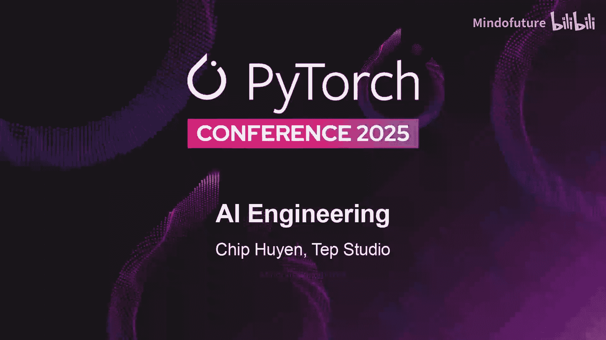
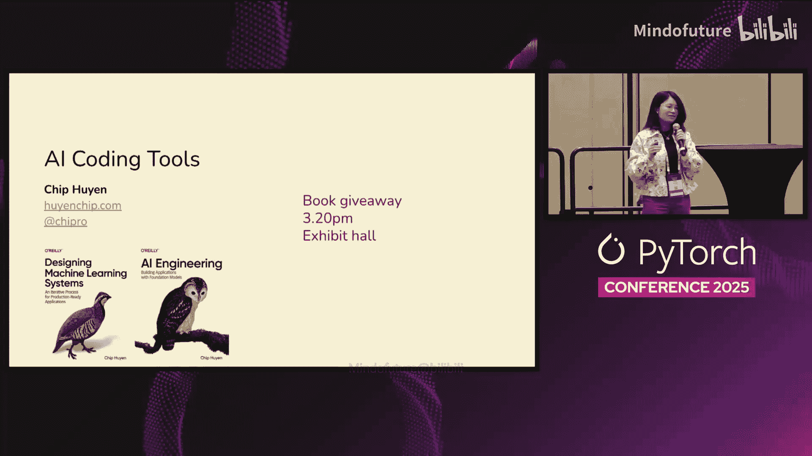
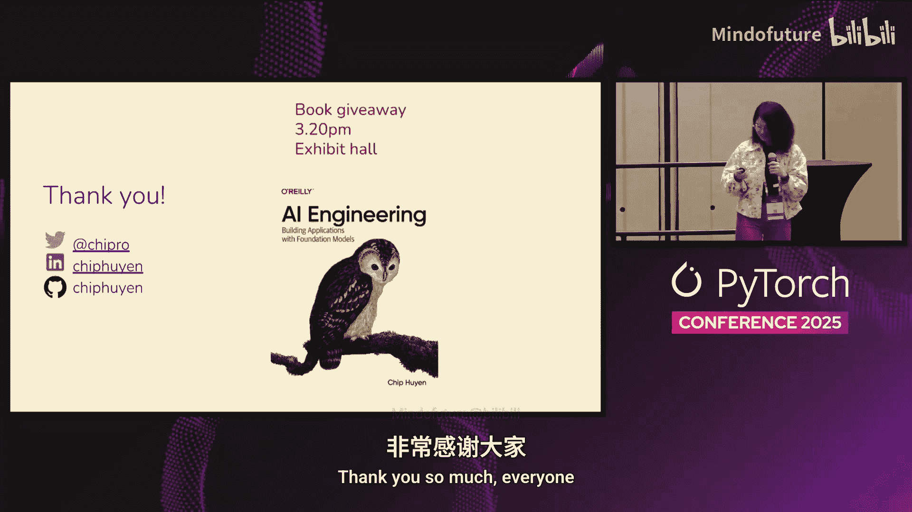

# 010：AI辅助编程的现状与未来

在本节课中，我们将探讨AI辅助编程的现状、生产力衡量、自动化水平以及如何优化工作流程。我们将分析不同工具接口的偏好、影响AI编码效率的关键因素，并展望未来的发展趋势。

## 课程概述

大家好，我是Chip。本次分享的主题是AI辅助编程。这个话题仍然很新，我也在不断学习中。因此，在分享过程中，我会提出一些问题，希望能与大家共同探讨。

## 工具接口偏好

在开始之前，我想先了解一下大家使用AI编程工具的情况。如今，AI编程工具有多种交互界面。

以下是几种主要的接口类型：

*   **IDE集成接口**：例如在VS Code等编辑器中直接集成AI助手。
*   **云端/聊天式接口**：例如Claude Code、Cursor、GitHub Copilot Chat等。
*   **GitHub集成接口**：AI可以直接参与代码审查，在PR中提出建议。
*   **Web界面**：例如上传网站截图，让AI生成对应的前端代码。

根据我与多家公司的交流，大多数工程师倾向于使用**IDE集成接口**。但值得注意的是，这种偏好很大程度上取决于个人对特定工具的熟悉程度。实际上，最高效的开发者通常会根据任务需求，灵活地在多种接口间切换。

## 生产力衡量

当公司投入大量资金引入AI编程工具后，管理层自然会关注其投资回报率。如何衡量AI工具带来的生产力提升是一个挑战。

传统的工程指标，如**工程耗时**和**代码行数**，在AI时代已不再理想。工程耗时忽略了“心智能量”的消耗——如果一项任务可以完全交给AI，即使耗时较长，只要无需人工干预，其实际成本就很低。代码行数指标则过于关注产出数量，而非任务完成的质量和有效性。

因此，我们需要新的衡量标准。一个思路是借鉴自动驾驶的**自动化水平**概念，来衡量AI编码工具的自主性。

## 自动化水平与中断率

我们可以将AI编码工具的自动化水平分为几个等级：

*   **Level 1: 自动补全**：AI提供代码建议，开发者选择接受或拒绝。
*   **Level 2: 部分自动化**：AI可以自动化完成非常小的子集任务，如编写单个函数或修复简单bug，但仍需大量人工审查。
*   **Level 3: 条件自动化**：AI可以在更多任务上实现完全自动化，例如从头构建一个完整的应用。
*   **Level 4: 高度自动化**：AI几乎能处理所有任务，除了某些特定领域（如遗留的Oracle代码库）或非常小众的语言。

目前，大多数工具处于**Level 2**和**Level 3**之间。为了有效分配任务，我们需要评估AI的能力。一个有用的指标是**中断率**，即人类需要干预AI进程的频率。

降低中断率至关重要，原因有二：
1.  它节省了开发者的“心智能量”。
2.  它允许AI生成**子代理**来并行处理更复杂的任务，因为如果人类频繁中断主流程，就无法有效管理这些并行的子任务。

## 影响中断率的因素

中断率因人、因任务而异，通常在6%到50%之间波动。主要影响因素包括：

*   **用户背景**：非工程师用户中断率可能更低，因为他们更关注结果而非过程。有趣的是，**资深工程师的中断率往往低于初级工程师**，因为他们能更清晰地定义需求，写出更优质的提示词。
*   **任务类型**：在全新项目（greenfield）上工作比维护遗留代码库（brownfield）更容易。
*   **技术栈**：不同的编程语言会影响AI的表现。例如，有经验表明，AI在**Rust**上生成的代码接受率（约90%）可能高于**Python**（约40-50%），这可能因为网络上的Rust代码平均质量更高，且Rust编译器能在过程中帮助纠错。
*   **任务复杂度**：任务越复杂，人类介入的必要性就越高。

## 优化工作流程

为了降低中断率、提升效率，我们可以从以下几个层面优化：

*   **模型层面**：使用推理能力更强、预训练更充分的模型。
*   **智能体设计**：设计更好的工作流程和提示词模板。
*   **用户层面**：开发者需要调整工作方式以适应AI智能体。这需要时间和练习，例如学会编写清晰、全面的需求说明。

上一节我们讨论了如何从外部优化AI工具的使用，本节中我们来看看开发者自身工作流程的变化。

传统的开发流程包括：规划（写需求）-> 执行（写代码）-> 验证（测试/运行）-> 迭代修复。

引入AI后，这个流程发生了变化：
*   **规划**：变得**更加重要**。开发者需要花费大量时间撰写清晰、详细的需求说明（即提示词）。
*   **执行**：开发者亲手编写代码的时间**大大减少**。
*   **验证**：变得**更加关键**。对于复杂功能，需要进行大量测试，因为AI生成的代码逻辑可能不直观。

这种变化让一些工程师感到不安，担心自己会沦为纯粹的“代码审查员”。但我们可以从另一个角度理解：这类似于职业晋升，我们从事的**抽象层次提高了**，从亲手实现细节，转变为定义目标、分配任务（给AI）并审查成果。这要求我们具备更强的系统思维和架构能力。

## 总结与展望

本节课中我们一起学习了AI辅助编程的多个核心方面。

我们首先探讨了不同工具接口的偏好及其背后的原因。接着，我们分析了衡量AI编程生产力的挑战，并引入了**自动化水平**和**中断率**作为关键评估指标。我们了解到，用户背景、任务类型和技术栈等因素会显著影响中断率。最后，我们审视了AI如何改变开发者的工作流程，强调**规划与验证**的重要性日益凸显，而我们的角色正向着更高层次的抽象任务迈进。

AI编码工具正在飞速发展。一年前，AI智能体还难以可靠地连续执行超过5个步骤的任务。如今，在一些项目中，AI已经能够连续处理**10到15个，甚至上百个步骤**。虽然“步骤数”不是一个完美的度量标准，但它清晰地表明了进步的迅猛。

未来，随着AI自主性的不断提高，我们有理由相信，开发者的生产力将得到进一步解放，可以更专注于创造性的、高价值的工作。

---
*演讲中提到的书籍赠阅活动于当天下午3:20在展馆举行。*