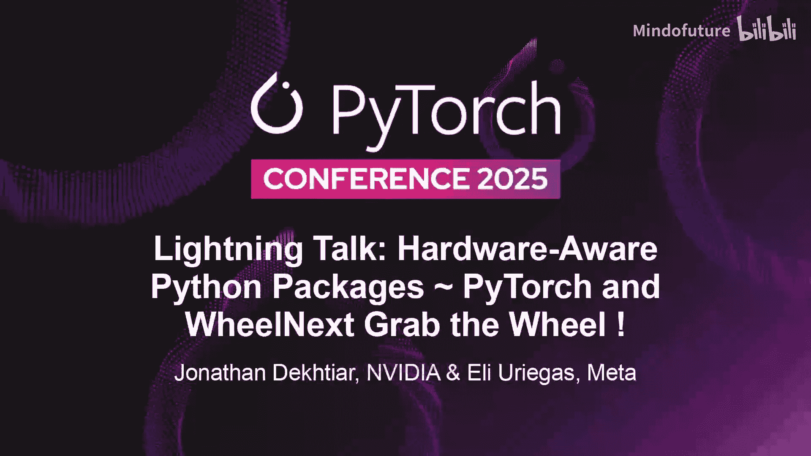
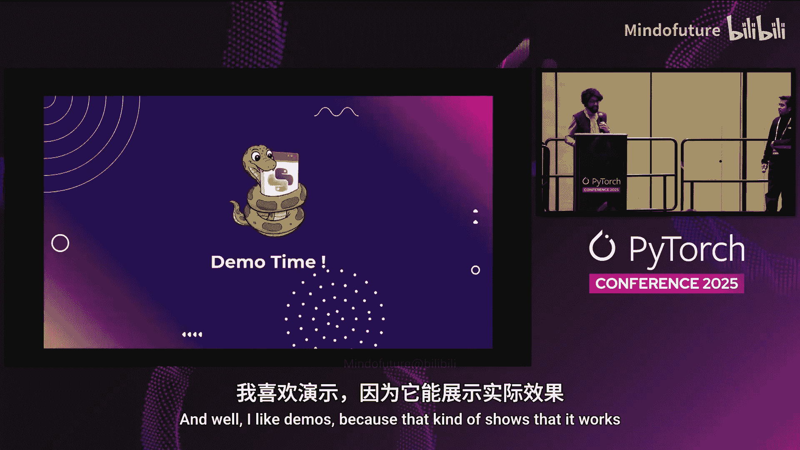
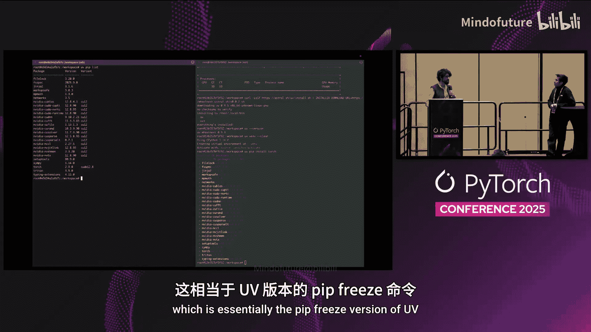
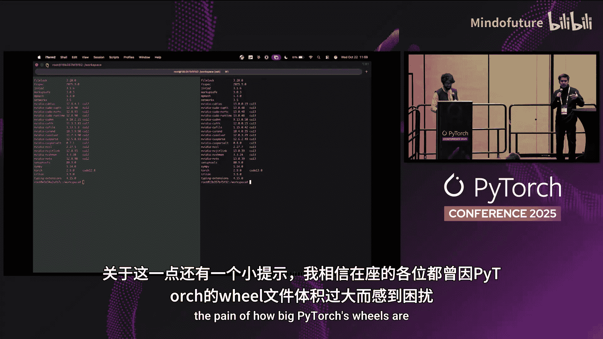
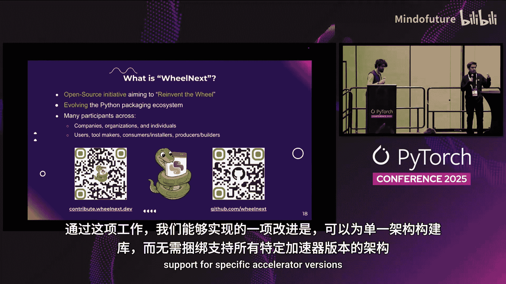
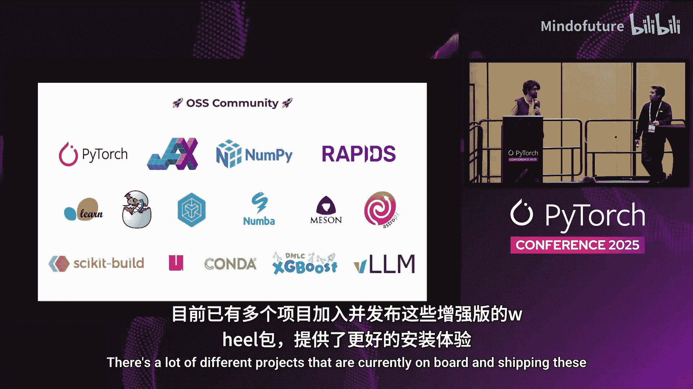
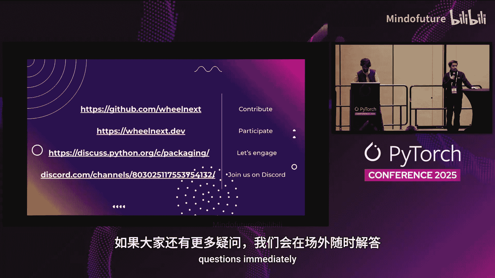

# 011：硬件感知的Python包与Wheel Next



## 概述

在本节课中，我们将学习Python包管理在硬件支持方面面临的核心挑战，并了解一个名为“Wheel Next”的新兴解决方案。该方案旨在实现一个理想目标：无论用户使用何种硬件，只需执行 `pip install torch` 命令，即可自动安装与之匹配的正确版本PyTorch。

## 当前面临的问题

上一节我们概述了课程目标，本节中我们来看看实现这一目标所面临的具体障碍。以下是当前Python包管理在硬件支持方面的主要问题：

1.  **硬件描述能力缺失**：Python打包标准缺乏精确描述硬件兼容性的能力。这包括无法指定所需的CUDA版本、GPU计算能力（Compute Capability）、ARM架构版本或特定的CPU指令集（如AVX512）。现有的标准仅能粗略处理CPU架构。

2.  **依赖不同的包索引**：安装特定硬件版本的PyTorch时，用户必须查找并使用不同的包索引URL。例如，安装支持CUDA 13、12.8和12.6的PyTorch需要使用完全不同的命令。这不仅对用户不友好，也容易出错。

3.  **分发与安全挑战**：
    *   **索引冲突**：使用多个包索引可能导致包名冲突，存在供应链攻击风险。
    *   **分发规模限制**：随着PyTorch等科学计算包的体积日益增大，受限于PyPI等免费服务的存储和带宽，大规模二进制文件的分发变得困难。

## 解决方案：Wheel Next

了解了问题所在后，本节我们来看看提出的解决方案——Wheel Next。这是一个由社区推动的、旨在扩展Python打包标准的新倡议。

### 核心概念

Wheel Next的核心思想是让包管理器具备“硬件感知”能力。其工作流程可以概括为以下伪代码：

```python
# 用户执行
pip install torch



# 包管理器内部逻辑
def install_package(package_name):
    system_hardware = detect_local_hardware() # 检测本地CUDA版本、GPU型号等
    available_wheels = fetch_wheels_from_index(package_name)
    best_wheel = select_best_match(available_wheels, system_hardware)
    install(best_wheel)
```

具体实现依赖于为构建的包（wheel文件）名称添加新的标签。这个标签是一个唯一的字符串标识符，用于描述该二进制文件的硬件要求，例如：

*   `torch-2.9.0-cp311-cp311-linux_x86_64.whl` （传统wheel）
*   `torch-2.9.0-cp311-cp311-linux_x86_64.cuda13.0_sm70_sm80_sm90.whl` （Wheel Next增强版wheel）



第二个文件名包含了`cuda13.0`以及支持的GPU计算能力（`sm70`, `sm80`, `sm90`）信息。包管理器可以读取这些信息，并与本地硬件进行匹配，从而自动选择最合适的版本安装。

### 优势

1.  **简化安装**：用户无需指定CUDA版本或索引URL，实现真正的“一键安装”。
2.  **精准匹配**：确保安装的包能最大限度利用本地硬件（如正确的GPU加速、CPU指令集优化）。
3.  **减小体积**：可以为特定硬件架构构建单独的包，避免当前“一个wheel包含所有架构”导致的体积臃肿问题。
4.  **跨平台/供应商支持**：该机制同样适用于为AMD、Intel GPU或不同ARM CPU版本构建的优化包。

## 如何尝试



目前，您可以通过一个特殊版本的包安装器`uv`来体验Wheel Next的功能。以下是操作步骤：



1.  安装支持Wheel Next的`uv`版本。
2.  使用`uv`创建虚拟环境并安装PyTorch：`uv pip install torch`。
3.  `uv`将自动检测您的系统硬件（CUDA版本、GPU型号等），并选择匹配的PyTorch wheel进行安装。



您可以在装有不同CUDA版本或GPU的机器上尝试，观察安装的PyTorch版本及其依赖项有何不同。

## 总结



本节课中我们一起学习了Python科学计算生态中硬件感知包管理的重要性。我们探讨了当前`pip install torch`体验中的痛点，并深入了解了**Wheel Next**这一社区解决方案。它通过扩展wheel文件的命名规范，使包管理器能够智能匹配本地硬件，最终目标是让复杂的硬件依赖对终端用户完全透明。这是一个正在发展中的开放标准，需要社区的共同努力来推进和完善。