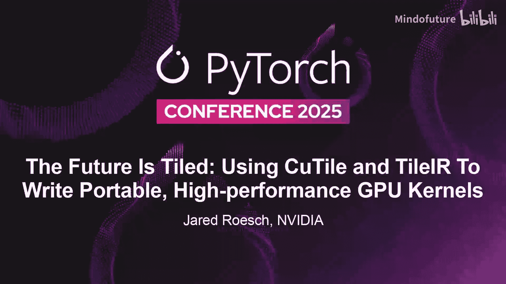
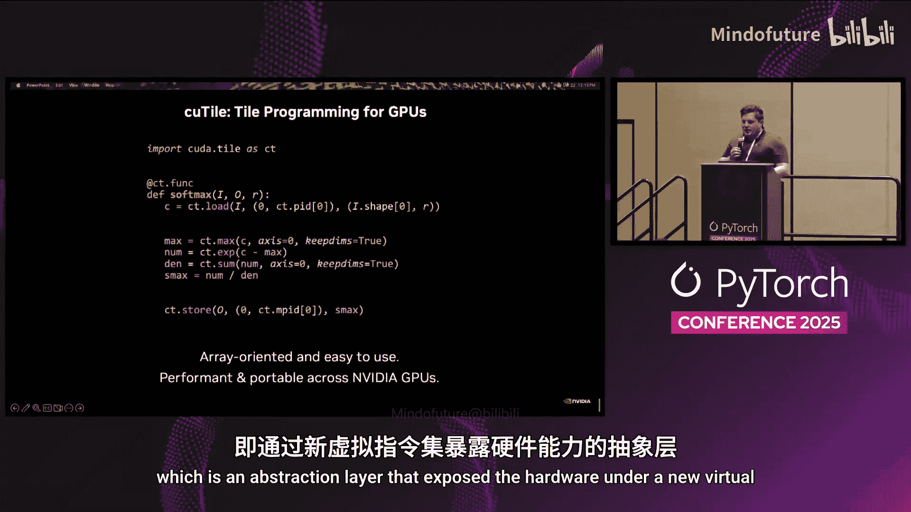
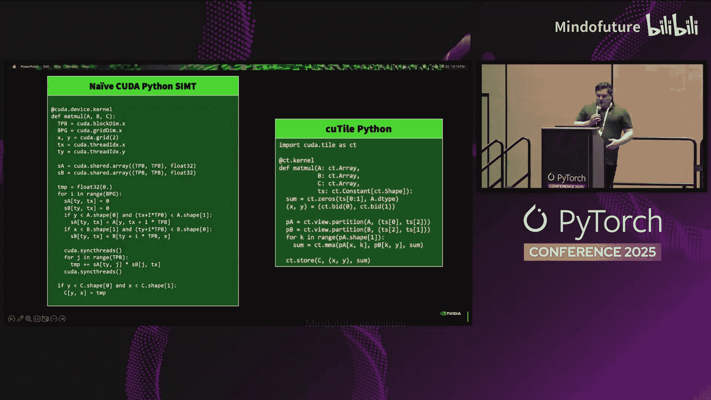
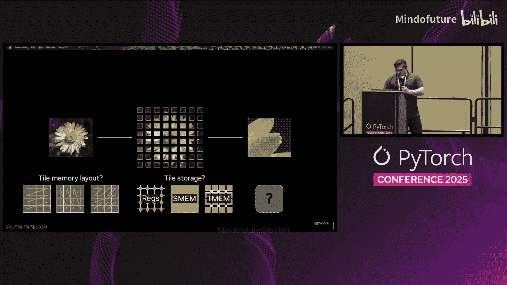
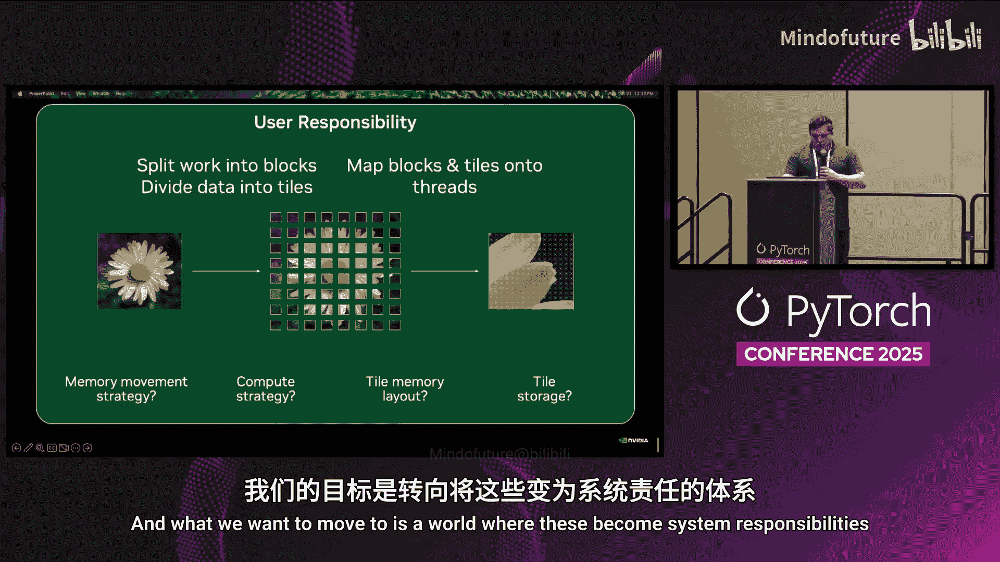
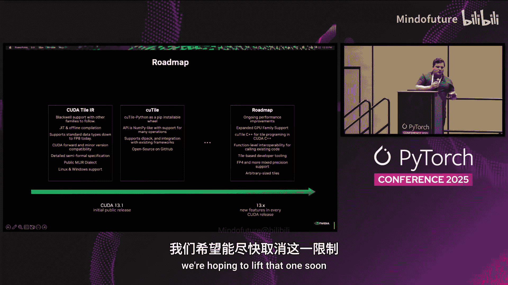

# 012：未来是分块化的——使用 CuTile 与 TileIR 编写可移植高性能 GPU 代码



## 概述

在本节课中，我们将学习 NVIDIA 推出的新一代 GPU 编程模型扩展——**CuTile** 及其底层抽象 **TileIR**。我们将探讨为何需要演进 GPU 编程模型，了解 CuTile 的核心组件，并通过具体示例展示如何编写简洁、高性能且可移植的 GPU 代码。课程最后将介绍其性能表现和未来路线图。

---

## 为何要演进 GPU 编程模型？🤔

上一节我们介绍了课程主题，本节中我们来看看推动 GPU 编程模型演进的根本原因。

GPU 的硬件能力在过去十几年间飞速发展。从早期的固定功能加速器，到可编程着色器，再到 2007 年 CUDA 引入的统一计算模型，GPU 已成为通用计算的核心。时至 2025 年，GPU 增加了更多计算与内存层次、线程束（Warp）级操作、张量核心（Tensor Core）、低精度计算、硬件稀疏性等众多新特性。

然而，底层的 CUDA C++ 编程抽象却相对稳定。随着硬件工具箱的日益丰富，编程体验并未同步简化。例如，张量核心本身每一代都在变化，开发者为了追求峰值性能，往往需要为每一代硬件重写底层内核代码，这带来了巨大的移植负担。

我们演进编程模型主要基于三个原因：
1.  **简化编程**：匹配硬件演进，简化 GPU 程序的编写。
2.  **语言与框架无关**：支持从 Python 等高级语言直接编写高性能 GPU 代码，而不仅限于 C++。
3.  **定义稳定抽象**：为张量核心等硬件特性提供稳定的编程接口，确保代码的跨代性能可移植性。

---



## CuTile 与 TileIR 简介 🧩



上一节我们探讨了演进的原因，本节中我们来看看 NVIDIA 提出的解决方案：CuTile 和 TileIR。

CuTile 是自 2007 年 CUDA 发布以来最大的一次编程模型扩展。它包含两个核心组件：

1.  **CuTile Python**：一个直接在 Python 中编写**分块（Tile）**程序的高级领域特定语言（DSL）。其目标是面向数组、易于使用、高性能且可移植。
2.  **TileIR**：一个面向 NVIDIA GPU 的**虚拟指令集**，是 CuTile 的底层抽象。

TileIR 可以看作是现有 PTX（并行线程执行）指令集的兄弟抽象。PTX 在线程级别描述行为，而 TileIR 则在更高的**分块级别**进行抽象。它专注于表达规则的数据并行数组程序，使得这类程序更容易达到峰值性能，并且我们致力于使其在未来保持稳定和可移植。

重要的是，TileIR 将作为开放的多级中间表示（MLIR）方言发布。这意味着开发者可以将其集成到自己的编译器或系统中，直接生成 TileIR 代码，就像今天使用 LLVM 或 PTX 作为后端一样。

---

## 编程模型对比：从线程到分块 🔄

上一节我们介绍了新的抽象层，本节中我们来深入对比新旧编程模型的差异。

在传统的 **线程级编程模型**（如 CUDA C++）中：
*   **执行单元**是线程。开发者必须从网格（Grid）到线程块（Block），再到线程束（Warp）和线程（Thread）进行层级分解。
*   **数据视图**是标量或向量。开发者需要精细地考虑每个线程处理张量中的哪些元素，以及数据在寄存器、共享内存中的布局。

在新的 **分块级编程模型**（如 CuTile）中：
*   **执行单元**是分块块（Tile Block）。开发者只需将网格划分为分块块，每个分块块处理一个或多个分块。
*   **数据视图**是数组和分块。分块是聚合值，开发者可以对整个分块进行加载、加法、矩阵乘法等逻辑操作。

这种转变将许多复杂的责任从开发者转移给了系统：



以下是传统模型中开发者需要手动处理，而在新模型中由系统负责的事项：
*   **分块存储**：数据应存放在寄存器、共享内存还是全局内存？
*   **分块布局**：如何安排数据以避免存储体冲突（Bank Conflict）或进行数据重排（Swizzling）？
*   **内存移动策略**：如何在不同内存层级间流水线式地搬运数据？使用同步加载、异步拷贝还是批量拷贝？
*   **计算策略**：何时使用张量核心？何时使用手写向量化循环？

在 CuTile 中，开发者只需：**将工作拆分为块，将数据划分为分块，然后从分块的视角编写程序。**



---

## 代码示例：Softmax 与矩阵乘法 ✍️

上一节我们理解了模型差异，本节中我们通过具体代码看看 CuTile 如何简化编程。

### Softmax 示例

以下是一个接近最终语法的 CuTile Python 内核示例，用于实现 Softmax 操作：

```python
@cutile.kernel
def softmax(O: cutile.global_array[cutile.f32, 2],
            I: cutile.global_array[cutile.f32, 2],
            R: int):
    # 将全局数组视为一系列分块，并加载当前分块块对应的那个
    tile = I.load((BID.y, 0), (1, R))
    # 在分块上进行计算：这些是纯的、不可变的操作
    max_val = tile.max(axis=1)
    exp_tile = (tile - max_val).exp()
    sum_val = exp_tile.sum(axis=1)
    out_tile = exp_tile / sum_val
    # 将结果分块存回全局内存
    O.store((BID.y, 0), out_tile)
```

**代码解析**：
*   `cutile.global_array` 表示位于全局内存中的可变张量。
*   `load` 操作根据索引和形状从全局数组加载一个分块。`BID` 是分块块的网格索引。
*   加载后得到的是一个**分块**（绿色高亮部分），对其进行的 `max`、`exp`、`sum`、`/` 等操作都是高级的、不可变的数组操作。
*   `store` 操作将结果分块写回全局内存。**只有通过全局内存的存储操作才会产生副作用**，这给了编译器极大的优化自由度（如重排操作、改变内存布局、流水线调度等）。

### 矩阵乘法示例

这是一个更完整的矩阵乘法（GEMM）示例，展示了循环和累加：

```python
@cutile.kernel
def gemm(C: cutile.global_array[cutile.f32, 2],
         A: cutile.global_array[cutile.f32, 2],
         B: cutile.global_array[cutile.f32, 2],
         TS: (int, int, int)): # TS 是编译时常量，表示分块大小 (M, N, K)
    # 获取当前分块块的坐标
    x, y = BID.x, BID.y
    # 分配一个初始值为零的累加器分块
    accumulator = cutile.zeros((TS[0], TS[1]), dtype=cutile.f32)

    # 计算在K维度上需要迭代的分块数量
    num_tiles_k = A.num_tiles((TS[0], TS[2]), axis=2)
    # 在K维度上进行归约循环
    for k in range(num_tiles_k):
        # 从A和B加载对应的分块
        tile_a = A.load((x, k), (TS[0], TS[2]))
        tile_b = B.load((k, y), (TS[2], TS[1]))
        # 执行分块矩阵乘累加 (MMA)
        accumulator = cutile.mma(accumulator, tile_a, tile_b)

    # 循环结束后，将累加器分块存回C
    C.store((x, y), accumulator)
```

**代码解析**：
*   内核接收动态大小的输入数组 `A`, `B` 和编译时常量分块大小 `TS`。
*   `cutile.zeros` 用于创建指定形状的零值分块作为累加器。
*   `num_tiles` API 用于计算基于给定分块形状的切片数量。
*   循环内部，每次迭代加载 `A` 和 `B` 的一个分块，然后通过 `cutile.mma` 函数进行矩阵乘累加。注意 `accumulator` 作为参数传入并接收结果，体现了分块操作的不可变性。
*   循环结束后，一次性将结果存回全局内存。

---

## 性能与路线图 🚀

上一节我们编写了 CuTile 内核，本节中我们简要了解其性能表现和未来发展计划。

### 性能表现

我们可能会担心，抽象层次提高是否会牺牲性能？早期的测试结果（在 NVIDIA B200 GPU 上）表明，CuTile 能够获得极具竞争力的性能。

以下是部分基准测试结果（浅绿色为 CuTile 实现，深绿色为对应 workload 的当前最优实现，如 cuBLAS、TensorRT-LLM 等）：
*   在多个关键工作负载上，CuTile 的性能通常位于最优实现的 **±10%** 范围内。
*   即使在某些情况下略有性能差距，其带来的**生产力提升**（代码简洁度、可维护性、可移植性）也足以抵消微小的性能成本。我们相信这种性能水平能够随着时间推移而保持。



### 发布与路线图

**TileIR 和 CuTile 将作为 CUDA 13.1 的一部分发布**。


**TileIR 发布内容**：
*   初始支持 Blackwell 架构，后续支持其他架构。
*   作为 JIT 编译器的一部分集成在驱动程序中，同时也提供类似 PTX 的离线编译工具。
*   支持标准数据类型（目前下至 FP8）。
*   提供约 200 页的详细形式化规范文档。
*   公开 MLIR 方言，供外部编译器集成。

**CuTile Python 发布内容**：
*   通过 PIP 提供可安装的 wheel 包。
*   提供 NumPy 风格的 API，专注于数组片段操作。
*   支持标准集成点（如 DLPack、C API），可与 PyTorch 等框架无缝协作。
*   在 GitHub 上开源。

**未来计划（CUDA 13.x 系列）**：
*   持续的性能优化。
*   扩展 GPU 家族支持（回溯支持 Ampere、Hopper 等架构）。
*   发布 **CuTile C++** 支持。
*   增强函数级互操作性，允许在同一内核内混合调用不同代码片段。
*   开发更强大的调试、剖析和性能分析工具。
*   增加 FP4 和混合精度支持。
*   解除对分块大小的 2 的幂次方限制，支持任意尺寸分块。

---

## 总结

本节课中我们一起学习了 NVIDIA 新一代 GPU 编程模型 **CuTile** 及其底层抽象 **TileIR**。我们了解到，为了简化编程、支持高级语言并实现跨代性能可移植性，NVIDIA 引入了**分块级**的编程抽象。通过 CuTile Python，开发者可以用简洁的数组语法编写高性能内核，而复杂的硬件细节（如内存布局、流水线、张量核心调度）则由 TileIR 和编译器自动处理。初步性能数据显示其极具竞争力，并且其开源和跨平台的发布策略将助力更广泛的生态系统建设。未来，随着功能的不断丰富，CuTile 有望成为编写可移植高性能 GPU 代码的重要工具。