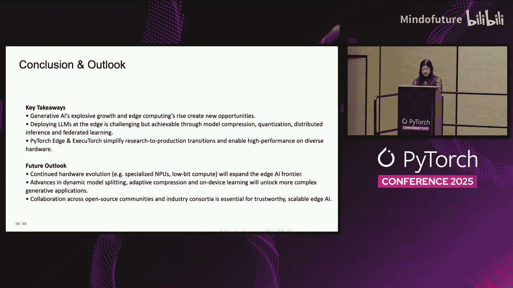
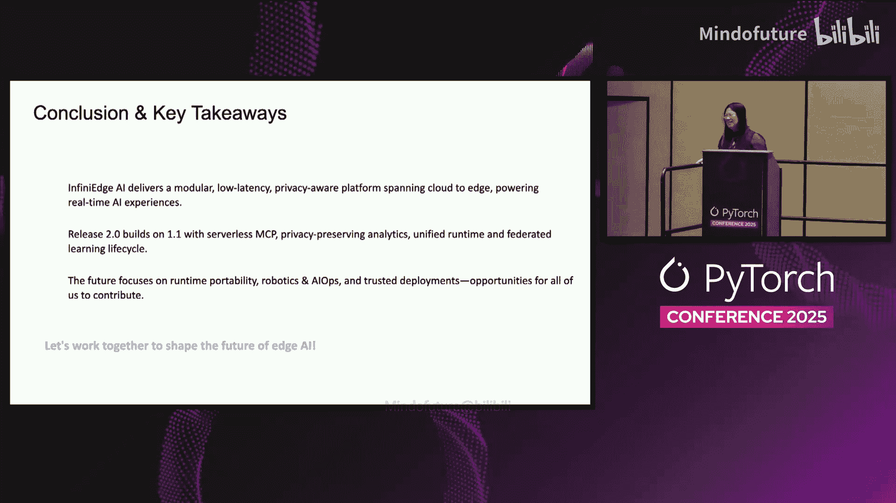

# 013：利用PyTorch在分布式边缘云中实现生成式AI

在本教程中，我们将探讨如何利用PyTorch生态在分布式边缘云中开发和部署生成式AI模型。我们将了解其重要性、在资源受限设备上运行大语言模型（LLM）所面临的挑战，以及PyTorch Edge和Executorch等工具如何使这一切成为可能。学完本教程，你将掌握在分布式边缘基础设施上高效架构、优化和基准测试生成式AI解决方案的方法。

## 概述：生成式AI与边缘计算的融合趋势 🚀

生成式AI与边缘计算正在相互促进，快速发展。在设备端运行推理可以降低延迟，并通过保持数据本地化来保护用户隐私。离线能力确保了即使在网络连接不稳定的情况下，也能提供可靠的用户体验。

市场采用正在加速。数据显示，77%的美国企业正在采用生成式AI，94%的日常用户报告了生产力提升，67%的人感觉压力减轻。同时，边缘计算的采用受到5G网络、工业物联网、实时洞察需求以及降低网络带宽成本等因素的驱动。这些力量共同为边缘AI创造了强大的机遇。

## 挑战：在边缘部署大语言模型 🧩

在边缘部署大语言模型极具挑战性。现代LLM包含数十亿参数，可能需要数十GB的内存，这远超大多数边缘设备的处理能力。自注意力操作计算量巨大，在低功耗处理器上运行缓慢，因此简单的部署会导致无法接受的延迟。

我们还面临诸多权衡：压缩模型会减小体积，但可能降低精度；使用低精度可以加速推理，但会增加数值误差；分布式部署模型可以减少单设备内存占用，但会增加通信成本。成功的边缘部署需要通过精心优化来平衡这些权衡。

## 解决方案：PyTorch Edge与Executorch 🛠️

PyTorch通过PyTorch Edge将其生态系统扩展到边缘设备，为移动和嵌入式部署提供从研究到生产的解决方案。

**Executorch**是关键运行时，它是一个由Meta与Arm、Apple、Qualcomm等合作伙伴共同构建的开源设备端推理引擎。Executorch允许你将PyTorch 2.x模型导出为稳定、紧凑的表示形式，从而可以在从移动GPU到微控制器的各种设备硬件上高效运行。它优先考虑可移植性（跨不同架构工作）、生产力（保留PyTorch开发者友好的工作流程）和性能（提供低延迟和小内存占用）。

Executorch与PyTorch Mobile的不同之处在于，它使用了新的PyTorch编译器，并支持高度可定制的运行时。它还集成了Metal和NNAPI后端以实现硬件加速。

## 架构：分布式边缘推理 🏗️

在边缘，我们通常无法将整个模型放在一个设备上。因此，我们需要将模型分区到多个设备上，并通过中央协调器来编排推理过程。

以下是分布式边缘推理架构的核心组件：

*   **模型分区**：每个设备持有模型层的一个子集。
*   **协调器**：中央协调器处理同步、调度以及在需要时回退到云端。
*   **通信**：设备通过本地网络交换中间激活张量。

我们使用**流水线并行**，其中设备并发处理不同的输入令牌，并采用重计算流水线并行来最小化空闲时间。这种架构使得单设备内存需求随着更多设备的加入而减少，吞吐量得以增加。我们还可以跨集群使用数据并行。这种分布式方法在管理延迟和可靠性的同时，解锁了在低功耗设备上运行高能力LLM的可能性。

## 优化技术：提升边缘推理效率 ⚡

为了使边缘推理变得实用，我们结合了多种优化技术。

以下是关键的优化策略：

1.  **模型压缩**：使用剪枝和知识蒸馏来创建更小但保持性能的学生模型。
2.  **量化**：将权重和激活从32位浮点数转换为更低精度的格式，如`int8`或`fp8`。这可以将内存占用减少多达四倍，并在专用硬件上实现更快的计算。公式表示为：`FP32 -> INT8/FP8`。
3.  **分布式推理**：将模型拆分到多个设备上，使用高效的通信协议交换激活值。
4.  **联邦学习**：在设备上使用本地数据训练和更新模型，然后集中聚合更新，在保护隐私的同时实现个性化。

结合这些技术有助于满足内存、延迟和准确性的目标。

## 性能基准与案例研究 📊

基准测试表明，与简单部署相比，经过优化的LLM框架可以将内存占用和推理延迟降低一个数量级，同时精度损失最小。像Amazon Inferentia2这样的硬件加速器提供了比上一代实例多三倍的计算能力和四倍的内存，在评估时能提供高达四倍的吞吐量和十倍的延迟降低。

在评估你自己的部署时，请对不同量化级别、批处理大小和硬件配置下的内存消耗、延迟、吞吐量和准确性进行基准测试。使用像`torch.profiler`这样的开源工具，并测量从设备输入到输出的端到端延迟。这些见解强调了细致优化和硬件选择的重要性。

这里有一个来自NDLM的案例研究，这是一种在边缘设备上运行大语言模型的分布式推理方法。模型被划分为多个块，分布在低功耗设备上。每个设备将中间激活向量发送给下一个设备。该系统使用重计算流水线并行来减少空闲时间，并随着设备数量的增加而提高吞吐量。实验表明，单设备内存显著减少，吞吐量几乎随设备数量线性增加。这个案例表明，通过适当的分区和调度，我们可以在满足实时性要求的同时，在边缘集群上运行大型模型。

## 最佳实践与展望 🌟

根据我们的经验，以下是一些最佳实践：

*   **模型选择**：为你的用例选择合适的模型大小和架构，较小的模型或微调版的Llama 2可能就足够了。
*   **早期优化**：尽早应用压缩和量化，并通过性能分析找到最佳精度，`int8`通常能提供良好的平衡。
*   **分布式设计**：使用分布式推理和流水线并行在多个设备上扩展，确保你的网络带宽和延迟足够。
*   **隐私保护**：当需要设备端个性化和隐私时，采用联邦学习。
*   **严格测试**：在真实世界条件下进行严格的基准测试，并在可用时使用硬件加速器。
*   **拥抱开源**：采用PyTorch Edge和Executorch等开源技术栈，并为社区做出贡献。
*   **安全第一**：通过加密激活传输和应用差分隐私技术来保障联邦学习的安全。

展望未来，我们看到专用硬件、改进的编译器、动态模型拆分以及更多的开源协作。参与像LF Edge、LF AI & Data和Infinite AI（隶属于LF Edge）这样的社区，将加速这一进程。

## 总结

在本教程中，我们一起学习了生成式AI和边缘计算如何快速融合，并因其强大的体验而带来新的挑战，特别是LLM的巨大规模和计算需求。我们探讨了PyTorch Edge和Executorch如何通过可移植性、生产力和性能实现设备端推理。分布式架构以及压缩、量化、分布式推理和联邦学习等优化技术，使得LLM在边缘变得可行。基准测试表明，这些策略可以将内存和延迟降低数个数量级。通过遵循最佳实践并参与开源生态，你将能够构建高效、隐私安全的边缘生成式AI应用。