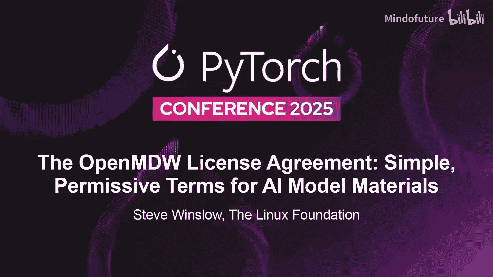
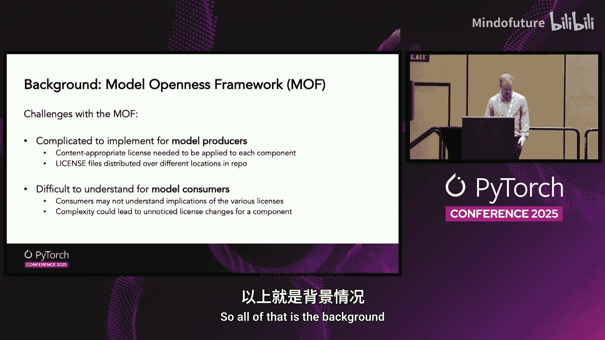
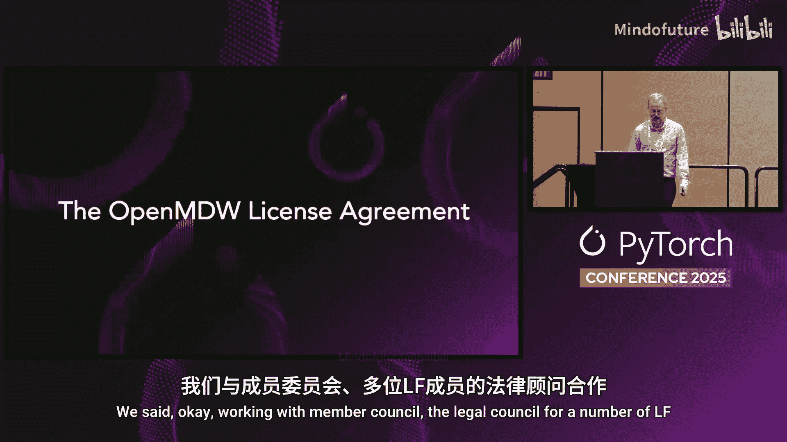
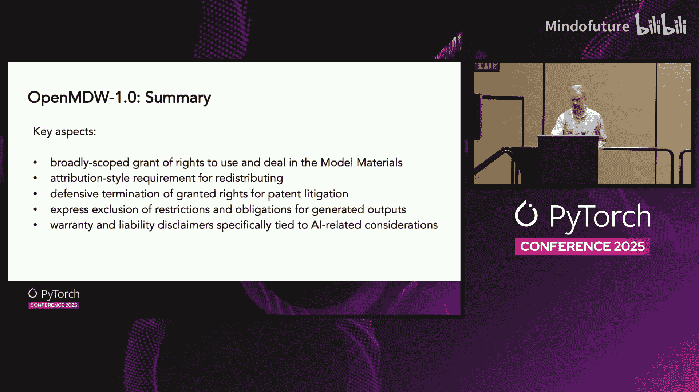
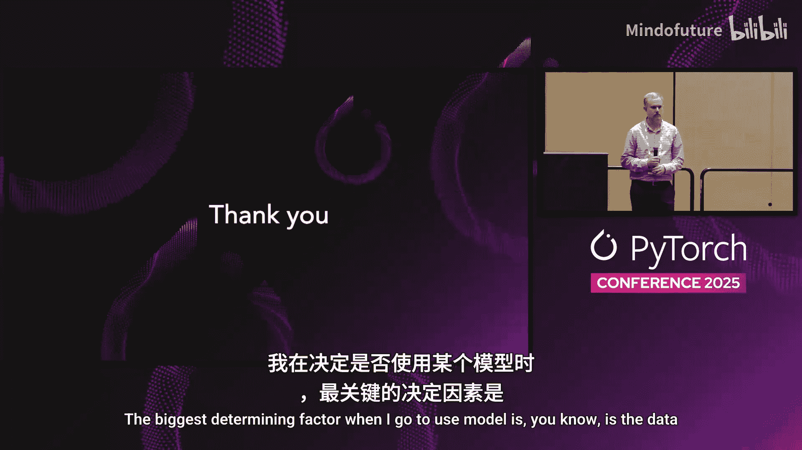

# 014：OpenMDW许可协议——AI模型材料的简易宽松条款



在本节课中，我们将学习OpenMDW许可协议。这是一个专门为AI模型及其相关材料设计的、简单且宽松的开源许可协议。我们将了解其产生的背景、核心条款、设计目标，以及它如何简化AI模型的开源发布流程。

## 背景：AI模型许可的复杂性





在开源软件领域，我们通常使用像MIT、Apache 2.0这样的成熟协议。然而，AI模型是一个包含多种组件的复合体，例如：
*   **模型本身**：架构与参数
*   **代码**：训练与推理脚本
*   **数据**：训练数据集
*   **文档**：使用说明

上一节我们介绍了AI模型构成的复杂性。本节中我们来看看，当使用传统软件许可证来许可AI模型时，会遇到哪些挑战。

传统的“模型开源定义”试图为每个组件指定不同的许可证。这导致了一系列问题：
*   **对发布者而言**：需要为不同文件选择并嵌入合适的许可证文本，过程繁琐且容易出错。
*   **对使用者而言**：需要理解并协调多个许可证如何共同工作，增加了法律合规的复杂性。

虽然并非不可行，但这无疑比理想情况要复杂得多。正是基于这一背景，Linux基金会与成员法律委员会及社区合作，经过多次迭代，最终发布了**OpenMDW许可协议**。

## OpenMDW协议的设计目标与定位

设计开源许可证的第一原则通常是“不要增加新的许可证”，以避免协议泛滥。过去几十年开源软件社区的一大优势，正是尽可能汇聚在少数几个通用许可证上。

在起草过程中，我们核心目标是：能否在现有许可证框架内工作，或仅做最小增补，以实现我们的目标？最终我们决定，创建一个全新的、专门针对AI模型分发的简易宽松许可证。

**OpenMDW 1.0** 是一个宽松许可证。如果您熟悉开源软件许可证中“宽松”与“著佐权”的频谱，它明确地位于宽松一端。其核心精神是：**“这是材料，随你使用”**，仅附带提供通知等有限义务。

该协议专为机器学习模型的元素设计，适用于构成“模型材料”的任何或所有组件集合。它覆盖根据本协议发布的任何内容，但**不强制**发布者必须包含所有类别的组件。协议本身只管辖那些被声明遵循OpenMDW协议进行分发的材料。

在实施层面，它旨在易于操作：**只需将许可证文本放在项目仓库根目录的LICENSE文件中即可**。

以下是该许可证的完整文本（为幻灯片适配格式）：
```text
Open Machine Learning Model Distribution Agreement (OpenMDW) 1.0

By exercising rights granted to you under this Agreement, you accept and agree to its terms.

1. Definitions. “Model Materials” means the materials provided to You under OpenMDW, consisting of one or more machine learning models (including their architecture and parameters) and all related artifacts provided to You under OpenMDW.

2. License Grant. If you comply with the terms of this Agreement, You are granted permission, free of charge, to deal in the Model Materials without restriction, including under copyright, patent, database, and trade secret rights.

3. Conditions on Distribution. If You distribute any portion of the Model Materials, You must retain a copy of this Agreement and any other applicable notices (such as copyright or notices of origin) that are included with the Model Materials.

4. Defensive Termination. If You initiate a claim against any party alleging that the Model Materials infringe a patent, then any rights granted to You under this Agreement shall terminate.

5. No Restrictions on Output. OpenMDW does not impose any restrictions on Your use, modification, or sharing of outputs generated from Your use of the Model Materials.

6. Disclaimer of Warranties and Limitation of Liability. [标准免责声明，此处省略全大写法律文本]
```
*（注：右侧部分为全大写的免责声明和责任限制条款，这是法律文件的常见格式）*

## 核心条款逐条详解

让我们对协议文本进行逐行深入解读。

**首段：接受条款**
> “By exercising rights granted to you under this Agreement, you accept and agree to its terms.”

这是一些法律样板文字。其目的是明确这是一个许可协议，具有合同性质。它基于开源软件许可证的常见假设：如果您选择行使本协议授予的权利，即表示您接受其条款。

**第一段：定义“模型材料”**
> “Model Materials means the materials provided to You under OpenMDW, consisting of one or more machine learning models (including their architecture and parameters) and all related artifacts provided to You under OpenMDW.”

这是整个协议的关键，定义了变量 **`Model Materials`**。它指根据OpenMDW提供给您的所有材料，包括一个或多个机器学习模型（及其架构和参数），以及随之一同提供的所有相关制品（如代码、文档）。这一定义将贯穿后续所有条款。

**第二段：核心授权**
> “If you comply with the terms of this Agreement, You are granted permission, free of charge, to deal in the Model Materials without restriction, including under copyright, patent, database, and trade secret rights.”

这是核心的许可授权。只要遵守协议条款，您就可以**免费、无限制地处置模型材料**。此措辞借鉴自MIT许可证。在起草过程中，我们决定明确列出所涵盖的权利范围（版权、专利、数据库、商业秘密），旨在清晰地表明，以此协议分发模型时，我们意图授予所有这些权利。

**第三段：分发条件**
> “If You distribute any portion of the Model Materials, You must retain a copy of this Agreement and any other applicable notices (such as copyright or notices of origin) that are included with the Model Materials.”

要遵守协议，关键要求在于**分发**。如果您分发任何部分模型材料，则必须保留一份协议文本副本以及任何其他适用的通知（如版权或来源声明）。这非常类似于宽松开源软件许可证的“署名”要求。



**第四段：防御性终止**
> “If You initiate a claim against any party alleging that the Model Materials infringe a patent, then any rights granted to You under this Agreement shall terminate.”

此条款类似于Apache等许可证中的规定。如果您在依据OpenMDW获得权利后，转而起诉他人主张这些模型材料侵犯专利，那么您依据本协议获得的权利将终止。这并不阻止您提起诉讼，但您将无法同时享受他人依据OpenMDW授予您的许可。

**第五段：对输出无限制**
> “OpenMDW does not impose any restrictions on Your use, modification, or sharing of outputs generated from Your use of the Model Materials.”

这是整个协议的核心之一。OpenMDW**不对您使用模型材料所生成的输出施加任何限制**。这意味着，虽然分发模型材料本身需要保留许可文本，但模型产生的输出并不受OpenMDW条款的约束。协议意图明确：输出本身不附带本协议规定的义务。

需要强调的是，这仅指**本协议本身不施加义务**。许可证提供者无法授予超出其已有权利之外的权利。例如，如果适用法律（如版权法、GDPR）对输出有规定，OpenMDW或其他任何许可证都无法神奇地使其消失。本条款只是为了明确，材料提供者不会通过此协议对输出附加额外条件。

**第六段：免责声明**
这部分是全大写的法律条文，主要包括详细的免责声明和责任限制。部分内容专门针对AI领域的问题起草，旨在明确：接收和使用这些材料的人需对自己使用行为负责。如果您免费获得并行使这些权利，不应回头向材料提供者追究责任。

## OpenMDW的关键特点总结

本节课中我们一起学习了OpenMDW许可协议。现在我们来总结一下它的关键特点：

*   **广泛的授权范围**：授予使用和不受限制处置所接收模型材料的广泛权利。
*   **署名式要求**：重新分发时，需保留适用的通知和许可证文本。
*   **防御性终止**：若发起专利诉讼，则其获得的许可权利终止。
*   **对输出无限制**：明确声明不对使用模型材料生成的输出施加任何限制。
*   **针对AI的免责**：包含专门针对AI相关考量的免责和责任限制条款。



该协议经过Linux基金会成员公司法律委员会的多轮起草和审查，于今年早些时候发布。目前已开始被一些公司和机构采用，用于那些希望明确、开放地分发AI材料的场景。

---

## 问答环节精选

以下是演讲后问答环节的部分内容。

**问：它是许可证还是合同？**
答：它既是许可证也是合同。鉴于AI模型所涉及底层权利的复杂性，它被设计为一份合同，以明确“保留署名通知”的义务，作为换取广泛授权范围的交换。

**问：OpenMDW与Apache 2.0许可证有何不同？**
答：Apache 2.0等开源软件许可证是针对**软件源代码**设计的。虽然其中许多概念与OpenMDW类似，但当律师审阅一个非软件、而是包含参数等多种组件的AI模型时，使用Apache 2.0会增加额外的理解摩擦。OpenMDW旨在消除这种摩擦，提供更直接的清晰度。

**问：与CDLA（社区数据许可协议）相比如何？**
答：CDLA是专门为**数据集**设计的一组许可证。如果分发物是纯粹的AI模型及其相关组件集合，OpenMDW可能更合适；如果纯粹是数据集，CDLA可能更简单。CDLA中也有“对计算输出无限制”的类似概念，并启发了OpenMDW的这部分设计。

**问：OpenMDW是否保证模型训练数据不包含版权材料或个人数据？**
答：**绝对不保证**。任何开源许可证通常都不会提供此类保证。对于这类担忧，更应关注模型构建社区的治理流程、章程和前期清理步骤，而非其采用的具体输出许可证。SPDX的AI物料清单（AI BOM）项目正是为了以机器和人类可读的方式表示此类元数据。

**问：能否将使用GPL库的AI模型以OpenMDW许可发布？**
答：这是一个复杂的问题。OpenMDW适用于您以该协议分发的材料集合。它特别适用于您拥有完整权利的“绿地”材料。如果您要分发包含第三方GPL材料的模型，会遇到许多关于著佐权如何适用的复杂性，不能简单地将其重新许可为OpenMDW。这需要更深入的探讨。