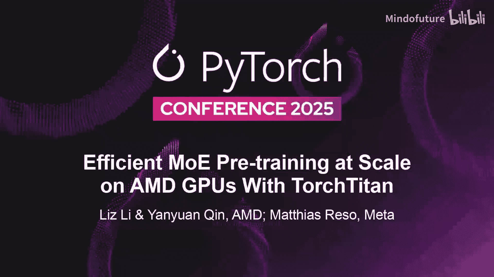
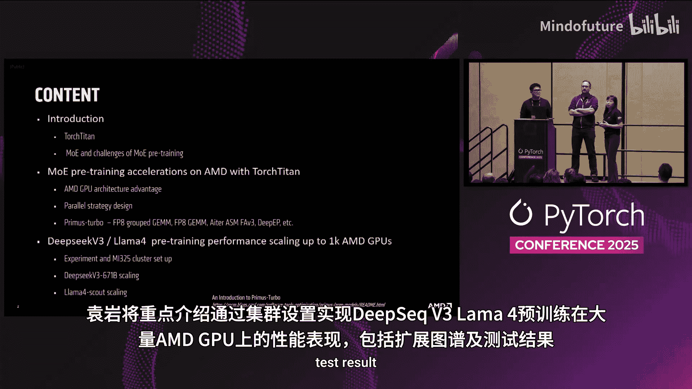
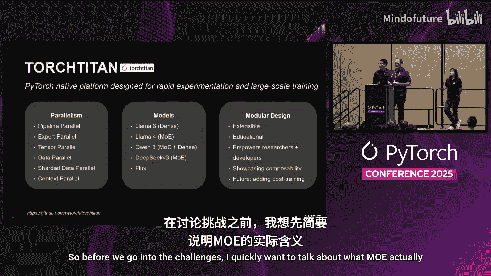
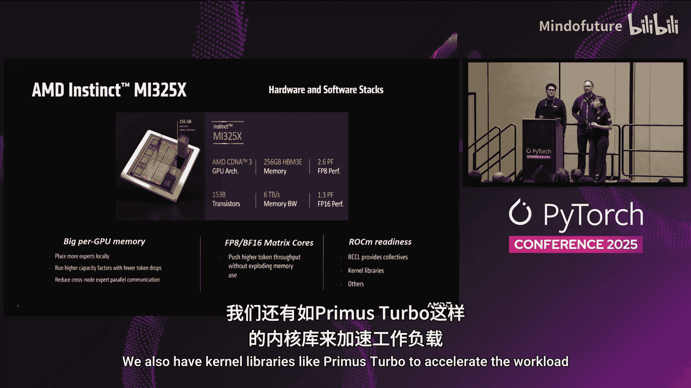
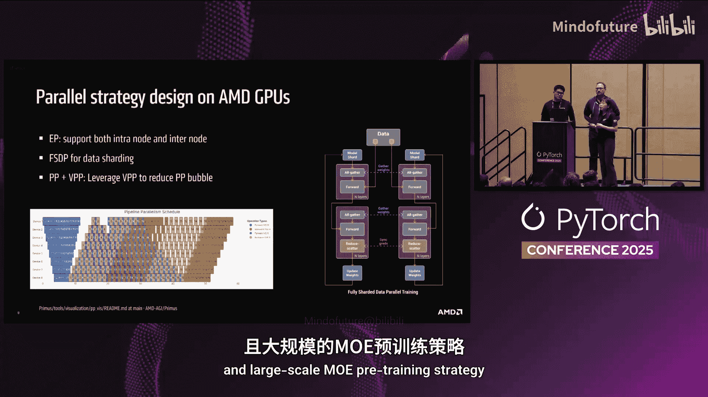
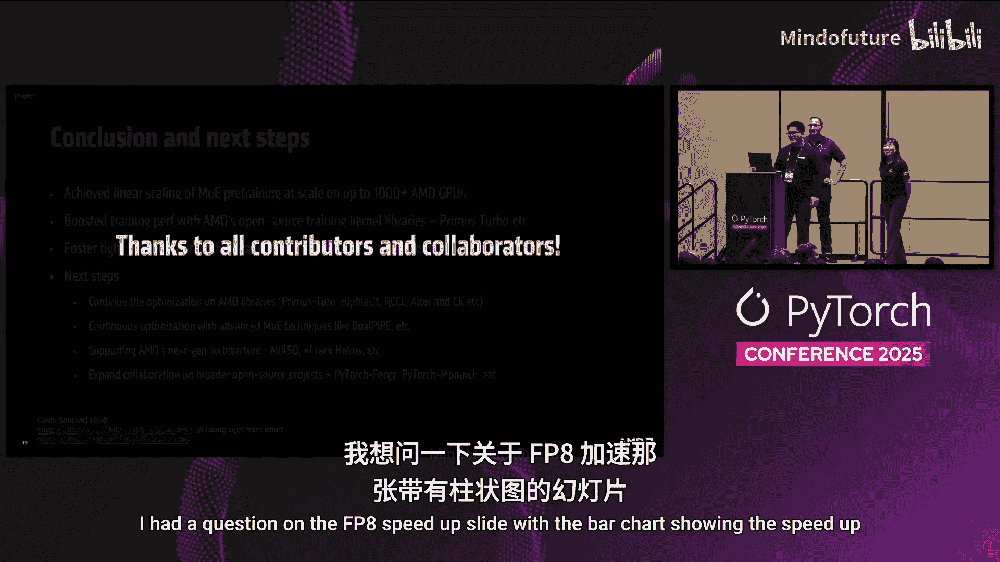
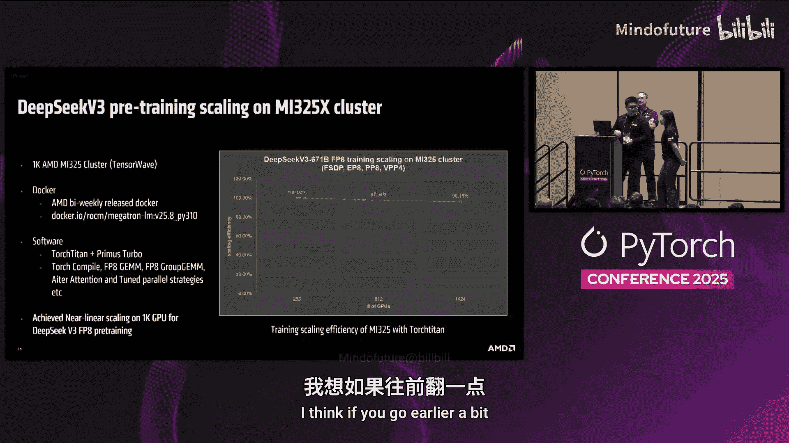
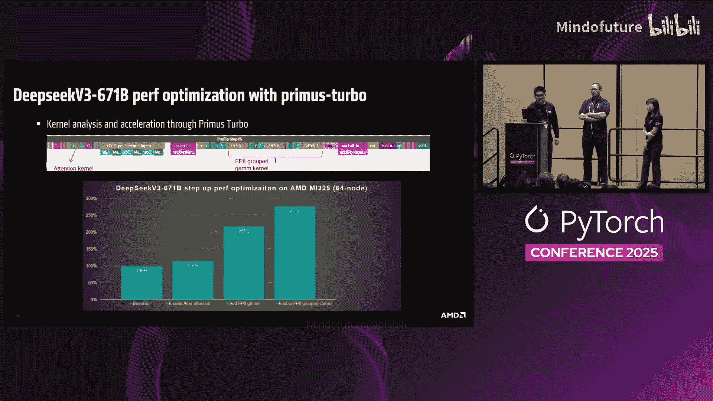
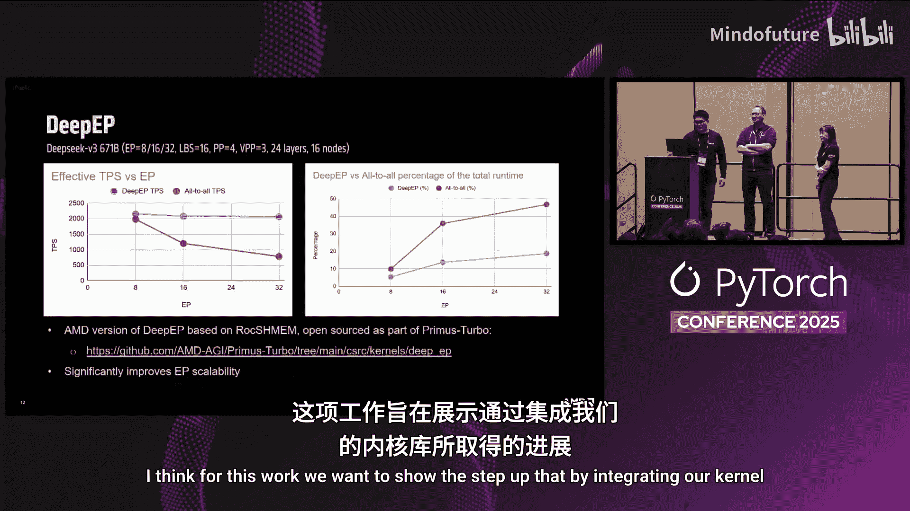
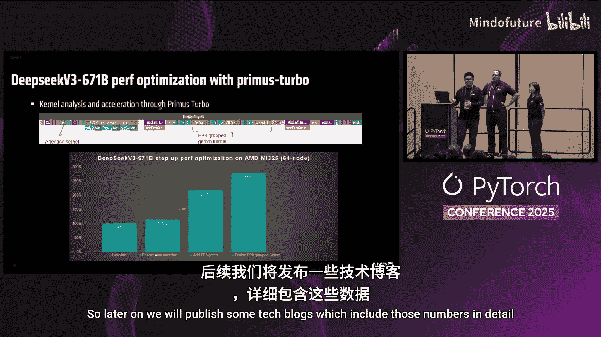

# 015：基于TorchTitan在AMD GPU上实现高效大规模混合专家预训练 🚀

## 概述

在本教程中，我们将学习如何利用TorchTitan框架和AMD GPU的硬件优势，高效地进行大规模混合专家模型的预训练。我们将深入探讨AMD GPU的架构特性、并行策略设计以及高性能内核库Prime Turbo，并通过实际案例展示其在千卡规模下的卓越性能。

---

## TorchTitan与混合专家模型简介

上一节我们介绍了本教程的主题，本节中我们来看看TorchTitan框架和混合专家模型的基本概念。

大家好，我是来自PyTorch团队的Matthias。我将介绍TorchTitan，这是我们用于大规模训练的PyTorch原生框架。我们开发TorchTitan旨在教育用户，同时展示最佳实践，并致力于将最佳性能交付到用户手中。我们通过使其易于使用来实现这一目标，它基本上只是一个配置文件，您就可以掌握所有功能，它使研究人员和开发人员能够快速迭代不同的训练配置，并使其适应他们所处的环境。

例如，所有并行化技术都集成在TorchTitan中，例如流水线并行、张量并行，您只需通过一行配置即可启用它们。关于模型覆盖范围，我们力求尽可能广泛，例如，我们有用于密集模型的Llama 3，对于混合专家模型，我们有Llama 4，现在我们又添加了DeepSeek-V3以及Qwen2系列，还有用于图像生成的Flux，未来还会有更多模型加入。

在深入探讨挑战之前，我想快速谈谈MOE代表什么。混合专家模型，当您从像Llama 3这样的密集模型转向像Llama 4这样的MOE模型时，您替换的是自注意力层之后的大型MLP层。我们将其替换为多个可能比原始密集层更小的MLP，然后我们有一个路由组件，它决定哪个专家（即小型MLP）来处理这个令牌，或者它可能是所有专家中的一个子集。然后可能还有一个共享专家。

这使我们有可能以更少的参数处理更大的模型，同时仍保持在相同的计算预算内。因此，计算量将相同，而内存占用可以大得多。正如我们在过去一年中所看到的，这提高了训练速度以及训练准确性。

---

## 混合专家模型预训练的挑战

上一节我们了解了MOE模型的基本原理，本节中我们来探讨其预训练面临的主要挑战。

混合专家模型预训练和训练面临的挑战如下：

首先，是内核效率问题。您可以想象，如果一个批次中有多个令牌，并且它们都被路由到不同的专家，您最终将不得不调用这些专家内核（即矩阵乘法），这在GPU上效率非常低下。您想要做的是将它们融合在一起，最终得到一个称为分组通用矩阵乘法的操作，它可以在一次内核调用中处理多个专家。

其次，在路由之后，我们有一个通信步骤。因为当我们进行大规模预训练时，我们拥有包含许多节点的大型集群，所以我们应用专家并行，这意味着不同的专家位于不同的GPU上。因此，我们需要将这些令牌的中间结果通信到这些GPU，所有GPU都必须进行通信，这是大型All-to-All通信，需要时间。因此，我们尝试通过将其与计算重叠来掩盖它，并应用共享内存技术使通信尽可能高效。

第三，存在组合性问题。例如，我们发现，如果您只是天真地将FSDP和流水线并行与专家并行结合在一起，最终会产生很多流水线气泡。气泡意味着在给定时间，流水线阶段的GPU没有做任何工作，这导致训练效率低下。因此，我们必须消除这些气泡以使训练高效。

最后，还存在路由和稳定性问题，您可能会遇到路由崩溃，将所有令牌路由到单个专家，这会使您的训练效率低下，并且准确性也会变差。

---

## 在AMD GPU上加速MOE预训练

上一节我们探讨了MOE预训练的挑战，本节中我们来看看AMD GPU如何解决这些挑战。

正如我们所知MOE预训练的所有挑战，那么让我们看看如何在AMD GPU上加速MOE预训练挑战。我们将关注三个关键贡献领域：AMD GPU架构优势、并行策略设计，以及我们将介绍新的训练内核库Prime Turbo。

AMD Instinct MI 325X是我们的领先产品，在大模型预训练和推理方面表现出色。它基于CDNA 3架构，包含256 GB内存和6 TB/s的内存带宽。在计算方面，它包括2.6 PFlops的FP8性能和1.3 PFlops的FP16性能。

巨大的单GPU内存对于MOE预训练非常重要，因为我们可以在每个GPU上本地放置大量专家。我们还可以以更低的令牌丢弃率运行更高的容量，从而显著减少跨节点专家并行通信。此外，FP8和BF16矩阵核心可以进一步推动令牌吞吐量，而不会爆炸内存使用。最后，我们的ROCm软件栈已完全就绪，我们拥有像RCCL这样的通信库来提供集合操作，还有像Prime Turbo这样的内核库来加速工作负载。

AMD GPU完全支持多维并行策略设计。例如，我们支持节点内和节点间专家并行。我们支持用于数据分片的FSDP。我们还结合流水线并行和虚拟流水线并行来减少流水线气泡。总之，我们创建了一个非常高效的扩展策略，以实现稳定的大规模MOE训练策略。

---

## Prime Turbo内核加速库

上一节我们介绍了并行策略，本节中我们来深入了解加速训练的核心——Prime Turbo库。

Prime Turbo是我们用于AMD ROCm上大规模语言模型训练的通用内核加速库。它提供高性能、完整性和易用性。如果您看左侧的图表，它支持多种框架，如PyTorch，JAX框架支持即将推出。在组件层，我们还支持高级构建块，如算子、模块、分布式原语和其他内核。对于后端，我们全面支持重要的AMD计算和通信库，如hipBLAS、Composable Kernel、RCCL、Triton等。

Prime Turbo支持广泛的AMD硬件，包括MI 325X、MI 355X和即将推出的AI 450。我们希望确保在所有硬件范围内的性能可移植性。

如果我们看右侧，这是Prime Turbo内部调用FP8分组GEMM的示例代码，只需几行代码。因此，在TorchTitan中，我们只需要写大约两行代码来调用Prime Turbo中的FP8分组GEMM。这对于每个人来说都非常容易集成和使用。

以下是我们目前在Prime Turbo中支持的所有内核总结：

*   **GEMM和分组GEMM**：我们支持BF16、FP16，支持具有张量级、行级和块级量化的FP8。FP6和FP4支持即将推出。
*   **注意力内核**：我们支持FP8和BF16，也支持具有块级量化的FP8。
*   **深度EP**：我们支持节点内和节点间深度EP。我们今天支持Mellanox，Broadcom和AI支持即将推出。
*   **All-to-All内核**：我们支持具有张量级和行级量化的FP8。
*   **我们还支持许多逐元素操作**：包括归一化、激活函数、RoPE等。

在这张幻灯片中，我们想展示使用Prime Turbo加速DeepSeek-V3全时长预训练轮次的逐步性能优化。我们首先使用Torch Profiler来分析工作负载，并识别不同内核的关键瓶颈和热点。然后，我们使用Prime Turbo中的内核来加速它们。这里的条形图显示了在64节点DeepSeek运行中使用Prime Turbo内核的每步优化。

在吞吐量方面，我们的基线设为100%。如果我们启用注意力优化，吞吐量可以提高15%。然后，如果我们启用FP8 GEMM，我们获得了巨大的性能提升，达到基线吞吐量的2倍。接着，我们启用FP8分组GEMM，它使我们获得了相对于基线2.77倍的吞吐量。这证明了我们Prime Turbo内核的效率。

Prime Turbo还包括深度EP，可以显著加速All-to-All性能。这里我们使用DeepSeek轮次演示了深度EP。如果我们看左侧的曲线，在吞吐量方面，我们看红色曲线。EP大小从8增加到16再到32，我们可以看到随着EP大小增加，吞吐量下降很多。但是，如果我们启用深度EP（蓝色曲线），我们可以看到即使增加EP大小，吞吐量也几乎相同。在右侧，是All-to-All延迟占总运行时间的百分比。类似地，红色曲线是没有深度EP的运行。我们可以看到，当EP大小等于32时，All-to-All延迟几乎占总运行时间的30-50%。但是，如果我们启用深度EP，All-to-All延迟将减少到小于20%，这是一个巨大的性能提升。

---

## 千卡规模性能展示与实验设置

上一节我们看到了内核级别的优化效果，本节中我们来看看这些优化在千卡集群上的实际扩展性能。

现在，我想展示我们使用TorchTitan训练DeepSeek-V3和Llama 4的实验结果。首先，我想谈谈实验和集群设置，然后详细介绍结果。

对于这个MI 325X集群，我们总共使用了多达1000个GPU来运行此工作负载，该集群托管在TensorWave中。节点间配备了Broadcom Sort2，节点间带宽约为每秒400 GB，协议是RoCE v2。后端网络以胖树拓扑连接，这通常用于GPU集群。

如果我们看DeepSeek训练扩展结果，这里我们使用了AMD每周公开发布的Docker镜像，您基本上可以在Docker Hub上找到它。在软件方面，我们使用了TorchTitan和Prime Turbo。我们启用了包括torch.compile、FP8 GEMM、FP8分组GEMM、注意力优化在内的功能，并根据我们的硬件特性调整了并行策略。

如果我们看右图，X轴是我们使用的GPU数量，我们最多扩展到1000个，Y轴是训练扩展效率。如果我们设第一个点为100%，那么当我们进一步将GPU总数增加四倍时，我们可以实现接近线性的扩展。我想提一下，我们在这里使用的并行策略是FSDP + EP + PP和VPP。

我们还测试了其他MOE模型，即Llama 4 8x22B。这个模型比DeepSeek-V3小，但我们仍然可以在这个MOE训练上实现非常好的线性扩展。

除此之外，我们还检查了模型训练的数值准确性。为此，我们使用DeepSeek-V3，启用了FP8训练。对于数据集，我们使用了来自Hugging Face的公共数据The Pile。对于学习率，我们选择了TorchTitan中的默认值。我们运行了900次迭代。如果您看这个图，X轴是步数，Y轴是损失曲线。基本上，这个训练曲线表明，在这个MI 325X集群上，我们可以使用TorchTitan展示出强大的收敛曲线。

---

## 总结与未来展望

本节课中，我们一起学习了如何利用TorchTitan和AMD软硬件栈进行高效的千卡规模MOE模型预训练。

总结来说，我们所做的是在多达1000个AMD GPU上实现了近乎线性的MOE预训练扩展。我们通过开源训练库TorchTitan以及AMD的ROCm和RCCL库提升了训练性能。我们与Meta在PyTorch开源生态系统中促进了合作。

下一步，我们将继续优化AMD库，包括Prime Turbo、RCCL、ROCm和Composable Kernel。我们将继续优化高级MOE功能，包括最近在TorchTitan中上游化的Piped Experts。我们将继续努力确保此功能在我们的硬件上完全启用。接下来，我们还想支持我们的下一代GPU架构，即MI 450以及我们的AI机架解决方案。

最后，我们希望扩大与更广泛开源项目的合作，包括今天刚刚发布的PyForge和PyMonarch。最终，我们所有使用的产品和源代码都是开源的，我们在GitHub上托管了这些仓库，并且我们发起了上游化工作，以确保我们所有的优化都能出现在主流中，PyTorch社区可以直接使用它们。

感谢所有为此工作做出贡献和合作的同仁，也感谢各位观众。